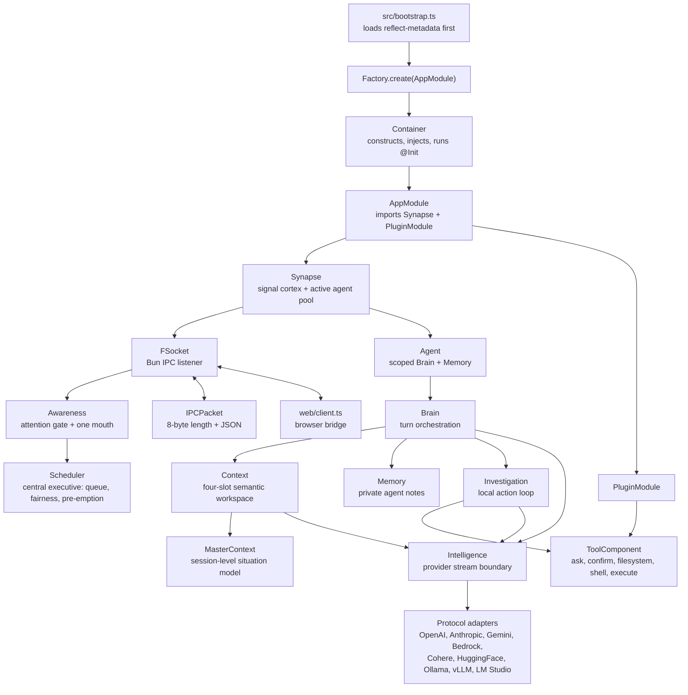
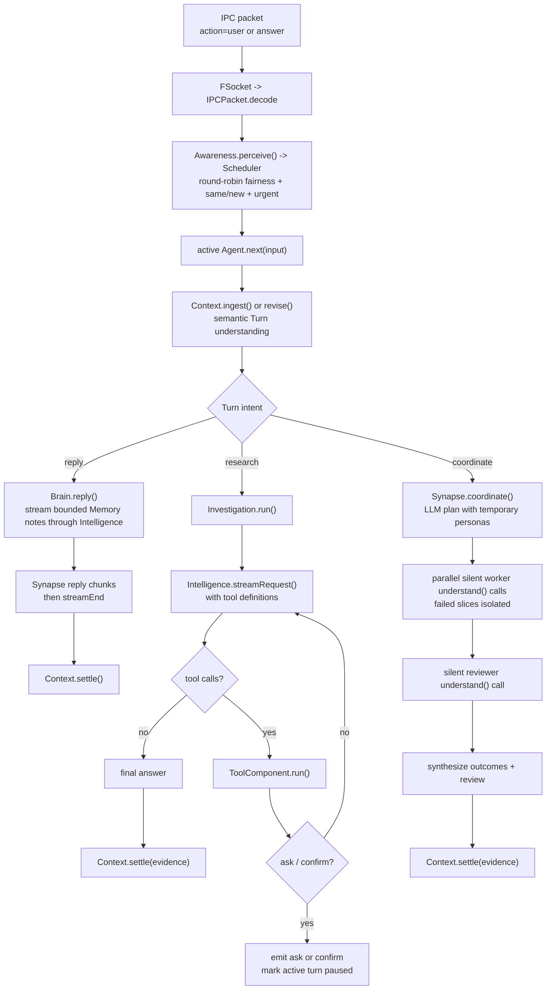

# Flyflor

Flyflor is a Bun + TypeScript agent kernel. The current codebase is built around decorated classes, a reflect-metadata IOC container, a local length-prefixed IPC socket, prompt packages, provider protocol adapters, and a small local tool surface.

## Quick Start

```bash
bun install
export DEEPSEEK_API_KEY=...
bun run dev
bun run client
```

`bun run dev` starts `src/bootstrap.ts` and opens the configured IPC socket. `bun run client` serves the local browser bridge at `http://127.0.0.1:17878` and forwards browser JSON messages to that socket.

Use these checks before calling a change healthy:

```bash
bun run check
bun test
bun run build:binary
```

`bun run check` runs TypeScript and the repository red-line scanner. The default model/provider lives in `.config/config.jsonc`; secrets stay in environment variables.

## Runtime Map



## Boot Lifecycle

```mermaid
flowchart LR
    A["bootstrap.ts"] --> B["import reflect-metadata"]
    B --> C["Factory.create(AppModule)"]
    C --> D["Container.getAsync(AppModule)"]
    D --> E["build module imports"]
    E --> F["construct class"]
    F --> G["@Config / @Prompt early injections"]
    G --> H["@Inject / @Scope dependency injections"]
    H --> I["@Init lifecycle method"]
    I --> J["Factory.synapse()"]
```



Only the IOC container should construct application classes. Singleton classes are cached by decorator metadata; ordinary providers are created fresh when resolved.

## One User Turn



`Context` is a four-slot semantic working set, not a durable archive. It evicts only completed Turns when capacity is needed and has no wall-clock TTL. Settled Turns consolidate ("promote") into `MasterContext`, a bounded in-process session-level situation model, so understanding and scheduling can see beyond the four slots without becoming long-term memory. `Memory` is a bounded private note cache seeded from a `Context.brief()`; the active runtime has no long-term memory write path.

## IPC Contract

Every packet on the kernel socket is one 8-byte unsigned big-endian JSON body length followed by a UTF-8 JSON body:

```txt
+--------------------------+-------------------------------+
| 8-byte body length (BE)  | JSON body bytes (UTF-8)       |
+--------------------------+-------------------------------+
```

Inbound packets with `action: "user"` or `action: "answer"` become agent input. Other inbound actions are dispatched to `Controller`; the current controller action is `cwd`, which updates `ConfigService.path.cwd`.

Common outbound actions are `open`, `agent`, `interrupted`, `streamEnd`, `data`, `ask`, `confirm`, `pause`, `resume`, and `error`.

## Model Boundary

`Intelligence` exposes one normalized stream contract:

- `text_delta` for visible output.
- `reasoning_delta` for provider reasoning that must be replayed when the provider expects it.
- `action_start`, `action_delta`, and `action_end` for streamed tool calls.
- `done` with `stop`, `length`, or `toolUse`.

Protocol selection comes from the active provider in `.config/config.jsonc`. Provider-level `protocols` override `model.protocols`; each protocol adapter owns only its wire body and stream parser.

## Tool Surface

The current model-visible tools are loaded from `prompts/tools/config.jsonc` and implemented under `src/plugins/tools`:

- `ask`: asks the user to choose from options; the tool adds an `other` option.
- `confirm`: asks for a yes/no-style confirmation with a recommended boolean.
- `filesystem`: `read`, `write`, `edit`, or file-only `delete`, resolved from explicit `cwd` or `ConfigService.path.cwd`.
- `shell`: runs one command with args and a bounded timeout.
- `execute`: runs serial or parallel `python` / `sh` script tasks with optional per-task cwd, env, and timeout.

`Investigation` owns the tool loop. Tool request/result replay stays inside provider messages and is not written into `Context.turns`.

## Prompt Runtime

`PromptService` loads either one markdown file or a prompt package directory with `config.jsonc`. Package configs define ordinary render sections, editable files, locked files, runtime-ignored files, and an optional XML document view. The active agent package loads only static `SOUL.md`/`EXTENSION.md`; runtime prompt writes and the legacy `soul` route are disabled.

Canonical runtime prompt sources are English `.md` files. `.zh.cn.md` files are human mirrors and must not become runtime source-of-truth.

## Source Layout

```txt
src/bootstrap.ts                       process entrypoint
src/app.module.ts                      root @Module
src/configuration.ts                   ConfigService and runtime config types
src/core/                              decorators, IOC, base classes, prompt, logger, tool contracts
src/neural/                            Synapse, Awareness, Scheduler, IPC socket, packet codec, controller
src/agent/                             Agent, Brain, Context, MasterContext, Memory, Investigation, Intelligence
src/plugins/                           plugin boundary and local tools
src/entities/                          entity/repository classes; MemoryRepo currently returns SQL statements
web/                                   local browser-to-IPC bridge and test page
prompts/                               prompt packages plus zh.cn mirrors
.config/                              runtime config and active agent prompt package
sql/                                   schema files
pakcages/                              bundled sqlite-vec helper/native assets; not in the current agent turn path
scripts/check.script.ts                repository mirror and prompt-term checks
```

## Current Edges

`MemoryRepo`, `sql/001-core-schema.sql`, and native vector assets remain placeholders for a future persistence boundary, but they are not connected to the current `Agent`, `Context`, or `Memory` path. The config file also declares skills and MCP shapes, but this codebase does not yet include a runtime MCP client or skill loader wired into the turn loop.

## Session-less Organism Design

Status: implemented research prototype. Every IPC connection reaches one
organism; a connection supplies only a transient speaker identity and never
creates a session or durable conversation store.

### Biological Reference Points

The neuroscience literature below supplies design constraints and analogies. It
does not establish that an LLM runtime is a brain or that this prototype is
conscious.

- Baddeley, “Working memory: theories, models, and controversies” (2012),
  [PMID 21961947](https://europepmc.org/article/MED/21961947): working memory is
  a limited, actively maintained workspace rather than an unlimited log.
- Cowan, “The magical number 4 in short-term memory” (2001),
  [PMID 11515286](https://europepmc.org/article/MED/11515286): motivates four
  semantic Turn slots as a prototype prior. Four is not a biological constant.
- Lewandowsky et al., “No evidence for temporal decay in short-term memory”
  (2009), [PMID 19223224](https://europepmc.org/article/MED/19223224): argues
  against treating wall-clock TTL as a general theory of forgetting; Flyflor
  uses capacity and interference instead.
- Stokes, “Activity-silent working memory” (2015),
  [PMID 26051384](https://europepmc.org/article/MED/26051384): supports the weak
  analogy of reactivating a compact task set instead of replaying a transcript.
- Halassa and Kastner, “Thalamic functions in distributed cognitive control”
  (2017), [PMID 29184210](https://europepmc.org/article/MED/29184210): informs a
  gate/control analogy. `Awareness` is not a literal thalamus or a salience
  oracle.
- Aston-Jones and Cohen, “An integrative theory of locus
  coeruleus-norepinephrine function” (2005),
  [PMID 16022602](https://europepmc.org/article/MED/16022602): motivates sparse,
  thresholded interruption rather than a continuously model-scored priority.
- Mashour et al., “The global neuronal workspace” (2020),
  [PMID 32135090](https://europepmc.org/article/MED/32135090): motivates one
  foreground broadcast boundary and one mouth. It is an architectural analogy,
  not evidence of a global neuronal workspace in software.
- Alberini and LeDoux, “Memory reconsolidation” (2013),
  [PMID 24028957](https://europepmc.org/article/MED/24028957): informs the weaker
  software idea of updating a suspended task set. Turn revision is not
  biological reconsolidation.
- Klinzing, Niethard, and Born, “Mechanisms of systems memory consolidation
  during sleep” (2019),
  [PMID 31451802](https://europepmc.org/article/MED/31451802): makes the absence
  of replay and consolidation an explicit requirement while long-term memory
  is disabled.
- Kassab and Alexandre, “Pattern separation in the hippocampus: distinct
  circuits under different conditions” (2018),
  [PMID 29637298](https://europepmc.org/article/MED/29637298): loosely motivates
  source separation. Privacy still comes from deterministic speaker ownership,
  data minimization, and non-persistence—not from the analogy.

### Runtime Invariants

1. A connection is only a speaker identity (`conn_N`). All speakers enter one
   singleton `Awareness` and one singleton `Context`; there is no session
   object.
2. `Context` stores at most four semantic Turn projections. A Turn contains a
   goal, constraints, references, done/open labels, and a compact outcome; it
   never contains a user/assistant transcript or tool replay buffer.
3. Turn states are `working`, `waiting`, `suspended`, and `completed`. Capacity
   pressure may evict only the oldest completed Turn. No wall-clock expiry is
   used.
4. The transient sensory queue is separately bounded (32 by default). When it
   is full, the newest stimulus is rejected with an explicit backpressure error.
   A stimulus classified as `new` is likewise rejected when all four semantic
   slots are protected; neither case is silently dropped or retained forever.
5. A same-speaker follow-up judged `same` calls `Context.revise()` and preserves
   the Turn id. A distinct stimulus is `new` and remains FIFO. Cross-speaker
   revision is rejected by deterministic code.
6. External stimuli are serial. A single Turn may use temporary worker/reviewer
   cognition, but that path does not create another external attention stream.
7. Only an explicit boolean `urgent` verdict may pre-empt the foreground Turn.
   The runtime cancels its provider and cancellable tool work, compacts the Turn
   as suspended, sends `interrupted` followed by `streamEnd`, then releases the
   mouth. Already emitted text cannot be retracted.
8. `AbortSignal` reaches provider requests and the investigation tool boundary.
   `shell` and `execute` terminate their active process groups and do not start
   later serial tasks after cancellation. Synchronous filesystem calls check
   cancellation before and after an operation; an already completed write or
   other side effect is not rolled back.
9. Answers, interactions, streams, and disconnect cleanup are checked against
   the owning `speakerId`. Late output from a forgotten speaker or an older
   same-Turn stream generation is discarded.
10. Only static `SOUL.md` and `EXTENSION.md` enter the active prompt. `USER.md`,
    runtime prompt writes, SQL/vector repositories, episodic archives, and
    background replay are outside the active path.
11. Diagnostics contain routing metadata such as speaker/stimulus ids,
    relation, and text length. They do not persist stimulus or answer text as a
    shadow transcript.

### Object Boundaries

| Layer | Responsibility |
| --- | --- |
| `FSocket` / `Connection` | Decode framed IPC, assign speaker ids, and continue after an individually malformed coalesced packet. |
| `Awareness` | Perceive stimuli, own speaker tombstones and the one-mouth lock, and wire the cortex boundary for the scheduler. |
| `Scheduler` | Own stimulus admission, cross-speaker round-robin fairness with per-speaker FIFO, LLM verdict consultation, and validated urgent pre-emption. |
| `Context` | Own the four-slot semantic working set and Turn lifecycle, and consolidate settled Turns into the master context. |
| `MasterContext` | Hold the bounded session-level situation model of consolidated turn outcomes; in-process only, never long-term memory. |
| `Synapse` | Run one foreground stimulus, cancel it, address output to its speaker, and coordinate temporary workers. |
| `Brain` | Ingest or revise a Turn and execute reply, research, or coordinate intent. |
| `Memory` | Hold bounded per-agent scratch notes seeded from a brief; it is not a persistence layer. |
| `ToolComponent` | Execute local capabilities behind confirmation and cancellation boundaries. |

The scheduler model may propose only `same|new`, `targetTurnId`, and a boolean
`urgent`. Deterministic code owns identity, capacity, valid pre-emption targets,
FIFO, fairness, and stream ordering. A malformed or timed-out scheduler result
falls back to the oldest pending stimulus as `new`, never to an implicit merge.
`prompts/awareness/SCHEDULE.md` is the canonical runtime contract;
`SCHEDULE.zh.cn.md` is a human mirror.

### Deliberate Non-goals

- No durable user profile, SQL/native-vector write, episodic archive, automatic
  cross-session recall, or hidden provider/tool transcript cache in this phase.
- No claim that four slots, a thalamic gate analogy, locus-coeruleus language,
  or a foreground broadcast boundary proves consciousness.
- No parallel processing of independent external stimuli until measurements
  justify it and a stronger ownership model is specified.
- No promise to undo an external side effect that finished before cancellation.

### Verification

Run `bun run check` and `bun test`. The suite covers four-slot capacity without
temporal decay, bounded sensory backpressure, same-Turn revision, FIFO and
urgent scheduling, speaker isolation, disconnect cleanup, cancellable provider
and process work, stale stream suppression, `interrupted` → `streamEnd`
ordering, malformed/coalesced IPC frames, and the browser client's stale
interaction cleanup.

Project rules live in `AGENTS.md`; this README is the complete implementation
and research-design overview.
