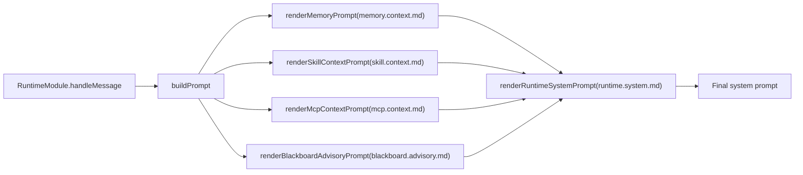
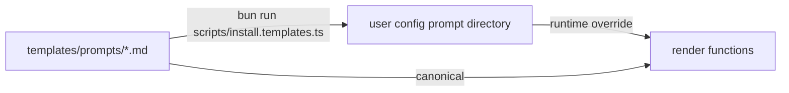

# Flyflor

Flyflor is a Bun + TypeScript intelligent-lifeform runtime kernel designed for single-binary delivery. It is not a chat/session agent. The LLM is fluid intelligence, Memory is context equipment, Crystal is crystallized intelligence, Scope/Fork are explicit durable work domains, and ASK is the closure organ for uncertainty and long-horizon loops.

Official homepage: [https://flyflor.qingshen.xin](https://flyflor.qingshen.xin)

Chinese companion: [README.zh.cn.md](README.zh.cn.md).

## Design Philosophy

- **Context is selected, not accumulated.** Raw transcripts and event streams are evidence. Runtime context is assembled from current input, Memory, Crystal, explicit Scope/Fork, and the Executive capability surface.
- **The ledger is not the mind.** `brain.db` is the monthly life ledger for ledger/query/replay/audit/detail. It is not a session store and never becomes a prompt container.
- **Long work needs territory.** Scope is the durable work domain; ContextFork is the branch under that domain; codename is only an anchor/proposal/recall boost, not a hidden context bucket.
- **Uncertainty must close through ASK.** A missing decision, merge conflict, loop guard, crystallization gate, or long-horizon pause should produce structured ASK instead of silent guessing.
- **Experience becomes Crystal only after evidence.** Gem/Crystal output is stable method or knowledge. Recent conversation, failed guesses, and raw logs do not crystallize without evidence.
- **Execution is an exoskeleton.** MCP, plugins, skills, channel actions, user tools and subagents enter the same auditable Executive Tool surface with sandbox, approval and events.
- **No hidden intelligence via string matching.** Business semantic decisions are driven by structured model output, dedicated JSON prompt templates, or numeric resource metrics.

## Code Layering

The core design is the **Cognitive-Executive-Agent Architecture**:

| Layer | Owner | Responsibility |
| --- | --- | --- |
| Entry | `app.ts` | Thin mode dispatch only. |
| Composition | `src/app.ts` | Explicit dependency binding and runtime startup. |
| Cognitive | `src/cognitive` | Mindstream, Hippocampus Memory, Scope, ASK, Crystal and Gem closure. |
| Executive | `src/executive` | Capability registry, tool descriptors, trust gates, loop guard and pause/resume. |
| Agent | `src/agent` | Runtime pipeline, Blackboard, sandbox, context assembly, skills, MCP, plugin, worker. |
| Socket | `src/socket` | `/ws`, `/health`, live turn, event, operation, ledger query/replay transport. |
| Events | `src/events` | Runtime event fabric and fan-out. |
| Protocol | `src/protocol` | Serializable contracts, enums, control envelopes and structured blocks. |
| Entities | `src/entities` | SQLite row mapping, repositories and schema ownership. |
| Config/Templates | `src/config`, `templates` | JSONC config defaults, prompt templates and memory templates. |

The runtime is split into two planes:

- **Context plane:** current input, Memory recall, Crystal recall, explicit `activeScope`, explicit `contextForkId`, and visible capability surface.
- **Ledger/query plane:** current-month `brain.db`, archived ledgers, history/replay/audit/detail, task plans, fork snapshots and blackboard detail.

No explicit Scope means no fallback Scope, no inbox Scope, and no hidden restore from channel/chat/thread/user metadata. `activeProject` remains a compatibility alias; new code, docs and tests use `activeScope`.

## Memory Tree And Scope Vector

Flyflor's memory model borrows the useful shape of OpenHuman-style Memory Trees: local-first, provenance-bearing, scored, hierarchical memory instead of opaque vector soup. Flyflor adapts that idea to an agent kernel with a stricter context/ledger split:

- **Constitution layer:** Markdown identity, user preferences, Scope facts and explicit constraints.
- **Working-memory layer:** `MemoryComponent` local WAL/snapshot episodes, recent ring buffer, TTL, activation and hot-memory compression.
- **Scope-local tree/vector layer:** each Scope owns its own `.flyflor/scope.db` with vector/tree nodes, hot memory and association rows. This is the project hot zone.
- **Crystal layer:** `CrystalComponent` owns `crystal.db`, memory nodes, Gem snapshots, drift repair and long-term method crystallization.
- **Ledger layer:** `brain.db` records life events, state, replay, audit and detail. It can provide provenance and replay, but does not assemble prompts.

The memory curve is explicit: hot episodes decay quickly, memory nodes decay more slowly, Gems decay very slowly, and stale or contradictory knowledge is repaired or archived. Capacity valves prevent bloat; hot-memory compression writes audit evidence without becoming prompt recall by default.

Scope solidification has two paths:

- **Explicit creation:** when the user clearly starts a project/work item, the system can ASK for confirmation and then create a Scope with constitution, `scope.db`, skills and MCP surface.
- **Gradual promotion:** when the user repeatedly references a project, the system creates a codename anchor, gathers evidence, then promotes it into a Scope once the evidence and confirmation path are strong enough.

Natural Scope recall is a two-stage gate: Flyflor first emits a visible recall phase (`scope.recall.started`, surfaced as "回忆中"), then an LLM judges `none | load | ask` from the current request and Scope candidates. Vector hits, codenames and association rows only supply evidence. If the LLM returns `load`, Runtime equips the Scope constitution and scope-local `scope.db` tree/vector/hot memory before prompt assembly. If it returns `ask`, Runtime asks the user instead of guessing.

## ASK, Fork And Crystal Closed Loop

The closure loop is the kernel's main long-line mechanism:

1. A turn is equipped with current input + Memory + Crystal + explicit Scope/Fork + Executive capabilities.
2. Work may branch into a `ContextFork`, similar to a git branch for cognitive state.
3. A merge request is model-assisted but structured. Conflicts do not silently overwrite; they produce ASK.
4. An unanswered ASK becomes a ghost/pending snapshot that can be resumed with explicit continue behavior.
5. A resolved fork/ASK loop produces evidence. Evidence can become a Crystal candidate, and high-quality candidates become Gem knowledge.

This is how Flyflor closes long-horizon loops without turning transport sessions into memory owners.

## WebSocket Surface And OpenAPI

- `/ws` WebSocket control/event
- `/health`

`/ws` is deliberately more than chat. It supports several interaction modes:

- live turn streaming: `gateway.message.send` -> `turn.delta` -> `turn.final`
- status and capability control: `gateway.status.get`, `capability.catalog.get`
- ledger query/replay: `history.list`, `history.snapshot`
- event subscriptions: `event.subscribe` for ASK, execution, memory, channel and runtime timelines
- Executive loop visibility: paused/resumed loop snapshots, tool execution metadata and guard reasons
- external client wiring: thin clients, local shells, dashboards, Apifox scenarios and future channel adapters

Wire names such as `gateway.*` are `flyflor.ws.v1` compatibility strings, not architecture owner names. HTTP stays limited to `/ws` and `/health`; `/channels` is not restored.

OpenAPI and WS docs:

- [docs/openapi/flyflor.socket.openapi.json](docs/openapi/flyflor.socket.openapi.json) is the Apifox-importable contract.
- [docs/openapi/flyflor.socket.openapi.md](docs/openapi/flyflor.socket.openapi.md) explains the real Apifox WebSocket flow and example messages.
- [docs/apifox/README.md](docs/apifox/README.md) provides the Apifox-only WS example set with every frame expanded for testing.
- [docs/ws.doc.md](docs/ws.doc.md) is the field-level `/ws` manual.
- [docs/control.protocol.md](docs/control.protocol.md) is the protocol contract for external clients.
- [docs/external.kit.md](docs/external.kit.md) and [docs/external.tools.seal.md](docs/external.tools.seal.md) define the three-layer tool model, external sidecar governance, and WS/TUI capability consumption boundary.

Parallel development and handoff rules live in [docs/development.workflow.md](docs/development.workflow.md).

## Quick Start

### Remote Install

```bash
curl -fsSL https://raw.githubusercontent.com/flyflor/flyflor/master/scripts/install.sh | bash
# Pinned version:
curl -fsSL https://raw.githubusercontent.com/flyflor/flyflor/master/scripts/install.sh | bash -s -- --version v0.4.0
# Custom Flyflor home:
curl -fsSL https://raw.githubusercontent.com/flyflor/flyflor/master/scripts/install.sh | bash -s -- --home ~/.flyflor
# Release binary mode is explicit and still installs only inside the prefix:
curl -fsSL https://raw.githubusercontent.com/flyflor/flyflor/master/scripts/install.sh | bash -s -- --binary
# Uninstall release binary path while preserving source/config/data:
curl -fsSL https://raw.githubusercontent.com/flyflor/flyflor/master/scripts/install.sh | bash -s -- --uninstall
```

The default installer is source-first: `~/.flyflor` is the source checkout root, and runtime config, prompts, templates and workspace data live under `~/.flyflor/.config`. The installer runs `bun run build:binary` and leaves the local kernel binary at `~/.flyflor/dist/flyflor`.

It deliberately does **not** create a `flyflor` command in `~/.local/bin`, `/usr/local/bin`, or any other global execution directory. The future Rust CLI/TUI distribution owns the global command through `npm i -g flyflor` and connects to this Bun kernel over `/ws`.

### Install Modes

The repository provides three kernel bootstrap paths. The default and source paths keep the source in `~/.flyflor` and config in `~/.flyflor/.config`; none of them writes a global command:

```bash
# 1. Default source-first install: ~/.flyflor is source root, ~/.flyflor/.config is config root
curl -fsSL https://raw.githubusercontent.com/flyflor/flyflor/master/scripts/install.sh | bash

# 2. Source installer alias; --target can choose the source/config root
curl -fsSL https://raw.githubusercontent.com/flyflor/flyflor/master/scripts/install.source.sh | bash

# 3. Docker dev bootstrap; source remains under ~/.flyflor and compose starts from there
curl -fsSL https://raw.githubusercontent.com/flyflor/flyflor/master/scripts/install.docker.sh | bash

# Windows: PowerShell source bootstrap
powershell -ExecutionPolicy Bypass -Command "irm https://raw.githubusercontent.com/flyflor/flyflor/master/scripts/install.ps1 | iex"
```

Inside a checkout, use `bun run install:source`, `bun run install:docker`, or `bun run install:windows` to debug the bootstrap scripts.

### From Source

```bash
bun install
bun run install:templates  # copies prompts/templates/commands into this checkout's .config
bun run chat
```

Common current entrypoints:

```bash
./dist/flyflor             # local stdio chat debug entrypoint
./dist/flyflor --accept-hooks
./dist/flyflor socket      # primary socket vascular entrypoint; gateway remains a compatibility command
bun run dev                # Bun watch chat mode after syncing templates
bun run socket             # source mode socket: /ws /health
bun run socket:dev         # Bun watch socket mode after syncing templates
sh scripts/socket.dev.sh   # socket dev wrapper with per-run logs
bun run dev:dist           # watch source and rebuild dist/flyflor
```

Recommended socket debugging:

- Run `sh scripts/socket.dev.sh`.
- It clears `./.config/logs/socket.dev/current.log` before startup.
- It also writes this run to `./.config/logs/socket.dev/run.YYYYMMDD-HHMMSS.log`.
- The terminal still streams the full output.

That keeps each debug run isolated from older errors.

Notes:

- The Bun mainline keeps a local stdio chat surface for direct `RuntimeModule` debugging.
- First-party CLI/TUI/socket shell lives outside this repository and should integrate through `/ws`.
- `setup`, `status`, `doctor`, and first-party navigator commands are not stable mainline boundaries here.

Quality checks:

```bash
bun run check                  # TypeScript type check
bun run test                   # deterministic offline unit tests
bun run test:kernel            # deterministic kernel seal subset
bun run test:live              # configured live-model smoke
bun run test:live:docker       # configured Docker live-model smoke
bun run provider:ready         # structured provider readiness
bun run smoke:agent            # deterministic runtime + memory + brain.db smoke
bun run smoke:agent:live       # live-model runtime + memory + brain.db smoke
bun run smoke:mcp:live         # real MCP tools/list smoke
bun run build:binary           # compile local binary
bun run build:binary:release   # compile release-aligned Linux assets
bun run build:templates:release
bun run build:release
bun run kernel:seal            # full Bun kernel seal; missing live provider is a failure here
```

## Docker Dev

Docker dev runs the compiled Linux binary. Compose does not install dependencies or build the project.

```bash
bun run docker:dev
bun run docker:chat
bun run smoke:docker
bun run smoke:agent
bun run smoke:agent:live
bun run smoke:socket:service
bun run smoke:runtime
bun run smoke:runtime:live
bun run smoke:recovery
bun run smoke:mcp:live -- --rounds 10 --delay-ms 30000
bun run smoke:release                     # docs + type + tests + agent smoke + release assets + socket service + docker smoke
bun run ci                                # deterministic local gate; no live credentials
bun run release:check                     # deterministic release smoke
docker exec -it flyflor-dev /tmp/flyflor-linux chat
```

`bun run test` does not call a real model by default. For configured live-model checks, run `bun run provider:ready` first, then use `bun run test:live`, `bun run test:live:docker`, or Docker-specific live smokes. Manual live probes may print skipped diagnostics when credentials are absent; `bun run kernel:seal` treats missing live provider readiness as a seal failure.

Mounts:

| Host path | Container path | Purpose |
| ---------------------- | ------------------------------- | --------------------- |
| `./docker/config` | `/root/.flyflor/.config` | dev config and prompt templates |
| `./docker/workspace` | `/root/.flyflor/.config/workspace` | workspace data |
| `./dist/flyflor-linux` | copied to `/tmp/flyflor-linux` in the container | compiled container binary |

Docker dev defaults to one Flyflor container. Local WAL working memory and local `CrystalComponent` are enabled. `docker/config.default.jsonc` only initializes `docker/config/config.jsonc` when it is missing, so local provider secrets are not overwritten. Rebuild and restart after architecture changes:

```bash
bun run docker:up
```

## Model Config

A minimal OpenAI-compatible provider config:

```jsonc
{
    "model": {
        "activeProvider": "openai",
        "activeModel": "gpt-5.5",
        "providers": {
            "fastai": {
                "baseUrl": "https://api.openai.com",
                "apiKey": "openai-api-key",
                "defaultModel": "gpt-5.5",
            },
        },
        "secrets": {
            "openai-api-key": "...",
        },
    },
}
```

When `baseUrl` is present, the provider is inferred as OpenAI-compatible and `apiMode` defaults to `chat-completions`. If `activeModel`, `defaultModel`, and `models` are absent, the loader probes `${baseUrl}/models` with the resolved `apiKey`. Runtime generation is streaming by default; a non-streaming fallback is only used when the model client does not expose `stream`.

## Runtime Flow

1. Transport, message and actor provenance are normalized into the socket/control input shape.
2. Context assembly uses constitution Markdown, Memory recall, Crystal recall, explicit Scope/Fork and the visible Executive capability surface.
3. The model loop streams output and emits structured blocks for memory actions, ASK, continuation, identity append, TaskPlan, ContextFork and ReplayRecord.
4. The synchronous tail writes episodes, ledger events, ASK/Continuation/Codename/EQ/planning/fork state, skill usage and runtime snapshots.
5. Background workers handle consolidation, hot-memory compression, summary, decay, idle, dream, feedback classification and reflection.

External chat-style channels should deliver final-only responses. Runtime may stream internally and through `/ws`, but platform adapters should not turn intermediate deltas into multiple user-visible messages.

## Engineering Boundaries

- Use Bun for dependencies, scripts and binary builds; do not require Node.js.
- Config lives under `~/.flyflor/.config/config.jsonc` or `./docker/config/config.jsonc` for Docker dev, and JSON config must remain JSONC-compatible.
- Business config does not use environment variables; provider, model, credentials, sandbox policy and socket behavior go through config/secrets provider.
- `brain.db` is ledger/query/replay/audit/detail only. It does not assemble prompt context.
- Business semantic decisions cannot use `text.includes`, regex intent detection, keyword lists, phrase heuristics, sentiment dictionaries or punctuation checks. Use structured model output, dedicated JSON prompt templates or numeric resource metrics.
- Public events and protocols must be JSON-serializable and use explicit types/enums from `src/protocol`.
- New runtime dependencies must be compatible with `bun build --compile`: no native addon, postinstall, dynamic require or runtime `node_modules` asset dependency.
- Secrets, logs, runtime databases and user workspace data must not be compiled into the binary.
- Boundary, high-risk tool or dependency-policy changes must update [docs/boundaries.md](docs/boundaries.md).

## Documentation

Full documentation index: [docs/README.md](docs/README.md).

| Document | Purpose |
| --- | --- |
| [TODO.md](TODO.md) | Current handoff, migration status and validation commands. |
| [docs/README.md](docs/README.md) | Active documentation index and reading order. |
| [docs/project.report.md](docs/project.report.md) | Current project report, design philosophy, red lines, closure model and Kernel V2 lane decisions. |
| [docs/architecture.md](docs/architecture.md) | Cognitive / Executive / Agent architecture, composition root and process model. |
| [docs/refactor.roadmap.md](docs/refactor.roadmap.md) | Refactor direction and active maintenance posture. |
| [docs/directory.architecture.md](docs/directory.architecture.md) | Source, config, runtime and workspace directory ownership. |
| [docs/executive.exoskeleton.md](docs/executive.exoskeleton.md) | Executive capability, tool, trust and loop model. |
| [docs/runtime.events.md](docs/runtime.events.md) | Event fabric and runtime timeline. |
| [docs/boundaries.md](docs/boundaries.md) | Engineering boundaries and hard red lines. |
| [docs/runtime.turn.md](docs/runtime.turn.md) | Single-turn runtime flow. |
| [docs/memory.system.md](docs/memory.system.md) | Memory, Crystal, Scope/Fork, decay and Dream. |
| [docs/blackboard.md](docs/blackboard.md) | Blackboard routing, convergence and worker protocol. |
| [docs/ws.doc.md](docs/ws.doc.md) | Field-level `/ws` manual. |
| [docs/openapi/flyflor.socket.openapi.md](docs/openapi/flyflor.socket.openapi.md) | Apifox import and real socket scenario contract. |
| [docs/sandbox.capabilities.md](docs/sandbox.capabilities.md) | Sandbox decisions and audit. |
| [docs/mcp.tools.md](docs/mcp.tools.md) | MCP tool loop. |
| [docs/external.kit.md](docs/external.kit.md) | External kit manifest, discovery and control contract. |
| [docs/external.tools.seal.md](docs/external.tools.seal.md) | External tool capability matrix, WS/TUI contract and seal validation. |
| [docs/control.protocol.md](docs/control.protocol.md) | WS/control protocol for external clients and thin clients. |
| [docs/crystal.reflection.md](docs/crystal.reflection.md) | Reflection to Gem crystallization. |
| [docs/skill.system.md](docs/skill.system.md) | Skill loading and promotion. |

External repository handoff references:

| Document | Purpose |
| --- | --- |
| [docs/old-docs/rust.integration.md](docs/old-docs/rust.integration.md) | External Rust socket/channel/cli/tui `/ws` integration handoff. |
| [docs/old-docs/rust.connection.core.md](docs/old-docs/rust.connection.core.md) | External Rust `/ws` connection core and reconnect state machine. |
| [docs/old-docs/rust.gateway.shell.backlog.md](docs/old-docs/rust.gateway.shell.backlog.md) | External Rust socket shell backlog reference. |

Historical proposals and migration background are archived under [docs/old-docs/README.md](docs/old-docs/README.md). They explain past decisions but do not define the current runtime contract.

<!-- flyflor:prompt-templates:start -->
# Prompt Template System

## One-line Summary

All model-facing instructions live in `templates/prompts/`, grouped by topic; canonical `*.md` files are the runtime templates.

## Related Paths

- `src/agent/prompts/index.ts` - all render entry points
- `src/agent/prompts/template.manifest.ts` - template bundle version and file contract
- `src/agent/prompts/template.docs.ts` - docs renderer
- `templates/prompts/` - built-in runtime templates
- `templates/prompts/docs/` - docs renderer templates, not runtime prompts
- `scripts/install.templates.ts` - install into the config directory
- user config prompt directory - optional override directory

## Bundle Version

2

## Template Catalog

| Key | File | Call Site | Required Placeholders |
|---|---|---|---|
| `askSchema` | `ask.schema.md` | `renderAskSchemaInstructions` | — |
| `behaviorPriority` | `behavior.priority.md` | `renderBehaviorPriorityInstructions` | — |
| `blackboardAdvisory` | `blackboard.advisory.md` | `renderBlackboardAdvisoryPrompt` | `compactRounds` / `elapsedMs` / `reason` / `status` / `turnId` |
| `blackboardDecision` | `blackboard.decision.md` | `BlackboardModule.returnDecisionToUser` | `questionCount` / `reason` / `unresolvedIssues` |
| `blackboardRoute` | `blackboard.route.md` | `decideBlackboardRoute` | `request` |
| `blackboardWorkerEnvelope` | `blackboard.worker.envelope.md` | `renderBlackboardWorkerEnvelope` | `contractJson` / `convergencePolicyJson` / `currentRoundStepsJson` / `discussionPlanJson` / `goalJson` / `minRoundsJson` / `participantJson` / `phaseJson` / `previousStepsJson` / `roundJson` |
| `blackboardWorkerSystem` | `blackboard.worker.system.md` | `renderBlackboardWorkerSystemPrompt` | `participant` |
| `crystalReflection` | `crystal.reflection.md` | `ReflectionWorker.dispatch` | `evidence` |
| `feedbackClassify` | `feedback.classify.md` | `classifyAndApplyFeedback` | `currentUserText` / `previousAssistantText` |
| `memoryAction` | `memory.action.md` | `renderMemoryActionInstructions` | — |
| `memoryConsolidation` | `memory.consolidation.md` | `ConsolidationWorker` | `episode` |
| `memoryHotCompress` | `memory.hot.compress.md` | `HotMemoryCompressionWorker` | `episodes` |
| `memoryContext` | `memory.context.md` | `renderMemoryPrompt` | `hippocampus` / `markdownContent` / `retrievedResults` / `scopeMemory` |
| `memoryDream` | `memory.dream.md` | `DreamWorker` | `candidates` / `ownerKey` |
| `memoryWorkContextOffer` | `memory.scope.offer.md` | `renderWorkContextOfferPrompt` | `evidenceScore` / `relatedCount` / `remainingTurns` / `title` |
| `memorySkillOffer` | `memory.skill.offer.md` | `renderSkillOfferPrompt` | `confidence` / `name` / `remainingTurns` / `support` / `tools` |
| `mcpContext` | `mcp.context.md` | `renderMcpContextPrompt` | `mcpEntries` |
| `mcpToolBudgetExhausted` | `mcp.tool.budget.exhausted.md` | `renderMcpToolBudgetExhaustedPrompt` | — |
| `runtimeAskContinuation` | `runtime.ask.continuation.md` | `renderRuntimeAskContinuationPrompt` | `chainDepth` / `choices` / `prompt` / `reason` |
| `runtimeIdleResume` | `runtime.idle.resume.md` | `renderRuntimeIdleResumePrompt` | `idleBucket` |
| `runtimeEqContext` | `runtime.eq.context.md` | `renderRuntimeEqContextPrompt` | `ageBucket` / `arousal` / `confidence` / `directive` / `dominance` / `label` / `valence` |
| `runtimeContinuationHint` | `runtime.continuation.hint.md` | `renderRuntimeContinuationHintPrompt` | `continuationEntries` |
| `runtimeIdentityContext` | `runtime.identity.context.md` | `renderRuntimeIdentityContextPrompt` | `identityEntries` |
| `runtimeSystem` | `runtime.system.md` | `renderRuntimeSystemPrompt` | `askSchemaInstructions` / `behaviorPriorityInstructions` / `blackboardContext` / `mcpContext` / `memoryActionInstructions` / `memoryContext` / `sandboxSummary` / `skillContext` |
| `skillContext` | `skill.context.md` | `renderSkillContextPrompt` | `skillEntries` |

## Assembly Flow



## Install Flow



- A same-named file in the user directory overrides the built-in template; the install script syncs the bundle and manifest together.
- Runtime only loads canonical `.md` template files.
- `*.zh.cn.md` files are audit-only mirrors synced by the install script; they do not enter the runtime bundle, manifest, or lint contract.
- `templates/prompts/docs/*.md` files are docs-renderer templates; they are not installed as runtime prompts.

## Data Contract

Every template must guarantee:

1. The model emits structured JSON sections by schema while code only validates shape, enums, and ranges.
2. Template-facing enum values come from `src/protocol/contracts/enums.ts`; add new enums there before updating templates.
3. Templates must not allow the model to invent undeclared fields; extra fields are always discarded.

## Prompt-facing Enums

- `MemoryActionTarget`: `memory` / `self` / `identity` / `user`
- `MemoryKind`: `candidate` / `conversation-turn` / `fact` / `gem` / `history` / `profile` / `rule` / `skill` / `summary`
- `MarkdownMemoryFile`: `MEMORY.md` / `SELF.md` / `IDENTITY.md` / `USER.md`
- `AskReason`: `codename-ambiguity` / `codename-create` / `user-intent-unclear` / `blackboard-stalemate` / `policy-decision` / `other`
- `ContinuationContextReason`: `ask` / `tool-failure` / `blackboard-cap` / `process-restart`
- `ContinuationDecisionKind`: `resume` / `fork` / `fresh`
- `EqLabel`: `neutral` / `joy` / `anger` / `sadness` / `fear` / `surprise`

## Model Readability

Runtime-injected templates should only contain instructions the model can act on directly: when to use them, what structure to emit, what each field means, and how to resolve conflicts. Internal route ids, TODO ids, phase names, and implementation metaphors must not appear in runtime prompts.

Internal identifiers may stay in archived planning docs, design docs, code comments, and test names; model-facing templates must translate them into plain source labels and behavior descriptions.

## Release Checks

- Template lint checks required files, non-empty content, required placeholders, unknown prompt files, the bundle manifest version, and the template catalog.
- Runtime prompt bodies must not expose internal route ids or unexplained engineering metaphors.
- `*.zh.cn.md` mirrors do not participate in runtime assembly or manifest comparison; they are for human review and audit only.
- `template.docs.ts` reads this Markdown template and only replaces machine values such as bundle version and enum snapshots.
- Runtime only assembles canonical `.md` files.

## Related Tests

- `tests/prompt.lint.test.ts`
- `tests/prompt.templates.docs.test.ts`
- `tests/blackboard.boundaries.test.ts`
- `tests/eq.prompt.test.ts`
- `tests/ask.parse.test.ts`
<!-- flyflor:prompt-templates:end -->
