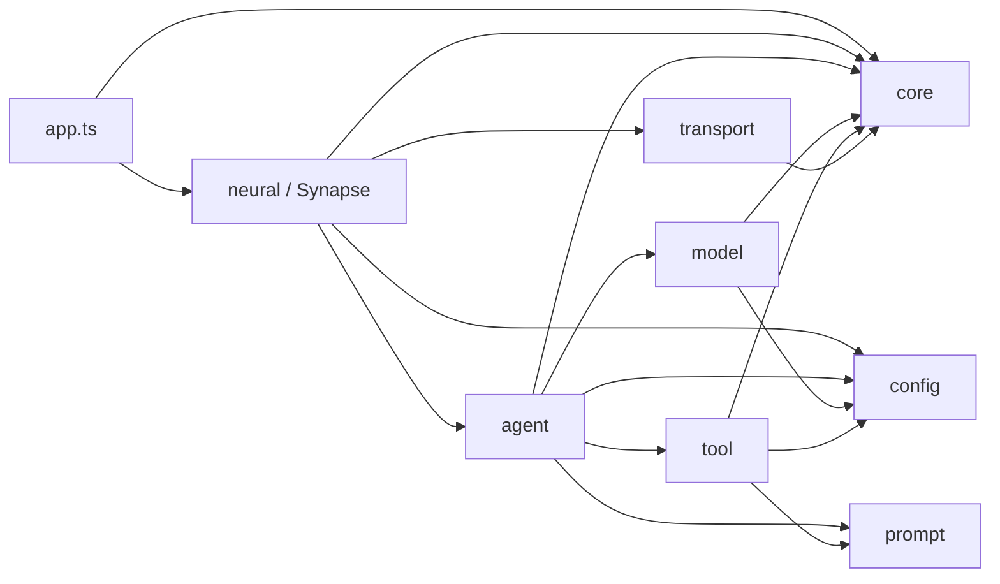
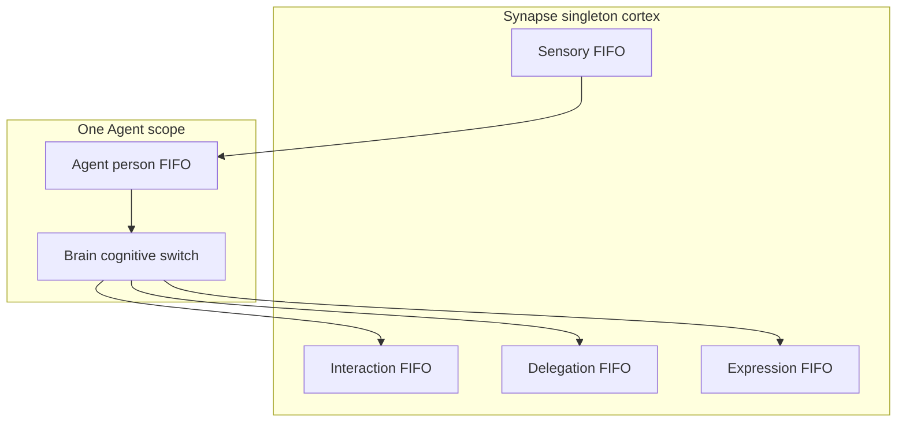
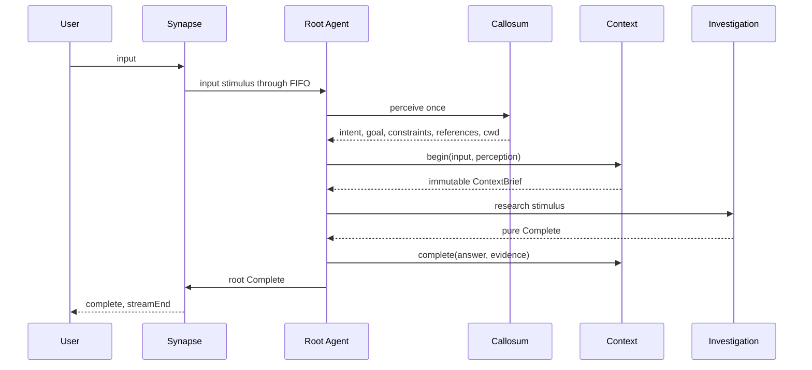
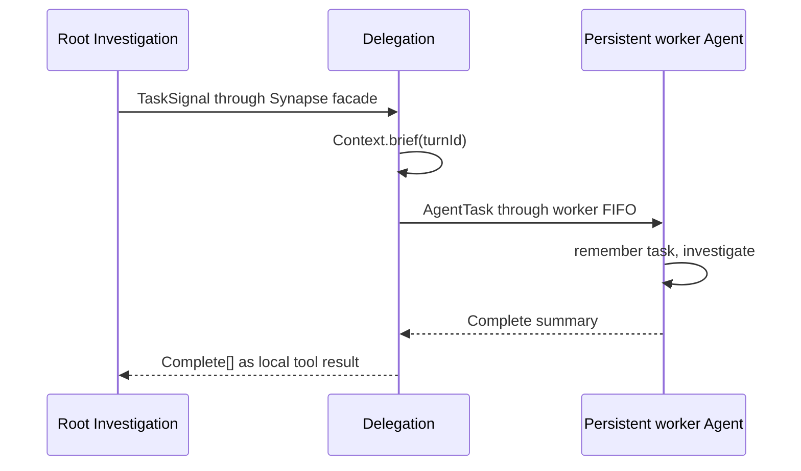

# Flyflor

Flyflor is a sessionless intelligent-life kernel built with Bun and TypeScript. It exists continuously: reconnecting a socket or refreshing a browser does not recreate its Context or its people. A transport connection is not a lifecycle boundary and there is no Session object.

The kernel has one purpose: understand the user's need, investigate reality, summarize what was learned, and complete the task accurately.

Its biological vocabulary is architectural, not decorative:

- `Synapse` is the singleton cortex. It routes neural signals and coordinates persistent people.
- `Context` is the singleton owner of every Turn.
- each `Agent` is a persistent person with an isolated IOC scope;
- each person owns one `Brain`, `Callosum`, `Investigation`, `Identity`, and bounded `Memory`;
- `Tools` perform concrete actions directly and never disguise tool execution as a neural signal.

Engineering red lines live in [AGENTS.md](AGENTS.md).

## Quick Start

```bash
bun install
printf 'DEEPSEEK_API_KEY=...\n' > .env
bun run dev
bun run client
```

`bun run dev` starts [src/bootstrap.ts](src/bootstrap.ts). Bun loads the ignored `.env`; the bootstrap loads decorator metadata and calls `Factory.create(AppModule)`. `@Init` completes lifecycle wiring before the graph becomes available.

`bun run client` serves the browser client at `http://127.0.0.1:17878`. The bridge preserves the kernel's length-prefixed IPC boundary and forwards strict JSON actions. The UI handles `open`, ordered `agent` chunks, `ask`, `confirm`, `pause`, `resume`, pure `complete`, `streamEnd`, connection close, and transport errors. Unknown or malformed packets throw instead of being displayed as a successful response.

Run every health gate before completing a kernel change:

```bash
bun run check
bun test
bun run build:binary
```

To exercise the configured provider rather than mocks, run:

```bash
bun run test:live
```

The live suite starts the real AppModule, Unix socket, WebSocket bridge, persistent Agent pool, and the model/provider from `.config/config.jsonc`. It verifies direct reply, filesystem read, Ask, rejected Confirm, approved filesystem write, Shell, Execute, two-person Task delegation, refresh-and-resume while Ask and Confirm are pending, reconnect memory continuity, and Soul updates against a disposable identity package. All files and logs created by this suite live in a temporary directory and are removed afterward. The command intentionally performs real API calls and fails when the configured credential, model, protocol, signal, tool result, or cleanup is wrong.

## Ownership

| Object | Lifetime | Sole responsibility |
| --- | --- | --- |
| `Synapse` | life-form singleton | cortical facade, lifecycle composition, signal routing |
| `AgentPool` | one Synapse lifecycle | active identity, validated profiles, persistent Agent scopes |
| `Sensory` / `Interaction` / `Delegation` / `Expression` | one Synapse lifecycle | one independent FIFO and its exact cortical effect |
| `Context` | life-form singleton | sole creation and mutation of Turns; bounded completed experience (32) |
| `Agent` | persistent pool person | person-boundary FIFO around one person's cognition |
| `Memory` | one Agent scope | bounded continuous temporary notes; never Turns |
| `Brain` | one Agent scope | cognitive switch FIFO and root completion |
| `Callosum` | one Agent scope | one strict perception for each root input |
| `Investigation` | one Agent scope | model loop, Ask/Confirm/Task/Complete network, compact evidence, and local replay |
| `Identity` | one Agent scope | durable prompt identity under package policy |
| `Tools` | life-form singleton | direct concrete actions and their schemas |
| `Model` | one Agent scope | context-pressure decision, exact provider request, and fully awaited streaming |
| `FSocket` | life-form singleton | IPC lifecycle and backpressure only |

Context owns the internal `Turn` class. The Context barrel exports immutable briefs and summaries, never Turn. Brain calls `begin()` and `complete()`; Interaction calls `pause()` and `resume()`; Delegation calls `brief()`. No caller receives mutable Turn state.

## Dependency Direction



Agent never imports Neural. Their boundary is `AgentBus.fire()` plus the stable discriminated signal structures in `src/agent/types.ts`. Transport never imports cognition or Synapse; it invokes bound callbacks.

## Neural Path


Ask and Confirm share a serial interaction circuit. Task uses an independent delegation circuit. Reply and Complete use an ordered expression circuit. A delegated task can therefore wait for another person while user interaction continues without deadlocking.

Every circuit uses the same four-method `Observable` contract: `pipe`, `switch`, `subscribe`, and `next`. Exactly one Input→Output transform is required; a missing transform, duplicate registration, absent discriminated branch, or downstream rejection fail-stops that circuit.

## IOC And Lifecycle

`src/bootstrap.ts` loads `reflect-metadata` before decorated application classes and calls `Factory.create(AppModule)`. AppModule imports Synapse, so one call resolves and initializes the entire life form.

- `@Singleton` and `@Module` are cached only after injection and `@Init` succeed.
- `@Inject()` records only an owned property key; Container reads its `design:type` through Reflect metadata when resolving the object.
- inherited member metadata is collected explicitly without sharing mutable arrays, while singleton and module policies remain class-owned.
- `@Scope` uses one Agent-local resolution scope.
- Brain, Callosum, Investigation, Identity, Memory, and Model are created once inside that person's scope and reused there.
- different people never share scoped cognition or Memory;
- business code never directly constructs an application class;
- a failed initialization is not published to the singleton cache.

Synapse binds one fresh AgentPool to its `AgentBus`. AgentPool validates and copies every complete configured profile, creates each person once, and retains the isolated scopes. A failed Synapse initialization discards its unpublished pool and circuits. Profile copies are never mutated; `ConfigService.path.cwd` is intentionally mutable only through the explicit `cwd` transport action. Task-level workers are never created.

## Observable Circuits

`Observable<TInput, TOutput>` extends `FlyFlor`. Its complete public method surface is `pipe`, `switch`, `subscribe`, and `next`.

- `pipe` installs the sole Input→Output transform; a missing or second transform rejects;
- `switch('type', handlers)` installs that same transform with exhaustive discriminated branches;
- `next()` returns the full processing Promise;
- one promise tail gives each circuit FIFO ordering;
- the selected transform and subscribers are awaited in registration order;
- an absent switch case throws;
- a rejection propagates unchanged and leaves that circuit fail-stopped;
- separate instances can process concurrently.

Synapse composes four independent concrete circuit objects:

| Circuit | Input | Effect |
| --- | --- | --- |
| sensory | user text | queues the root person's input stimulus |
| interaction | Ask or Confirm | serializes exact user interaction while other circuits remain live |
| delegation | Task | builds child tasks from `ContextBrief` and awaits target Completes |
| expression | Reply or root Complete | orders reply chunks, Complete, then streamEnd |

Each Agent owns a person-boundary FIFO (`pipe` maps stimulus to Complete). Each Brain owns a separate cognitive switch FIFO (`switch` on stimulus type). The two layers stay distinct: serial person thinking versus cognitive routing. Investigation builds its Ask, Confirm, Task, and Complete switch once in `@Init` and reuses it for later stimuli.



## Root Turn



The `reply`, `research`, and `soul` routes all end in Complete. Complete is the final summary and Context stores it directly. There is no second settle call and provider replay is never written to Context.

If cognition rejects, the rejection is not converted to a friendly message. The affected FIFO remains fail-stopped and the active experience is preserved for diagnosis rather than disguised as success.

## Delegation

Investigation exposes Task only for a root-capable run. Task validates `[{ agent, goal }]`; it neither creates people nor performs dispatch.



Tasks targeting the same person queue behind that person's current stimulus. Different people can run concurrently. Self-delegation is rejected because waiting on the currently executing FIFO would deadlock. Delegated runs receive `tools.list(false)`, so they cannot recursively emit Task. They may still use the common Ask and Confirm circuit.

## Investigation And Tools

Provider tool calls exist only in the local Investigation message list.

- Ask is validated by its tool, routed through the interaction circuit, and replayed with structured answers.
- Confirm is routed before a concrete dangerous action. Rejection becomes `{ approved: false, executed: false }`; the action is not run.
- Task is validated, routed through delegation, and replayed with child Complete summaries.
- Filesystem, Shell, and Execute run directly through Tools.
- thrown failures reject unchanged;
- shell non-zero exit and timeout remain explicit process data;
- execute spawn errors reject the batch, while completed process exits remain explicit data;
- Filesystem, Shell, and Execute each own a strongly typed compact `observe` projection;
- `Tools.observe(result)` trusts the result's single `name`; Investigation projects Ask/Task outcomes and appends approval/effect metadata;
- valid observations are copied into the current person's bounded Memory.

Investigation advances by understanding the goal, obtaining facts or executing, checking the result, and either continuing or completing. It requests a model-written plain-text summary before the next ordinary sample when Model reports approximately eighty percent of usable context capacity. The compacted history retains identity, the current stimulus, the original goal, compact evidence, the summary, and its next action; older tool replay is removed. Model-facing results share a fixed 64 KiB display budget per tool-call batch and retain UTF-8-safe head and tail content around an explicit omitted-byte marker. Model-visible tool JSON schemas remain unchanged.

Memory evicts oldest notes in FIFO order after sixteen notes. It stores compact goals, references, and observations, not the current raw input, full file contents, process output, delegated answers, provider messages, final Turn answer, Turn status, or a Turn array. Context alone retains the completed answer and keeps at most thirty-two completed Turns (active Turn is never evicted). The current input appears once in the stimulus input block and is omitted from its Context block.

## PromptService And XML

PromptService is the only prompt boundary. It owns:

- canonical English Markdown loading and `.zh.cn.md` mirror exclusion;
- ordered sections declared by package `config.jsonc`;
- editable, locked, and runtime-ignored identity policy;
- strict all-before-any validation of identity writes;
- XML name validation, attribute escaping, CDATA splitting, and stable block order;
- inline `document` rendering for ContextBrief, user input, task data, and tool results.

XML exists only at model input boundaries. It is not a storage format for Context, Turn, or Memory. Missing packages, sections, mappings, blocks, and illegal names reject immediately.

## Model Protocol

Each provider resolves to one protocol attempt:

| Provider | Protocol and path | Tools |
| --- | --- | --- |
| `openai` | Chat Completions, `/v1/chat/completions` | supported |
| `deepseek` | OpenAI-compatible Chat Completions, `/chat/completions` | supported |
| `vllm`, `lmstudio` | declared OpenAI-compatible Chat Completions | supported |
| `responses` | Responses, `/v1/responses` | rejected before fetch |
| `anthropic` | Messages, `/v1/messages` | rejected before fetch |
| `google`, `gemini` | Gemini streaming generate content | rejected before fetch |
| `aws`, `bedrock` | Bedrock converse stream | rejected before fetch |
| `cohere` | Cohere chat | rejected before fetch |
| `ollama` | Ollama JSON stream | rejected before fetch |

Unknown providers reject. Failed status codes, wrong response shapes, malformed tool JSON, missing or repeated terminal events, token limits, unsafe or unknown finish reasons, tool-use mismatches, and tool calls on text-only requests reject. Unsupported protocols reject tool definitions or tool replay before `fetch`. Streaming text callbacks are awaited, so neural output ordering cannot escape the model Promise.

Agent profiles provide `contextLength` and `maxTokens` as capacity facts; they do not configure cognition or review policy. ProtocolClient measures the final UTF-8 JSON body and rejects any request above its internal 512 KiB safety boundary before `fetch`.

## Transport

IPC frames contain an eight-byte unsigned big-endian body length followed by UTF-8 JSON. Packet buffering covers split headers, split bodies, split UTF-8 sequences, and coalesced frames. Invalid and oversized frames reject.

FSocket rejects writes without a live connection. It validates packet roots, non-empty actions, user text, and answer correlation before routing. Reconnect resets only transport framing and pending bytes; Context and Agent Memory remain untouched. A pending Ask/Confirm stays paused and is replayed after `open` in the original `ask|confirm → pause` order. `resume` is written successfully before Context is resumed and the pending Promise is resolved. Input, answer, and connected callbacks are awaited. Unknown controller actions reject.

The Web bridge preserves the same eight-byte frame and enforces the same 4 MiB body boundary and packet-root validation in both directions.

## Runtime Contracts

- A Turn is created and changed only under `src/agent/context`; it is never exported.
- Context retains at most 32 completed Turns; `recent(0)` is empty and invalid limits reject.
- Memory contains only one person's 16 finite notes. It never stores Turns, provider messages, or session state.
- Complete is the final investigation summary. Context stores it directly without a second settlement model call.
- Root and delegated stimuli enter the receiving person's FIFO. The same person thinks serially; different people may investigate concurrently.
- Delegated people do not receive the Task tool, preventing recursive delegation.
- Ask and Confirm wait for exact correlated answers. If the client disconnects while waiting, the pending interaction remains paused and replays after `open`; `resume` is written before Context changes. A rejected Confirm is an explicit non-execution result.
- Filesystem, Shell, and Execute are strongly typed direct actions and each projects only its own compact observation. Investigation owns Ask/Task outcomes plus approval/effect metadata. Thrown failures reject unchanged.
- Filesystem byte limits preserve UTF-8 boundaries. Runtime cwd changes belong to `ConfigService`; Agent profile copies remain unchanged.
- PromptService is the only prompt-package and XML rendering boundary.
- Provider names map to one protocol and one endpoint convention. OpenAI-compatible protocols support tools; Responses, Anthropic, Gemini, Bedrock, Cohere, and Ollama reject tool definitions or replay before fetch while retaining text-only paths.
- A model request succeeds only after one terminal event. Missing/repeated terminals, token limits, unsafe or unknown finish reasons, tool-use mismatches, and tool calls on text-only requests reject.
- IPC keeps its eight-byte big-endian frame and enforces a 4 MiB body limit, strict packet roots, non-empty actions, exact user text, answer correlation, and backpressure. The Web bridge enforces the same root and body limits.
- Catch clauses, `.catch()`, rejection fallbacks, public Turn access, direct application construction, cross-domain relative imports, behavioral barrels, unowned instance state, unsupported decorators, and Observable surface expansion are static violations.
- Unit-test logging is isolated under the system temporary directory, leaving the tracked runtime log unchanged.
- The checked-in live suite uses the real configured `deepseek` provider and currently targets `deepseek-v4-flash`; it does not replace deterministic unit tests.

## Static Red Lines

`bun run check` combines TypeScript checking with an AST-based architecture gate. It rejects:

- CatchClause, `.catch()`, and rejection fallback handlers;
- direct application construction outside IOC;
- missing substantive EN/ZH JSDoc on runtime classes, constructors, methods, and accessors;
- instance state not initialized by its constructor and decorators outside the fixed whitelist;
- any Observable public method or state beyond its four-method contract;
- methods over 500 lines;
- illegal dependency direction, cross-domain relative imports, and non-re-export barrels;
- public or externally imported Turn;
- Session types;
- missing Chinese documentation mirrors;
- invalid prompt source constraints.

## Verification Layers

`bun test` provides deterministic coverage for Observable FIFO/fail-stop behavior, IOC scope and publication, Context isolation, Investigation branching, tools, protocol parsing, IPC framing, reconnect replay, and Web bridge encoding. Unit-test logging is redirected to a temporary directory so the tracked runtime log is unchanged. `bun run test:live` then drives the actual browser bridge and kernel with the configured model. Its disposable scenarios cover all three cognitive routes, every concrete tool, Ask/Confirm correlation, multi-person Task completion, and reconnect continuity. This separation keeps ordinary tests repeatable while making provider and prompt behavior independently reproducible.

## Source Layout

```text
src/
  bootstrap.ts  metadata-first process entry
  app.ts        AppModule composition root
  core/         IOC, Observable, bases, logging
  config/       strict runtime configuration
  prompt/       prompt packages and safe XML rendering
  model/        model boundary and protocol adapters
  agent/        people, cognition, Context, private Memory
  neural/       Synapse cortical circuits and Agent pool
  tool/         concrete tools and approval policy
  transport/    socket, packet, controller
scripts/
  live.script.ts  real provider and Web/IPC end-to-end verification
web/
  client.ts      strict HTTP/WebSocket-to-IPC bridge
  client.html    browser interaction and expression client
```
