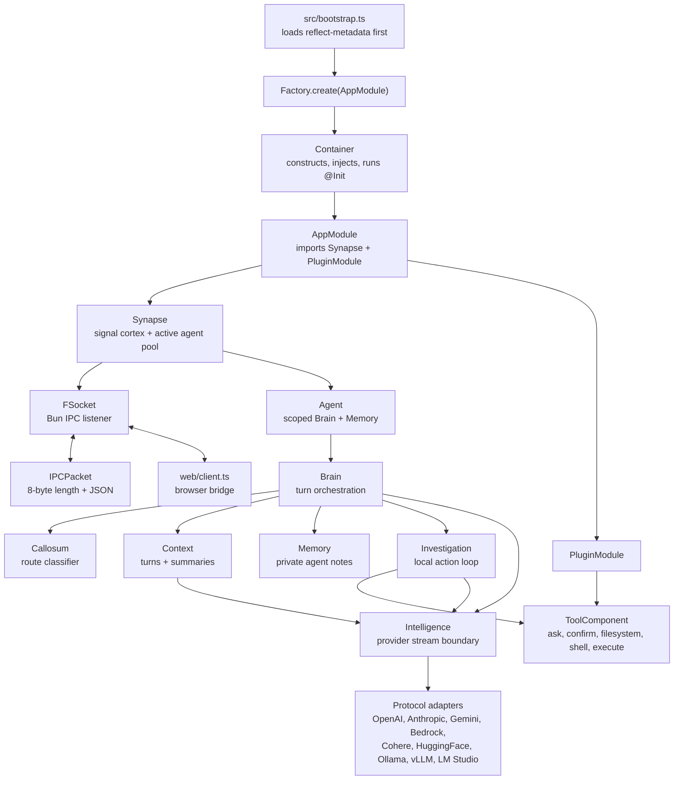
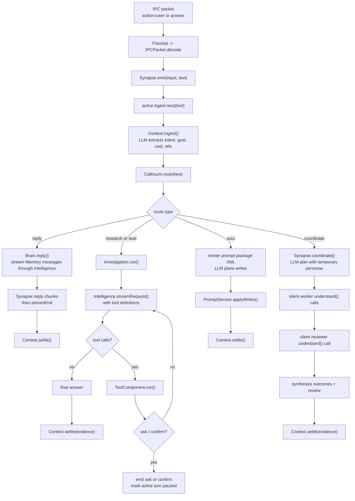

# Flyflor

Flyflor is a Bun + TypeScript agent kernel. The current codebase is built around decorated classes, a reflect-metadata IOC container, a local length-prefixed IPC socket, prompt packages, provider protocol adapters, and a small local tool surface.

## Quick Start

```bash
bun install
export DEEPSEEK_API_KEY=...
bun run dev
bun run client
```

`bun run dev` starts `src/bootstrap.ts` and opens the configured IPC socket. `bun run client` serves the local browser bridge at `http://127.0.0.1:17878` and forwards browser JSON messages to that socket.

Use these checks before calling a change healthy:

```bash
bun run check
bun test
bun run build:binary
```

`bun run check` runs TypeScript and the repository red-line scanner. The default model/provider lives in `.config/config.jsonc`; secrets stay in environment variables.

## Runtime Map



## Boot Lifecycle

```mermaid
flowchart LR
    A["bootstrap.ts"] --> B["import reflect-metadata"]
    B --> C["Factory.create(AppModule)"]
    C --> D["Container.getAsync(AppModule)"]
    D --> E["build module imports"]
    E --> F["construct class"]
    F --> G["@Config / @Prompt early injections"]
    G --> H["@Inject / @Scope dependency injections"]
    H --> I["@Init lifecycle method"]
    I --> J["Factory.synapse()"]
```



Only the IOC container should construct application classes. Singleton classes are cached by decorator metadata; ordinary providers are created fresh when resolved.

## One User Turn



`Context` is the durable turn owner. `Memory` is not a transcript; it is a bounded private note cache seeded from a `Context.brief()`.

## IPC Contract

Every packet on the kernel socket is one 8-byte unsigned big-endian JSON body length followed by a UTF-8 JSON body:

```txt
+--------------------------+-------------------------------+
| 8-byte body length (BE)  | JSON body bytes (UTF-8)       |
+--------------------------+-------------------------------+
```

Inbound packets with `action: "user"` or `action: "answer"` become agent input. Other inbound actions are dispatched to `Controller`; the current controller action is `cwd`, which updates `ConfigService.path.cwd`.

Common outbound actions are `open`, `agent`, `streamEnd`, `data`, `ask`, `confirm`, `pause`, `resume`, and `error`.

## Model Boundary

`Intelligence` exposes one normalized stream contract:

- `text_delta` for visible output.
- `reasoning_delta` for provider reasoning that must be replayed when the provider expects it.
- `action_start`, `action_delta`, and `action_end` for streamed tool calls.
- `done` with `stop`, `length`, or `toolUse`.

Protocol selection comes from the active provider in `.config/config.jsonc`. Provider-level `protocols` override `model.protocols`; each protocol adapter owns only its wire body and stream parser.

## Tool Surface

The current model-visible tools are loaded from `prompts/tools/config.jsonc` and implemented under `src/plugins/tools`:

- `ask`: asks the user to choose from options; the tool adds an `other` option.
- `confirm`: asks for a yes/no-style confirmation with a recommended boolean.
- `filesystem`: `read`, `write`, `edit`, or file-only `delete`, resolved from explicit `cwd` or `ConfigService.path.cwd`.
- `shell`: runs one command with args and a bounded timeout.
- `execute`: runs serial or parallel `python` / `sh` script tasks with optional per-task cwd, env, and timeout.

`Investigation` owns the tool loop. Tool request/result replay stays inside provider messages and is not written into `Context.turns`.

## Prompt Runtime

`PromptService` loads either one markdown file or a prompt package directory with `config.jsonc`. Package configs define ordinary render sections, editable files, locked files, runtime-ignored files, and an XML document view used by the `soul` route.

Canonical runtime prompt sources are English `.md` files. `.zh.cn.md` files are human mirrors and must not become runtime source-of-truth.

## Source Layout

```txt
src/bootstrap.ts                       process entrypoint
src/app.module.ts                      root @Module
src/configuration.ts                   ConfigService and runtime config types
src/core/                              decorators, IOC, base classes, prompt, logger, tool contracts
src/neural/                            Synapse, IPC socket, packet codec, controller
src/agent/                             Agent, Brain, Callosum, Context, Memory, Investigation, Intelligence
src/plugins/                           plugin boundary and local tools
src/entities/                          entity/repository classes; MemoryRepo currently returns SQL statements
web/                                   local browser-to-IPC bridge and test page
prompts/                               prompt packages plus zh.cn mirrors
.config/                              runtime config and active agent prompt package
sql/                                   schema files
pakcages/                              bundled sqlite-vec helper/native assets; not in the current agent turn path
scripts/check.script.ts                docs mirror and prompt-term checks
```

## Current Edges

`MemoryRepo` and `sql/001-core-schema.sql` prepare a future persistence boundary, but the current `Agent`, `Context`, and `Memory` path is in memory. The config file also declares skills and MCP shapes, but this codebase does not yet include a runtime MCP client or skill loader wired into the turn loop.

Project rules live in `AGENTS.md`; this README is only the implementation overview.
