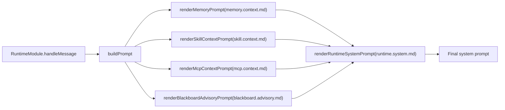
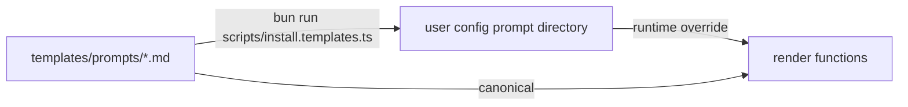

# Flyflor

Flyflor is a Bun + TypeScript intelligent-lifeform kernel for single-binary delivery. It is not a chat/session agent: Mindstream is fluid intelligence, `MemoryComponent` is hot memory, `CrystalComponent` is crystallized intelligence, explicit `Scope` and `ContextFork` are durable work domains, and ASK is the closure organ for uncertainty, crystallization and long-horizon loops.

Official homepage: [https://flyflor.qingshen.xin](https://flyflor.qingshen.xin)

Chinese companion: [README.zh.cn.md](README.zh.cn.md).

## Current Contract

- Runtime context is assembled from current input, Memory, Crystal, explicit Scope/Fork, and the Executive visible capability surface.
- `brain.db` is the monthly life ledger for ledger/query/replay/audit/detail. It is not a session store, prompt container, or hidden continuity owner.
- `clientId`, `conversationKey`, `threadId`, connection metadata and transport actor data stay at routing/audit/dedup/reply-anchor boundaries.
- `/ws` and `/health` are the only HTTP surfaces. `gateway.*` names are `flyflor.ws.v1` wire compatibility, not architecture ownership.
- Tools, MCP, plugins, skills, user tools, sidecars and subagents enter through the Executive exoskeleton with sandbox, approval, quota, audit and events.
- Business semantic decisions are driven by structured model output, dedicated JSON prompt templates, or numeric resource metrics, never keyword matching.

## Source Map

| Layer | Path | Responsibility |
| --- | --- | --- |
| Entry | `app.ts` | Thin mode dispatch. |
| Composition | `src/app.ts` | Explicit dependency binding and startup. |
| Cognitive | `src/cognitive` | Mindstream, Hippocampus Memory, Scope, ContextFork, ASK and Crystal/Gem closure. |
| Executive | `src/executive` | Capability registry, tool descriptors, trust policy, loop guard and external sidecar contracts. |
| Agent | `src/agent` | Runtime turn pipeline, Blackboard, context assembly, sandbox, prompts, skills, MCP, plugins and workers. |
| Socket | `src/socket` | `/ws`, `/health`, live turn, control/event transport and ledger read snapshots. |
| Events | `src/events` | Runtime event fabric and fan-out. |
| Protocol | `src/protocol` | Serializable contracts, enums, control envelopes and structured model blocks. |
| Entities | `src/entities` | SQLite row mapping, repositories and schema ownership. |
| Config/Templates | `src/config`, `templates` | JSONC config, defaults, prompt templates and project/memory templates. |

## Documentation

- [docs/README.md](docs/README.md) - documentation reading order and archive policy.
- [docs/architecture.md](docs/architecture.md) - project philosophy, context/ledger split and source directory map.
- [docs/directory.architecture.md](docs/directory.architecture.md) - owner boundaries and naming rules.
- [docs/runtime.turn.md](docs/runtime.turn.md) - single-turn runtime pipeline.
- [docs/memory.system.md](docs/memory.system.md) - Memory, Crystal, Scope, ContextFork, recall and `brain.db`.
- [docs/blackboard.md](docs/blackboard.md) - Blackboard routing and ASK handoff.
- [docs/crystal.reflection.md](docs/crystal.reflection.md) - Crystal reflection and Gem promotion.
- [docs/executive.exoskeleton.md](docs/executive.exoskeleton.md) - Capability / Tool / Trust / Loop.
- [docs/control.protocol.md](docs/control.protocol.md) - `/ws` control envelope and snapshot matrix.
- [docs/ws.doc.md](docs/ws.doc.md) - field-level WebSocket manual.
- [docs/runtime.events.md](docs/runtime.events.md) - event classes, timeline and socket subscription surface.
- [docs/development.workflow.md](docs/development.workflow.md) - worktree/tmux/Codex collaboration workflow.
- [docs/project.report.md](docs/project.report.md) - current architecture report.
- [docs/boundaries.md](docs/boundaries.md) - hard engineering boundaries.
- [docs/refactor.roadmap.md](docs/refactor.roadmap.md) - sealed Bun kernel roadmap.
- [docs/openapi/flyflor.socket.openapi.md](docs/openapi/flyflor.socket.openapi.md) - Apifox-importable socket contract.
- [docs/apifox/README.md](docs/apifox/README.md) - Apifox WebSocket examples.
- [docs/external.kit.md](docs/external.kit.md) - External kit discovery contract.
- [docs/external.tools.seal.md](docs/external.tools.seal.md) - external tool seal matrix.
- [docs/mcp.tools.md](docs/mcp.tools.md) - MCP transport and tool surface.
- [docs/sandbox.capabilities.md](docs/sandbox.capabilities.md) - sandbox and approval boundaries.
- [docs/skill.system.md](docs/skill.system.md) - external `SKILL.md` capability packages.
- [docs/old-docs/rust.integration.md](docs/old-docs/rust.integration.md), [docs/old-docs/rust.connection.core.md](docs/old-docs/rust.connection.core.md), and [docs/old-docs/rust.gateway.shell.backlog.md](docs/old-docs/rust.gateway.shell.backlog.md) are archived references for a future independent Rust shell, not active Bun-kernel implementation plans.

## Run

Remote-first install commands:

```bash
curl -fsSL https://raw.githubusercontent.com/flyflor/flyflor/master/scripts/install.sh | bash
curl -fsSL https://raw.githubusercontent.com/flyflor/flyflor/master/scripts/install.source.sh | bash
curl -fsSL https://raw.githubusercontent.com/flyflor/flyflor/master/scripts/install.docker.sh | bash
irm https://raw.githubusercontent.com/flyflor/flyflor/master/scripts/install.ps1
```

Local development:

```bash
bun install
bun run install:templates
bun run chat
bun run socket
```

Socket mode exposes:

- `GET /health`
- `GET /ws`

Gateway command aliases are retained for v1 compatibility:

```bash
bun run gateway
bun run gateway:dev
```

## Verify

```bash
bun run docs:check
bun run check
bun run test:kernel
bun run build:binary
```

`bun run kernel:seal` is the full Bun kernel seal; missing live provider is a failure for that bar.

<!-- flyflor:prompt-templates:start -->
# Prompt Template System

## One-line Summary

All model-facing instructions live in `templates/prompts/`, grouped by topic; canonical `*.md` files are the runtime templates.

## Related Paths

- `src/agent/prompts/index.ts` - all render entry points
- `src/agent/prompts/template.manifest.ts` - template bundle version and file contract
- `src/agent/prompts/template.docs.ts` - docs renderer
- `templates/prompts/` - built-in runtime templates
- `templates/prompts/docs/` - docs renderer templates, not runtime prompts
- `scripts/install.templates.ts` - install into the config directory
- user config prompt directory - optional override directory

## Bundle Version

2

## Template Catalog

| Key | File | Call Site | Required Placeholders |
|---|---|---|---|
| `askSchema` | `ask.schema.md` | `renderAskSchemaInstructions` | — |
| `behaviorPriority` | `behavior.priority.md` | `renderBehaviorPriorityInstructions` | — |
| `blackboardAdvisory` | `blackboard.advisory.md` | `renderBlackboardAdvisoryPrompt` | `compactRounds` / `elapsedMs` / `reason` / `status` / `turnId` |
| `blackboardDecision` | `blackboard.decision.md` | `BlackboardModule.returnDecisionToUser` | `questionCount` / `reason` / `unresolvedIssues` |
| `blackboardRoute` | `blackboard.route.md` | `decideBlackboardRoute` | `request` |
| `blackboardWorkerEnvelope` | `blackboard.worker.envelope.md` | `renderBlackboardWorkerEnvelope` | `contractJson` / `convergencePolicyJson` / `currentRoundStepsJson` / `discussionPlanJson` / `goalJson` / `minRoundsJson` / `participantJson` / `phaseJson` / `previousStepsJson` / `roundJson` |
| `blackboardWorkerSystem` | `blackboard.worker.system.md` | `renderBlackboardWorkerSystemPrompt` | `participant` |
| `crystalReflection` | `crystal.reflection.md` | `ReflectionWorker.dispatch` | `evidence` |
| `feedbackClassify` | `feedback.classify.md` | `classifyAndApplyFeedback` | `currentUserText` / `previousAssistantText` |
| `memoryAction` | `memory.action.md` | `renderMemoryActionInstructions` | — |
| `memoryConsolidation` | `memory.consolidation.md` | `ConsolidationWorker` | `episode` |
| `memoryHotCompress` | `memory.hot.compress.md` | `HotMemoryCompressionWorker` | `episodes` |
| `memoryContext` | `memory.context.md` | `renderMemoryPrompt` | `hippocampus` / `markdownContent` / `retrievedResults` / `scopeMemory` |
| `memoryDream` | `memory.dream.md` | `DreamWorker` | `candidates` / `ownerKey` |
| `memoryWorkContextOffer` | `memory.scope.offer.md` | `renderWorkContextOfferPrompt` | `evidenceScore` / `relatedCount` / `remainingTurns` / `title` |
| `memorySkillOffer` | `memory.skill.offer.md` | `renderSkillOfferPrompt` | `confidence` / `name` / `remainingTurns` / `support` / `tools` |
| `mcpContext` | `mcp.context.md` | `renderMcpContextPrompt` | `mcpEntries` |
| `mcpToolBudgetExhausted` | `mcp.tool.budget.exhausted.md` | `renderMcpToolBudgetExhaustedPrompt` | — |
| `runtimeAskContinuation` | `runtime.ask.continuation.md` | `renderRuntimeAskContinuationPrompt` | `chainDepth` / `choices` / `prompt` / `reason` |
| `runtimeIdleResume` | `runtime.idle.resume.md` | `renderRuntimeIdleResumePrompt` | `idleBucket` |
| `runtimeEqContext` | `runtime.eq.context.md` | `renderRuntimeEqContextPrompt` | `ageBucket` / `arousal` / `confidence` / `directive` / `dominance` / `label` / `valence` |
| `runtimeContinuationHint` | `runtime.continuation.hint.md` | `renderRuntimeContinuationHintPrompt` | `continuationEntries` |
| `runtimeIdentityContext` | `runtime.identity.context.md` | `renderRuntimeIdentityContextPrompt` | `identityEntries` |
| `runtimeSystem` | `runtime.system.md` | `renderRuntimeSystemPrompt` | `askSchemaInstructions` / `behaviorPriorityInstructions` / `blackboardContext` / `mcpContext` / `memoryActionInstructions` / `memoryContext` / `sandboxSummary` / `skillContext` |
| `skillContext` | `skill.context.md` | `renderSkillContextPrompt` | `skillEntries` |

## Assembly Flow



## Install Flow



- A same-named file in the user directory overrides the built-in template; the install script syncs the bundle and manifest together.
- Runtime only loads canonical `.md` template files.
- `*.zh.cn.md` files are audit-only mirrors synced by the install script; they do not enter the runtime bundle, manifest, or lint contract.
- `templates/prompts/docs/*.md` files are docs-renderer templates; they are not installed as runtime prompts.

## Data Contract

Every template must guarantee:

1. The model emits structured JSON sections by schema while code only validates shape, enums, and ranges.
2. Template-facing enum values come from `src/protocol/contracts/enums.ts`; add new enums there before updating templates.
3. Templates must not allow the model to invent undeclared fields; extra fields are always discarded.

## Prompt-facing Enums

- `MemoryActionTarget`: `memory` / `self` / `identity` / `user`
- `MemoryKind`: `candidate` / `conversation-turn` / `fact` / `gem` / `history` / `profile` / `rule` / `skill` / `summary`
- `MarkdownMemoryFile`: `MEMORY.md` / `SELF.md` / `IDENTITY.md` / `USER.md`
- `AskReason`: `codename-ambiguity` / `codename-create` / `user-intent-unclear` / `blackboard-stalemate` / `policy-decision` / `other`
- `ContinuationContextReason`: `ask` / `tool-failure` / `blackboard-cap` / `process-restart`
- `ContinuationDecisionKind`: `resume` / `fork` / `fresh`
- `EqLabel`: `neutral` / `joy` / `anger` / `sadness` / `fear` / `surprise`

## Model Readability

Runtime-injected templates should only contain instructions the model can act on directly: when to use them, what structure to emit, what each field means, and how to resolve conflicts. Internal route ids, TODO ids, phase names, and implementation metaphors must not appear in runtime prompts.

Internal identifiers may stay in archived planning docs, design docs, code comments, and test names; model-facing templates must translate them into plain source labels and behavior descriptions.

## Release Checks

- Template lint checks required files, non-empty content, required placeholders, unknown prompt files, the bundle manifest version, and the template catalog.
- Runtime prompt bodies must not expose internal route ids or unexplained engineering metaphors.
- `*.zh.cn.md` mirrors do not participate in runtime assembly or manifest comparison; they are for human review and audit only.
- `template.docs.ts` reads this Markdown template and only replaces machine values such as bundle version and enum snapshots.
- Runtime only assembles canonical `.md` files.

## Related Tests

- `tests/prompt.lint.test.ts`
- `tests/prompt.templates.docs.test.ts`
- `tests/blackboard.boundaries.test.ts`
- `tests/eq.prompt.test.ts`
- `tests/ask.parse.test.ts`
<!-- flyflor:prompt-templates:end -->
