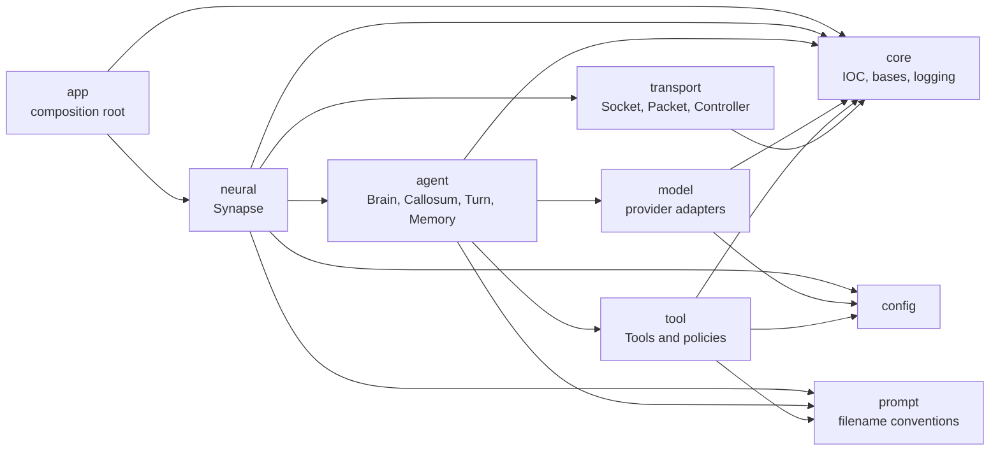
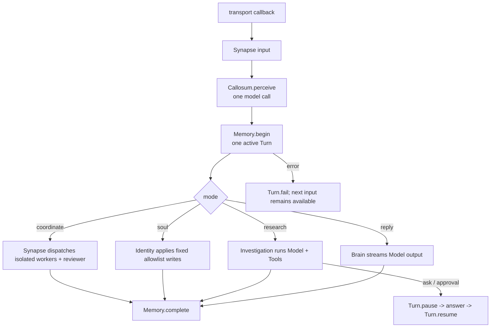

# Flyflor

Flyflor is a Bun + TypeScript life-form kernel. Its domain language models cognition directly: Synapse coordinates, Brain owns cognition, Callosum perceives intent, Memory owns Turns, and Identity owns durable notes. Technical infrastructure keeps direct engineering names such as Model, Tools, Transport, Packet, and Controller.

## Quick Start

```bash
bun install
export DEEPSEEK_API_KEY=...
bun run dev
bun run client
```

`bun run dev` starts `src/app/bootstrap.ts` and opens the configured IPC socket. `bun run client` serves the browser bridge at `http://127.0.0.1:17878`.

Run the health gate before considering a change complete:

```bash
bun run check
bun test
bun run build:binary
```

## Architecture



The enforced business dependency is `app -> neural -> agent -> model/tool`, with `neural -> transport`. `core`, `config`, and `prompt` provide shared infrastructure. `bun run check` rejects invalid source roots, multi-word directory names, reversed dependencies, behavioral `index.ts` files, and application-class construction outside IOC.

## One Turn



`Turn` is the only conversational entity. It owns input, perception, status, answer, evidence, interaction state, and timestamps. `Memory` is the only Turn owner and supplies the most recent four completed Turns as continuous context. Workers receive an `Assignment` and return an `Outcome`; they do not share the active Turn.

## Runtime Contracts

- IOC is the only application-class construction path. It retains singleton caching, scoped constructor values, property injection, and `@Init` lifecycle execution.
- Decorators are limited to `Module`, `Provide`, `Singleton`, `Inject`, `Scope`, `Init`, `Config`, and `Prompt`.
- `Model` exposes `Message`, `ToolCall`, `ModelResult`, and `StreamEvent`. Provider endpoint, authentication, path, and wire parsing are protocol conventions under `src/model/protocol`.
- OpenAI-compatible providers share one adapter. OpenAI Responses, Anthropic, Gemini, Bedrock, Cohere, Ollama, DeepSeek, Hugging Face, vLLM, and LM Studio paths remain supported.
- `Tools` explicitly owns `ask`, `filesystem`, `shell`, and `execute`. Each tool owns its schema, description prompt, cwd convention, and approval decision. Risky calls still use the `confirm` interaction action; there is no standalone confirm tool.
- Canonical prompts are English `.md` files loaded by directory and filename. `.zh.cn.md` files are human mirrors and are never loaded at runtime.
- IPC packets remain an 8-byte unsigned big-endian body length followed by a UTF-8 JSON body. Transport reports input through callbacks and does not import Synapse.

## Source Layout

```text
src/
  app/          composition root
  core/         IOC, base classes, logging
  config/       runtime configuration
  prompt/       conventional prompt loading
  model/        model boundary and protocol adapters
  agent/        cognition and Turn ownership
  neural/       Synapse coordination
  tool/         tools and approval policy
  transport/    socket, packet, controller
```

All directory names are single lowercase English words. `index.ts` files are barrels only. Configuration lives in `.config/config.jsonc`; secrets live in environment variables.

See [docs/architecture.md](docs/architecture.md) for ownership, lifecycle, protocol, and compatibility details. Project red lines live in [AGENTS.md](AGENTS.md).
