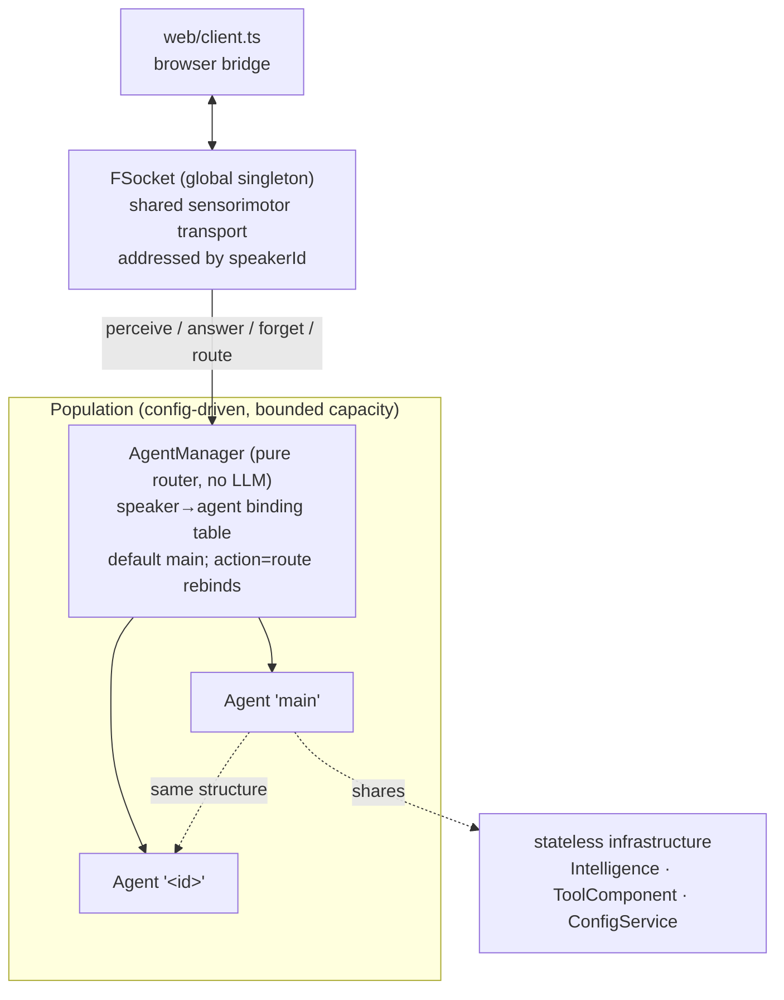
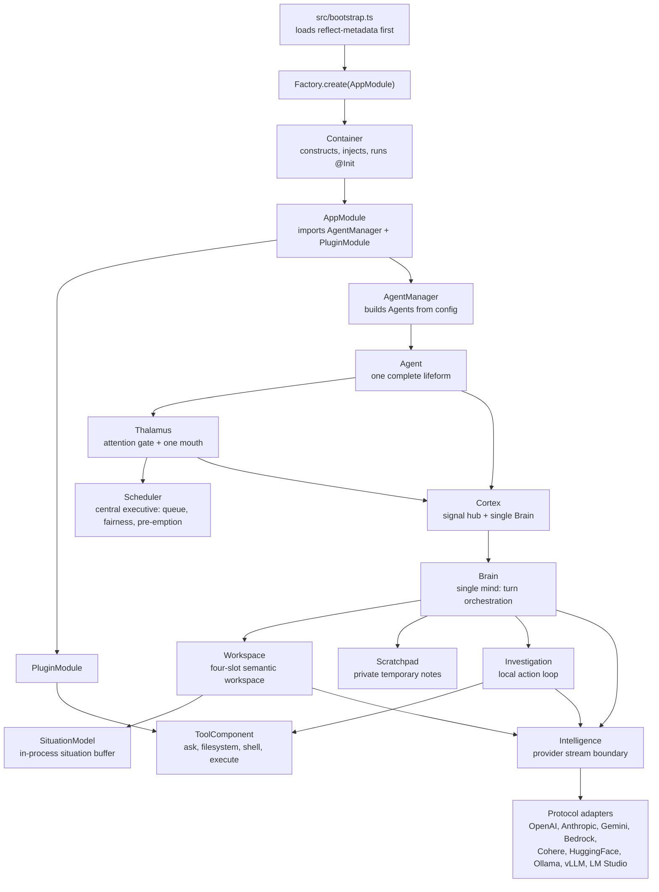
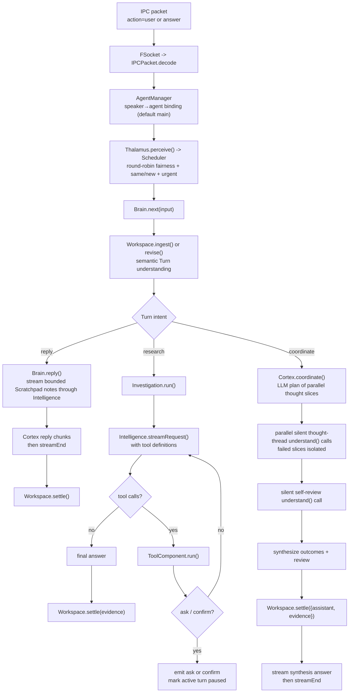

# Flyflor

Flyflor is a Bun + TypeScript agent kernel. The current codebase is built around decorated classes, a reflect-metadata IOC container, a local length-prefixed IPC socket, prompt packages, provider protocol adapters, and a small local tool surface.

## Quick Start

```bash
bun install
export DEEPSEEK_API_KEY=...
bun run dev
bun run client
```

`bun run dev` starts `src/bootstrap.ts` and opens the configured IPC socket. `bun run client` serves the local browser bridge at `http://127.0.0.1:17878` and forwards browser JSON messages over a WebSocket to that socket (one kernel connection per browser client).

Use these checks before calling a change healthy:

```bash
bun run check
bun test
bun run build:binary
```

`bun run check` runs TypeScript and the repository red-line scanner. The default model/provider lives in `.config/config.jsonc`; secrets stay in environment variables.

## Runtime Map

### Population Layer



### Inside One Agent



Every `Agent` owns this full subtree; `Intelligence` and `ToolComponent` resolve to the shared global singletons.

## Boot Lifecycle

```mermaid
flowchart LR
    A["bootstrap.ts"] --> B["import reflect-metadata"]
    B --> C["Factory.create(AppModule)"]
    C --> D["Container.getAsync(AppModule)"]
    D --> E["build module imports"]
    E --> F["construct class"]
    F --> G["@Config / @Prompt early injections"]
    G --> H["@Inject / @Scope dependency injections"]
    H --> I["@Init lifecycle method"]
    I --> J["Factory.population()"]
```



Only the IOC container should construct application classes. Singleton classes are cached by decorator metadata; ordinary providers are created fresh when resolved. `useContainer().create()` is the sanctioned bare-construction path — no imports, injection, or `@Init` — for path-bound objects such as the per-file services inside a prompt package. Agent-private objects (`Workspace`, `Thalamus`, `Scheduler`, `Cortex`, `Brain`) are non-singleton providers: the `Agent` composer threads them as constructor props, so every agent owns an independent subtree while `ConfigService`, `Intelligence`, `ToolComponent`, and `FSocket` stay global singletons.

## One User Turn



`Workspace` is a four-slot semantic working set, not a durable archive. It evicts only the oldest completed Turn when capacity is needed and has no wall-clock TTL. Settled Turns graduate ("promote") into `SituationModel`, a bounded **in-process situation buffer** capped at 16 records (not long-term memory, no recall API, no persistence), so understanding and scheduling can see beyond the four slots within one process lifetime; promotion is idempotent per Turn, and suspended Turns are never promoted. `Scratchpad` is a bounded private note cache (16 notes of at most 1024 characters) seeded from a denser `Workspace.brief()`: lifecycle `status`, salvage `outcome` after preemption, the four most recent situation projection entries, and up to four peer turn outcomes—never a transcript. The active runtime has no long-term memory write path.

## IPC Contract

Every packet on the kernel socket is one 8-byte unsigned big-endian JSON body length followed by a UTF-8 JSON body. Bodies larger than 4 MiB are rejected as malformed.

```txt
+--------------------------+-------------------------------+
| 8-byte body length (BE)  | JSON body bytes (UTF-8)       |
+--------------------------+-------------------------------+
```

Inbound `action: "user"` packets become brain input for the speaker's bound agent (the `main` agent by default); `action: "answer"` packets resolve a pending ask/confirm interaction on the bound agent; `action: "route"` with `{agent: "<id>"}` rebinds the connection to another agent and receives a `{action: "route", data: {agent, ok}}` receipt. Other inbound actions are dispatched to `Controller`; the current controller action is `cwd`, which updates `ConfigService.path.cwd`. A decoded packet that fails validation is logged and skipped without aborting the coalesced frames behind it; a frame that fails length-splitting or JSON decoding rejects the whole read batch and resets that connection's inbound buffer.

Common outbound actions are `open`, `agent`, `interrupted`, `streamEnd`, `data`, `ask`, `confirm`, `pause`, `resume`, `route`, and `error`.

## Model Boundary

`Intelligence` exposes one normalized stream contract:

- `text_delta` for visible output.
- `reasoning_delta` for provider reasoning that must be replayed when the provider expects it.
- `action_start`, `action_delta`, and `action_end` for streamed tool calls.
- `done` with `stop`, `length`, or `toolUse`.

Protocol selection comes from the active provider in `.config/config.jsonc`. Provider-level `protocols` override `model.protocols`; the configured list is an ordered fallback chain, retried only on specific HTTP statuses (400/404/405/415/422/501) and with a `/v1` URL fallback. Each protocol adapter owns only its wire body and stream parser. Streamed tool calls — and therefore the `Investigation` tool loop — are implemented only by the OpenAI chat completions adapter family (also reused by the HuggingFace, LM Studio, and vLLM adapters); the other adapters are text-only and drop action messages, and only the OpenAI chat completions family replays accumulated reasoning into provider messages.

## Tool Surface

The current model-visible tools are loaded from `prompts/tools/config.jsonc` and implemented under `src/plugins/tools`:

- `ask`: asks the user to choose from options; the tool adds an `other` option.
- `filesystem`: `read`, `write`, `edit`, or file-only `delete`, resolved from explicit `cwd` or `ConfigService.path.cwd`.
- `shell`: runs one command with args and a bounded timeout (clamped to 1–120 seconds, 30 by default).
- `execute`: runs serial or parallel `python` / `sh` script tasks with optional per-task cwd, env, and timeout.

Confirmation is an interaction kind, not a tool. Each tool declares a `risk` level in `prompts/tools/config.jsonc`, and code-level gates (`filesystem` write/edit/delete plus every `shell` and `execute` call) make `Investigation` emit a `confirm` interaction before executing; an `ask` result likewise pauses the active turn until the user answers. Tools marked `cwd: "inject"` receive the turn's working directory when their arguments omit it. `shell` and `execute` terminate their process groups on timeout or cancellation, and a cancelled serial batch never starts its remaining tasks.

`Investigation` owns the tool loop. Tool request/result replay stays inside provider messages and is not written into `Workspace.turns`.

## Prompt Runtime

`PromptService` loads either one markdown file or a prompt package directory with `config.jsonc`. Package configs define ordinary render sections, editable files, locked files, runtime-ignored files, and an optional XML document view. The persona package defaults to `./prompts/agent`, and the active config points it at `./.config/persona`; the runtime seeds only static persona sections — `SOUL.md` and `EXTENSION.md` by default, with `AGENTS.md` available through `persona.promptSections`, while `USER.md` is always filtered out. Runtime prompt writes and the legacy `soul` route are disabled.

Canonical runtime prompt sources are English `.md` files. `.zh.cn.md` files are human mirrors and must not become runtime source-of-truth. Besides the persona package, runtime prompt contracts live in `prompts/thalamus/SCHEDULE.md`, `prompts/workspace/INGEST.md` and `SETTLE.md`, the `prompts/cortex` plan/synthesis package, and `prompts/tools`.

## Source Layout

```txt
src/bootstrap.ts                       process entrypoint
src/app.module.ts                      root @Module
src/configuration.ts                   ConfigService and runtime config types
src/core/                              decorators, IOC, base classes, prompt, logger, tool contracts
src/neural/                            neural domain root: shared signal types, LLM JSON helper
src/neural/cortex/                     Cortex signal hub: foreground turn, thought coordination
src/neural/thalamus/                   Thalamus attention gate + Scheduler central executive
src/neural/sensorimotor/               IPC socket, packet codec, connection, controller
src/neural/brain/                      Brain, Scratchpad, Investigation, Intelligence
src/neural/workspace/                  Workspace and Turn lifecycle
src/neural/situation/                  bounded in-process SituationModel
src/plugins/                           plugin boundary and local tools
src/population/                        AgentManager router + Agent lifeform composer
web/                                   local browser-to-IPC WebSocket bridge and test page
prompts/                               prompt packages plus zh.cn mirrors
.config/                               runtime config and active persona prompt package
packages/                              bundled sqlite-vec helper/native assets; compiled but not in the current agent turn path
scripts/check.script.ts                repository mirror, prompt-term, and code-style checks
```

## Current Edges

Durable-memory repositories and schemas are absent from the active tree. Bundled sqlite-vec native assets under `packages/` remain disconnected from `Brain`, `Workspace`, `SituationModel`, and `Scratchpad`; the `packages/index.ts` barrel is empty and `sqlite-vec/index.ts` / `sqlite-vec/loader.ts` are near-duplicate helpers. The config file also declares skills and MCP shapes, but this codebase does not yet include a runtime MCP client or skill loader wired into the turn loop. Further known edges:

- Streamed tool calls work only on the OpenAI chat completions adapter family; the other six adapters are text-only, and nine of the ten adapters have no direct tests yet.
- Provider `requestTimeoutSeconds` and `staleTimeoutSeconds` are declared in config but not yet enforced by the transport.
- The `filesystem` tool resolves paths without containing them under the working directory; absolute paths and `..` segments can escape it.
- `src/plugins/tools/confirm.ts` holds an unregistered `Confirm` atom; runtime confirmation is an interaction kind driven by tool risk gates, not a model-visible tool.
- The browser bridge has no automatic reconnect: a closed kernel socket closes the browser WebSocket.
- All agents share the global `model`/`providers` config; per-agent model overrides are not wired yet.
- The unix socket is the only channel; the population router is channel-agnostic, but no second transport exists.
- There is no cross-agent messaging; isolation between agents is total in this phase.

## Population Design

Status: implemented research prototype. Every IPC connection reaches one
population of agents routed by a deterministic `AgentManager`; each agent is a
complete session-less organism. A connection supplies only a transient speaker
identity, binds to the `main` agent by default (an explicit `route` action
rebinds it), and never creates a session or durable conversation store.

### Population Invariants

1. Routing is deterministic: a speaker binds to the `main` agent unless an
   explicit `route` action rebinds it. The manager never consults a model and
   never interprets content.
2. Isolation is structural: agents share no working state. `Thalamus`,
   `Scheduler`, `Workspace`, `SituationModel`, `Cortex`, and `Brain` instances
   are per-agent; only stateless infrastructure (`ConfigService`,
   `Intelligence`, `ToolComponent`, the socket listener) is shared.
3. The population is bounded and config-driven: agents come from
   `config.population.agents`, truncated at `capacity`; neither the runtime
   nor a model can spawn an agent in this phase.
4. One context per lifeform: a connection addresses exactly one agent at a
   time, and there is no cross-agent messaging.

### Biological Reference Points

The neuroscience literature below supplies design constraints and analogies. It
does not establish that an LLM runtime is a brain or that this prototype is
conscious.

- Baddeley, “Working memory: theories, models, and controversies” (2012),
  [PMID 21961947](https://europepmc.org/article/MED/21961947): working memory is
  a limited, actively maintained workspace rather than an unlimited log.
- Cowan, “The magical number 4 in short-term memory” (2001),
  [PMID 11515286](https://europepmc.org/article/MED/11515286): motivates four
  semantic Turn slots as a prototype prior. Four is not a biological constant.
- Lewandowsky et al., “No evidence for temporal decay in short-term memory”
  (2009), [PMID 19223224](https://europepmc.org/article/MED/19223224): argues
  against treating wall-clock TTL as a general theory of forgetting; Flyflor
  uses capacity and interference instead.
- Stokes, “Activity-silent working memory” (2015),
  [PMID 26051384](https://europepmc.org/article/MED/26051384): supports the weak
  analogy of reactivating a compact task set instead of replaying a transcript.
- Halassa and Kastner, “Thalamic functions in distributed cognitive control”
  (2017), [PMID 29184210](https://europepmc.org/article/MED/29184210): informs a
  gate/control analogy. `Thalamus` is not a literal thalamus or a salience
  oracle.
- Aston-Jones and Cohen, “An integrative theory of locus
  coeruleus-norepinephrine function” (2005),
  [PMID 16022602](https://europepmc.org/article/MED/16022602): motivates sparse,
  thresholded interruption rather than a continuously model-scored priority.
- Mashour et al., “The global neuronal workspace” (2020),
  [PMID 32135090](https://europepmc.org/article/MED/32135090): motivates one
  foreground broadcast boundary and one mouth. It is an architectural analogy,
  not evidence of a global neuronal workspace in software.
- Alberini and LeDoux, “Memory reconsolidation” (2013),
  [PMID 24028957](https://europepmc.org/article/MED/24028957): informs the weaker
  software idea of updating a suspended task set. Turn revision is not
  biological reconsolidation.
- Klinzing, Niethard, and Born, “Mechanisms of systems memory consolidation
  during sleep” (2019),
  [PMID 31451802](https://europepmc.org/article/MED/31451802): makes the absence
  of replay and consolidation an explicit requirement while long-term memory
  is disabled.
- Kassab and Alexandre, “Pattern separation in the hippocampus: distinct
  circuits under different conditions” (2018),
  [PMID 29637298](https://europepmc.org/article/MED/29637298): loosely motivates
  source separation. Privacy still comes from deterministic speaker ownership,
  data minimization, and non-persistence—not from the analogy.
- Hutchins, “Cognition in the Wild” (1995, MIT Press): distributed cognition
  frames the population layer—cognition as a system spread across organisms
  and their environment; the manager is environment, not a super-mind.

### Runtime Invariants

Each agent holds these invariants independently within the population.

1. A connection is only a speaker identity (`conn_N`). All speakers routed to
   one agent enter that agent's `Thalamus` and `Workspace`; there is no
   session object.
2. `Workspace` stores at most four semantic Turn projections. A Turn contains an
   intent, a goal, constraints, references, done/open labels, optional cwd and
   output hints, and a compact outcome; it never contains a user/assistant
   transcript or tool replay buffer.
3. Turn states are `working`, `waiting`, `suspended`, and `completed`. Capacity
   pressure may evict only the oldest completed Turn. No wall-clock expiry is
   used.
4. The transient sensory queue is separately bounded (32 by default). When it
   is full, the newest stimulus is rejected with an explicit backpressure error.
   A stimulus classified as `new` is likewise rejected when all four semantic
   slots are protected; neither case is silently dropped or retained forever.
5. A same-speaker follow-up judged `same` calls `Workspace.revise()` and preserves
   the Turn id. A distinct stimulus is `new` and remains FIFO. Cross-speaker
   revision is rejected by deterministic code.
6. External stimuli are serial. A single Turn may use parallel thought slices
   and a self-review pass, but that path does not create another external
   attention stream.
7. Only an explicit boolean `urgent` verdict may pre-empt the foreground Turn.
   The runtime cancels its provider and cancellable tool work, compacts the Turn
   as suspended, sends `interrupted` followed by `streamEnd`, then releases the
   mouth. Already emitted text cannot be retracted.
8. `AbortSignal` reaches provider requests and the investigation tool boundary.
   `shell` and `execute` terminate their active process groups and do not start
   later serial tasks after cancellation. Synchronous filesystem calls check
   cancellation before and after an operation; an already completed write or
   other side effect is not rolled back.
9. Answers, interactions, streams, and disconnect cleanup are checked against
   the owning `speakerId`. Late output from a forgotten speaker or an older
   same-Turn stream generation is discarded.
10. Only static persona sections enter the active prompt: `SOUL.md` and
    `EXTENSION.md` by default, with `AGENTS.md` available through
    `persona.promptSections`; `USER.md` is always filtered out. Runtime prompt
    writes, durable repositories, episodic archives, and background replay are
    outside the active path.
11. Diagnostics contain routing metadata such as speaker/stimulus ids,
    relation, and text length. They do not persist stimulus or answer text as a
    shadow transcript.

### Object Boundaries

| Layer | Responsibility |
| --- | --- |
| `FSocket` / `Connection` | Decode framed IPC, assign speaker ids, forward stimuli to the population router, skip an individually invalid packet without aborting the frames behind it, and reset a connection's inbound buffer when a frame cannot be decoded at all. |
| `AgentManager` | Route speakers to agents by deterministic binding (default `main`, explicit `route` rebinds), own the bounded agent registry, and never interpret content. |
| `Agent` | Compose one complete lifeform subtree (Thalamus, Scheduler, Workspace, SituationModel, Cortex, Brain) and forward routed stimuli into it. |
| `Thalamus` | Perceive stimuli, own speaker tombstones and the one-mouth lock, and wire the cortex boundary for the scheduler. |
| `Scheduler` | Own stimulus admission, cross-speaker round-robin fairness with per-speaker FIFO, LLM verdict consultation, and validated urgent pre-emption. |
| `Workspace` | Own the four-slot semantic working set and Turn lifecycle, and graduate settled Turns into the situation buffer. |
| `SituationModel` | Hold the bounded in-process situation buffer (16 records) of graduated turn outcomes; in-process only, never long-term memory or recall. |
| `Cortex` | Run one foreground stimulus, cancel it, address output to its speaker, and coordinate parallel thought threads. |
| `Brain` | Ingest or revise a Turn and execute reply, research, or coordinate intent. |
| `Scratchpad` | Hold bounded per-thread scratch notes seeded from a denser brief (status, salvage outcome, situation, peers); not a persistence layer. |
| `ToolComponent` | Execute local capabilities behind confirmation and cancellation boundaries. |

The scheduler model may propose only `same|new`, `targetTurnId`, and a boolean
`urgent`. Deterministic code owns identity, capacity, valid pre-emption targets,
FIFO, fairness, and stream ordering. A malformed or timed-out scheduler result
falls back to treating the round-robin-selected pending stimulus as `new`,
never to an implicit merge.
`prompts/thalamus/SCHEDULE.md` is the canonical runtime contract;
`SCHEDULE.zh.cn.md` is a human mirror.

### Deliberate Non-goals

- No durable user profile, native-vector write, episodic archive, automatic
  cross-process recall, or hidden provider/tool transcript cache in this phase.
- No claim that four slots, a thalamic gate analogy, locus-coeruleus language,
  or a foreground broadcast boundary proves consciousness.
- No parallel processing of independent external stimuli within one agent
  until measurements justify it and a stronger ownership model is specified.
- No cross-agent messaging, per-agent model override, or manager intelligence
  in this phase; decay and recall mechanisms are deferred by design.
- No promise to undo an external side effect that finished before cancellation.

### Verification

Run `bun run check` and `bun test`. The suite covers four-slot capacity without
temporal decay, bounded sensory backpressure, same-Turn revision, FIFO and
urgent scheduling, speaker isolation, disconnect cleanup, cancellable provider
and process work, stale stream suppression, `interrupted` → `streamEnd`
ordering, malformed/coalesced IPC frames, population routing (default `main`
binding, `route` rebinds, capacity truncation), per-agent isolation of working
state, and the browser client's stale interaction cleanup.

Project rules live in `AGENTS.md`; this README is the complete implementation
and research-design overview.
