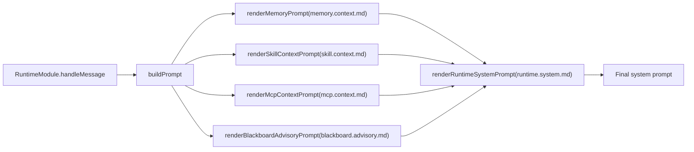
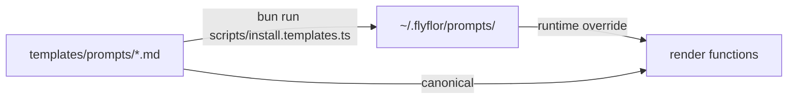

# Flyflor

Flyflor 是一个 Bun + TypeScript 智能体运行时，目标是单文件二进制交付。

核心设计：LLM 负责流体智力，反思沉淀晶体智力（Gem），海马体负责工作记忆与长期记忆图，黑板协作处理复杂任务。

## 设计哲学

- LLM 负责当下推理与生成，记忆系统只负责沉淀、召回和偏移修正。
- 不靠单轮堆叠上下文，而靠三层记忆、遗忘曲线和反思把经验压成稳定能力。
- 简单问题直接回，复杂问题走黑板，保证复杂度和协作成本只在必要时上升。
- 协议、渠道、Worker、Skill、MCP 都是显式边界，所有内部协议统一管理，避免坏数据互相断链。

## 支持的渠道

Flyflor 当前支持 31 个 channel，分为三类：

| 类别 | 渠道 |
| --- | --- |
| 核心入口 | API、STDIO、Webhook |
| 官方协议 / 独立适配 | WeChat official account、WeCom Callback、Weixin iLink、Telegram、Discord、Feishu、Slack、Line、Mattermost、DingTalk、BlueBubbles / iMessage |
| 共享 HTTP 协议适配 | API Server、Google Chat、IRC、Email、Home Assistant、Matrix、MS Graph Webhook、QQ、QQBot、Signal、SMS、Teams、WeCom、WhatsApp、Yuanbao、Zalo |

Channel 协议会保留 thread、引用回复、评论、typing、mention、reaction、编辑 / 删除、卡片更新等结构化通信细节；业务判断仍只走模型结构化输出，不从消息文本做关键词推断。`/channels` 状态会暴露每个 adapter 的 capability：Telegram 已支持 typing / thread / reply / message edit，Discord 使用 official deferred interaction + original message patch，Slack 支持 thread / update / reaction，Feishu 支持 thread reply / message update，Mattermost 支持 REST typing / thread / post patch，Weixin iLink 支持官方 `sendtyping` ticket 生命周期，WeChat official、WeCom Callback 坚持官方协议并按平台能力稳定降级。

完整矩阵和每个 channel 的配置要求见 [docs/gateway.channels.md](docs/gateway.channels.md)。

## 快速开始

### 安装（curl-pipe，无需克隆源码）

```bash
curl -fsSL https://flyflor.dev/install.sh | sh
# 固定版本：
curl -fsSL https://flyflor.dev/install.sh | sh -s -- --version v0.4.0
# 自定义前缀：
curl -fsSL https://flyflor.dev/install.sh | sh -s -- --prefix /usr/local/flyflor
# 更新 / 卸载：
flyflor update -y
curl -fsSL https://flyflor.dev/install.sh | sh -s -- --uninstall
```

脚本从 GitHub Releases 下载匹配平台的 `flyflor-{os}-{arch}` 二进制与 `flyflor-templates.tar.gz`，默认安装到 `~/.flyflor`。`--uninstall` 保留配置和数据。

### 从源码

```bash
bun install
bun run install:templates
bun run chat
```

常用命令：

```bash
bun run setup        # 初始化向导
bun run status       # 运行状态
bun run doctor       # 诊断配置与依赖
bun run doctor --fix # 自动创建缺失目录
bun run tui          # 仪表板 TUI
bun run app.ts gateway
```

质量验证：

```bash
bun run check        # TypeScript 类型检查
bun run test         # 运行本仓库测试
bun run build:binary # 编译本机二进制
```

## Docker Dev

Docker dev 运行已编译的 Linux 二进制，Compose 内不安装依赖也不构建。

```bash
bun run docker:dev                        # 重编 Linux binary + 启动 compose + 跟日志
bun run docker:chat                       # 直接进入 chat TUI
bun run smoke:docker                      # 不启动容器，检查 compose / binary / prompt bundle
bun run smoke:runtime                     # 已启动 compose 后，检查 doctor / status / recovery；占位 API key 只提示
bun run smoke:runtime:live                # 已配置真实 API key 后，额外跑一次模型 chat probe
bun run smoke:recovery                    # 临时 HOME 下检查 local working memory WAL/backup + MCP transport 恢复
bun run smoke:release                     # docs + type + tests + binary + docker smoke
bun run ci                                # 本地确定性门禁：不跑真实模型凭据，检查 docs/type/tests/binary/docker 静态烟测
bun run release:check                     # 本地发布门禁：完整 deterministic release smoke；真实模型另跑 smoke:runtime:live
docker exec -it flyflor-dev flyflor       # 进入容器交互
```

挂载路径：

| 宿主路径               | 容器路径                       | 用途                    |
| ---------------------- | ------------------------------ | ----------------------- |
| `./docker/config`      | `/root/.flyflor`               | dev 配置 + 提示词模板   |
| `./docker/workspace`   | `/root/.flyflor/workspace`     | 工作区数据              |
| `./dist/flyflor-linux` | 复制至 `/usr/local/bin/flyflor`| 编译好的二进制          |

默认 Docker dev 为单 Flyflor 容器，本地 WAL 工作记忆会落到 `flyflor_data` 卷；`brain.db` 和 `crystal.db` 分别承载生命事件与晶体图。架构变更后重新编译 + 重启：

```bash
bun run docker:up   # = 重编 binary + force-recreate compose
```

## 模型配置

自定义 OpenAI-compatible provider 只需要最小 JSONC：

```jsonc
{
  "model": {
    "activeProvider": "fastai",
    "activeModel": "gpt-5.5",
    "providers": {
      "fastai": {
        "baseUrl": "https://fastai.fast/v1",
        "apiKey": "fastai-api-key",
        "defaultModel": "gpt-5.5"
      }
    },
    "secrets": {
      "fastai-api-key": "..."
    }
  }
}
```

`baseUrl` 存在时默认推断为 OpenAI-compatible，`apiMode` 默认 `chat-completions`；未配置 `activeModel` / `defaultModel` / `models` 时会用已解析的 `apiKey` 探测 `${baseUrl}/models`。Runtime 默认走流式生成；只有模型 client 未暴露 `stream` 方法时才走普通 HTTP 并给调用方返回一段完整 final delta。若 `stream` 方法已存在但请求失败，错误会直接透出，不自动重试另一条 provider 路径。

## 架构

### 目录结构

| 路径              | 职责                                                           |
| ----------------- | -------------------------------------------------------------- |
| `app.ts`          | 薄入口，启动 FlyFlor 主类                                      |
| `src/app.ts`      | FlyFlor composition root，显式 DI 容器                        |
| `src/command`     | CLI、TUI、命令注册、终端渲染                                   |
| `src/agent`       | runtime、gateway、blackboard、sandbox、worker、MCP、project、plugin |
| `src/agent/di`    | `@Module`、`@Provide`、`@Inject` 元数据 + 显式 provider 容器  |
| `src/llm`         | 模型 provider（OpenAI/Anthropic 兼容协议层）                   |
| `src/crystal`     | 晶体智力：episode、memory_node、Gem、consolidation、dream      |
| `src/neural`      | 海马体工作记忆：local WAL/snapshot、召回、最近交流 ring、热记忆压缩 |
| `src/protocol`    | 公共协议、枚举、事件、进程 envelope                            |
| `templates`       | 提示词和记忆 Markdown 模板                                     |

### 三层智能模型

- **LLM = 流体智力**：当前任务的理解、推理、生成、工具编排、黑板讨论和即时决策。
- **Crystal = 晶体智力**：把验证过的经验压缩成可复用 Gem（晶粒），由证据门和质量门控制升格。
- **Neural = 海马体**：由 `MemoryComponent` 承载本地工作记忆（WAL + snapshot），由 `CrystalComponent` 承载本地晶体图（`crystal.db` + VectorIndex）。

**核心原则：不在堆叠记忆上发力，而在思考能力的自我迭代上发力。**

### 请求流程

1. 渠道、消息、用户身份归一为 `GatewayMessage`
2. 路由判断：fastRoute 启发式（~70% 命中）或 LLM route，决定 `direct` / `direct-with-watch` / `blackboard`
3. 上下文装配（热路径）：宪法层 Markdown + brain prompt atoms + working-memory 热激活 + project/codename 局部记忆 + local crystal Gem 召回
4. LLM 主循环：流式生成，解析结构化 memory action / Ask / Ghost decision / identity append；TTFB 目标 < 350ms
5. 同步收尾：写 episode、brain 双写、Ask/Ghost/Codename/EQ 状态、skill usage 和 fastRoute snapshot
6. 后台 worker：consolidation、hot-memory compression、summary、decay、dormant、dream、feedback classify、reflection

外部聊天渠道统一 final-only 投递：Runtime 内部可以流式生成和驱动 TUI/API SSE，但 Slack、Telegram、WeChat、WeCom、DingTalk 等平台只在本轮结束后发送一次完整回复，避免把中间 token 当作多条平台消息。正在输入、引用回复、thread/topic、消息更新、reaction、卡片更新统一走 `GatewayOutboundOperation`；平台不支持时只做显式 no-op / final text 降级，不走不稳定 bridge。

## 记忆系统

| 层               | 后端      | 职责                                                             |
| ---------------- | --------- | ---------------------------------------------------------------- |
| 宪法层           | Markdown  | 身份、用户偏好、项目事实（手编辑 + 结构化 append，慢变）           |
| 生命事件层       | SQLite `brain.db` | `memory_events` append-only + `memory_state` 当前可见性；prompt recall/write authority 已切到 brain events |
| 工作记忆         | `MemoryComponent`：Local WAL/snapshot | episode buffer + TTL 遗忘曲线 + 最近交流 ring buffer；到期压缩只写隔离审计；`status` / `doctor` / TUI 只读恢复文件元数据 |
| 长期记忆图       | `CrystalComponent`：`crystal.db` + VectorIndex | episode → memory_node → Gem，summary_embedding，本地图关系 |
| 索引 / 审计      | SQLite    | blackboard、candidate、offer、skill/plugin/mcp 辅助状态          |

**长期图主实体：** `episode`、`memory_node`、`gem`（晶粒，crystallized intelligence）、`gem_snapshot`（防漂移版本快照）、`summary_embedding`

**图边：** `next_context`、`similar_ep`、`consolidated_into`、`similar_concept`、`proven_as`、`proven_by`

### Gem（晶体智力固化产物）升格流程

候选来源：runtime LLM 反思（整合 worker 异步触发）、用户显式提升、黑板收敛 / MCP 增强证据、skill promotion 与 brain 事件状态。

**双质量门：**
- 门 1：episode cluster sourceKind weight gate
- 门 2：memory_node confidence > 0.5 AND evidenceCount ≥ 3 → 升格 Gem

Evidence Weight 裁判表：

| sourceKind             | weight |
| ---------------------- | ------ |
| direct / unverified    | 0.0    |
| blackboard-needs-user  | 0.65   |
| blackboard-converged   | 0.8    |
| explicit               | 0.9    |

### 遗忘与防膨胀

- **双轨衰减**：episode 5%/天、memory_node 2%/天、Gem 0.5%/天；lastVerifiedAt 超 30 天额外打折。
- **矛盾检测**：`contradictionCount ≥ 2` → drift-repair；confidence < 0.1 → deprecated 归档。
- **热记忆压缩**：到期 working-memory episode 可压缩成 `memory_events.type='hot-memory-compression'` 审计事件；不进入 prompt recall / `memory_summary` / CrystalComponent / Gem 候选。
- **容量阀门**：working memory `maxEpisodesPerUser=200`；长期图 episode 500 / memory_node 100 / Gem 50。
- **Gem 去重**：symbols IoU ≥ 0.7 且 cosine ≥ 0.85 → merge（`dedupeGems`，纯函数，无字符匹配）。

### Dream 模式（晶体层离线维护）

Dream 是长期晶体层的主动维护 worker，经 `CrystalComponent` 读写本地 `crystal.db`（`gem / memory_node / episode / gem_snapshot`），不触碰工作记忆热窗口。

| Worker        | 作用层             | 唯一职责                                                       |
| ------------- | ------------------ | -------------------------------------------------------------- |
| Consolidation | Working memory → Crystal graph | 升格通道：到期 episode → reinforce / consolidate / discard     |
| Hot compression | Working memory → brain.db | 清理通道：到期 episode → 隔离压缩审计 → 删除热窗口 episode     |
| Decay         | Crystal graph（纯函数）| 被动衰减：importance × 时间 / verification age                 |
| Anti-bloat    | Working memory & Crystal graph | 容量阀门：超额强制遗忘 / 归档                                  |
| Dream         | Crystal graph only | 晶体维护：drift-repair / recall-reinforce / contradiction-audit|

三类动作：
- `drift-repair`：先写 `gem_snapshot` 存档，再收窄 scope/precondition 或转 deprecated
- `recall-reinforce`：importance × 1.1，追加 `proven_by` 边
- `contradiction-audit`：弱侧 `contradictionCount += 1`，confidence × 0.7；< 0.1 → deprecated 归档

触发：定时 30 min 节拍 + 用户 10 min 静默自动触发（类海马 SWR 回放）。

单 pass：≤ 1 次 LLM 调用、≤ 8K token；候选选择仅用资源指标（counter / age / cosine），不用关键词。

## 黑板

Runtime 通过 `blackboard.route.md` 获取结构化路由：

- `direct`：单智能体直接回答
- `direct-with-watch`：直接回答同时监听升级信号
- `blackboard`：动态 worker 多轮讨论

黑板特性：
- 同 project constraint 同时只能一个 turn（lease 机制）
- 目标 3 轮收敛，5 轮硬上限
- livelock 检测（两轮无新事实、重复争议、重复失败工具）
- 流式输出 worker 讨论步骤
- 无法收敛时由 runtime 合成 Ask（`reason=blackboard-stalemate`），交还用户选择；旧 `flyflor-decision-form` 已退役

## CLI 参考

```bash
flyflor                      # 启动 chat TUI（TTY 环境）
flyflor chat                 # 对话模式
flyflor tui                  # 仪表板 TUI
flyflor setup                # 初始化向导
flyflor status               # 运行状态
flyflor doctor [--fix]       # 诊断（--fix 自动创建缺失目录）
flyflor update [--check] [-y]# 检查 / 应用更新
flyflor version              # 版本信息
flyflor config show          # 查看配置
flyflor config path          # 配置文件路径
flyflor memory status        # 记忆状态
flyflor blackboard           # 黑板浏览 TUI：搜索、选择、进入详情
flyflor blackboard list      # 黑板 turn 列表
flyflor codename list        # 代号锚点列表
flyflor inbox list           # inbox/codename 桶中的 atom
flyflor ghost list --user me # 未完事项 / 可恢复上下文
flyflor identity list --user me # identity 自写条目
flyflor gem list             # 晶体列表（`skills` 子命令已更名为 `gem`）
flyflor mcp list             # MCP 服务列表
flyflor plugins list         # 插件列表
flyflor plugins run <name>   # 沙箱审批后运行插件
flyflor dream status         # Dream 队列状态
flyflor dream run            # 手动触发 dream pass
flyflor model                # 模型配置向导
flyflor gateway status       # 网关状态
```

## 工程规则

### DI 与命名

- 只保留必要 decorator：`@Module`、`@Provide`、`@Inject`、`@Service`、`@Component`、`@Worker`、`@Channel`、`@Plugin`
- 边界模块用 core 继承表达：`class RuntimeModule extends Runtime`、`class MemoryModule extends Memory`；`kind/layer/name/provider` 默认由基类和类名推断
- `@Module` / `@Component` 复用 `Provide` 注入元数据；默认单例，需要每次重新 `new` 时显式使用 `ProviderScope.Factory`
- DI token 优先使用 class 对象：`@Inject(RuntimeModule)` / `container.resolve(RuntimeModule)`；非 class 值才使用 `createInjectionToken()`，禁止新增裸字符串 token
- 公开 API 显式写 `public`，内部状态保持 `private` / `protected`
- 实现文件使用点分后缀：`*.module.ts`、`*.service.ts`、`*.worker.ts`、`*.manager.ts`、`*.adapter.ts`、`*.store.ts`
- 目录入口统一为 `index.ts`，不新增连字符或下划线命名的仓库文件

### 零字符匹配红线

业务语义判断（意图、路由、记忆动作、反馈分类、矛盾检测、复杂度评估等）**只能**由模型同轮返回的结构化字段或专用提示词模板的 JSON 输出驱动。

禁止：`text.includes()`、正则识别意图、关键词列表、句式启发式、情感词典、句末标点判断。

性能优化只能用资源指标（token 数、向量相似度、TTL、cluster size）短路。

### 其他约束

- 只使用 Bun 命令管理依赖，不要求安装 Node.js
- 配置走 `~/.flyflor/config.jsonc`（Docker dev：`./docker/config/config.jsonc`），兼容 JSONC
- 业务配置不走环境变量；凭据、沙箱策略走 config/secrets provider
- 新增运行时依赖前确认兼容 `bun build --compile`（无 native addon、无 postinstall、无动态 require）
- 不把密钥、日志、会话数据库、用户数据编译进二进制
- 跨模块通信使用显式类型；公共事件和协议必须可 JSON 序列化
- 修改边界、高风险工具或依赖策略时同步更新 `docs/boundaries.md`

## 文档

完整文档索引见 [docs/README.md](docs/README.md)。核心文档：

| 文档 | 用途 |
| --- | --- |
| [docs/architecture.md](docs/architecture.md) | 分层架构 / composition root / 进程模型 |
| [docs/boundaries.md](docs/boundaries.md) | 工程边界与红线 |
| [docs/runtime.turn.md](docs/runtime.turn.md) | 单轮请求完整流程 |
| [docs/memory.system.md](docs/memory.system.md) | 四层记忆 / 升格 / 衰减 / Dream |
| [docs/blackboard.md](docs/blackboard.md) | 黑板路由 / 收敛 / Worker 协议 |
| [docs/gateway.channels.md](docs/gateway.channels.md) | Gateway 与渠道矩阵 |
| [docs/sandbox.capabilities.md](docs/sandbox.capabilities.md) | Sandbox 决策与审计 |
| [docs/mcp.tools.md](docs/mcp.tools.md) | MCP 工具循环 |
| [docs/crystal.reflection.md](docs/crystal.reflection.md) | Reflection → Gem |
| [docs/skill.system.md](docs/skill.system.md) | Skill 加载与升格 |
| [docs/cli.commands.md](docs/cli.commands.md) | CLI 命令现状 |
| [TODO.md](TODO.md) | 运行边界 / 后续计划 |

历史提案和迁移背景已收进 [docs/old-docs/README.md](docs/old-docs/README.md)，只做追溯，不作为当前运行契约。

<!-- flyflor:prompt-templates:start -->
# Prompt Template System

## One-line Summary

All model-facing instructions live in `templates/prompts/`, grouped by topic; `*.md` files are the runtime canonical templates.

## Related Paths

- `src/agent/prompts/index.ts` - all render entry points
- `src/agent/prompts/template.manifest.ts` - template bundle version and file contract
- `src/agent/prompts/template.docs.ts` - docs generator
- `templates/prompts/` - built-in templates
- `scripts/install.templates.ts` - install into the user directory
- `~/.flyflor/prompts/` - user override directory

## Bundle Version

- Version: `v2`
- Manifest file: `template.manifest.json`
- Runtime checks the manifest version first, then reads each template by filename; missing files, empty files, and stale versions all fail with a reinstall hint.
- The manifest also records each template key, runtime filename, protocol metadata, protocol-specific envelope data, and required placeholders; lint compares it with runtime definitions to prevent partial bundle upgrades.
- `blackboard.worker.envelope.md` keeps its output schema and constraints in manifest metadata, then renders them into the JSON envelope at runtime.

## Template Catalog

| Template | Runtime File | Caller | Protocol | Purpose | Required Placeholders |
| --- | --- | --- | --- | --- | --- |
| `ask.schema.md` | `ask.schema.md` | `renderAskSchemaInstructions` | — | Structured clarifying questions, ghost decisions, and identity append blocks. | — |
| `behavior.priority.md` | `behavior.priority.md` | `renderBehaviorPriorityInstructions` | — | Prompt source ordering and conflict resolution rules. | — |
| `blackboard.advisory.md` | `blackboard.advisory.md` | `renderBlackboardAdvisoryPrompt` | — | Advisory transcript for direct-path turns that need blackboard context. | `compactRounds` / `elapsedMs` / `reason` / `status` / `turnId` |
| `blackboard.decision.md` | `blackboard.decision.md` | `BlackboardModule.returnDecisionToUser` | — | Decision prompt when the board needs user confirmation to close a loop. | `questionCount` / `reason` / `unresolvedIssues` |
| `blackboard.route.md` | `blackboard.route.md` | `decideBlackboardRoute` | — | Route planner prompt for the blackboard front door. | `request` |
| `blackboard.worker.envelope.md` | `blackboard.worker.envelope.md` | `renderBlackboardWorkerEnvelope` | `flyflor.blackboard.worker.v1` | User task envelope for a single blackboard worker participant. | `constraintsJson` / `contractJson` / `convergencePolicyJson` / `currentRoundStepsJson` / `discussionPlanJson` / `goalJson` / `expectedOutputJson` / `minRoundsJson` / `participantJson` / `phaseJson` / `previousStepsJson` / `roundJson` |
| `blackboard.worker.system.md` | `blackboard.worker.system.md` | `renderBlackboardWorkerSystemPrompt` | — | System prompt for a single blackboard worker participant. | `participant` |
| `crystal.reflection.md` | `crystal.reflection.md` | `ReflectionWorker.dispatch` | — | Reflection prompt that extracts reusable methods from evidence. | `evidence` |
| `feedback.classify.md` | `feedback.classify.md` | `classifyAndApplyFeedback` | — | Feedback classifier that buckets the latest user message. | `currentUserText` / `previousAssistantText` |
| `memory.action.md` | `memory.action.md` | `renderMemoryActionInstructions` | — | Durable Markdown memory tool block schema. | — |
| `memory.consolidation.md` | `memory.consolidation.md` | `ConsolidationWorker` | — | Episode classification prompt for consolidation. | `episode` |
| `memory.hot.compress.md` | `memory.hot.compress.md` | `HotMemoryCompressionWorker` | — | Audit-only compression prompt for expiring working-memory episodes. | `episodes` |
| `memory.context.md` | `memory.context.md` | `renderMemoryPrompt` | — | Memory context wrapper for recent, project, long-term, and global layers. | `hippocampus` / `markdownContent` / `projectMemory` / `retrievedResults` |
| `memory.dream.md` | `memory.dream.md` | `DreamWorker` | — | Quiet maintenance prompt for long-term drift, recall, and contradiction work. | `candidates` / `userId` |
| `memory.project.offer.md` | `memory.project.offer.md` | `renderProjectOfferPrompt` | — | Runtime nudge for a project candidate awaiting user confirmation. | `evidenceScore` / `relatedCount` / `remainingTurns` / `title` |
| `memory.skill.offer.md` | `memory.skill.offer.md` | `renderSkillOfferPrompt` | — | Runtime nudge for a reusable skill candidate awaiting user confirmation. | `confidence` / `name` / `remainingTurns` / `support` / `tools` |
| `mcp.context.md` | `mcp.context.md` | `renderMcpContextPrompt` | — | MCP capability wrapper and tool-context listing. | `mcpEntries` |
| `runtime.ask.continuation.md` | `runtime.ask.continuation.md` | `renderRuntimeAskContinuationPrompt` | — | Runtime continuation hint for an active pending ask. | `chainDepth` / `choices` / `prompt` / `reason` |
| `runtime.dormant.resume.md` | `runtime.dormant.resume.md` | `renderRuntimeDormantResumePrompt` | — | Runtime resume hint after a dormant interval. | `idleBucket` |
| `runtime.eq.context.md` | `runtime.eq.context.md` | `renderRuntimeEqContextPrompt` | — | Tone-only emotional context hint. | `ageBucket` / `arousal` / `confidence` / `directive` / `dominance` / `label` / `valence` |
| `runtime.ghost.hint.md` | `runtime.ghost.hint.md` | `renderRuntimeGhostHintPrompt` | — | Runtime hint for active unfinished contexts. | `ghostEntries` |
| `runtime.identity.context.md` | `runtime.identity.context.md` | `renderRuntimeIdentityContextPrompt` | — | Runtime identity context assembled from live identity entries. | `identityEntries` |
| `runtime.system.md` | `runtime.system.md` | `renderRuntimeSystemPrompt` | — | Top-level runtime system prompt assembled for every turn. | `askSchemaInstructions` / `behaviorPriorityInstructions` / `blackboardContext` / `mcpContext` / `memoryActionInstructions` / `memoryContext` / `sandboxSummary` / `skillContext` |
| `skill.context.md` | `skill.context.md` | `renderSkillContextPrompt` | — | Skill wrapper prompt that formats loaded SKILL.md entries. | `skillEntries` |

## Assembly Flow



## Install Flow



- A same-named file in the user directory overrides the built-in template; the install script syncs the bundle and manifest together.
- Runtime only loads canonical `.md` template files.
- `*.zh.cn.md` files are audit-only mirrors synced by the install script; they do not enter the runtime bundle, manifest, or lint contract.

## Data Contract

Every template must guarantee:

1. The model emits structured JSON sections by schema (routing, reflection, feedback, memory actions, dream evaluation, cluster summaries, and so on), while code only validates shape, enums, and ranges.
2. Template-facing enum values come from `src/protocol/contracts/enums.ts`; add new enums there before updating templates.
3. Templates must not allow the model to invent undeclared fields; extra fields are always discarded.

## Prompt-facing Enums

- `MemoryActionTarget`: `memory` / `self` / `soul` / `user`
- `MemoryKind`: `candidate` / `conversation-turn` / `fact` / `history` / `profile` / `rule` / `skill` / `summary`
- `MarkdownMemoryFile`: `MEMORY.md` / `SELF.md` / `SOUL.md` / `USER.md`
- `AskReason`: `codename-ambiguity` / `codename-create` / `user-intent-unclear` / `blackboard-stalemate` / `policy-decision` / `other`
- `GhostContextReason`: `ask` / `tool-failure` / `blackboard-cap` / `process-restart`
- `GhostDecisionKind`: `resume` / `fork` / `fresh`
- `EqLabel`: `neutral` / `joy` / `anger` / `sadness` / `fear` / `surprise`

## Model Readability

Runtime-injected templates should only contain instructions the model can act on directly: when to use them, what structure to emit, what each field means, and how to resolve conflicts. Internal route ids, TODO ids, phase names, and implementation metaphors must not appear in runtime prompts, including `LF-R*` or engineering-only labels such as “hippocampus / crystal / Dream / Gem.”

Internal identifiers may stay in `TODO.md`, design docs, code comments, and test names; model-facing templates must translate them into plain source labels and behavior descriptions such as “recently activated memory,” “current project notes,” “open items,” and “quiet maintenance phase.”

## Risks / Known Gaps

- Template lint already checks required files, non-empty content, required placeholders, and unknown prompt files, and it blocks runtime prompt bodies that expose internal route ids or unexplained engineering metaphors; the bundle manifest version and template catalog are validated too.
- The manifest integrity test compares the canonical templates under `templates/prompts/`; unregistered runtime prompt files must not appear in the directory, and `lintPromptTemplates` performs the same checks in the user directory.
- `*.zh.cn.md` mirrors do not participate in runtime assembly or manifest comparison; they are for human review and audit only.
- `template.docs.ts` renders the template matrix and prompt-facing enum snapshot into reviewable documentation, while `scripts/prompt.templates.docs.ts` can generate or check the same output and sync the prompt bundle manifest.
- Runtime only assembles canonical `.md` files.

## Related Tests

- `tests/prompt.lint.test.ts`
- `tests/prompt.templates.docs.test.ts`
- `tests/blackboard.boundaries.test.ts`
- `tests/eq.prompt.test.ts`
- `tests/ask.parse.test.ts`
<!-- flyflor:prompt-templates:end -->
