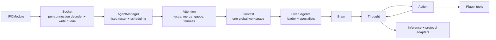

# Flyflor

Flyflor is a Bun + TypeScript kernel for one process-wide, sessionless intelligent collective. It has one consciousness stream and one global working Context. Multiple external speakers are identified by stable `speakerId` values; they do not create isolated conversations.

## Quick start

```bash
bun install
export DEEPSEEK_API_KEY=...
bun run dev
bun run client
```

The kernel opens the Unix socket configured in `.config/config.jsonc`. The browser bridge is served at `http://127.0.0.1:17878` and forwards strict Flyflor IPC packets.

Before handing off a change, run:

```bash
bun run check
bun test
bun run build:binary
```

Secrets remain environment variables. Restarting the process intentionally clears Context and all volatile agent notes. Reconnecting a socket does not clear them.

## Runtime chain



The boundaries are deliberately object-led:

- `IPC → Socket` owns framing, validation, connection identity, and backpressure.
- `AgentManager` owns fixed member construction, one active focus, cancellation, revision checks, and output routing. It does not generate answers.
- `Attention` acts as the salience gate. Related stimuli merge into the active focus; unrelated stimuli enter a bounded fair queue.
- `Context` is the only owner of dialogue facts. It stores the current focus, constraints, decisions, evidence, unresolved items, and sourced summaries.
- Each fixed `Agent` owns a volatile local `Memory` for observations and reflections. It never owns an independent dialogue transcript.
- `Brain` runs the same loop for every member: `Thought → Action/Observation → Thought` until a report is ready. Hidden provider reasoning and replay buffers stay inside the current inference call.
- Only the configured leader may use side-effecting tools. Specialists are forced to read-only scope and run in parallel before the leader synthesizes the answer.

## Focus and continuity

There is at most one external focus at a time. When the process is idle, the first stimulus opens it. While it is working, a message with an explicit `replyTo` is merged first; otherwise Attention evaluates semantic relation. A merge increments `revision`, emits `responseReset`, aborts cancellable model work, and causes the leader to rethink from the new Context. An action becomes started only after its tool atom has resolved and the current revision has been checked immediately before execution. A side effect that has actually started is allowed to finish and is recorded as compact evidence.

While an `ask` or `confirm` interaction is pending, ordinary user input is queued. Only an answer matching `focusId` + `requestId` from the focus owner, or an owner `cancel`, releases the hard gate. Ask answers must also match the pending question count, order, and text. A reconnected owner connection is attached when it answers or cancels. Ask answers become sourced constraints in Context, and confirmations become sourced decisions. A merged focus sends its final stream to every participating connection, while confirmation authority remains with the owner who opened the focus. Cancellation is reported immediately, but an already-started side effect is allowed to finish and record a compact observation before the focus is released.

The queue is bounded by `collective.queueLimit`. It scores salience, wait age, and speaker fairness; when full it rejects the newest message explicitly. When a queued root becomes active, its explicit `replyTo` chain is absorbed before inference starts, so related queued speakers receive one focus and one final revision. Every inbound action reserves its `messageId` process-wide. An exact `user`, `answer`, or `cancel` retry is idempotent and returns the stable receipt for that command. Reusing an ID for another action or payload is rejected. Idempotency records retain SHA-256 payload fingerprints rather than raw dialogue or interaction answers.

## IPC

Every socket packet is an 8-byte unsigned big-endian body length followed by UTF-8 JSON:

```txt
+--------------------------+-------------------------------+
| 8-byte body length (BE)  | JSON body bytes (UTF-8)       |
+--------------------------+-------------------------------+
```

The envelope is strict; legacy packets are rejected:

```ts
interface IpcEnvelope<A extends string, D> {
    protocol: 'flyflor.ipc';
    messageId: string;
    action: A;
    data: D;
}

interface UserInput {
    speakerId: string;
    text: string;
    replyTo?: string;
}
```

Inbound actions are `user`, `answer`, and `cancel`. `open` returns `connectionId` and the protocol. Every accepted inbound command returns an `event` receipt. Public `attention` packets contain only state and queue depth. Chunks use `{ focusId, revision, chunk }`; a revision merge emits `responseReset`. Answers, confirmations, tool events, errors, and final streams are targeted to the relevant focus participants.

Each socket has an independent decoder, ordered intake, and backpressure output queue. Split UTF-8 bytes, coalesced packets, malformed frames, overlapping data callbacks, and one client disconnect cannot reset or reorder another connection. Per-connection pending input and output are each capped at two maximum-size IPC packets; a slow or flooding client is disconnected without disturbing healthy clients. A malformed complete frame emits an error without dropping valid frames that follow it in the same chunk. Disconnecting removes that connection's active routing entry without deleting its speaker identity; reconnecting can attach a new route, but missed output is not replayed. An oversized outbound packet is isolated as an error on its target connection instead of interrupting Agent execution.

Attention projects active stimuli into `collective.contextCharLimit` before classification. Context applies the same budget independently for each Agent, preserving full process-local truth while keeping the first and latest messages and constraints in bounded model input. `collective.contextItemLimit` is a hard store limit: ordinary items are evicted first, then the oldest non-pinned protected item only when every slot is protected; current focus constraints remain on the Focus itself.

Inference propagates external abort reasons, enforces provider/model total-request and stale-stream timeouts, and cancels the active byte reader on failure or consumer cancellation. Missing or duplicate provider tool-call IDs are normalized into unique request IDs before interaction or replay. Inside Brain, the retention budget for old provider-only tool replay uses `collective.contextCharLimit`; eviction removes only whole old Thought/Action cycles and always retains the newest complete cycle. A single replayed tool result is capped at 12,000 characters. Filesystem reads return at most 20,000 valid UTF-8 bytes. Shell and execute each retain at most 20,000 characters per stdout/stderr stream; truncated streams preserve both edges and set explicit flags. Execute accepts at most 64 tasks with effective concurrency capped at 8.

## Source layout

```txt
src/ipc/                          framing and multi-connection socket boundary
src/collective/                   AgentManager, Attention, and the global Context
src/agent/                        fixed Agent, volatile Memory, Brain, Thought, Action
src/inference/                    model/provider infrastructure and adapters
src/plugins/tools/                ask, filesystem, shell, and execute atoms
prompts/agents/                   read-only fixed identity packages
prompts/attention/                salience/focus prompt package
web/                              browser bridge and local IPC console
.config/config.jsonc              model, collective, roster, and socket configuration
```

Runtime prompt sources are canonical English `.md` files. Every documentation and prompt source has a human `.zh.cn.md` mirror; mirrors are never loaded by runtime code.

The IOC container is the only constructor for application classes. Decorators (`@Module`, `@Singleton`, `@Provide`, `@Inject`, `@Scope`, `@Init`) make lifecycle and ownership explicit.
