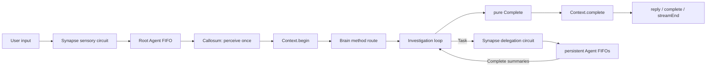

# Flyflor

Flyflor is a sessionless intelligent-life kernel built with Bun and TypeScript. It exists continuously: reconnecting a socket or refreshing a browser does not recreate its Context or its people.

Its biological vocabulary is architectural, not decorative:

- `Synapse` is the singleton cortex. It routes neural signals and coordinates persistent people.
- `Context` is the singleton owner of every Turn.
- each `Agent` is a persistent person with an isolated IOC scope;
- each person owns one `Brain`, `Callosum`, `Investigation`, `Identity`, and bounded `Memory`;
- `Tools` perform concrete actions directly and never disguise tool execution as a neural signal.

## Quick Start

```bash
bun install
printf 'DEEPSEEK_API_KEY=...\n' > .env
bun run dev
bun run client
```

`bun run dev` starts [src/bootstrap.ts](src/bootstrap.ts). Bun loads the ignored `.env`; the bootstrap loads decorator metadata and calls `Factory.create(AppModule)`. `@Init` completes lifecycle wiring before the graph becomes available.

`bun run client` serves the browser client at `http://127.0.0.1:17878`. The bridge preserves the kernel's length-prefixed IPC boundary and forwards strict JSON actions. The UI handles `open`, ordered `agent` chunks, `ask`, `confirm`, `pause`, `resume`, pure `complete`, `streamEnd`, connection close, and transport errors. Unknown or malformed packets throw instead of being displayed as a successful response.

Run every health gate before completing a kernel change:

```bash
bun run check
bun test
bun run build:binary
```

To exercise the configured provider rather than mocks, run:

```bash
bun run test:live
```

The live suite starts the real AppModule, Unix socket, WebSocket bridge, persistent Agent pool, and the model/provider from `.config/config.jsonc`. It verifies direct reply, filesystem read, Ask, rejected Confirm, approved filesystem write, Shell, Execute, two-person Task delegation, reconnect memory continuity, and Soul updates against a disposable identity package. All files and logs created by this suite live in a temporary directory and are removed afterward. The command intentionally performs real API calls and fails when the configured credential, model, protocol, signal, tool result, or cleanup is wrong.

## Neural Path



Ask and Confirm share a serial interaction circuit. Task uses an independent delegation circuit. Reply and Complete use an ordered expression circuit. A delegated task can therefore wait for another person while user interaction continues without deadlocking.

## Runtime Contracts

- A Turn is created and changed only under `src/agent/context`; it is never exported.
- Memory contains only one person's finite notes. It never stores Turns, provider messages, or session state.
- Complete is the final investigation summary. Context stores it directly without a second settlement model call.
- Root and delegated stimuli enter the receiving person's FIFO. The same person thinks serially; different people may investigate concurrently.
- Delegated people do not receive the Task tool, preventing recursive delegation.
- Ask and Confirm wait for exact correlated answers. A rejected Confirm is an explicit non-execution result.
- Filesystem, Shell, and Execute are direct actions. Thrown failures reject unchanged.
- PromptService is the only prompt-package and XML rendering boundary.
- Provider names map to one protocol and one endpoint convention. There is no protocol or endpoint fallback.
- Catch clauses, `.catch()`, rejection fallbacks, public Turn access, and direct application construction are static violations.
- The checked-in live suite uses the real configured `deepseek` provider and currently targets `deepseek-v4-flash`; it does not replace deterministic unit tests.

## Source Layout

```text
src/
  bootstrap.ts  metadata-first process entry
  app.ts        AppModule composition root
  core/         IOC, Observable, bases, logging
  config/       strict runtime configuration
  prompt/       prompt packages and safe XML rendering
  model/        model boundary and protocol adapters
  agent/        people, cognition, Context, private Memory
  neural/       Synapse cortical circuits and Agent pool
  tool/         concrete tools and approval policy
  transport/    socket, packet, controller
scripts/
  live.script.ts  real provider and Web/IPC end-to-end verification
web/
  client.ts      strict HTTP/WebSocket-to-IPC bridge
  client.html    browser interaction and expression client
```

See [docs/architecture.md](docs/architecture.md) for ownership and signal details. Engineering red lines live in [AGENTS.md](AGENTS.md).
