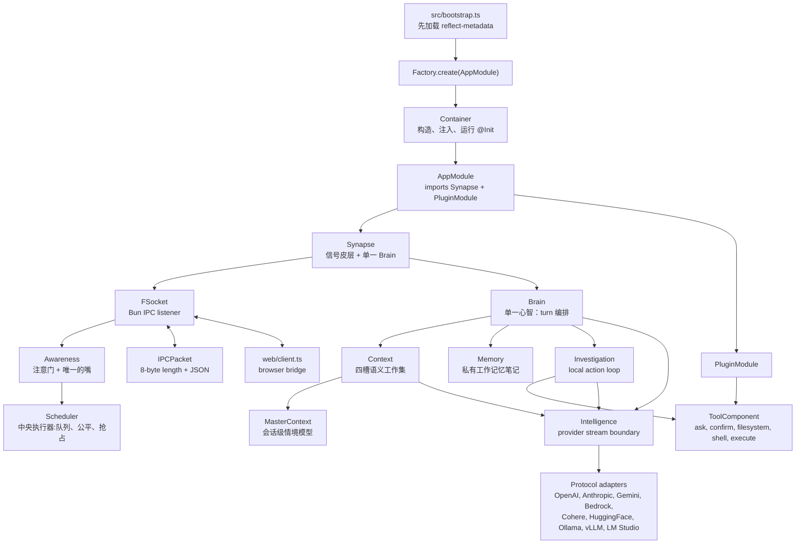
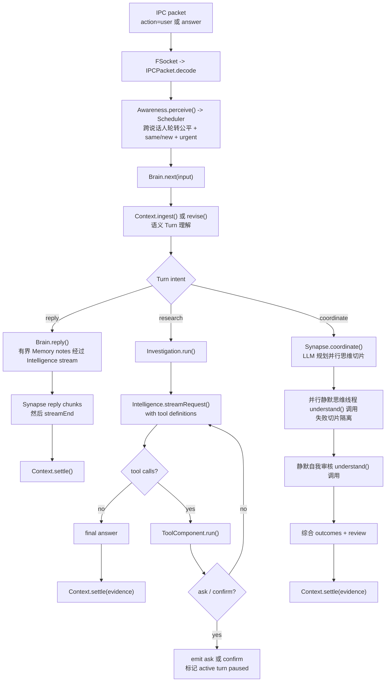

# Flyflor

Flyflor 是一个 Bun + TypeScript agent kernel。当前代码围绕 decorated classes、reflect-metadata IOC container、本地 length-prefixed IPC socket、prompt package、provider protocol adapter 和一组本地工具面运行。

## 快速开始

```bash
bun install
export DEEPSEEK_API_KEY=...
bun run dev
bun run client
```

`bun run dev` 启动 `src/bootstrap.ts` 并打开配置中的 IPC socket。`bun run client` 在 `http://127.0.0.1:17878` 启动本地浏览器桥，把浏览器 JSON 消息转发到这个 socket。

改动健康门槛：

```bash
bun run check
bun test
bun run build:binary
```

`bun run check` 会跑 TypeScript 和仓库红线扫描。默认 model/provider 在 `.config/config.jsonc`；secret 只放环境变量。

## 运行时地图



## 启动生命周期

```mermaid
flowchart LR
    A["bootstrap.ts"] --> B["import reflect-metadata"]
    B --> C["Factory.create(AppModule)"]
    C --> D["Container.getAsync(AppModule)"]
    D --> E["构建 module imports"]
    E --> F["构造 class"]
    F --> G["@Config / @Prompt 早期注入"]
    G --> H["@Inject / @Scope 依赖注入"]
    H --> I["@Init lifecycle method"]
    I --> J["Factory.synapse()"]
```



应用类只应由 IOC container 构造。带 singleton metadata 的 class 会缓存；普通 provider 每次解析时 fresh 创建。

## 一次用户回合



`Context` 是四槽语义工作集，不是 durable archive。容量不足时只淘汰 completed Turn，不使用墙上时间 TTL。已结算的 Turn 会固化(“升格”)进 `MasterContext`——进程内、有界的会话级情境模型——让理解与调度能看到四槽之外的前情,同时不构成长期记忆。`Memory` 是从 `Context.brief()` 初始化的有界私有工作记忆缓存；活跃运行时没有长期记忆写入路径。

## IPC 协议

kernel socket 上每个 packet 都是 8-byte unsigned big-endian JSON body length，加 UTF-8 JSON body：

```txt
+--------------------------+-------------------------------+
| 8-byte body length (BE)  | JSON body bytes (UTF-8)       |
+--------------------------+-------------------------------+
```

入站 `action: "user"` 或 `action: "answer"` 会变成 brain input。其他入站 action 会派发给 `Controller`；当前 controller action 是 `cwd`，用于更新 `ConfigService.path.cwd`。

常见出站 action 是 `open`、`agent`、`interrupted`、`streamEnd`、`data`、`ask`、`confirm`、`pause`、`resume`、`error`。

## 模型边界

`Intelligence` 对外只暴露统一 stream contract：

- `text_delta`：可见输出。
- `reasoning_delta`：需要在 provider 后续调用中回放的 reasoning。
- `action_start`、`action_delta`、`action_end`：streaming tool call。
- `done`：结束原因是 `stop`、`length` 或 `toolUse`。

协议选择来自 `.config/config.jsonc` 里的 active provider。provider 级 `protocols` 覆盖 `model.protocols`；每个 protocol adapter 只负责自己的 wire body 和 stream parser。

## 工具面

当前暴露给模型的工具由 `prompts/tools/config.jsonc` 加载，实现在 `src/plugins/tools`：

- `ask`：请用户从选项中选择；工具会自动补一个 `other` 选项。
- `confirm`：请求 yes/no 风格确认，并携带 recommended boolean。
- `filesystem`：`read`、`write`、`edit` 或 file-only `delete`，路径来自显式 `cwd` 或 `ConfigService.path.cwd`。
- `shell`：运行一个 command + args，有有界 timeout。
- `execute`：串行或并行运行 `python` / `sh` script tasks，可带 per-task cwd、env、timeout。

`Investigation` 拥有 tool loop。tool request/result replay 只留在 provider messages 里，不写入 `Context.turns`。

## Prompt Runtime

`PromptService` 可加载单个 markdown 文件，也可加载带 `config.jsonc` 的 prompt package 目录。package config 定义普通渲染 sections、editable files、locked files、runtime-ignored files，以及可选的 XML document view。persona package 只加载静态 `SOUL.md`/`EXTENSION.md`；运行时 prompt 写入和旧 `soul` route 已禁用。

canonical runtime prompt source 是英文 `.md` 文件。`.zh.cn.md` 是 human mirror，不能成为运行时 source-of-truth。

## 源码布局

```txt
src/bootstrap.ts                       process entrypoint
src/app.module.ts                      root @Module
src/configuration.ts                   ConfigService 和 runtime config types
src/core/                              decorators、IOC、base classes、prompt、logger、tool contracts
src/neural/                            Synapse、Awareness、Scheduler、IPC socket、packet codec、controller
src/neural/brain/                      Brain、Memory、Investigation、Intelligence
src/neural/context/                    Context、MasterContext
src/plugins/                           plugin boundary 和 local tools
src/entities/                          entity/repository classes；MemoryRepo 当前只返回 SQL statements
web/                                   本地 browser-to-IPC bridge 和测试页
prompts/                               prompt packages 和 zh.cn mirrors
.config/                              runtime config 和 persona prompt package
sql/                                   schema files
pakcages/                              bundled sqlite-vec helper/native assets；不在当前 agent turn path
scripts/check.script.ts                仓库镜像和 prompt-term checks
```

## 当前边界

`MemoryRepo`、`sql/001-core-schema.sql` 和 native vector 资产保留为未来 persistence boundary 占位，但没有接入当前 `Brain`、`Context` 或 `Memory` 路径。config file 也声明了 skills 和 MCP shapes，但当前代码还没有把 runtime MCP client 或 skill loader 接进 turn loop。

## 无 session 生命体设计

状态：已落地的研发原型。所有 IPC 连接都面对同一个生命体；连接只提供临时说话人身份，
不创建 session，也不创建持久对话库。

### 生物学参考点

以下神经科学文献提供设计约束和类比，不表示 LLM runtime 等同于大脑，也不证明本原型
具有意识。

- Baddeley，《Working memory: theories, models, and controversies》（2012），
  [PMID 21961947](https://europepmc.org/article/MED/21961947)：工作记忆是有限、
  需要主动维持的工作空间，不是无限日志。
- Cowan，《The magical number 4 in short-term memory》（2001），
  [PMID 11515286](https://europepmc.org/article/MED/11515286)：启发原型采用四个
  语义 Turn 槽。四不是生物学常数。
- Lewandowsky 等，《No evidence for temporal decay in short-term memory》（2009），
  [PMID 19223224](https://europepmc.org/article/MED/19223224)：反对把墙上时间 TTL
  当作一般遗忘理论；Flyflor 改用容量与干扰边界。
- Stokes，《Activity-silent working memory》（2015），
  [PMID 26051384](https://europepmc.org/article/MED/26051384)：支持一个较弱类比——
  重新激活紧凑任务集，而不是回放 transcript。
- Halassa 与 Kastner，《Thalamic functions in distributed cognitive control》（2017），
  [PMID 29184210](https://europepmc.org/article/MED/29184210)：启发门控/控制类比；
  `Awareness` 不是字面丘脑，也不是显著性神谕。
- Aston-Jones 与 Cohen，《An integrative theory of locus
  coeruleus-norepinephrine function》（2005），
  [PMID 16022602](https://europepmc.org/article/MED/16022602)：启发稀疏、阈值化的
  中断信号，而不是持续由模型打分的优先级。
- Mashour 等，《The global neuronal workspace》（2020），
  [PMID 32135090](https://europepmc.org/article/MED/32135090)：启发单一前台广播
  边界与一张嘴；这是架构类比，不表示软件里存在全局神经工作空间。
- Alberini 与 LeDoux，《Memory reconsolidation》（2013），
  [PMID 24028957](https://europepmc.org/article/MED/24028957)：启发更新挂起任务集的
  弱软件类比。Turn 修订不等于生物记忆再巩固。
- Klinzing、Niethard 与 Born，《Mechanisms of systems memory consolidation
  during sleep》（2019），
  [PMID 31451802](https://europepmc.org/article/MED/31451802)：在关闭长期记忆时，
  必须同时明确禁止 replay 与 consolidation 通路。
- Kassab 与 Alexandre，《Pattern separation in the hippocampus: distinct
  circuits under different conditions》（2018），
  [PMID 29637298](https://europepmc.org/article/MED/29637298)：弱类比启发来源分离；
  真正的隐私仍来自确定性的 speaker ownership、数据最小化与不持久化。

### 运行时不变量

1. 连接只是说话人身份（`conn_N`）。所有说话人进入同一个 singleton `Awareness`
   和 singleton `Context`；不存在 session 对象。
2. `Context` 最多保存四个语义 Turn 投影。Turn 包含目标、约束、引用、done/open 标签和
   紧凑 outcome；绝不保存 user/assistant transcript 或工具回放缓冲。
3. Turn 状态是 `working`、`waiting`、`suspended`、`completed`。容量压力下只可淘汰
   最早的 completed Turn，不使用墙上时间过期。
4. 临时感觉队列独立有界（默认 32）。队列满时明确向最新刺激返回背压错误；若四个语义
   槽都受保护，被判为 `new` 的刺激同样明确拒绝。两种情况都不会静默丢弃或无限保留。
5. 同一说话人的追问若判定为 `same`，调用 `Context.revise()` 并保留 Turn id；独立刺激
   是 `new`，保持 FIFO。确定性代码拒绝跨说话人修订。
6. 外部刺激串行执行。单个 Turn 可以使用并行思维切片与自我审核通道，但它不会形成
   第二条外部注意流。
7. 只有明确的布尔 `urgent` 判决可以抢占前台 Turn。runtime 取消其 provider 与可取消
   工具工作，把 Turn 压缩为 suspended，依次发送 `interrupted`、`streamEnd`，再释放嘴。
   已经输出的文字无法收回。
8. `AbortSignal` 贯穿 provider request 与 investigation 工具边界。`shell`、`execute`
   会终止活动进程组，取消后不再启动后续串行任务。同步 filesystem 调用只可在操作前后
   检查取消；已完成的写入或其他副作用不会回滚。
9. answer、interaction、stream 与断连清理都校验所属 `speakerId`。遗忘说话人的迟到输出，
   以及同一 Turn 上旧 stream generation 的迟到分片，会被丢弃。
10. active prompt 只读取静态 `SOUL.md` 与 `EXTENSION.md`。`USER.md`、运行时 prompt 写入、
    SQL/vector repository、episodic archive 和后台 replay 都不在 active path。
11. 诊断只包含 speaker/stimulus id、relation、text length 等路由元数据，不把刺激或回答
    原文持久化成影子 transcript。

### 对象边界

| 层 | 职责 |
| --- | --- |
| `FSocket` / `Connection` | 解码带长度帧的 IPC、分配 speaker id，并在某个 coalesced packet 格式错误后继续处理下一包。 |
| `Awareness` | 感知刺激、持有说话人墓碑与单嘴锁,并为调度器接线皮层边界。 |
| `Scheduler` | 持有刺激准入、跨说话人轮转公平(说话人内部 FIFO)、LLM 判决咨询与校验后的紧急抢占。 |
| `Context` | 持有四槽语义工作集和 Turn 生命周期,并把已结算 Turn 固化升格进 master context。 |
| `MasterContext` | 持有有界的会话级情境模型(固化 turn outcome);仅限进程内,绝不是长期记忆。 |
| `Synapse` | 执行一个前台刺激、取消它、把输出寻址给所属说话人，并协调并行思维线程。 |
| `Brain` | 摄取或修订 Turn，执行 reply、research 或 coordinate 意图。 |
| `Memory` | 保存由 brief 初始化的有界私有笔记；它不是持久化层。 |
| `ToolComponent` | 在确认与取消边界后执行本地能力。 |

调度模型只能提出 `same|new`、`targetTurnId` 和布尔 `urgent`。身份、容量、有效抢占目标、
FIFO、公平性和 stream 顺序由确定性代码负责。调度结果格式错误或超时时，最早待处理刺激
回退为 `new`，绝不隐式合并。`prompts/awareness/SCHEDULE.md` 是 canonical runtime
contract；`SCHEDULE.zh.cn.md` 只是人类镜像。

### 明确不做的事

- 本阶段不保存持久用户画像、不写 SQL/native-vector、不建 episodic archive、不做自动
  跨 session recall，也不允许隐藏的 provider/tool transcript cache。
- 不宣称四槽、丘脑门控类比、蓝斑语言或前台广播边界可以证明意识。
- 在没有测量依据和更强所有权模型前，不并行处理相互独立的外部刺激。
- 不承诺撤销取消前已经完成的外部副作用。

### 验证

运行 `bun run check` 与 `bun test`。测试覆盖四槽容量与无时间衰退、有界感觉背压、同 Turn
修订、FIFO/urgent 调度、说话人隔离、断连清理、可取消 provider 与进程工作、旧 stream
抑制、`interrupted` → `streamEnd` 顺序、格式错误/coalesced IPC frame，以及 browser
client 清理过期 interaction。

项目规则在 `AGENTS.md`；本 README 是完整的实现与研发设计总览。
