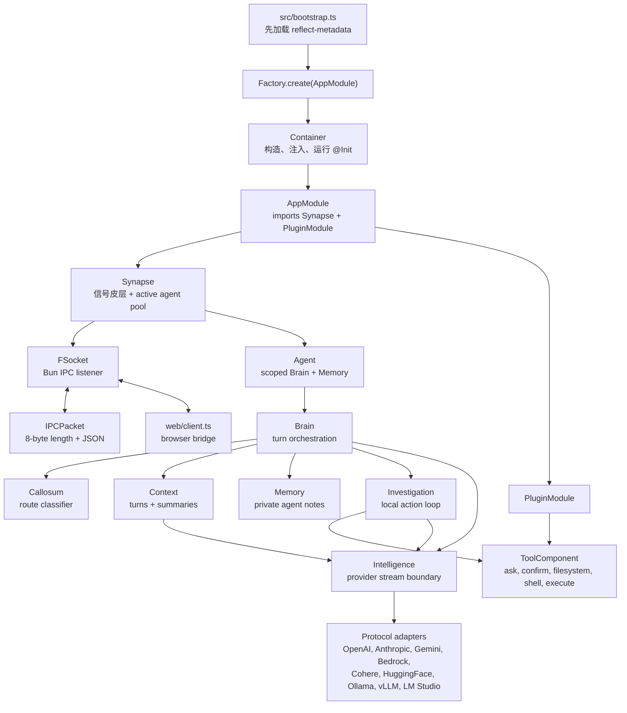
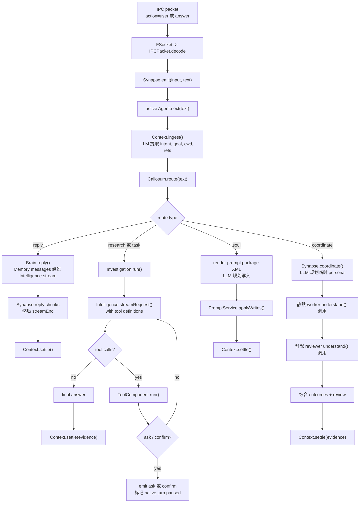

# Flyflor

Flyflor 是一个 Bun + TypeScript agent kernel。当前代码围绕 decorated classes、reflect-metadata IOC container、本地 length-prefixed IPC socket、prompt package、provider protocol adapter 和一组本地工具面运行。

## 快速开始

```bash
bun install
export DEEPSEEK_API_KEY=...
bun run dev
bun run client
```

`bun run dev` 启动 `src/bootstrap.ts` 并打开配置中的 IPC socket。`bun run client` 在 `http://127.0.0.1:17878` 启动本地浏览器桥，把浏览器 JSON 消息转发到这个 socket。

改动健康门槛：

```bash
bun run check
bun test
bun run build:binary
```

`bun run check` 会跑 TypeScript 和仓库红线扫描。默认 model/provider 在 `.config/config.jsonc`；secret 只放环境变量。

## 运行时地图



## 启动生命周期

```mermaid
flowchart LR
    A["bootstrap.ts"] --> B["import reflect-metadata"]
    B --> C["Factory.create(AppModule)"]
    C --> D["Container.getAsync(AppModule)"]
    D --> E["构建 module imports"]
    E --> F["构造 class"]
    F --> G["@Config / @Prompt 早期注入"]
    G --> H["@Inject / @Scope 依赖注入"]
    H --> I["@Init lifecycle method"]
    I --> J["Factory.synapse()"]
```



应用类只应由 IOC container 构造。带 singleton metadata 的 class 会缓存；普通 provider 每次解析时 fresh 创建。

## 一次用户回合



`Context` 是 durable turn owner。`Memory` 不是 transcript；它是从 `Context.brief()` 初始化的、有容量上限的 agent 私有笔记缓存。

## IPC 协议

kernel socket 上每个 packet 都是 8-byte unsigned big-endian JSON body length，加 UTF-8 JSON body：

```txt
+--------------------------+-------------------------------+
| 8-byte body length (BE)  | JSON body bytes (UTF-8)       |
+--------------------------+-------------------------------+
```

入站 `action: "user"` 或 `action: "answer"` 会变成 agent input。其他入站 action 会派发给 `Controller`；当前 controller action 是 `cwd`，用于更新 `ConfigService.path.cwd`。

常见出站 action 是 `open`、`agent`、`streamEnd`、`data`、`ask`、`confirm`、`pause`、`resume`、`error`。

## 模型边界

`Intelligence` 对外只暴露统一 stream contract：

- `text_delta`：可见输出。
- `reasoning_delta`：需要在 provider 后续调用中回放的 reasoning。
- `action_start`、`action_delta`、`action_end`：streaming tool call。
- `done`：结束原因是 `stop`、`length` 或 `toolUse`。

协议选择来自 `.config/config.jsonc` 里的 active provider。provider 级 `protocols` 覆盖 `model.protocols`；每个 protocol adapter 只负责自己的 wire body 和 stream parser。

## 工具面

当前暴露给模型的工具由 `prompts/tools/config.jsonc` 加载，实现在 `src/plugins/tools`：

- `ask`：请用户从选项中选择；工具会自动补一个 `other` 选项。
- `confirm`：请求 yes/no 风格确认，并携带 recommended boolean。
- `filesystem`：`read`、`write`、`edit` 或 file-only `delete`，路径来自显式 `cwd` 或 `ConfigService.path.cwd`。
- `shell`：运行一个 command + args，有有界 timeout。
- `execute`：串行或并行运行 `python` / `sh` script tasks，可带 per-task cwd、env、timeout。

`Investigation` 拥有 tool loop。tool request/result replay 只留在 provider messages 里，不写入 `Context.turns`。

## Prompt Runtime

`PromptService` 可加载单个 markdown 文件，也可加载带 `config.jsonc` 的 prompt package 目录。package config 定义普通渲染 sections、editable files、locked files、runtime-ignored files，以及 `soul` route 使用的 XML document view。

canonical runtime prompt source 是英文 `.md` 文件。`.zh.cn.md` 是 human mirror，不能成为运行时 source-of-truth。

## 源码布局

```txt
src/bootstrap.ts                       process entrypoint
src/app.module.ts                      root @Module
src/configuration.ts                   ConfigService 和 runtime config types
src/core/                              decorators、IOC、base classes、prompt、logger、tool contracts
src/neural/                            Synapse、IPC socket、packet codec、controller
src/agent/                             Agent、Brain、Callosum、Context、Memory、Investigation、Intelligence
src/plugins/                           plugin boundary 和 local tools
src/entities/                          entity/repository classes；MemoryRepo 当前只返回 SQL statements
web/                                   本地 browser-to-IPC bridge 和测试页
prompts/                               prompt packages 和 zh.cn mirrors
.config/                              runtime config 和 active agent prompt package
sql/                                   schema files
pakcages/                              bundled sqlite-vec helper/native assets；不在当前 agent turn path
scripts/check.script.ts                docs mirror 和 prompt-term checks
```

## 当前边界

`MemoryRepo` 和 `sql/001-core-schema.sql` 准备了未来 persistence boundary，但当前 `Agent`、`Context`、`Memory` 路径仍是内存态。config file 也声明了 skills 和 MCP shapes，但当前代码还没有把 runtime MCP client 或 skill loader 接进 turn loop。

项目规则在 `AGENTS.md`；本 README 只做实现总览。
