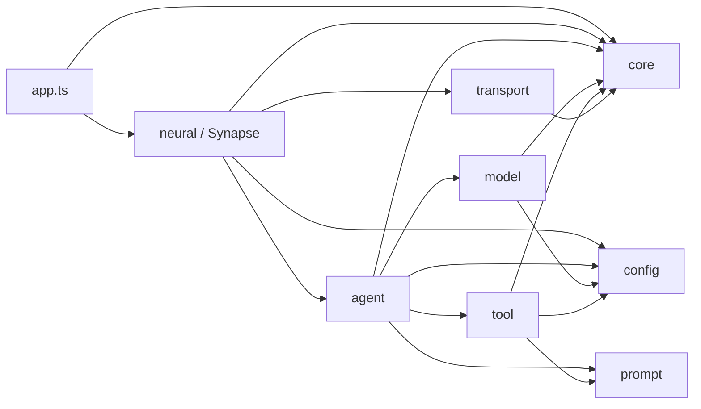
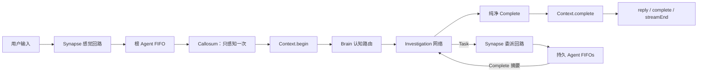
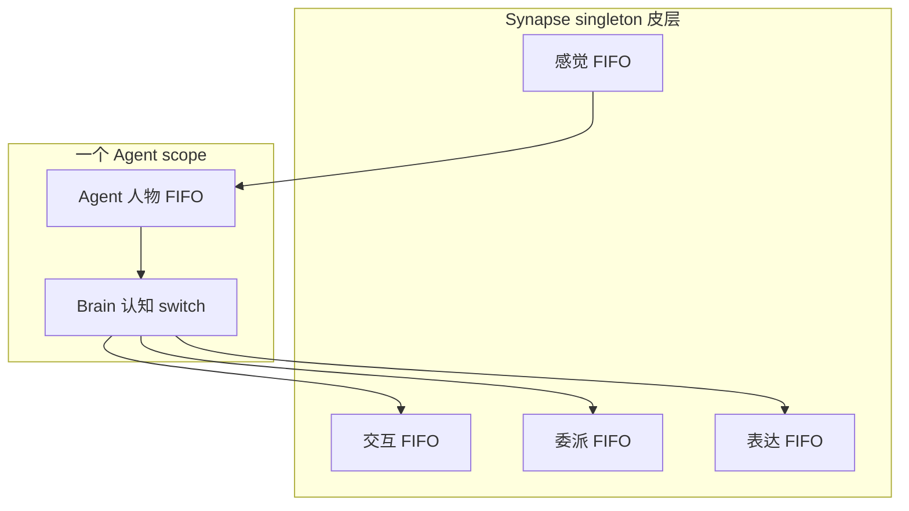
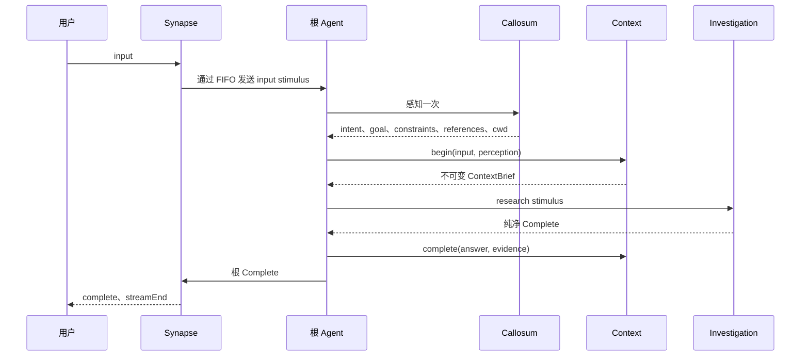
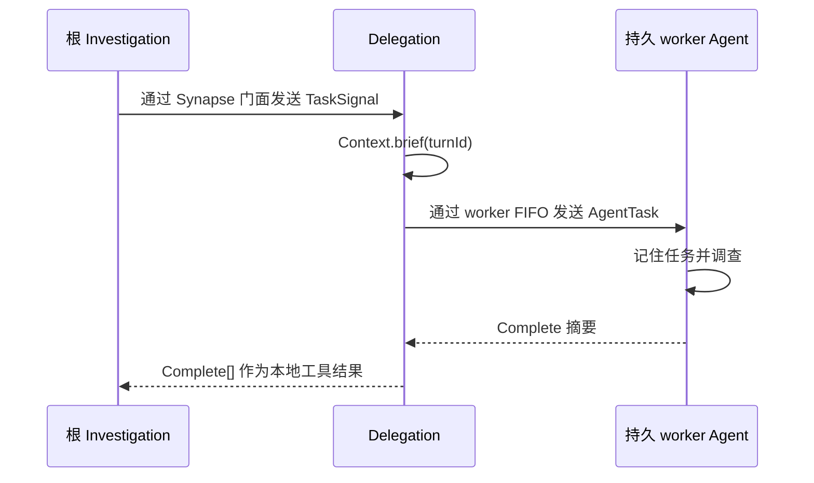

# Flyflor

Flyflor 是一个使用 Bun 与 TypeScript 构建的无 Session 智能生命体内核。它持续存在：Socket 重连或浏览器刷新不会重新创建它的 Context 或人物。Transport 连接不是生命周期边界，系统中不存在 Session 对象。

内核只有一个目的：理解用户需求、调查现实、摘要所得，并准确完成任务。

它的生物学词汇是架构本体，而不是装饰：

- `Synapse` 是 singleton 大脑皮层，负责路由神经信号并协调持续存在的人物；
- `Context` 是所有 Turn 的 singleton 唯一所有者；
- 每个 `Agent` 都是一个持续存在、拥有隔离 IOC scope 的人；
- 每个人独享一个 `Brain`、`Callosum`、`Investigation`、`Identity` 与有界 `Memory`；
- `Tools` 直接执行具体动作，不把工具执行伪装成神经信号。

工程红线见 [AGENTS.zh.cn.md](AGENTS.zh.cn.md)。

## 快速开始

```bash
bun install
printf 'DEEPSEEK_API_KEY=...\n' > .env
bun run dev
bun run client
```

`bun run dev` 启动 [src/bootstrap.ts](src/bootstrap.ts)。Bun 自动加载已忽略的 `.env`；入口先加载 decorator metadata，再调用 `Factory.create(AppModule)`。依赖图只有在 `@Init` 完成生命周期连接后才可用。

`bun run client` 在 `http://127.0.0.1:17878` 提供浏览器客户端。Bridge 保持内核长度前缀 IPC 边界并转发严格 JSON action。UI 处理 `open`、有序 `agent` chunks、`ask`、`confirm`、`pause`、`resume`、纯净 `complete`、`streamEnd`、连接关闭与 transport error。未知或非法 packet 会抛错，不会被显示成成功响应。

完成内核变更前运行全部健康门：

```bash
bun run check
bun test
bun run build:binary
```

要验收真实配置 provider 而不是 mock，运行：

```bash
bun run test:live
```

Live suite 会启动真实 AppModule、Unix socket、WebSocket bridge、持久 Agent pool，以及 `.config/config.jsonc` 中配置的 model/provider。它覆盖直接 reply、filesystem read、Ask、拒绝 Confirm、批准 filesystem write、Shell、Execute、双人物 Task 委派、Ask 与 Confirm pending 期间刷新后恢复、重连记忆连续性，以及使用一次性 identity package 的 Soul 更新。该套件生成的文件和日志全部位于临时目录，结束后删除。命令会产生真实 API 调用；credential、model、protocol、signal、tool result 或 cleanup 任一错误都会使测试失败。

## 所有权

| 对象 | 生命周期 | 唯一职责 |
| --- | --- | --- |
| `Synapse` | 生命体 singleton | 皮层门面、生命周期组合、信号路由 |
| `AgentPool` | 单个 Synapse 生命周期 | 活跃身份、已验证 profiles、持久 Agent scopes |
| `Sensory` / `Interaction` / `Delegation` / `Expression` | 单个 Synapse 生命周期 | 一条独立 FIFO 及其精确皮层效果 |
| `Context` | 生命体 singleton | 唯一创建和修改 Turn；有界完成经历（32） |
| `Agent` | pool 中持久人物 | 人物边界 FIFO，包围一个人的认知 |
| `Memory` | 单个 Agent scope | 有界、连续的临时笔记；绝不保存 Turn |
| `Brain` | 单个 Agent scope | 认知 switch FIFO 与根任务完成 |
| `Callosum` | 单个 Agent scope | 对每次根输入进行一次严格感知 |
| `Investigation` | 单个 Agent scope | 模型循环、Ask/Confirm/Task/Complete 网络、紧凑证据与本地 replay |
| `Identity` | 单个 Agent scope | 按 package policy 持有持久 prompt 身份 |
| `Tools` | 生命体 singleton | 直接具体动作及其 schema |
| `Model` | 单个 Agent scope | 上下文压力判断、精确 provider 请求与完整等待的 streaming |
| `FSocket` | 生命体 singleton | 仅负责 IPC 生命周期与 backpressure |

Context 持有内部 `Turn` class。Context barrel 只导出不可变 brief 与 summary，绝不导出 Turn。Brain 调用 `begin()`、`complete()`；Interaction 调用 `pause()`、`resume()`；Delegation 调用 `brief()`。任何调用者都无法取得可变 Turn 状态。

## 依赖方向



Agent 永不导入 Neural。两者边界是 `AgentBus.fire()` 与 `src/agent/types.ts` 中稳定的判别信号结构。Transport 不导入认知层或 Synapse，只调用已绑定 callback。

## 神经链路



Ask 与 Confirm 共用串行交互回路；Task 使用独立委派回路；Reply 与 Complete 使用有序表达回路。因此委派任务等待其他人物时，用户交互仍可继续，不会死锁。

所有回路使用同一个四方法 `Observable` 契约：`pipe`、`switch`、`subscribe`、`next`。每条回路必须且只能安装一个 Input→Output 变换；缺失变换、重复注册、缺少判别分支或下游 rejection 都会使该回路 fail-stop。

## IOC 与生命周期

`src/bootstrap.ts` 在 decorated application class 前加载 `reflect-metadata`，再调用 `Factory.create(AppModule)`。AppModule 导入 Synapse，因此一次调用即可解析并初始化整个生命体。

- `@Singleton` 与 `@Module` 只有在注入和 `@Init` 成功后才写入缓存；
- `@Inject()` 只登记自有属性键；Container 在解析对象时通过 Reflect metadata 读取其 `design:type`；
- 继承成员元数据由 Container 显式收集且不共享可变数组，singleton 与 module 策略仍由 class 自有；
- `@Scope` 使用单个 Agent 本地 resolution scope；
- Brain、Callosum、Investigation、Identity、Memory、Model 在同一人物 scope 内只创建一次并复用；
- 不同人物绝不共享 scoped cognition 或 Memory；
- 业务代码不得直接构造 application class；
- 初始化失败的对象不会发布到 singleton cache。

Synapse 将一个全新的 AgentPool 绑定到自身 `AgentBus`。AgentPool 验证并复制每个完整的已配置 profile，为每个人物只创建一次隔离 scope 并持续保留。Synapse 初始化失败时，其尚未发布的 pool 与回路会被整体丢弃。Profile 副本永不修改；只有显式 `cwd` transport action 可以有意更新 `ConfigService.path.cwd`。系统不会创建 task-level worker。

## Observable 回路

`Observable<TInput, TOutput>` 继承 `FlyFlor`，完整公开方法面只有 `pipe`、`switch`、`subscribe`、`next`。

- `pipe` 安装唯一 Input→Output 变换；缺失变换或二次安装都 reject；
- `switch('type', handlers)` 通过穷尽判别分支安装同一个唯一变换；
- `next()` 返回完整处理 Promise；
- 每条回路使用一个 promise tail 保证 FIFO；
- 选中变换与 subscribers 按注册顺序完整 await；
- 缺失 switch 分支直接抛错；
- rejection 原样传播，并使该回路 fail-stop；
- 不同 Observable 实例可以并行放电。

Synapse 组合四个独立的具体回路对象：

| 回路 | 输入 | 效果 |
| --- | --- | --- |
| 感觉 | 用户文本 | 将根人物 input stimulus 排入队列 |
| 交互 | Ask 或 Confirm | 串行化精确用户交互，同时不阻塞其他回路 |
| 委派 | Task | 从 `ContextBrief` 构建子任务并等待目标 Complete |
| 表达 | Reply 或根 Complete | 保证 reply chunks、Complete、streamEnd 顺序 |

每个 Agent 拥有人物边界 FIFO（`pipe` 将刺激映射为 Complete）。每个 Brain 拥有独立的认知 switch FIFO（`switch` 按刺激类型路由）。两层保持分离：人物串行思考 vs 认知路由。Investigation 在 `@Init` 中一次性构建 Ask、Confirm、Task、Complete switch，并为后续刺激复用。



## 根 Turn



`reply`、`research`、`soul` 三条路径都以 Complete 结束。Complete 就是最终摘要，Context 直接保存。不存在第二次 settle 调用，provider replay 永不写入 Context。

如果认知 reject，错误不会被转换为友好消息。受影响 FIFO 保持 fail-stop，活动经历保留用于诊断，而不是伪装成功。

## 委派

Investigation 只在根能力运行中暴露 Task。Task 只验证 `[{ agent, goal }]`；它不创建人物，也不执行派发。



发给同一人物的任务排在该人物当前 stimulus 之后；不同人物可以并发。自我委派会被拒绝，因为等待当前正在执行的 FIFO 会死锁。委派运行使用 `tools.list(false)`，因此无法递归触发 Task，但仍可使用统一 Ask 与 Confirm 回路。

## Investigation 与 Tools

Provider tool calls 只存在于本次 Investigation 的本地消息列表。

- Ask 由工具验证，通过交互回路放电，并以结构化 answers replay；
- Confirm 在具体危险动作前放电；拒绝结果为 `{ approved: false, executed: false }`，动作不执行；
- Task 完成验证后通过委派回路放电，并以子 Complete summaries replay；
- Filesystem、Shell、Execute 通过 Tools 直接运行；
- 抛出的失败原样 reject；
- shell 非零退出与 timeout 保留为显式进程数据；
- execute spawn 错误使批次 reject，已完成进程的退出仍是显式数据；
- Filesystem、Shell、Execute 各自拥有强类型紧凑 `observe` 投影；
- `Tools.observe(result)` 只信结果自身唯一的 `name`；Investigation 投影 Ask/Task outcome，并附加审批/effect 元数据；
- 有效观察复制到当前人物的有界 Memory。

Investigation 始终按理解目标、获取事实或执行、检查结果、继续或完成推进。当 Model 判断可用上下文容量达到约百分之八十时，它会在下一次普通采样前请求模型生成纯文本摘要。压缩后的历史保留身份、当前 stimulus、原始目标、紧凑证据、摘要及下一步，并移除旧 tool replay。每批 tool call 的模型可见结果共享固定 64 KiB 展示预算，以 UTF-8 安全的首尾内容和显式 omitted-byte 标记呈现。模型可见工具 JSON schema 保持不变。

Memory 在超过十六条 notes 后按 FIFO 淘汰最旧笔记。它只保存紧凑的目标、引用与观察，不保存当前原始输入、完整文件内容、进程输出、委派答案、provider messages、Turn 最终答案、Turn status 或 Turn 数组。完成答案只由 Context 保存，且最多保留三十二条已完成 Turn（活动 Turn 永不淘汰）。当前输入只出现在 stimulus 的 input block 一次，Context block 不再重复它。

## PromptService 与 XML

PromptService 是唯一 prompt 边界，负责：

- 加载规范英文 Markdown，并忽略 `.zh.cn.md` 镜像；
- 按 package `config.jsonc` 声明顺序组合 sections；
- editable、locked、runtime-ignored 身份策略；
- 身份写入的 all-before-any 严格验证；
- XML name 验证、attribute escaping、CDATA splitting、稳定 block 顺序；
- 为 ContextBrief、用户输入、task data、tool results 渲染内联 `document`。

XML 只存在于模型输入边界，不是 Context、Turn 或 Memory 的存储格式。缺少 package、section、mapping、block 或非法 name 都立即 reject。

## 模型协议

每个 provider 只解析为一个协议 attempt：

| Provider | 协议与路径 | Tools |
| --- | --- | --- |
| `openai` | Chat Completions，`/v1/chat/completions` | 支持 |
| `deepseek` | OpenAI-compatible Chat Completions，`/chat/completions` | 支持 |
| `vllm`、`lmstudio` | 显式声明的 OpenAI-compatible Chat Completions | 支持 |
| `responses` | Responses，`/v1/responses` | fetch 前拒绝 |
| `anthropic` | Messages，`/v1/messages` | fetch 前拒绝 |
| `google`、`gemini` | Gemini streaming generate content | fetch 前拒绝 |
| `aws`、`bedrock` | Bedrock converse stream | fetch 前拒绝 |
| `cohere` | Cohere chat | fetch 前拒绝 |
| `ollama` | Ollama JSON stream | fetch 前拒绝 |

未知 provider 直接 reject。失败状态码、错误响应结构、非法 tool JSON、缺失或重复 terminal event、token limit、不安全或未知 finish reason、tool-use 不一致，以及纯文本请求中的 tool call 都 reject。不支持工具的协议在 `fetch` 前拒绝 tool definitions 或 tool replay。Streaming 文本 callback 被完整 await，因此神经输出顺序不会逃逸模型 Promise。

Agent profile 的 `contextLength` 与 `maxTokens` 只描述容量事实，不配置认知或审查策略。ProtocolClient 测量最终 UTF-8 JSON body，并在调用 `fetch` 前拒绝超过内部 512 KiB 安全边界的请求。

## Transport

IPC frame 使用八字节 unsigned big-endian body length，随后是 UTF-8 JSON。Packet buffering 覆盖 split header、split body、split UTF-8 sequence 与 coalesced frames。非法或过大 frame 直接 reject。

FSocket 在无活动连接时拒绝 write，并在路由前验证 packet 根对象、非空 action、user text 与 answer correlation。重连只重置 transport framing 与 pending bytes，不触碰 Context 或 Agent Memory。待处理 Ask/Confirm 保持 paused，并在 `open` 后按原始 `ask|confirm → pause` 顺序重放。只有 `resume` 成功写出后才恢复 Context 并解析 pending Promise。Input、answer 与 connected callback 都被完整 await。未知 controller action 直接 reject。

Web bridge 保持同一八字节 frame，并在双向执行相同的 4 MiB body 上限与 packet 根验证。

## Runtime 契约

- Turn 只能在 `src/agent/context` 下创建和修改，且永不导出。
- Context 最多保留 32 条完成 Turn；`recent(0)` 返回空数组，非法 limit 直接 reject。
- Memory 只包含一个人的 16 条有限笔记，不保存 Turn、provider messages 或 session state。
- Complete 是最终调查摘要，Context 直接保存，不进行第二次结算模型调用。
- 根刺激与委派刺激都进入接收人物的 FIFO；同一人物串行思考，不同人物可以并行调查。
- 被委派人物看不到 Task 工具，从而禁止递归委派。
- Ask 与 Confirm 等待精确关联的回答。等待期间断连时，pending interaction 保持 paused，并在 `open` 后重放；只有 `resume` 写出后 Context 才改变。被拒绝的 Confirm 是明确的未执行结果。
- Filesystem、Shell、Execute 是强类型直接动作，各自只投影自身紧凑 observation。Investigation 持有 Ask/Task outcome 与审批/effect 元数据。抛出的失败原样 reject。
- Filesystem 字节限制保持 UTF-8 边界。Runtime cwd 变更归 ConfigService 所有，Agent profile 副本保持不变。
- PromptService 是唯一 prompt package 与 XML 渲染边界。
- 每个 provider 名称只映射一个协议和一个 endpoint convention。OpenAI-compatible 协议支持 tools；Responses、Anthropic、Gemini、Bedrock、Cohere、Ollama 在 fetch 前拒绝 tool definition/replay，但保持纯文本路径。
- Model request 只有收到唯一 terminal event 才成功；缺失/重复终态、token limit、不安全或未知 finish reason、tool-use 不一致，以及纯文本请求中的 tool call 都 reject。
- IPC 保持八字节 big-endian frame，并严格执行 4 MiB body 上限、packet 根、非空 action、精确 user text、answer correlation 与 backpressure。Web bridge 执行相同根对象和 body 门禁。
- CatchClause、`.catch()`、rejection fallback、公开 Turn、直接构造应用 class、跨域相对 import、带行为 barrel、未归属 instance state、非法 decorator 与 Observable 扩面都是静态违规。
- Unit test logger 隔离在系统临时目录，不修改 tracked runtime log。
- 仓库内 live suite 使用真实配置的 `deepseek` provider，当前目标模型为 `deepseek-v4-flash`；它不替代确定性 unit tests。

## 静态红线

`bun run check` 组合 TypeScript 检查与 AST 架构门，拒绝：

- CatchClause、`.catch()`、rejection fallback handler；
- IOC 外直接构造 application class；
- runtime class、constructor、method、accessor 缺少实质 EN/ZH JSDoc；
- instance state 未由 constructor 初始化，或使用固定白名单之外的 decorator；
- Observable 出现四方法契约之外的公开 method/state；
- method 超过 500 行；
- 非法依赖方向、跨域相对 import 与非 re-export barrel；
- 公开或外部导入 Turn；
- Session type；
- 缺少中文文档镜像；
- 非法 prompt source。

## 验证层次

`bun test` 为 Observable FIFO/fail-stop、IOC scope 与发布、Context 隔离、Investigation 分支、tools、协议解析、IPC framing、重连重放与 Web bridge encoding 提供确定性覆盖。Unit test logger 被重定向到临时目录，因此不会修改 tracked runtime log。随后，`bun run test:live` 使用已配置模型驱动真实 browser bridge 与内核。其一次性场景覆盖三条认知路径、全部具体工具、Ask/Confirm 关联、多人物 Task Complete 与重连连续性。这样既保持普通测试可重复，又能独立复现 provider 与 prompt 的真实行为。

## 源码布局

```text
src/
  bootstrap.ts  metadata-first 进程入口
  app.ts        AppModule 组合根
  core/         IOC、Observable、基础类、日志
  config/       严格 runtime 配置
  prompt/       prompt package 与安全 XML 渲染
  model/        模型边界与协议适配器
  agent/        人物、认知、Context、私有 Memory
  neural/       Synapse 皮层回路与 Agent pool
  tool/         具体工具与审批策略
  transport/    socket、packet、controller
scripts/
  live.script.ts  真实 provider 与 Web/IPC 端到端验收
web/
  client.ts      严格 HTTP/WebSocket-to-IPC bridge
  client.html    浏览器交互与表达客户端
```
