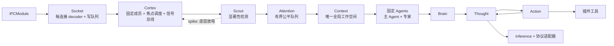

# Flyflor

Flyflor 是一个 Bun + TypeScript 内核，用于承载单进程、无 session 的多人智能生命体。进程只有一条意识流和一个全局工作 Context。多个外部说话者通过稳定的 `speakerId` 区分，不会产生彼此隔离的对话。

## 快速开始

```bash
bun install
export DEEPSEEK_API_KEY=...
bun run dev
bun run client
```

内核会监听 `.config/config.jsonc` 中配置的 Unix socket；浏览器 bridge 在 `http://127.0.0.1:17878` 提供页面，并转发严格的 Flyflor IPC 数据包。

提交改动前运行：

```bash
bun run check
bun test
bun run build:binary
```

密钥只放在环境变量中。进程重启会按设计清空 Context 和所有易失 Agent 笔记；socket 重连不会清空它们。

## 运行链路



对象边界如下：

- `IPC → Socket` 负责 framing、校验、连接身份和 backpressure。
- `Cortex`（皮层）是唯一编排中枢：固定成员构建、单焦点、取消、revision 校验、输出路由与类型化信号总线。它不直接生成答案。
- `Scout`（侦察者）是显著性探测器。每条入站刺激在此完成侦察，并以 `spike`（放电信号）释放，皮层据此反应。检测是责任链：等待闸门 → 显式 reply 链 → 模型分类 → 确定性回退。
- `Attention` 是闸门和有界公平队列。皮层依据每次放电信号把刺激合并进当前焦点或排入队列。
- `Context` 是对话事实唯一所有者，保存当前焦点、约束、事实、未决事项和带来源摘要。
- 每个固定 `Agent` 只有保存观察与反思的易失局部 `Memory`，不拥有独立对话 transcript。
- 每个成员的 `Brain` 都运行 `Thought → Action/Observation → Thought` 闭环。隐藏 provider 推理和 replay 缓冲只留在当前推理调用内部。
- 只有配置的主 Agent 能使用副作用工具；专家强制只读，并在主 Agent 综合前并行工作。

## 焦点与连续性

全局同时最多一个外部焦点。空闲时第一条刺激创建焦点；工作中优先检查显式 `replyTo`，否则由 Scout 判断语义关联。合并会增加 `revision`、发送 `responseReset`、取消可取消的模型工作，并让主 Agent 基于新 Context 重思考。只有解析出工具 atom，并在执行前一刻再次校验当前 revision 后，action 才算真正开始；实际已经开始的副作用会完成，并以精简证据记录。

等待 `ask` 或 `confirm` 时是硬闸门，普通消息排队。只有携带匹配 `focusId` + `requestId` 且由焦点拥有者发出的 answer，或拥有者发出的 cancel，才能解除等待；ask 回答还必须与 pending questions 的数量、顺序和文本完全一致。拥有者重连后通过新连接回答或取消时，该连接会自动附着到焦点。ask 回答与 confirm 结果都会作为带来源约束写入 Context。跨 speaker 合并后，最终流定向发送给所有参与连接，但确认权仍属于创建焦点的拥有者。取消结果会立即发送，但已经开始的副作用会完成并记录精简观察，之后才释放焦点。

队列上限由 `collective.queueLimit` 控制，按显著性、等待时间和说话者公平性选取；队列满时明确拒绝最新消息。排队根消息激活时，会在推理开始前吸收它的显式 `replyTo` 链，因此相关排队说话者共享一个焦点和一个最终 revision。每个入站 action 都在进程范围占用自己的 `messageId`。完全相同的 `user`、`answer` 或 `cancel` 重试是幂等的，并返回该命令稳定的原始 receipt；同一 ID 被用于不同 action 或载荷时会被拒绝。幂等记录只保存载荷的 SHA-256 指纹，不保留原始对话或交互回答。

## IPC

socket 上每个数据包都是 8 字节无符号大端正文长度，后接 UTF-8 JSON：

```txt
+--------------------------+-------------------------------+
| 8-byte body length (BE)  | JSON body bytes (UTF-8)       |
+--------------------------+-------------------------------+
```

协议严格校验，旧格式会被拒绝：

```ts
interface IpcEnvelope<A extends string, D> {
    protocol: 'flyflor.ipc';
    messageId: string;
    action: A;
    data: D;
}

interface UserInput {
    speakerId: string;
    text: string;
    replyTo?: string;
}
```

入站 action 为 `user`、`answer`、`cancel`。`open` 返回 `connectionId` 和协议版本。每个被接受的入站命令都会返回 `event` receipt。公共 `attention` 只包含状态和队列深度。每次侦察者放电都会以 `event { type: 'spike', spike }` 广播给所有连接，让皮层放电信号保持可观测。正文增量使用 `{ focusId, revision, chunk }`；焦点合并会发送 `responseReset`。回答、确认、工具事件、错误和最终流只发送给相关焦点参与者。

每个 socket 拥有独立 decoder、严格有序的入站队列和带 backpressure 的输出队列，能处理 UTF-8 分片、粘包、坏帧和重叠 data 回调。每连接的待处理输入和输出分别最多容纳两个最大 IPC 包；慢客户端或洪泛客户端会被单独断开，不影响健康连接。一个完整坏帧只产生一条错误，不会丢弃同一 chunk 中排在后面的合法帧。连接断开只移除它在当前焦点中的传输路由，不删除 speaker 身份；重连可以附着新路由，但断线期间产生的流不补发。超大出站包只会在目标连接上转化为错误，不会打断 Agent 执行。

Scout 会在分类前把当前刺激投影到 `collective.contextCharLimit`；Context 也会按同一预算为每个 Agent 独立构造输入。完整的进程内事实不被修改，受限模型输入保留首条与最新消息和约束。`collective.contextItemLimit` 是存储硬上限：先淘汰普通条目；只有全部槽位都受保护时，才淘汰最老的非 pinned 保护条目；当前焦点约束仍完整留在 Focus 上。

动态压缩让工作空间保持稠密而不是丢知识：普通条目超过 `collective.contextCompressItemLimit` 软阈值(默认 96)后，后台把最老、最低显著性的条目折叠成一条保留来源元数据并集的 `digest` 条目。受保护类型和被当前焦点引用的条目永不进入批次。模型压缩使用 `prompts/context` 包，模型不可用时回退为带类型标签的确定性合并；硬上限与紧急淘汰仍是最后防线，生命账本完全不参与。

Inference 会透传外部取消原因，执行 provider/model 的请求总超时和流停滞超时，并在失败或调用方取消读取时终止活动 byte reader。provider 返回的空或重复 tool-call ID 会在交互或 replay 前被规范化为唯一 request ID。Brain 使用 `collective.contextCharLimit` 作为旧 provider-only 工具 replay 的保留预算，只按完整 Thought/Action 周期淘汰旧内容，并始终保留最新完整周期；单条 replay 工具结果最多 12,000 字符。Filesystem 读取最多返回 20,000 个有效 UTF-8 字节。Shell 和 execute 的每个 stdout/stderr 流最多保留 20,000 字符；截断时保留首尾并设置显式标记。Execute 最多接受 64 个任务，有效并发上限为 8。

## 目录

```txt
src/ipc/                          framing 和多连接 socket 边界
src/collective/                   Cortex、Scout、Attention、全局 Context
src/agent/                        固定 Agent、易失 Memory、Brain、Thought、Action
src/inference/                    模型/provider 基础设施和适配器
src/plugins/tools/                ask、filesystem、shell、execute 原子工具
prompts/agents/                   只读固定身份 prompt 包
prompts/scout/                   显著性/焦点 prompt 包(侦察者放电)
web/                              浏览器 bridge 和本地 IPC 控制台
.config/config.jsonc              模型、群体、成员和 socket 配置
```

运行时 prompt 的规范源是英文 `.md` 文件。所有文档和 prompt 源都有人工维护的 `.zh.cn.md` 镜像；运行时代码不会读取镜像。

应用 class 只能由 IOC container 构造。`@Module`、`@Singleton`、`@Provide`、`@Inject`、`@Scope`、`@Init` 装饰器明确声明生命周期和所有权。
