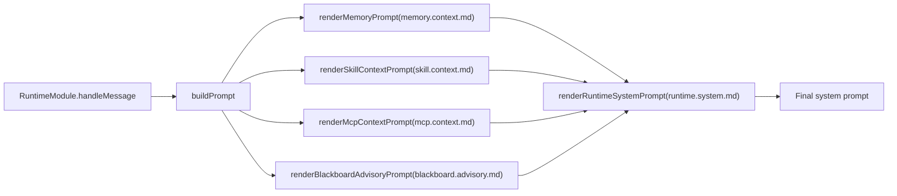
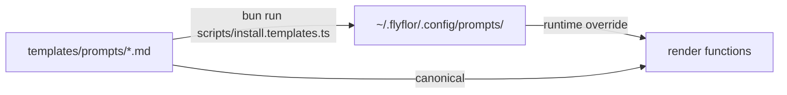

# Flyflor

Flyflor 是一个 Bun + TypeScript 智能生命体运行时内核，目标是单文件二进制交付。它不是 chat/session agent。LLM 是流体智力，Memory 是上下文装备，Crystal 是晶体智力，Scope/Fork 是显式固化工作域，ASK 是不确定性与超长线 loop 的闭环器官。

官方主页：[https://flyflor.qingshen.xin](https://flyflor.qingshen.xin)

## 设计哲学

- **上下文是选择出来的，不是堆出来的。** 原始 transcript 和事件流只是证据；运行时上下文来自当前输入、Memory、Crystal、显式 Scope/Fork 和 Executive 能力面。
- **账本不是心智。** `brain.db` 是按月生命账本，只负责 ledger/query/replay/audit/detail，不是 session store，也不是 prompt 容器。
- **长期工作需要领地。** Scope 是 durable work domain；ContextFork 是该 domain 下的分支；codename 只是锚点、提议入口和 recall boost，不是隐藏上下文桶。
- **不确定性必须通过 ASK 闭环。** 缺少决策、merge 冲突、loop guard、结晶门或长线暂停，都应该产出结构化 ASK，而不是静默猜测。
- **经验必须有证据才结晶。** Gem/Crystal 沉淀的是稳定方法或知识；近期对话、失败猜测和原始日志不会无门槛升格。
- **执行是外骨骼。** MCP、插件、skill、channel action、用户工具和 subagent 都进入同一套可审计 Executive Tool surface，并受 sandbox、approval 和 event 约束。
- **禁止把字符匹配伪装成智能。** 业务语义判断只能来自结构化模型输出、专用 JSON prompt 模板或数值资源指标。

## 代码分层

核心设计命名为 **Cognitive-Executive-Agent Architecture（心智-执行-外显三层架构）**：

| 层 | Owner | 职责 |
| --- | --- | --- |
| Entry | `app.ts` | 只做薄模式分派。 |
| Composition | `src/app.ts` | 显式依赖绑定和 runtime 启动。 |
| Cognitive | `src/cognitive` | Mindstream、Hippocampus Memory、Scope、ASK、Crystal、Gem 闭环。 |
| Executive | `src/executive` | Capability registry、tool descriptor、trust gate、loop guard、pause/resume。 |
| Agent | `src/agent` | Runtime pipeline、Blackboard、sandbox、context assembly、skills、MCP、plugin、worker。 |
| Socket | `src/socket` | `/ws`、`/health`、live turn、event、operation、ledger query/replay transport。 |
| Events | `src/events` | Runtime event fabric 和 fan-out。 |
| Protocol | `src/protocol` | 可序列化 contract、enum、control envelope、structured block。 |
| Entities | `src/entities` | SQLite row mapping、repo、schema ownership。 |
| Config/Templates | `src/config`, `templates` | JSONC config 默认值、prompt template、memory template。 |

运行模型拆成两张平面：

- **Context plane：** 当前输入、Memory recall、Crystal recall、显式 `activeScope`、显式 `contextForkId`、可见 capability surface。
- **Ledger/query plane：** 当前月 `brain.db`、历史月归档、history/replay/audit/detail、task plan、fork snapshot、blackboard detail。

没有显式 Scope 时，不创建 fallback Scope、不创建 inbox Scope、不按 channel/chat/thread/user metadata 隐式恢复工作域。`activeProject` 只保留兼容读取；新代码、新文档、新测试以 `activeScope` 为准。

## 记忆树与 Scope Vector

Flyflor 参考 OpenHuman 式 Memory Tree 的有效形态：local-first、有 provenance、有评分、有层级摘要，而不是不透明的向量汤。Flyflor 把这个思路收敛到智能体内核，并严格区分 context plane 与 ledger/query plane：

- **宪法层：** Markdown 身份、用户偏好、Scope 事实和显式约束。
- **工作记忆层：** `MemoryComponent` 本地 WAL/snapshot episode、最近 ring buffer、TTL、activation、hot-memory compression。
- **Scope-local tree/vector 层：** 每个 Scope 拥有自己的 `.flyflor/scope.db`，包含 vector/tree nodes、hot memory 和 association rows，这是项目热区。
- **Crystal 层：** `CrystalComponent` 拥有 `crystal.db`、memory node、Gem snapshot、drift repair 和长期方法结晶。
- **Ledger 层：** `brain.db` 记录生命事件、状态、replay、audit 和 detail；它提供 provenance 和回放，但不装配 prompt。

记忆曲线是显式的：hot episode 衰减最快，memory node 慢一些，Gem 最慢；过期或矛盾知识进入 repair/archive；容量阀门防止膨胀；hot-memory compression 只写审计证据，默认不进入 prompt recall。

Scope 固化有两条路径：

- **显式创建：** 用户明确开始项目/任务时，系统可先 ASK 确认，再创建带宪法、`scope.db`、skill、MCP surface 的 Scope。
- **渐进升格：** 用户频繁提起某个项目时，系统先生成 codename 锚点、累积证据，再在证据与确认路径足够强时升格成 Scope。

## ASK、Fork 与 Crystal 闭环

闭环是内核的超长线机制：

1. 当前 turn 装备 current input + Memory + Crystal + explicit Scope/Fork + Executive capabilities。
2. 工作可进入 `ContextFork`，类似认知状态里的 git branch。
3. merge 由模型辅助，但输出必须结构化；冲突不能静默覆盖，必须触发 ASK。
4. 未回答 ASK 变成 ghost/pending snapshot，可通过显式 continue 恢复。
5. 已解决的 fork/ASK loop 产出 evidence；evidence 可进入 Crystal candidate，高质量 candidate 再升格为 Gem。

这让 Flyflor 能闭合长线任务，而不把 transport session 当成 memory owner。

## WebSocket Surface 与 OpenAPI

- `/ws` WebSocket control/event
- `/health`

`/ws` 不只是 chat，它支持多种玩法：

- live turn streaming：`gateway.message.send` → `turn.delta` → `turn.final`
- 状态与能力控制：`gateway.status.get`、`capability.catalog.get`
- 账本 query/replay：`history.list`、`history.snapshot`
- 事件订阅：`event.subscribe` 订阅 ASK、执行、记忆、channel、runtime 时间线
- Executive loop 可见性：paused/resumed loop snapshot、tool execution metadata、guard reason
- 外部客户端接入：thin client、本地 shell、dashboard、Apifox 场景和未来 channel adapter

`gateway.*` 是 `flyflor.ws.v1` 兼容 wire string，不是架构 owner 名称。HTTP 只保留 `/ws` 和 `/health`，不恢复 `/channels`。

OpenAPI 与 WS 文档：

- [docs/openapi/flyflor.socket.openapi.json](docs/openapi/flyflor.socket.openapi.json) 是 Apifox 可导入契约。
- [docs/openapi/flyflor.socket.openapi.md](docs/openapi/flyflor.socket.openapi.md) 说明真实 Apifox WebSocket 流程和 example messages。
- [docs/ws.doc.md](docs/ws.doc.md) 是 `/ws` 字段级手册。
- [docs/control.protocol.md](docs/control.protocol.md) 是外部客户端协议契约。

并发开发与新 session 交接约定见 [docs/development.workflow.md](docs/development.workflow.md)。

## 快速开始

### 安装（远程一行命令）

```bash
curl -fsSL https://raw.githubusercontent.com/flyflor/flyflor/master/scripts/install.sh | bash
# 固定版本：
curl -fsSL https://raw.githubusercontent.com/flyflor/flyflor/master/scripts/install.sh | bash -s -- --version v0.4.0
# 自定义 Flyflor home：
curl -fsSL https://raw.githubusercontent.com/flyflor/flyflor/master/scripts/install.sh | bash -s -- --home ~/.flyflor
# 纯 release 二进制安装才显式使用 --binary，仍只安装到 prefix 内：
curl -fsSL https://raw.githubusercontent.com/flyflor/flyflor/master/scripts/install.sh | bash -s -- --binary
# 卸载 release binary path，保留源码、配置和数据：
curl -fsSL https://raw.githubusercontent.com/flyflor/flyflor/master/scripts/install.sh | bash -s -- --uninstall
```

默认一键安装是 source-first：`~/.flyflor` 就是源码仓库根，`config.jsonc`、`commands.jsonc`、`prompts/`、`templates/`、`workspace/` 等运行态统一放在源码根相对的 `.config`，也就是 `~/.flyflor/.config`。安装脚本会运行 `bun run build:binary`，并在 source config 缺失时从 `config.default.jsonc` 初始化最小 `config.jsonc`，本地内核二进制落在 `~/.flyflor/dist/flyflor`。

安装脚本**不会**向 `~/.local/bin`、`/usr/local/bin` 或其他全局执行目录创建 `flyflor` 命令链接。后续全局 CLI/TUI 由外部 `npm i -g flyflor` 安装，并通过 `/ws` 对接这个 Bun 内核。

### 安装方式

正式版提供三条内核 bootstrap 路径。默认路径与源码路径都会把源码保留在 `~/.flyflor`，配置在 `~/.flyflor/.config`；它们都不写全局命令：

```bash
# 1. 默认一键安装：~/.flyflor 是源码根，~/.flyflor/.config 是配置根
curl -fsSL https://raw.githubusercontent.com/flyflor/flyflor/master/scripts/install.sh | bash

# 2. 源码安装别名，语义同默认安装，可用 --target 指定源码/配置根
curl -fsSL https://raw.githubusercontent.com/flyflor/flyflor/master/scripts/install.source.sh | bash

# 3. Docker 一键安装，源码仍在 ~/.flyflor，同时拉起 compose
curl -fsSL https://raw.githubusercontent.com/flyflor/flyflor/master/scripts/install.docker.sh | bash

# Windows：用 PowerShell bootstrap 源码安装
powershell -ExecutionPolicy Bypass -Command "irm https://raw.githubusercontent.com/flyflor/flyflor/master/scripts/install.ps1 | iex"
```

已经在源码目录内时，也可以运行 `bun run install:source`、`bun run install:docker` 或 `bun run install:windows` 调试这些 bootstrap 脚本。

### 从源码

```bash
bun install
bun run install:templates  # copies prompts/templates/commands into this checkout's .config
bun run chat
```

当前主线常用入口：

```bash
./dist/flyflor       # 本地 stdio chat 调试入口
./dist/flyflor --accept-hooks # 本地快速调试：本进程自动允许 shell.run
./dist/flyflor socket  # 主 socket 血管入口；gateway 仍是兼容命令
bun run dev          # dev 源码模式：同步模板后用 Bun watch 直接跑 chat
bun run socket       # 源码模式启动最小 socket：/ws /health
bun run socket:dev   # 同步模板后用 Bun watch 直接跑 socket
sh scripts/socket.dev.sh # socket dev 外挂包装：启动前清理旧日志，并单独保存本轮会话日志
bun run dev:dist     # dev dist 模式：同步模板后 watch 源码并自动重编 dist/flyflor
```

推荐调试方式：

- 直接运行 `sh scripts/socket.dev.sh`
- 脚本会在启动前清理 `./.config/logs/socket.dev/current.log`
- 同时把本轮输出保存到 `./.config/logs/socket.dev/run.YYYYMMDD-HHMMSS.log`
- 终端仍会实时看到完整输出

这样每轮调试都是独立日志，不会把旧报错和新报错混在一起。

说明：

- Bun 主线仍保留一个本地 stdio chat 调试面，方便直接驱动 `RuntimeModule`。
- 未来第一方 CLI / TUI / socket shell 属于外部独立仓库事项；本仓库只保留 `/ws` 对接契约。
- `setup` / `status` / `doctor` / 第一方 navigator 类命令不再视为主线稳定边界。

质量验证：

```bash
bun run check        # TypeScript 类型检查
bun run test         # 确定性单元测试：离线、stub model、无真实 API 消耗
bun run test:kernel  # 内核封板关键 deterministic 子集：runtime/memory/blackboard/executive/ws/docs/chaos
bun run test:live    # 真实模型冒烟：source checkout 默认读取当前仓库 .config/config.jsonc，安装态读取 ~/.flyflor/.config/config.jsonc；手动运行时缺 apiKey 会打印 skipped 诊断
bun run test:live:docker # 真实模型冒烟：读取 ./docker/config/config.jsonc，并覆盖 runtime + memory 临时状态链路
bun run provider:ready # 读取当前约定 config，输出结构化 provider readiness（missing / placeholder / configured）
bun run smoke:agent  # 确定性智能体主路径冒烟：runtime + memory + planning + brain.db
bun run smoke:agent:live # 真实模型 + runtime + memory + brain.db 冒烟；状态写入临时 HOME，手动运行时缺 apiKey 会打印 skipped 诊断
bun run smoke:mcp:live # 真实 MCP 冒烟：读取配置中的 MCP server，默认只跑 tools/list
bun run build:binary # 编译本机二进制
bun run build:binary:release # 编译本机 + GitHub Release 资产名对齐的 Linux x64 / arm64 二进制
bun run build:templates:release # 打包 GitHub Release 使用的 flyflor-templates.tar.gz
bun run build:release # 构建并检查发布所需的二进制 + 模板包
bun run kernel:seal  # 当前 Bun 内核封板门禁：docs/check/test/smoke/build/live 全绿；kernel:seal 下缺真实 provider 会直接失败
```

## Docker Dev

Docker dev 运行已编译的 Linux 二进制，Compose 内不安装依赖也不构建。

```bash
bun run docker:dev                        # 重编 Linux binary + 启动 compose + 跟日志
bun run docker:chat                       # 进入容器内的本地 stdio chat 调试入口
bun run smoke:docker                      # 不启动容器，检查 compose / prompt bundle；带 binary gate 时会启动已编译 Linux binary
bun run smoke:agent                       # 临时 HOME 内检查 runtime 对话、记忆动作、TaskPlan/Fork/Replay 与 brain.db 写入
bun run smoke:agent:live                  # 读取真实 provider，临时 HOME 内检查完整 agent turn
bun run smoke:socket:service              # 临时 HOME 内渲染并写入 systemd/launchd 服务文件，不启停宿主服务
bun run smoke:runtime                     # 已启动 compose 后，检查 doctor / status / recovery；占位 API key 只提示
bun run smoke:runtime:live                # 已配置真实 API key 后，额外跑一次模型 chat probe
bun run smoke:recovery                    # 临时 HOME 下检查 local working memory WAL/backup + MCP transport 恢复
bun run smoke:mcp:live -- --rounds 10 --delay-ms 30000 # 真实 MCP 长时间断链/重连观察，默认只 list tools
bun run smoke:release                     # docs + type + tests + agent smoke + release assets + socket service + docker smoke
bun run ci                                # 本地确定性门禁：不跑真实模型凭据，检查 docs/type/tests/binary/gateway/docker 静态烟测
bun run release:check                     # 本地发布门禁：完整 deterministic release smoke；真实模型另跑 smoke:runtime:live
docker exec -it flyflor-dev flyflor       # 进入容器交互
```

`bun run test` 默认不调用真实模型，避免普通单测受网络、余额和 provider 抖动影响；需要验证你当前配置的真实模型时，先跑 `bun run provider:ready`，再按场景单独跑 `bun run test:live`、`bun run test:live:docker` 或 Docker 场景的 `bun run smoke:runtime:live`。手动 live 探测允许输出 skipped 诊断，但 `bun run kernel:seal` 会把 live provider 缺失视为封板失败。Docker live runtime 继续保留为可选扩展验证，不属于当前 Bun 内核封板硬门槛。

挂载路径：

| 宿主路径               | 容器路径                        | 用途                  |
| ---------------------- | ------------------------------- | --------------------- |
| `./docker/config`      | `/root/.flyflor/.config`         | dev 配置 + 提示词模板 |
| `./docker/workspace`   | `/root/.flyflor/.config/workspace` | 工作区数据            |
| `./dist/flyflor-linux` | 复制至 `/usr/local/bin/flyflor` | 编译好的二进制        |

默认 Docker dev 为单 Flyflor 容器，本地 WAL 工作记忆与 local CrystalComponent 都已启用；`docker/config.default.jsonc` 只在 `docker/config/config.jsonc` 缺失时初始化，避免覆盖本地 provider 密钥；`brain.db` 和 `crystal.db` 分别承载生命事件与晶体图。架构变更后重新编译 + 重启：

```bash
bun run docker:up   # = 重编 binary + force-recreate compose
```

## 模型配置

自定义 OpenAI-compatible provider 只需要最小 JSONC：

```jsonc
{
    "model": {
        "activeProvider": "openai",
        "activeModel": "gpt-5.5",
        "providers": {
            "fastai": {
                "baseUrl": "https://api.openai.com",
                "apiKey": "openai-api-key",
                "defaultModel": "gpt-5.5",
            },
        },
        "secrets": {
            "openai-api-key": "...",
        },
    },
}
```

`baseUrl` 存在时默认推断为 OpenAI-compatible，`apiMode` 默认 `chat-completions`；未配置 `activeModel` / `defaultModel` / `models` 时会用已解析的 `apiKey` 探测 `${baseUrl}/models`。Runtime 默认走流式生成；只有模型 client 未暴露 `stream` 方法时才走普通 HTTP 并给调用方返回一段完整 final delta。若 `stream` 方法已存在但请求失败，错误会直接透出，不自动重试另一条 provider 路径。

## 架构

### 目录结构

| 路径           | 职责                                                                        |
| -------------- | --------------------------------------------------------------------------- |
| `app.ts`       | 薄入口，启动 FlyFlor 主类                                                   |
| `src/app.ts`   | FlyFlor composition root，显式 DI 容器                                      |
| `src/agent`    | runtime、blackboard、sandbox、worker、MCP、scope、plugin                  |
| `src/socket`   | socket 血管层：`/ws`、`/health`、live turn、event、operation、ledger query/replay |
| `src/agent/di` | `@Module`、`@Provide`、`@Inject` 元数据 + 显式 provider 容器                |
| `src/cognitive/mindstream` | Mindstream 心流层（模型 provider 与当下推理流）；历史 `src/fch/mindstream` 已移除 |
| `src/cognitive/crystal` | 晶体智力：episode、memory_node、Gem、consolidation、dream；历史 `src/fch/crystal` 已移除 |
| `src/cognitive/hippocampus` | 海马体工作记忆：local WAL/snapshot、召回、最近交流 ring、热记忆压缩；历史 `src/fch/hippocampus` 已移除 |
| `src/events`   | RECL / Event Fabric，所有交互事件的订阅广播中枢                            |
| `src/executive` | Capability / Tool / Trust / Loop 执行层；旧执行层路径已移除 |
| `src/agent/context` | 显式 Scope / fork / capability surface 装配；历史 `src/context` 已移除 |
| `src/agent/skills` | Skill manifest、选择、使用计数、promotion；历史 `src/skills` 已移除 |
| `src/protocol` | 公共协议、枚举、control envelope、进程 envelope                            |
| `templates`    | 提示词和记忆 Markdown 模板                                                  |

### 三层智能模型

- **Mindstream**：心流层，负责 provider 协议转换、流式输出、当前任务的理解、推理、生成、工具编排、黑板讨论和即时决策，目标目录是 `src/cognitive/mindstream`。
- **Crystal = 晶体智力**：把验证过的经验压缩成可复用 Gem（晶粒），由证据门和质量门控制升格，目标目录是 `src/cognitive/crystal`。
- **Hippocampus = 海马体**：由 `MemoryComponent` 承载本地工作记忆（WAL + snapshot），由 `CrystalComponent` 承载本地晶体图（`crystal.db` + VectorIndex），目标目录是 `src/cognitive/hippocampus`。

**核心原则：不在堆叠记忆上发力，而在思考能力的自我迭代上发力。**

### 请求流程

1. 渠道、消息、用户身份归一为 `GatewayMessage`
2. 路由判断：fastRoute 资源指标短路（本地 cache 恢复热提示，目标 ~70% 命中）或 LLM route，决定 `direct` / `direct-with-watch` / `blackboard`
3. 上下文装配（热路径）：宪法层 Markdown + Memory recall + Crystal recall + explicit Scope/Fork + visible capability surface
4. LLM 主循环：流式生成，解析结构化 memory action / Ask / Continuation decision / identity append / TaskPlan / ContextFork / ReplayRecord；TTFB 目标 < 350ms
5. 同步收尾：写 episode、brain 双写、Ask/Continuation/Codename/EQ/计划/fork/场景摘要状态、skill usage 和 fastRoute snapshot cache
6. 后台 worker：consolidation、hot-memory compression、summary、decay、idle、dream、feedback classify、reflection

外部聊天渠道统一 final-only 投递：Runtime 内部可以流式生成并驱动 `/ws` thin client，但 Slack、Telegram、WeChat、WeCom、DingTalk 等平台只在本轮结束后发送一次完整回复，避免把中间 token 当作多条平台消息。正在输入、引用回复、thread/topic、消息更新、reaction、卡片更新统一走 `GatewayOutboundOperation`；平台不支持时只做显式 no-op / final text 降级，不走不稳定 bridge。

## 记忆系统

| 层          | 后端                                           | 职责                                                                                                                                                               |
| ----------- | ---------------------------------------------- | ------------------------------------------------------------------------------------------------------------------------------------------------------------------ |
| 宪法层      | Markdown                                       | 身份、用户偏好、scope 事实（手编辑 + 结构化 append，慢变）                                                                                                         |
| 生命事件层  | SQLite `brain.db`                              | 当前月 ledger：`memory_events` append-only + `memory_state` 当前可见性；TaskPlan / ContextFork / ReplayRecord / detail 索引；不直接参与 prompt 装配 |
| 工作记忆    | `MemoryComponent`：Local WAL/snapshot          | episode buffer + TTL 遗忘曲线 + 最近交流 ring buffer；到期压缩只写隔离审计；恢复面只暴露结构化文件元数据给诊断脚本或 future WS client                                           |
| 长期记忆图  | `CrystalComponent`：`crystal.db` + VectorIndex | episode → memory_node → Gem，summary_embedding，本地图关系                                                                                                         |
| 索引 / 审计 | SQLite                                         | blackboard、candidate、offer、skill/plugin/mcp 辅助状态                                                                                                            |

`RedisComponent` / `SurrealComponent` 作为原型定位基类保留，方便后续恢复外部后端时保持边界清晰；默认正式版不启用 Redis / SurrealDB 服务，外部后端不能绕过 Component 接入。

**长期图主实体：** `episode`、`memory_node`、`gem`（晶粒，crystallized intelligence）、`gem_snapshot`（防漂移版本快照）、`summary_embedding`

**图边：** `next_context`、`similar_ep`、`consolidated_into`、`similar_concept`、`proven_as`、`proven_by`

### Gem（晶体智力固化产物）升格流程

候选来源：runtime LLM 反思（整合 worker 异步触发）、用户显式提升、黑板收敛 / MCP 增强证据与 brain 事件状态；外部 Skill promotion 只作为能力包物化证据，不再和 Gem 本体混名。

当前是双轨固化，避免把 runtime 反思和长期图整合混成一个隐式流程：

- `CrystalGemComponent`：同轮模型已经给出结构化 `ReflectionCandidate` 后，只按证据权重计算 `evidenceScore`；`evidenceScore <= 0` 只保存 candidate，不写 atom / Gem；`evidenceScore > 0` 写 atom 并按 `bucket + symbols` 合并 Gem，重复命中增加 `support`。
- `ConsolidationWorker` / `CrystalComponent` 长期图：working-memory episode 异步聚合为 `memory_node`，再通过 graph 关系、support、confidence、contradiction 信号维护 Gem。`memory_node.evidenceCount` 是长期图证据计数字段，不是 runtime reflection Gem 的硬门槛。

Evidence Weight 裁判表：

| sourceKind            | weight |
| --------------------- | ------ |
| direct / unverified   | 0.0    |
| blackboard-needs-user | 0.65   |
| blackboard-converged  | 0.8    |
| explicit              | 0.9    |

### 遗忘与防膨胀

- **双轨衰减**：episode 5%/天、memory_node 2%/天、Gem 0.5%/天；lastVerifiedAt 超 30 天额外打折。
- **矛盾检测**：`contradictionCount ≥ 2` → drift-repair；confidence < 0.1 → deprecated 归档。
- **热记忆压缩**：到期 working-memory episode 可压缩成 `memory_events.type='hot-memory-compression'` 审计事件；不进入 prompt recall / `memory_summary` / CrystalComponent / Gem 候选。
- **容量阀门**：working memory `maxEpisodesPerUser=200`；长期图 episode 500 / memory_node 100 / Gem 50。
- **Gem 去重**：symbols IoU ≥ 0.7 且 cosine ≥ 0.85 → merge（`dedupeGems`，纯函数，无字符匹配）。

### Dream 模式（晶体层离线维护）

Dream 是长期晶体层的主动维护 worker，经 `CrystalComponent` 读写本地 `crystal.db`（`gem / memory_node / episode / gem_snapshot`），不触碰工作记忆热窗口。

| Worker          | 作用层                         | 唯一职责                                                        |
| --------------- | ------------------------------ | --------------------------------------------------------------- |
| Consolidation   | Working memory → Crystal graph | 升格通道：到期 episode → reinforce / consolidate / discard      |
| Hot compression | Working memory → brain.db      | 清理通道：到期 episode → 隔离压缩审计 → 删除热窗口 episode      |
| Decay           | Crystal graph（纯函数）        | 被动衰减：importance × 时间 / verification age                  |
| Anti-bloat      | Working memory & Crystal graph | 容量阀门：超额强制遗忘 / 归档                                   |
| Dream           | Crystal graph only             | 晶体维护：drift-repair / recall-reinforce / contradiction-audit |

三类动作：

- `drift-repair`：先写 `gem_snapshot` 存档，再收窄 scope/precondition 或转 deprecated
- `recall-reinforce`：importance × 1.1，追加 `proven_by` 边
- `contradiction-audit`：弱侧 `contradictionCount += 1`，confidence × 0.7；< 0.1 → deprecated 归档

触发：定时 30 min 节拍 + 用户 10 min 静默自动触发（类海马 SWR 回放）。

单 pass：≤ 1 次 LLM 调用、≤ 8K token；候选选择仅用资源指标（counter / age / cosine），不用关键词。

## 黑板

Runtime 通过 `blackboard.route.md` 获取结构化路由：

- `direct`：单智能体直接回答
- `direct-with-watch`：直接回答同时监听升级信号
- `blackboard`：动态 worker 多轮讨论

黑板特性：

- 同 scope constraint 同时只能一个 turn（lease 机制）
- 目标 3 轮收敛，5 轮硬上限
- livelock 检测（两轮无新事实、重复争议、重复失败工具）
- 流式输出 worker 讨论步骤
- 无法收敛时由 runtime 合成 Ask（`reason=blackboard-stalemate`），交还用户选择；旧 `flyflor-decision-form` 已退役

## Runtime Surfaces

```bash
flyflor            # 本地 stdio chat 调试入口
flyflor gateway    # 兼容命令：启动最小 socket：/ws /health
```

当前主线只把这两个 Bun 入口当成调试/血管面保留；`gateway` 在这里是 CLI 兼容命令名，不是架构 owner。后续第一方 CLI、TUI、channel shell 和 socket surface 属于外部独立仓库事项，并通过 `/ws` 对接当前 Bun 内核；退役壳体见 [docs/old-docs/cli.commands.md](docs/old-docs/cli.commands.md)，现行协议见 [docs/control.protocol.md](docs/control.protocol.md) 与 [docs/ws.doc.md](docs/ws.doc.md)。

## 工程规则

### DI 与命名

- 只保留必要 decorator：`@Module`、`@Provide`、`@Inject`、`@Component`、`@Event`、`@Worker`、`@Channel`、`@Plugin`
- 边界模块用 `FlyflorComponent` 继承链表达：`class RuntimeModule extends Runtime`、`class MemoryModule extends Memory`、`class ContextScopeComponent extends ContextComponent`；`kind/layer/name/provider` 默认由基类和类名推断
- `@Module` / `@Component` 复用 `Provide` 注入元数据；默认单例，需要每次重新 `new` 时显式使用 `ProviderScope.Factory`
- DI key 优先使用 class 对象：`@Inject(RuntimeModule)` / `container.resolve(RuntimeModule)`；模块唯一组件 owner 统一命名为 `component.ts` 且必须有真实边界职责，不能只是空壳 token；非 class 值才使用 `createInjectionToken()`，禁止新增裸字符串 token
- OOP + use composition：业务能力用 class / Component，组合装配统一放在对应模块 `composition.ts` 并用 `useXxx()` 命名；禁止散落无归属 helper function 拼依赖或路径
- `index.ts` 只做 barrel export；单出口可以直接一行 export，多出口必须拆到明确角色文件后汇总，禁止把实现逻辑写进 `index.ts`
- 禁止 `*.exports.ts`；目录导出统一进 `index.ts`。目录已经表达职责时用短名，例如 DI composition 下用 `component.ts` / `event.ts` / `injection.ts` / `module.ts`，factory 下用 `container.ts`
- 目录 owner 是第一语义：模块内文件不重复目录名前缀，目标路径 `src/cognitive/hippocampus/memory/dream/worker.ts`、`consolidation/worker.ts`、`lifecycle/scheduler.ts` 这类按生命周期分组；对外优先导入子目录 `index.ts`
- SQLite 访问按 `entity/repo -> store -> component` 分层；新增 SQL 优先放到 `src/entities/<domain>/tablename.repo.ts`，repo 只做 row/entity 映射 + SQL function，不做 service 层业务，并使用 `query\`SELECT ... ${value}\`` tagged template 绑定参数，禁止字符串拼接值进入 SQL
- Store 按模块目录归属，不建跨域假目录：单职责子目录使用模板名 `store.ts` / `types.ts`，例如目标路径 `src/cognitive/hippocampus/memory/brain/store.ts`、`src/cognitive/hippocampus/memory/working/index.ts`、`src/agent/blackboard/store.ts`；`src/components` 只放共享 Component 基类和跨模块基础设施，不允许 `src/components/memory` 这类领域兼容壳。
- 公开 API 显式写 `public`，内部状态保持 `private` / `protected`
- 实现文件使用点分后缀：`*.module.ts`、`*.worker.ts`、`*.manager.ts`、`*.adapter.ts`、`*.store.ts`、`*.repo.ts`；目录内唯一组件 owner 直接叫 `component.ts`
- 目录入口统一为 `index.ts`，不新增连字符或下划线命名的仓库文件

### 零字符匹配红线

业务语义判断（意图、路由、记忆动作、反馈分类、矛盾检测、复杂度评估等）**只能**由模型同轮返回的结构化字段或专用提示词模板的 JSON 输出驱动。

禁止：`text.includes()`、正则识别意图、关键词列表、句式启发式、情感词典、句末标点判断。

性能优化只能用资源指标（token 数、向量相似度、TTL、cluster size）短路。

### 其他约束

- 只使用 Bun 命令管理依赖，不要求安装 Node.js
- 配置走 `~/.flyflor/.config/config.jsonc`（Docker dev：`./docker/config/config.jsonc`），兼容 JSONC
- `~/.flyflor/.config/commands.jsonc` 只保留给 future client 的本地命令协议层，不承载模型、凭据和网关配置
- 业务配置不走环境变量；凭据、沙箱策略走 config/secrets provider
- 新增运行时依赖前确认兼容 `bun build --compile`（无 native addon、无 postinstall、无动态 require）
- 不把密钥、日志、会话数据库、用户数据编译进二进制
- 测试和文档不得使用 `sk-*` 等真实厂商密钥形态；占位值必须明显不可用，避免污染发布扫描
- 跨模块通信使用显式类型；公共事件和协议必须可 JSON 序列化
- 修改边界、高风险工具或依赖策略时同步更新 `docs/boundaries.md`

## 文档

完整文档索引见 [docs/README.md](docs/README.md)。核心文档：

| 文档                                                         | 用途                                   |
| ------------------------------------------------------------ | -------------------------------------- |
| [TODO.md](TODO.md)                                           | 当前中文接续路线 / 迁移状态 / 验收命令 |
| [docs/README.md](docs/README.md)                             | 活跃文档索引与阅读顺序 |
| [docs/architecture.md](docs/architecture.md)                 | Cognitive / Executive / Agent 分层架构 / composition root / 进程模型 |
| [docs/refactor.roadmap.md](docs/refactor.roadmap.md)         | 切除旧身体、保留内核 / 外骨骼 / 事件血管的阶段性重构路线 |
| [docs/directory.architecture.md](docs/directory.architecture.md) | 源码 / 配置 / 运行态 / 工作区目录约定 |
| [docs/executive.exoskeleton.md](docs/executive.exoskeleton.md)         | Executive 外骨架 / Capability / Tool / Trust / Loop |
| [docs/runtime.events.md](docs/runtime.events.md)             | RECL / Event Fabric 事件订阅广播中枢     |
| [docs/boundaries.md](docs/boundaries.md)                     | 工程边界与红线                         |
| [docs/runtime.turn.md](docs/runtime.turn.md)                 | 单轮请求完整流程                       |
| [docs/memory.system.md](docs/memory.system.md)               | 四层记忆 / 升格 / 衰减 / Dream         |
| [docs/blackboard.md](docs/blackboard.md)                     | 黑板路由 / 收敛 / Worker 协议          |
| [docs/ws.doc.md](docs/ws.doc.md)                             | `/ws` 字段级 API 手册 |
| [docs/sandbox.capabilities.md](docs/sandbox.capabilities.md) | Sandbox 决策与审计                     |
| [docs/mcp.tools.md](docs/mcp.tools.md)                       | MCP 工具循环                           |
| [docs/external.kit.md](docs/external.kit.md)                 | 外部套件 manifest / 发现 / control 契约 |
| [docs/control.protocol.md](docs/control.protocol.md)         | 外部客户端 / thin client 直接对接的 WS/control 血管协议 |
| [docs/crystal.reflection.md](docs/crystal.reflection.md)     | Reflection → Gem                       |
| [docs/skill.system.md](docs/skill.system.md)                 | Skill 加载与升格                       |

外部仓库参考材料：

| 文档                                                         | 用途                                   |
| ------------------------------------------------------------ | -------------------------------------- |
| [docs/old-docs/rust.integration.md](docs/old-docs/rust.integration.md) | 外部独立 Rust 仓库的 socket/channel/cli/tui `/ws` 接入手册 |
| [docs/old-docs/rust.connection.core.md](docs/old-docs/rust.connection.core.md) | 外部独立 Rust 仓库的 `/ws` 连接核心与重连状态机 |
| [docs/old-docs/rust.gateway.shell.backlog.md](docs/old-docs/rust.gateway.shell.backlog.md) | 外部独立 Rust 仓库的 socket shell 工程切分参考 |

历史提案和迁移背景已收进 [docs/old-docs/README.md](docs/old-docs/README.md)，只做追溯，不作为当前运行契约。

<!-- flyflor:prompt-templates:start -->
# 提示词模板系统

## 一句话摘要

所有面向模型的指令都放在 `templates/prompts/`，按主题分组；运行时只把 canonical `*.md` 当作模板。

## 相关路径

- `src/agent/prompts/index.ts` - 所有渲染入口
- `src/agent/prompts/template.manifest.ts` - 模板包版本与文件契约
- `src/agent/prompts/template.docs.ts` - 文档渲染器
- `templates/prompts/` - 内置运行时模板
- `templates/prompts/docs/` - 文档渲染模板，不是运行时 prompt
- `scripts/install.templates.ts` - 安装到配置目录
- `~/.flyflor/.config/prompts/` - 用户覆盖目录

## 模板包版本

2

## 模板目录

| 键 | 文件 | 调用点 | 必需占位符 |
|---|---|---|---|
| `askSchema` | `ask.schema.md` | `renderAskSchemaInstructions` | — |
| `behaviorPriority` | `behavior.priority.md` | `renderBehaviorPriorityInstructions` | — |
| `blackboardAdvisory` | `blackboard.advisory.md` | `renderBlackboardAdvisoryPrompt` | `compactRounds` / `elapsedMs` / `reason` / `status` / `turnId` |
| `blackboardDecision` | `blackboard.decision.md` | `BlackboardModule.returnDecisionToUser` | `questionCount` / `reason` / `unresolvedIssues` |
| `blackboardRoute` | `blackboard.route.md` | `decideBlackboardRoute` | `request` |
| `blackboardWorkerEnvelope` | `blackboard.worker.envelope.md` | `renderBlackboardWorkerEnvelope` | `contractJson` / `convergencePolicyJson` / `currentRoundStepsJson` / `discussionPlanJson` / `goalJson` / `minRoundsJson` / `participantJson` / `phaseJson` / `previousStepsJson` / `roundJson` |
| `blackboardWorkerSystem` | `blackboard.worker.system.md` | `renderBlackboardWorkerSystemPrompt` | `participant` |
| `crystalReflection` | `crystal.reflection.md` | `ReflectionWorker.dispatch` | `evidence` |
| `feedbackClassify` | `feedback.classify.md` | `classifyAndApplyFeedback` | `currentUserText` / `previousAssistantText` |
| `memoryAction` | `memory.action.md` | `renderMemoryActionInstructions` | — |
| `memoryConsolidation` | `memory.consolidation.md` | `ConsolidationWorker` | `episode` |
| `memoryHotCompress` | `memory.hot.compress.md` | `HotMemoryCompressionWorker` | `episodes` |
| `memoryContext` | `memory.context.md` | `renderMemoryPrompt` | `hippocampus` / `markdownContent` / `retrievedResults` / `scopeMemory` |
| `memoryDream` | `memory.dream.md` | `DreamWorker` | `candidates` / `ownerKey` |
| `memoryScopeOffer` | `memory.scope.offer.md` | `renderScopeOfferPrompt` | `evidenceScore` / `relatedCount` / `remainingTurns` / `title` |
| `memorySkillOffer` | `memory.skill.offer.md` | `renderSkillOfferPrompt` | `confidence` / `name` / `remainingTurns` / `support` / `tools` |
| `mcpContext` | `mcp.context.md` | `renderMcpContextPrompt` | `mcpEntries` |
| `mcpToolBudgetExhausted` | `mcp.tool.budget.exhausted.md` | `renderMcpToolBudgetExhaustedPrompt` | — |
| `runtimeAskContinuation` | `runtime.ask.continuation.md` | `renderRuntimeAskContinuationPrompt` | `chainDepth` / `choices` / `prompt` / `reason` |
| `runtimeIdleResume` | `runtime.idle.resume.md` | `renderRuntimeIdleResumePrompt` | `idleBucket` |
| `runtimeEqContext` | `runtime.eq.context.md` | `renderRuntimeEqContextPrompt` | `ageBucket` / `arousal` / `confidence` / `directive` / `dominance` / `label` / `valence` |
| `runtimeContinuationHint` | `runtime.continuation.hint.md` | `renderRuntimeContinuationHintPrompt` | `continuationEntries` |
| `runtimeIdentityContext` | `runtime.identity.context.md` | `renderRuntimeIdentityContextPrompt` | `identityEntries` |
| `runtimeSystem` | `runtime.system.md` | `renderRuntimeSystemPrompt` | `askSchemaInstructions` / `behaviorPriorityInstructions` / `blackboardContext` / `mcpContext` / `memoryActionInstructions` / `memoryContext` / `sandboxSummary` / `skillContext` |
| `skillContext` | `skill.context.md` | `renderSkillContextPrompt` | `skillEntries` |

## 装配流程



## 安装流程



- 用户目录中的同名文件会覆盖内置模板；安装脚本会同步模板包和 manifest。
- 运行时只加载 canonical `.md` 模板文件。
- `*.zh.cn.md` 是仅供审查的中文副本，会随安装脚本同步，但不会进入运行时模板包、manifest 或 lint 契约。
- `templates/prompts/docs/*.md` 是文档渲染模板，不会作为运行时 prompt 安装。

## 数据契约

每个模板都必须保证：

1. 模型按 schema 输出结构化 JSON 片段，代码只校验 shape、枚举和值域。
2. 面向模板的枚举值来自 `src/protocol/contracts/enums.ts`；新增枚举必须先加到那里，再更新模板。
3. 模板不能允许模型发明未声明字段；多余字段一律丢弃。

## 面向提示词的枚举

- `MemoryActionTarget`: `memory` / `self` / `identity` / `user`
- `MemoryKind`: `candidate` / `conversation-turn` / `fact` / `gem` / `history` / `profile` / `rule` / `skill` / `summary`
- `MarkdownMemoryFile`: `MEMORY.md` / `SELF.md` / `IDENTITY.md` / `USER.md`
- `AskReason`: `codename-ambiguity` / `codename-create` / `user-intent-unclear` / `blackboard-stalemate` / `policy-decision` / `other`
- `ContinuationContextReason`: `ask` / `tool-failure` / `blackboard-cap` / `process-restart`
- `ContinuationDecisionKind`: `resume` / `fork` / `fresh`
- `EqLabel`: `neutral` / `joy` / `anger` / `sadness` / `fear` / `surprise`

## 模型可读性

运行时注入的模板只能包含模型可以直接执行的指令：何时使用、输出什么结构、字段含义、如何解决冲突。内部路线 id、TODO id、阶段名和工程隐喻不得出现在运行时提示词中。

内部标识可以保留在归档计划文档、设计文档、代码注释和测试名里；面向模型的模板必须翻译成普通来源标签和行为描述。

## 发布检查

- 模板 lint 会检查必需文件、非空内容、必需占位符、未知 prompt 文件、模板包 manifest 版本和模板目录。
- 运行时 prompt 正文不能暴露内部路线 id 或未解释的工程隐喻。
- `*.zh.cn.md` 不参与运行时装配或 manifest 对比；它们只用于人工审查和审计。
- `template.docs.ts` 读取这个 Markdown 模板，只替换模板包版本和枚举快照等机器值。
- 运行时只装配 canonical `.md` 文件。

## 相关测试

- `tests/prompt.lint.test.ts`
- `tests/prompt.templates.docs.test.ts`
- `tests/blackboard.boundaries.test.ts`
- `tests/eq.prompt.test.ts`
- `tests/ask.parse.test.ts`
<!-- flyflor:prompt-templates:end -->
