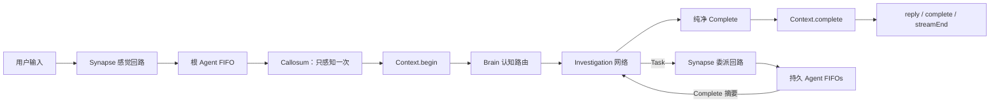

# Flyflor

Flyflor 是一个使用 Bun 与 TypeScript 构建的无 Session 智能生命体内核。它持续存在：Socket 重连或浏览器刷新不会重新创建它的 Context 或人物。

它的生物学词汇是架构本体，而不是装饰：

- `Synapse` 是 singleton 大脑皮层，负责路由神经信号并协调持续存在的人物；
- `Context` 是所有 Turn 的 singleton 唯一所有者；
- 每个 `Agent` 都是一个持续存在、拥有隔离 IOC scope 的人；
- 每个人独享一个 `Brain`、`Callosum`、`Investigation`、`Identity` 与有界 `Memory`；
- `Tools` 直接执行具体动作，不把工具执行伪装成神经信号。

## 快速开始

```bash
bun install
printf 'DEEPSEEK_API_KEY=...\n' > .env
bun run dev
bun run client
```

`bun run dev` 启动 [src/bootstrap.ts](src/bootstrap.ts)。Bun 自动加载已忽略的 `.env`；入口先加载 decorator metadata，再调用 `Factory.create(AppModule)`。依赖图只有在 `@Init` 完成生命周期连接后才可用。

`bun run client` 在 `http://127.0.0.1:17878` 提供浏览器客户端。Bridge 保持内核长度前缀 IPC 边界并转发严格 JSON action。UI 处理 `open`、有序 `agent` chunks、`ask`、`confirm`、`pause`、`resume`、纯净 `complete`、`streamEnd`、连接关闭与 transport error。未知或非法 packet 会抛错，不会被显示成成功响应。

完成内核变更前运行全部健康门：

```bash
bun run check
bun test
bun run build:binary
```

要验收真实配置 provider 而不是 mock，运行：

```bash
bun run test:live
```

Live suite 会启动真实 AppModule、Unix socket、WebSocket bridge、持久 Agent pool，以及 `.config/config.jsonc` 中配置的 model/provider。它覆盖直接 reply、filesystem read、Ask、拒绝 Confirm、批准 filesystem write、Shell、Execute、双人物 Task 委派、重连记忆连续性，以及使用一次性 identity package 的 Soul 更新。该套件生成的文件和日志全部位于临时目录，结束后删除。命令会产生真实 API 调用；credential、model、protocol、signal、tool result 或 cleanup 任一错误都会使测试失败。

## 神经链路



Ask 与 Confirm 共用串行交互回路；Task 使用独立委派回路；Reply 与 Complete 使用有序表达回路。因此委派任务等待其他人物时，用户交互仍可继续，不会死锁。

## Runtime 契约

- Turn 只能在 `src/agent/context` 下创建和修改，且永不导出。
- Memory 只包含一个人的有限笔记，不保存 Turn、provider messages 或 session state。
- Complete 是最终调查摘要，Context 直接保存，不进行第二次结算模型调用。
- 根刺激与委派刺激都进入接收人物的 FIFO；同一人物串行思考，不同人物可以并行调查。
- 被委派人物看不到 Task 工具，从而禁止递归委派。
- Ask 与 Confirm 等待精确关联的回答；被拒绝的 Confirm 是明确的未执行结果。
- Filesystem、Shell、Execute 是直接动作；抛出的失败原样 reject。
- PromptService 是唯一 prompt package 与 XML 渲染边界。
- 每个 provider 名称只映射一个协议和一个 endpoint convention，不存在协议或 endpoint 兜底。
- CatchClause、`.catch()`、rejection fallback、公开 Turn 与直接构造应用 class 都是静态违规。
- 仓库内 live suite 使用真实配置的 `deepseek` provider，当前目标模型为 `deepseek-v4-flash`；它不替代确定性 unit tests。

## 源码布局

```text
src/
  bootstrap.ts  metadata-first 进程入口
  app.ts        AppModule 组合根
  core/         IOC、Observable、基础类、日志
  config/       严格 runtime 配置
  prompt/       prompt package 与安全 XML 渲染
  model/        模型边界与协议适配器
  agent/        人物、认知、Context、私有 Memory
  neural/       Synapse 皮层回路与 Agent pool
  tool/         具体工具与审批策略
  transport/    socket、packet、controller
scripts/
  live.script.ts  真实 provider 与 Web/IPC 端到端验收
web/
  client.ts      严格 HTTP/WebSocket-to-IPC bridge
  client.html    浏览器交互与表达客户端
```

所有权和信号细节见 [docs/architecture.zh.cn.md](docs/architecture.zh.cn.md)。工程红线见 [AGENTS.zh.cn.md](AGENTS.zh.cn.md)。
