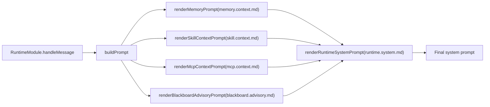
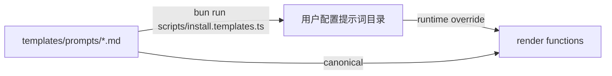

# Flyflor

Flyflor 是面向单二进制交付的 Bun + TypeScript 智能生命体内核。它不是 chat/session agent：Mindstream 是流体智力，`MemoryComponent` 是热记忆，`CrystalComponent` 是晶体智力，显式 `Scope` 与 `ContextFork` 是可固化工作域，ASK 是不确定性、结晶和长线 loop 的闭环器官。

官方主页：[https://flyflor.qingshen.xin](https://flyflor.qingshen.xin)

英文入口：[README.md](README.md)。

## 当前契约

- 上下文装配是 `Memory + Crystal + explicit Scope/Fork + Executive visible capability surface`，再加当前输入。
- `brain.db` 是按月生命账本，只负责 ledger/query/replay/audit/detail。它不是 session store、prompt 容器或隐式连续性 owner。
- `clientId`、`conversationKey`、`threadId`、connection metadata 和 transport actor data 只停留在 routing/audit/dedup/reply anchor 边界。
- HTTP surface 固定为 `/ws` 与 `/health`。`gateway.*` 名称只是 `flyflor.ws.v1` wire compatibility，不代表架构主语。
- 工具、MCP、插件、skill、用户工具、sidecar 和 subagent 都通过 Executive 外骨骼进入，保留 sandbox、approval、quota、audit 和 event。
- 业务语义判断只能由结构化模型输出、专用 JSON 提示词模板或数值资源指标驱动，不能做关键词匹配。

## 源码地图

| 层 | 路径 | 职责 |
| --- | --- | --- |
| 入口 | `app.ts` | 薄模式分派。 |
| 装配 | `src/app.ts` | 显式依赖绑定和启动。 |
| 认知层 | `src/cognitive` | Mindstream、Hippocampus Memory、Scope、ContextFork、ASK 与 Crystal/Gem 闭环。 |
| 执行层 | `src/executive` | capability registry、tool descriptor、trust policy、loop guard 和 external sidecar 契约。 |
| Agent 层 | `src/agent` | runtime turn 主链、Blackboard、context assembly、sandbox、prompts、skills、MCP、plugin 和 worker。 |
| Socket 层 | `src/socket` | `/ws`、`/health`、live turn、control/event transport 和 ledger read snapshot。 |
| 事件层 | `src/events` | Runtime event fabric 与 fan-out。 |
| 协议层 | `src/protocol` | 可 JSON 序列化 contract、enum、control envelope 和结构化模型块。 |
| 实体层 | `src/entities` | SQLite row mapping、repo 和 schema owner。 |
| 配置/模板 | `src/config`, `templates` | JSONC 配置、默认值、提示词模板和项目/记忆模板。 |

## 文档

- [docs/README.zh.cn.md](docs/README.zh.cn.md) - 文档阅读顺序与归档规则。
- [docs/architecture.zh.cn.md](docs/architecture.zh.cn.md) - 项目哲学、context/ledger 分层和源码目录地图。
- [docs/directory.architecture.zh.cn.md](docs/directory.architecture.zh.cn.md) - owner 边界与命名规则。
- [docs/runtime.turn.zh.cn.md](docs/runtime.turn.zh.cn.md) - 单轮 runtime 主链。
- [docs/memory.system.zh.cn.md](docs/memory.system.zh.cn.md) - Memory、Crystal、Scope、ContextFork、召回与 `brain.db`。
- [docs/blackboard.zh.cn.md](docs/blackboard.zh.cn.md) - Blackboard 路由与 ASK 交还。
- [docs/crystal.reflection.zh.cn.md](docs/crystal.reflection.zh.cn.md) - Crystal reflection 与 Gem 升格。
- [docs/executive.exoskeleton.zh.cn.md](docs/executive.exoskeleton.zh.cn.md) - Capability / Tool / Trust / Loop。
- [docs/control.protocol.zh.cn.md](docs/control.protocol.zh.cn.md) - `/ws` control envelope 与 snapshot matrix。
- [docs/ws.doc.zh.cn.md](docs/ws.doc.zh.cn.md) - WebSocket 字段级手册。
- [docs/runtime.events.zh.cn.md](docs/runtime.events.zh.cn.md) - event class、timeline 与 socket subscription。
- [docs/development.workflow.zh.cn.md](docs/development.workflow.zh.cn.md) - worktree/tmux/Codex 协作流程。
- [docs/project.report.zh.cn.md](docs/project.report.zh.cn.md) - 当前架构报告。
- [docs/boundaries.zh.cn.md](docs/boundaries.zh.cn.md) - 工程硬边界。
- [docs/refactor.roadmap.zh.cn.md](docs/refactor.roadmap.zh.cn.md) - Bun 内核封板路线。
- [docs/openapi/flyflor.socket.openapi.zh.cn.md](docs/openapi/flyflor.socket.openapi.zh.cn.md) - Apifox 可导入 socket 契约。
- [docs/external.kit.zh.cn.md](docs/external.kit.zh.cn.md) - External kit 发现契约。
- [docs/external.tools.seal.zh.cn.md](docs/external.tools.seal.zh.cn.md) - 外挂工具封板矩阵。
- [docs/mcp.tools.zh.cn.md](docs/mcp.tools.zh.cn.md) - MCP transport 与工具面。
- [docs/sandbox.capabilities.zh.cn.md](docs/sandbox.capabilities.zh.cn.md) - sandbox 与 approval 边界。
- [docs/skill.system.zh.cn.md](docs/skill.system.zh.cn.md) - 外部 `SKILL.md` 能力包。
- [docs/old-docs/rust.integration.zh.cn.md](docs/old-docs/rust.integration.zh.cn.md)、[docs/old-docs/rust.connection.core.zh.cn.md](docs/old-docs/rust.connection.core.zh.cn.md) 和 [docs/old-docs/rust.gateway.shell.backlog.zh.cn.md](docs/old-docs/rust.gateway.shell.backlog.zh.cn.md) 是未来独立 Rust shell 的归档参考，不是当前 Bun kernel 实现计划。

## 运行

```bash
bun install
bun run install:templates
bun run chat
bun run socket
```

Socket 模式暴露：

- `GET /health`
- `GET /ws`

Gateway 命令别名仅为 v1 compatibility 保留：

```bash
bun run gateway
bun run gateway:dev
```

## 验证

```bash
bun run docs:check
bun run check
bun run test:kernel
bun run build:binary
```

`bun run kernel:seal` 是完整 Bun kernel seal；missing live provider is a failure for that bar。

<!-- flyflor:prompt-templates:start -->
# 提示词模板系统

## 一句话摘要

所有面向模型的指令都放在 `templates/prompts/`，按主题分组；运行时只把 canonical `*.md` 当作模板。

## 相关路径

- `src/agent/prompts/index.ts` - 所有渲染入口
- `src/agent/prompts/template.manifest.ts` - 模板包版本与文件契约
- `src/agent/prompts/template.docs.ts` - 文档渲染器
- `templates/prompts/` - 内置运行时模板
- `templates/prompts/docs/` - 文档渲染模板，不是运行时 prompt
- `scripts/install.templates.ts` - 安装到配置目录
- 用户配置提示词目录 - 可选覆盖目录

## 模板包版本

2

## 模板目录

| 键 | 文件 | 调用点 | 必需占位符 |
|---|---|---|---|
| `askSchema` | `ask.schema.md` | `renderAskSchemaInstructions` | — |
| `behaviorPriority` | `behavior.priority.md` | `renderBehaviorPriorityInstructions` | — |
| `blackboardAdvisory` | `blackboard.advisory.md` | `renderBlackboardAdvisoryPrompt` | `compactRounds` / `elapsedMs` / `reason` / `status` / `turnId` |
| `blackboardDecision` | `blackboard.decision.md` | `BlackboardModule.returnDecisionToUser` | `questionCount` / `reason` / `unresolvedIssues` |
| `blackboardRoute` | `blackboard.route.md` | `decideBlackboardRoute` | `request` |
| `blackboardWorkerEnvelope` | `blackboard.worker.envelope.md` | `renderBlackboardWorkerEnvelope` | `contractJson` / `convergencePolicyJson` / `currentRoundStepsJson` / `discussionPlanJson` / `goalJson` / `minRoundsJson` / `participantJson` / `phaseJson` / `previousStepsJson` / `roundJson` |
| `blackboardWorkerSystem` | `blackboard.worker.system.md` | `renderBlackboardWorkerSystemPrompt` | `participant` |
| `crystalReflection` | `crystal.reflection.md` | `ReflectionWorker.dispatch` | `evidence` |
| `feedbackClassify` | `feedback.classify.md` | `classifyAndApplyFeedback` | `currentUserText` / `previousAssistantText` |
| `memoryAction` | `memory.action.md` | `renderMemoryActionInstructions` | — |
| `memoryConsolidation` | `memory.consolidation.md` | `ConsolidationWorker` | `episode` |
| `memoryHotCompress` | `memory.hot.compress.md` | `HotMemoryCompressionWorker` | `episodes` |
| `memoryContext` | `memory.context.md` | `renderMemoryPrompt` | `hippocampus` / `markdownContent` / `retrievedResults` / `scopeMemory` |
| `memoryDream` | `memory.dream.md` | `DreamWorker` | `candidates` / `ownerKey` |
| `memoryWorkContextOffer` | `memory.scope.offer.md` | `renderWorkContextOfferPrompt` | `evidenceScore` / `relatedCount` / `remainingTurns` / `title` |
| `memorySkillOffer` | `memory.skill.offer.md` | `renderSkillOfferPrompt` | `confidence` / `name` / `remainingTurns` / `support` / `tools` |
| `mcpContext` | `mcp.context.md` | `renderMcpContextPrompt` | `mcpEntries` |
| `mcpToolBudgetExhausted` | `mcp.tool.budget.exhausted.md` | `renderMcpToolBudgetExhaustedPrompt` | — |
| `runtimeAskContinuation` | `runtime.ask.continuation.md` | `renderRuntimeAskContinuationPrompt` | `chainDepth` / `choices` / `prompt` / `reason` |
| `runtimeIdleResume` | `runtime.idle.resume.md` | `renderRuntimeIdleResumePrompt` | `idleBucket` |
| `runtimeEqContext` | `runtime.eq.context.md` | `renderRuntimeEqContextPrompt` | `ageBucket` / `arousal` / `confidence` / `directive` / `dominance` / `label` / `valence` |
| `runtimeContinuationHint` | `runtime.continuation.hint.md` | `renderRuntimeContinuationHintPrompt` | `continuationEntries` |
| `runtimeIdentityContext` | `runtime.identity.context.md` | `renderRuntimeIdentityContextPrompt` | `identityEntries` |
| `runtimeSystem` | `runtime.system.md` | `renderRuntimeSystemPrompt` | `askSchemaInstructions` / `behaviorPriorityInstructions` / `blackboardContext` / `mcpContext` / `memoryActionInstructions` / `memoryContext` / `sandboxSummary` / `skillContext` |
| `skillContext` | `skill.context.md` | `renderSkillContextPrompt` | `skillEntries` |

## 装配流程



## 安装流程



- 用户目录中的同名文件会覆盖内置模板；安装脚本会同步模板包和 manifest。
- 运行时只加载 canonical `.md` 模板文件。
- `*.zh.cn.md` 是仅供审查的中文副本，会随安装脚本同步，但不会进入运行时模板包、manifest 或 lint 契约。
- `templates/prompts/docs/*.md` 是文档渲染模板，不会作为运行时 prompt 安装。

## 数据契约

每个模板都必须保证：

1. 模型按 schema 输出结构化 JSON 片段，代码只校验 shape、枚举和值域。
2. 面向模板的枚举值来自 `src/protocol/contracts/enums.ts`；新增枚举必须先加到那里，再更新模板。
3. 模板不能允许模型发明未声明字段；多余字段一律丢弃。

## 面向提示词的枚举

- `MemoryActionTarget`: `memory` / `self` / `identity` / `user`
- `MemoryKind`: `candidate` / `conversation-turn` / `fact` / `gem` / `history` / `profile` / `rule` / `skill` / `summary`
- `MarkdownMemoryFile`: `MEMORY.md` / `SELF.md` / `IDENTITY.md` / `USER.md`
- `AskReason`: `codename-ambiguity` / `codename-create` / `user-intent-unclear` / `blackboard-stalemate` / `policy-decision` / `other`
- `ContinuationContextReason`: `ask` / `tool-failure` / `blackboard-cap` / `process-restart`
- `ContinuationDecisionKind`: `resume` / `fork` / `fresh`
- `EqLabel`: `neutral` / `joy` / `anger` / `sadness` / `fear` / `surprise`

## 模型可读性

运行时注入的模板只能包含模型可以直接执行的指令：何时使用、输出什么结构、字段含义、如何解决冲突。内部路线 id、TODO id、阶段名和工程隐喻不得出现在运行时提示词中。

内部标识可以保留在归档计划文档、设计文档、代码注释和测试名里；面向模型的模板必须翻译成普通来源标签和行为描述。

## 发布检查

- 模板 lint 会检查必需文件、非空内容、必需占位符、未知 prompt 文件、模板包 manifest 版本和模板目录。
- 运行时 prompt 正文不能暴露内部路线 id 或未解释的工程隐喻。
- `*.zh.cn.md` 不参与运行时装配或 manifest 对比；它们只用于人工审查和审计。
- `template.docs.ts` 读取这个 Markdown 模板，只替换模板包版本和枚举快照等机器值。
- 运行时只装配 canonical `.md` 文件。

## 相关测试

- `tests/prompt.lint.test.ts`
- `tests/prompt.templates.docs.test.ts`
- `tests/blackboard.boundaries.test.ts`
- `tests/eq.prompt.test.ts`
- `tests/ask.parse.test.ts`
<!-- flyflor:prompt-templates:end -->
