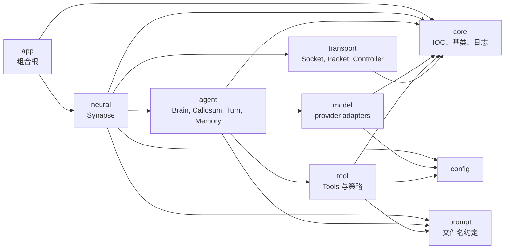
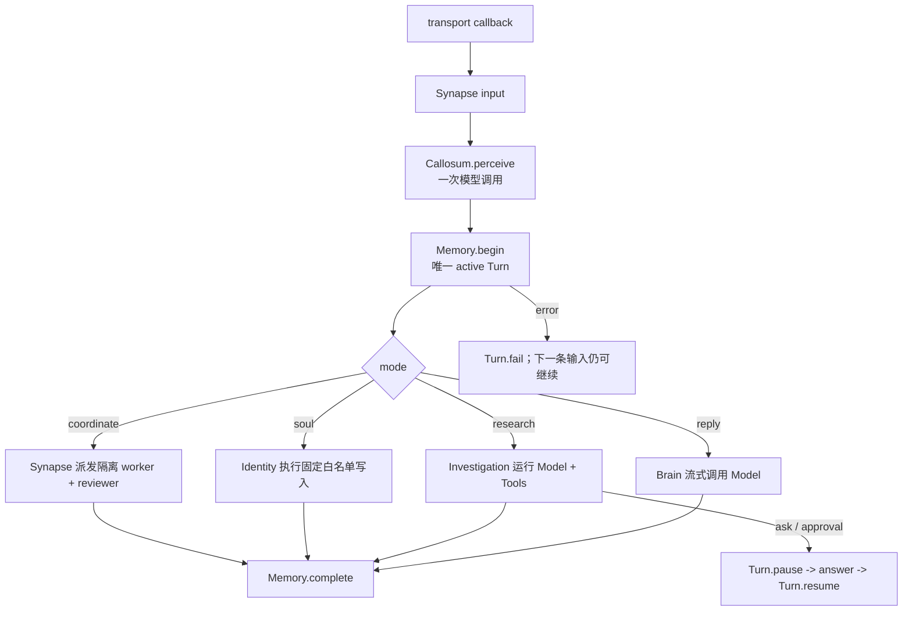

# Flyflor

Flyflor 是一个 Bun + TypeScript 生命体内核。领域语言直接表达认知：Synapse 负责协调，Brain 持有认知，Callosum 感知意图，Memory 持有 Turn，Identity 持有长期记录。技术设施使用直接工程命名，例如 Model、Tools、Transport、Packet 和 Controller。

## 快速开始

```bash
bun install
export DEEPSEEK_API_KEY=...
bun run dev
bun run client
```

`bun run dev` 启动 `src/app/bootstrap.ts` 并打开配置中的 IPC socket。`bun run client` 在 `http://127.0.0.1:17878` 启动浏览器桥。

认为改动完成前，运行健康门槛：

```bash
bun run check
bun test
bun run build:binary
```

## 架构



强制业务依赖为 `app -> neural -> agent -> model/tool`，并保留 `neural -> transport`。`core`、`config`、`prompt` 提供共享设施。`bun run check` 会拒绝非法源码根目录、多单词目录、反向依赖、承载行为的 `index.ts`，以及绕过 IOC 构造应用 class。

## 一次 Turn



`Turn` 是唯一会话实体，持有输入、感知、状态、回答、证据、交互状态和时间戳。`Memory` 是 Turn 的唯一所有者，并把最近四个完成 Turn 作为连续上下文。Worker 只接收 `Assignment` 并返回 `Outcome`，不共享 active Turn。

## 运行时契约

- IOC 是应用 class 的唯一构造路径，保留 singleton 缓存、scope 构造参数、property injection 和 `@Init` 生命周期。
- Decorator 只保留 `Module`、`Provide`、`Singleton`、`Inject`、`Scope`、`Init`、`Config`、`Prompt`。
- `Model` 暴露 `Message`、`ToolCall`、`ModelResult`、`StreamEvent`。Provider endpoint、auth、path 和 wire parser 都是 `src/model/protocol` 内的协议约定。
- OpenAI-compatible provider 复用同一个 adapter。继续支持 OpenAI Responses、Anthropic、Gemini、Bedrock、Cohere、Ollama、DeepSeek、Hugging Face、vLLM、LM Studio 路径。
- `Tools` 显式持有 `ask`、`filesystem`、`shell`、`execute`。每个工具自己持有 schema、描述 prompt、cwd 约定和审批决策。风险调用仍使用 `confirm` 交互 action，但不存在 standalone confirm tool。
- Canonical prompt 是按目录和文件名加载的英文 `.md`。`.zh.cn.md` 只供人类参考，运行时绝不读取。
- IPC packet 仍是 8-byte unsigned big-endian body length 加 UTF-8 JSON body。Transport 通过 callback 上报输入，不 import Synapse。

## 源码布局

```text
src/
  app/          组合根
  core/         IOC、基类、日志
  config/       运行时配置
  prompt/       约定式 prompt 加载
  model/        模型边界和协议 adapter
  agent/        认知与 Turn 所有权
  neural/       Synapse 协调
  tool/         工具和审批策略
  transport/    socket、packet、controller
```

所有目录名都是单个小写英文单词。`index.ts` 只能做 barrel。配置位于 `.config/config.jsonc`，secret 位于环境变量。

所有权、生命周期、协议和兼容性细节见 [docs/architecture.zh.cn.md](docs/architecture.zh.cn.md)。项目红线见 [AGENTS.zh.cn.md](AGENTS.zh.cn.md)。
