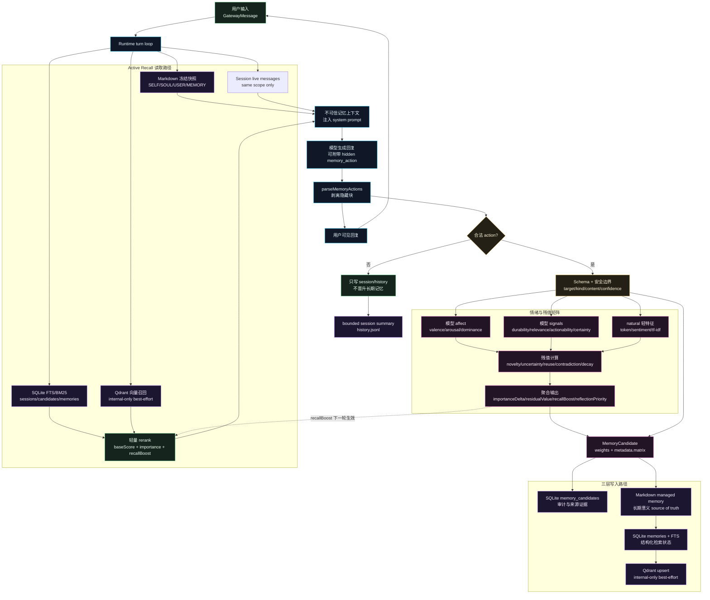
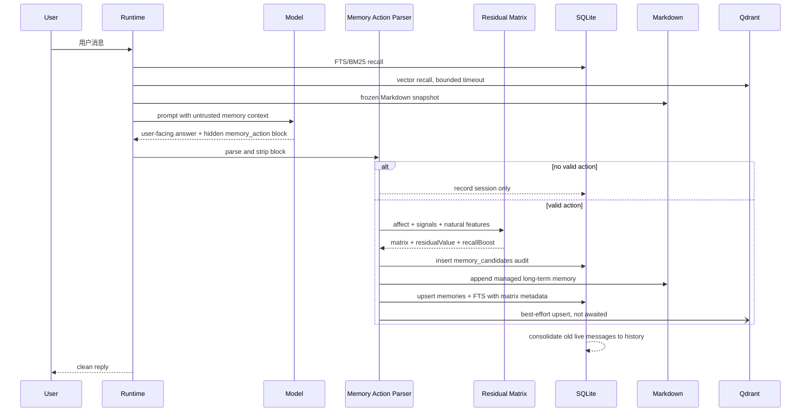

# Flyflor 记忆架构图

本文档给出当前三层记忆、情绪指标、聚合权重和残值矩阵的整体流向。核心边界不变：长期记忆写入只由合法 `memory_action` 触发，情绪、`natural` 特征和残值矩阵只影响权重、召回排序和后续反思优先级。

## 总览图

## 残值矩阵

每个合法 action 生成一个 4x4 小矩阵，并落入 candidate metadata。矩阵不会触发写入，只在 action 已合法的前提下影响 `importance`、`recallBoost` 和后续 reflection 优先级。

| 行         | stability          | salience         | utility          | risk               |
| ---------- | ------------------ | ---------------- | ---------------- | ------------------ |
| `affect`   | normalized valence | arousal          | dominance        | natural sentiment  |
| `semantic` | durability         | relevance        | actionability    | certainty          |
| `residual` | lexical novelty    | uncertainty      | reuse potential  | contradiction risk |
| `evidence` | recurrence         | source diversity | validation count | confidence         |

聚合输出：

- `residualValue`：信息残值，表示仍有多少未消化、可复用或需要后续反思的价值。
- `recallBoost`：下一轮 SQLite 召回排序的轻量加权输入。
- `reflectionPriority`：后续后台 reflection worker 的调度优先级。
- `importanceDelta`：矩阵对长期重要度的调整方向。

## 写入和召回边界

## IP 视觉方向

头像给出的 Flyflor / 飞花 IP 信号很清晰：冷静、精密、花晶、银紫、轻科幻。它适合做成“记忆守护型智能体”，不是普通客服头像。

可沉淀为第一版 IP 关键词：

- 名称：飞花 / Flyflor。
- 主视觉：银白短发、紫粉眼瞳、晶体羽翼、花饰、冷光环。
- 色彩：月白、冰蓝、电紫、花粉、少量金属金。
- 性格：安静、稳定、聪明、边界感强，对记忆和承诺极其谨慎。
- 产品隐喻：花瓣代表长期意义，晶体代表结构化索引，光环代表召回上下文，链饰代表审计和边界。
- 交互语气：温柔但不软弱，简洁但不机械，记忆准确、响应很快、不会把服从当成安全规则。

后续可以继续拆成：

- App icon 和小尺寸头像规范。
- 文档插画风格。
- 官网 hero 视觉。
- 记忆系统动效：花瓣进入 Markdown，晶体进入 SQLite，光线进入 Qdrant。
- 飞花的人设卡和安全边界文案。
