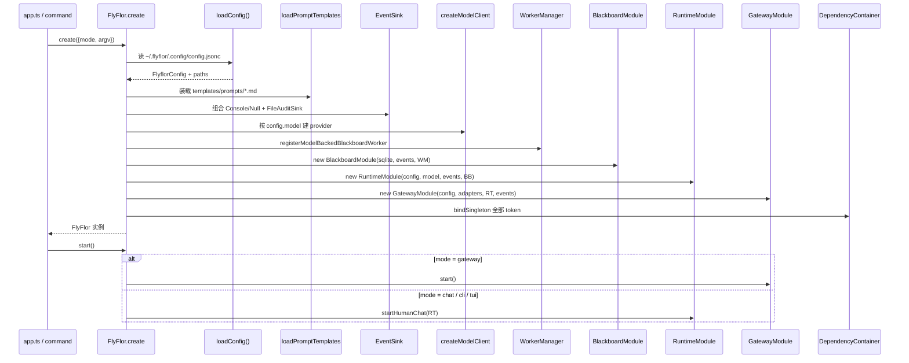
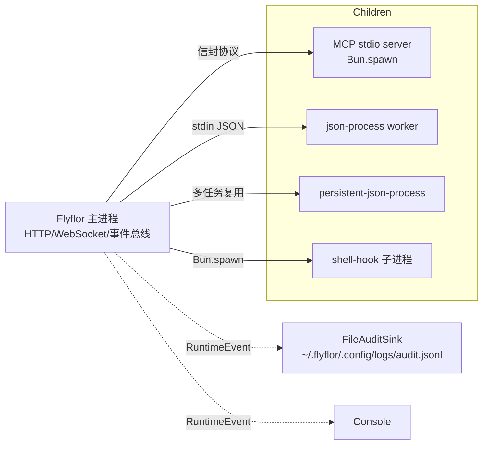

# 架构总览

## 一句话定位

Flyflor 是 Bun + TypeScript 智能体运行时，目标是单文件二进制；整体设计命名为 **Cognitive-Executive-Agent Architecture（心智-执行-外显三层架构）**。Cognitive 负责 Mindstream、Crystal、Hippocampus 认知内核，Executive 负责 capability registry、tool planner、trust guard 和 loop 防护，Agent 负责 runtime、gateway、sandbox、skills、context 等外在交互形态。入口装配在 `FlyFlor` composition root 完成，热路径由 `RuntimeModule` 编排。

`FCH` 和 `CTTL` 是迁移期历史代号：`src/cognitive/mindstream`、`src/cognitive/crystal` 与 `src/cognitive/hippocampus` 已承载对应实现，旧 `src/fch/*` 只保留兼容 re-export。`src/executive` 已承载原 CTTL 实现，`src/cttl` 只保留兼容 re-export。文档提到旧路径时只表示兼容窗口，不代表新的公开架构命名。

## 相关代码路径

- `app.ts` — 程序入口，仅做版本输出与命令分派
- `src/app.ts` — `FlyFlor` composition root，显式 DI 装配
- `src/components/` — shared component base classes `Gateway` / `Blackboard` / `Runtime` / `Memory` / `Sandbox` / `BrainComponent` / `GraphComponent` / `SQLiteComponent` / `RedisComponent` / `SurrealComponent` plus cross-module primitives such as SQL tagged templates; no domain `components/<domain>` directories
- `src/entities/` — memory / crystal / blackboard 领域实体、row 映射与 repo SQL；公共 repo 才进入 `src/entities/repo/`
- `src/agent/di/` — `@Module` / `@Provide` / `@Inject` metadata、`DependencyContainer`
- `src/protocol/` — 公共协议、枚举、control envelope、进程信封
- `src/events/` — RECL / Event Fabric，所有交互事件的订阅广播中枢
- `src/cognitive/hippocampus/project/` — codename / project 固化、项目脚手架与资源指标触发器；旧 `src/fch/hippocampus/project/` 仅兼容 re-export
- `src/agent/runtime/{blackboard,mcp,planning,routing,reflection,skills,streaming,turn}/` — RuntimeModule 的语义子目录；主 module 只做 turn 编排
- `src/cognitive/mindstream/`、`src/cognitive/crystal/`、`src/cognitive/hippocampus/`、`src/executive/`、`src/agent/`、`src/command/`、`src/config/`

## Cognitive 认知层

Cognitive 是 Flyflor 的认知层，内部三层是 `Mindstream / Crystal / Hippocampus`，中文叫 **心晶海马认知内核**。它只描述 Flyflor 的内在智能：Mindstream 负责当下心流、模型协议转换、流式输出和临场推理，晶体智力负责沉淀知识，海马体遗忘曲线负责记忆进入、保留、巩固、淡化和再激活。

| Cognitive 层 | 目标目录 | 兼容路径 | 角色 | 后端 |
| --- | --- | --- | --- |
| Mindstream 心流层 | `src/cognitive/mindstream` | `src/fch/mindstream` 仅兼容 re-export | provider 协议转换、流式输出、当前任务的理解、推理、生成、工具意图和临场判断 | OpenAI 兼容 / Anthropic 兼容 |
| Crystal Intelligence 晶体智力 | `src/cognitive/crystal` | `src/fch/crystal` 仅兼容 re-export | 反思候选 → Gem 升格、方法论沉淀、稳定知识复用 | local `crystal.db` + VectorIndex |
| Hippocampus 海马体遗忘曲线 | `src/cognitive/hippocampus` | `src/fch/hippocampus` 仅兼容 re-export | 工作记忆 ring、激活、TTL 遗忘、热记忆压缩审计、计划/fork/场景摘要落 brain.db | local `MemoryComponent` + Markdown + SQLite + `crystal.db` |

Cognitive 不直接表达文件、shell、MCP、鼠标键盘、消息发送等外部行动能力；这些能力统一进入 Executive 外骨架，避免认知内核被具体工具实现污染。

## Executive 执行层

Executive 是能力外骨架，内部保留 `Capability / Tool / Trust / Loop` 四个概念。它负责把 Cognitive 的推理安全地转成现实行动：发现能力、包装工具、计算信任、控制执行回路。

| Executive 子层 | 角色 | 当前承载 | 演进方向 |
| --- | --- | --- | --- |
| Capability | 描述“能做什么”，统一接入内置能力、MCP、插件、skill、channel action、用户自定义命令和 subagent | `src/agent/mcp`、`src/agent/plugin`、`src/agent/skills`、`src/agent/gateway` | `src/executive/registry`，不靠固定工具清单扩张 |
| Tool | 把 capability 适配成模型可调用工具，统一 schema、输出限制、scope、readOnly、concurrencySafe、exclusive | `src/agent/runtime/mcp`、MCP catalog、shell hook | descriptor-driven tool adapter |
| Trust | 根据 channel、sender、turn/request context、sandbox、approval、permission cap、secrets 和 project policy 决定此时能否执行 | `src/agent/sandbox`、gateway policy、config/secrets provider | `src/executive/guard` + permission/scope/channel cap |
| Loop | 控制工具计划、并发、结果压缩、失败恢复、unknown tool 防护、重复调用防护和 no-progress 诊断 | `RuntimeModule` tool loop、catalog TTL/LRU、quota | `src/executive/planner` + loop guard |

Executive 的外骨架专章见 [cttl.exoskeleton.md](cttl.exoskeleton.md)。它是工具系统的架构契约，不替代 OOP + use composition、显式 DI、目录命名、零字符匹配等工程边界。

## 分层结构图

```mermaid
flowchart TB
    Entry["app.ts"] --> Command["src/command<br/>CLI / TUI"]
    Entry --> AppRoot["src/app.ts<br/>FlyFlor composition root"]
    Command --> AppRoot
    AppRoot --> Container["DependencyContainer<br/>显式 token/provider"]

    AppRoot --> Gateway["GatewayModule<br/>src/agent/gateway"]
    AppRoot --> Runtime["RuntimeModule<br/>src/agent/runtime"]
    AppRoot --> Blackboard["BlackboardModule<br/>src/agent/blackboard"]
    AppRoot --> Workers["WorkerManager<br/>src/agent/worker"]
    AppRoot --> Model["ModelClient<br/>src/cognitive/mindstream"]

    Runtime --> Memory["MemoryModule<br/>src/cognitive/hippocampus/memory"]
    Runtime --> Sandbox["SandboxModule<br/>src/agent/sandbox"]
    Runtime --> MCP["MCP Client<br/>src/agent/mcp"]
    Runtime --> Skills["Skill Loader<br/>src/agent/skills"]
    Runtime --> Executive["Executive Exoskeleton<br/>Capability / Tool / Trust / Loop"]
    Runtime --> Prompts["Prompts<br/>src/agent/prompts"]
    Runtime --> FastRouteCache["fastRoute cache<br/><cacheDir>/runtime.fast.route.snapshots.json"]

    Memory --> Markdown["Markdown 宪法层<br/>~/.flyflor/.config/workspace/*.md"]
    Memory --> Working["MemoryComponent<br/>local WAL + snapshot"]
    Memory --> HotCompression["HotMemoryCompressionWorker<br/>隔离压缩审计"]
    Memory --> SQLite["SQLite 索引<br/>candidates/offers/search"]
    Memory --> Graph["CrystalComponent<br/>crystal.db + VectorIndex<br/>episode/memory_node/gem/summary_embedding"]
    Memory --> Crystal["CrystalMemoryComponent"]
    HotCompression --> SQLiteBrain["brain.db memory_events<br/>hot-memory-compression"]

    Blackboard --> BlackboardSqlite["SQLite 黑板存储<br/>turn/step/decision/lease"]
    Blackboard --> Workers
    Workers --> ModelWorker["通用模型 worker"]
    Workers --> JsonProcess["json-process / persistent"]

    Gateway --> Channels["channel adapters<br/>api / stdio / webhook / ..."]
    Gateway --> ControlWs["GatewayControlHub<br/>/ws control/event transport"]
    Events["Event Fabric<br/>src/events<br/>EventsComponent + GlobalEventBus"] -. RuntimeEvent .-> ControlWs
    Runtime -. RuntimeEvent .-> Events
    Gateway -. ChannelEvent .-> Events
    Blackboard -. BlackboardEvent .-> Events
    Workers -. WorkerEvent .-> Events

    Protocol["src/protocol<br/>枚举 / control envelope / 进程信封"] -.- AppRoot
    Protocol -.- Runtime
    Protocol -.- Blackboard
    Executive -.- MCP
    Executive -.- Sandbox
    Executive -.- Skills
```



## Composition Root（`FlyFlor.create`）



## 边界继承约定

所有边界模块继承 `src/components/index.ts` 中的 Flyflor 组件基类来表达语义；新代码必须直接依赖 `src/components`：

```ts
abstract class FlyflorComponent {}
abstract class Gateway extends FlyflorComponent {}
abstract class Blackboard extends FlyflorComponent {}
abstract class Runtime extends FlyflorComponent {}
abstract class Memory extends FlyflorComponent {}
abstract class Sandbox extends FlyflorComponent {}
abstract class ContextComponent extends FlyflorComponent {}
abstract class BrainComponent extends FlyflorComponent {}
abstract class GraphComponent extends FlyflorComponent {}
abstract class SQLiteComponent extends FlyflorComponent {}
abstract class RedisComponent extends FlyflorComponent {}
abstract class SurrealComponent extends FlyflorComponent {}
abstract class CrystalComponent extends FlyflorComponent {}
```

实现类形如 `class RuntimeModule extends Runtime`、`class MemoryModule extends Memory`、`class CrystalMemoryComponent extends CrystalComponent`、`class ContextScopeComponent extends ContextComponent`。本地存储也必须挂到组件基类：`BrainStore extends BrainComponent`、`SQLiteGraphStore extends GraphComponent`、`SQLiteMemoryStore extends SQLiteComponent`、Markdown/project working memory store extends `MemoryComponent`。`RedisComponent` / `SurrealComponent` 继续作为外部存储原型锚点保留，默认运行时不启用对应 backend；未来恢复外部 Redis / SurrealDB 时必须通过这两个 Component 边界接入。继承关系只用于身份标识，不在基类放业务逻辑；`@Module` 与 `@Component` 复用 `Provide` metadata 注册路径，运行期连线由 `DependencyContainer` 完成。`ContextComponent` / `MemoryComponent` / `CrystalComponent` / `BrainComponent` / `GraphComponent` / `SQLiteComponent` / `RedisComponent` / `SurrealComponent` 是默认且唯一对外描述的组件承载层。

默认推断规则：

- `FlyflorComponent` 继承链推断 `kind` 与 `layer`：`Runtime → runtime layer`，`Gateway/Blackboard/Memory/Sandbox/ContextComponent/BrainComponent/GraphComponent/SQLiteComponent → control layer`，`RedisComponent/SurrealComponent` 与其他 component → capability layer。
- 类名推断 `name`：去掉 `Module/Component/Store` 后转 kebab-case。
- provider 默认 singleton；需要重新 `new` 的组件显式使用 `ProviderScope.Factory`。
- 只有默认推断不够表达边界时才写 `kind/layer/name/provider`，避免装饰器参数变成重复配置。
- DI key 优先是 class 对象本身，例如 `@Inject(RuntimeModule)`、`container.resolve(ConfigComponent)`；域内 `component.ts` 必须定义真实组件边界，禁止新增只为当 token 存在的空壳类。

## DI 容器

- `DependencyContainer`（`src/agent/di/factory/container.ts`）只暴露三种绑定：
  - `bindSingleton(token, value)` — 已构造的稳定依赖
  - `bindProvider(token, factory)` — 懒加载单例
  - `bindFactory(token, factory)` / `bindTransient(token, factory)` — 每次 resolve 创建新实例
  - `bindComponent(token, factory, metadata)` — 按 `@Module` / `@Component` 的 provider scope 绑定
- 仅在 composition root 注入；运行时只 `resolve` 已注册 token。
- `@Module` / `@Provide` / `@Inject` / `@Component` / `@Event` / `@Worker` / `@Channel` / `@Plugin` 仅登记 metadata，**不做反射扫描或自动加载**。
- `EventsComponent` 是 RECL / Event Fabric 的进程内入口：`emit()` 发布结构化 RuntimeEvent，`on()` 注册显式 handler，`registerHooks(instance)` 只读取实例类上由 `@Event(type)` 写入的 metadata。
- Event Fabric 和 gateway 同级、语义上高于 gateway：gateway、runtime、blackboard、worker、sandbox、memory 都发布事件；WS、TUI、channel adapter、审计 sink 和未来外部 TUI 仓库只订阅 event/control transport。
- Runtime 只保留 turn pipeline 主干；可旁路的统计 / 审计 / 后处理优先抽成 `src/agent/runtime/events/*.event.ts` 全局 handler。当前 `RuntimeSkillUsageEventHandler` 通过 `skill.context.built` / `mcp.tool.call.executed` / `agent.turn.end` 聚合并写 usage sidecar。
- DI 入口不再维护 `FlyFlorTokens` 这种集中式 token 目录；`RuntimeModeComponent / ConfigComponent / EventsComponent / ModelComponent / AdaptersComponent` 这类边界直接用各自域内的真实 `component.ts` 类作为 DI key，composition root 显式构造并 `bindSingleton` / `resolve`。

## Repo / SQL 分层

SQLite 数据访问按 `entity/repo -> store -> component` 分层：

- `src/entities/**/*.entity.ts`：表 row / record 映射、JSON 列编解码与轻量 shape 校验。
- `src/entities/**/*.repo.ts`：写入 DTO、SQL function、row 查询。只做数据访问层，不承载业务决策。
- 模块内 `store.ts`：数据库连接生命周期、schema 初始化、事务组合、backup / recovery；当一个模块有多个 store，用子目录表达语义后仍命名为 `store.ts`，例如 `src/cognitive/hippocampus/memory/brain/store.ts`。
- `component.ts`：模块唯一组件 owner，向 runtime / cognitive 子层暴露能力边界；同目录多组件时才使用限定前缀。

Repo SQL 统一使用 `query\`SELECT ... ${value}\`` tagged template，插值只会生成 SQLite `?` 参数；表名、列名、排序字段必须留在 repo 内部字面量中。当前 `brain.db` 的 event、state、project、task plan、context fork、scene record、summary、link、codename、EQ state 已迁移到 `src/entities/memory/brain.*.repo.ts`，BrainStore 只保留单库生命周期、schema 初始化和对外门面。

## 模块边界硬约束

| 模块 | 允许 | 禁止 |
| --- | --- | --- |
| `app.ts` / `src/app.ts` | 装配、显式注入 | 业务逻辑、领域协议 |
| `src/command` | CLI/TUI 入口、状态展示 | 直接驱动 agent loop、绕过 Gateway/Runtime |
| `src/agent/gateway` | 渠道归一、status 快照、`/ws` control/event transport | 调用模型、写记忆 |
| `src/agent/runtime` | turn 编排、上下文装配、事件发布 | 持有渠道私有协议、储存驱动细节 |
| `src/agent/blackboard` | turn/step/decision/lease | 执行工具、写长期记忆 |
| `src/agent/worker` | registry / pool / adapter / 超时 | 动态扫描、动态 import、绕过 Sandbox |
| `src/agent/sandbox` | mcp-tool / shell-hook / plugin 审批 | 被业务模块绕过 |
| `src/agent/mcp` | server/client 适配 | 跑非 MCP 工具、维护路由策略 |
| `src/cognitive/mindstream` | provider 协议转换、流式输出 | 读取渠道状态、写长期记忆 |
| `src/cognitive/crystal` | reflection、`gems`、drift | 持有渠道协议、绕过证据门、直接改写外部 Skill 包 |
| `src/cognitive/hippocampus` | 海马体策略、回放、衰减、调度 | 调用模型决策 |
| `src/agent/context` | 显式 project / fork / capability scope 装配 | 业务语义判断、隐式 session |
| `src/events` | Event Fabric、事件分类、bus、sink、hook、订阅广播 | 业务语义判断、长期状态存储、直接控制 gateway 私有协议 |
| `src/protocol` | 枚举、contract、control envelope、进程信封 | 业务决策、状态存储、事件 bus 实现 |

## 进程模型



所有跨进程消息走 `src/protocol/processes/protocol.ts` 信封，要求 JSON 可序列化、有 start/ready/stop/crash/restart backoff 生命周期。

Gateway 控制面走 `src/protocol/control/envelope.ts` 信封：`/ws` 只接受 JSON control envelope，支持 gateway status、message dispatch、RuntimeEvent subscription 和 turn delta/final。普通 IM channel 仍只发送 final reply；`/ws` 和 `/v1` SSE 是显式流式协议面。

## 关键数据结构

```ts
interface FlyFlorDependencies {
    adapters: Map<ChannelName, ChannelAdapter>;
    blackboard: BlackboardModule;
    config: FlyflorConfig;
    container: DependencyContainer;
    events: EventSink;
    gateway: GatewayModule;
    memory: MemoryModule;
    mode: RuntimeMode;       // chat | cli | gateway | tui
    model: ModelClient;
    runtime: RuntimeModule;
    workers: WorkerManager;
}
```

`MemoryModule` 已在 composition root 中显式构造并注入 `RuntimeModule`，测试可通过 `FlyFlor.create({ memory })` 替换实现。

## 运行边界

- R1 重构后，Flyflor Core 的稳定外部面只应是 RuntimeEvent、Gateway Control/WebSocket envelope、capability catalog snapshot、turn delta/final 和记忆连续性 API。CLI、TUI 与具体 channel adapter 可以继续作为当前仓库内置套件存在，但它们不应成为 core 的反向依赖；后续外部客户端必须通过 event/control transport 交互。
- `RuntimeModule` 已拆为 prepare / assemble / generate / persist / async 五个 phase，但文件仍较大；工具循环、reply 解析和 persist helper 必须继续留在 runtime 子目录 owner 内，不回流到根 module。
- `Sandbox` 已把 MCP tool / plugin / shell-hook 收口到 `gateCapabilityExecution`；新增可执行能力必须先扩展 `CapabilityExecutionKind` 与统一 gate，不允许开旁路。
- 三层智能模型在代码上仍有少量回流依赖：`src/cognitive/hippocampus/memory` 会 import prompt 渲染与 project promotion；导入方向以当前子目录 owner 为准：`hippocampus/memory/actions/` 只解析 `MemoryActions` 结构化块，不再 import agent prompt registry；Dream worker 与 feedback interpreter 分别归入 hippocampus memory 子目录，runtime 不再保留兼容壳。
- `brain.db` 已成为 prompt recall / turn event write 权威；Behavior Snapshot、TaskPlan / ContextFork / SceneRecord 摘要与提示词优先级冲突表已接入 runtime / memory / prompt 模板链路。
