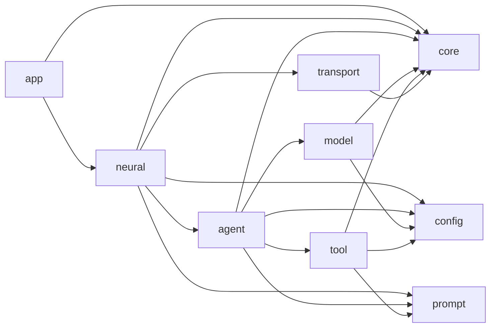
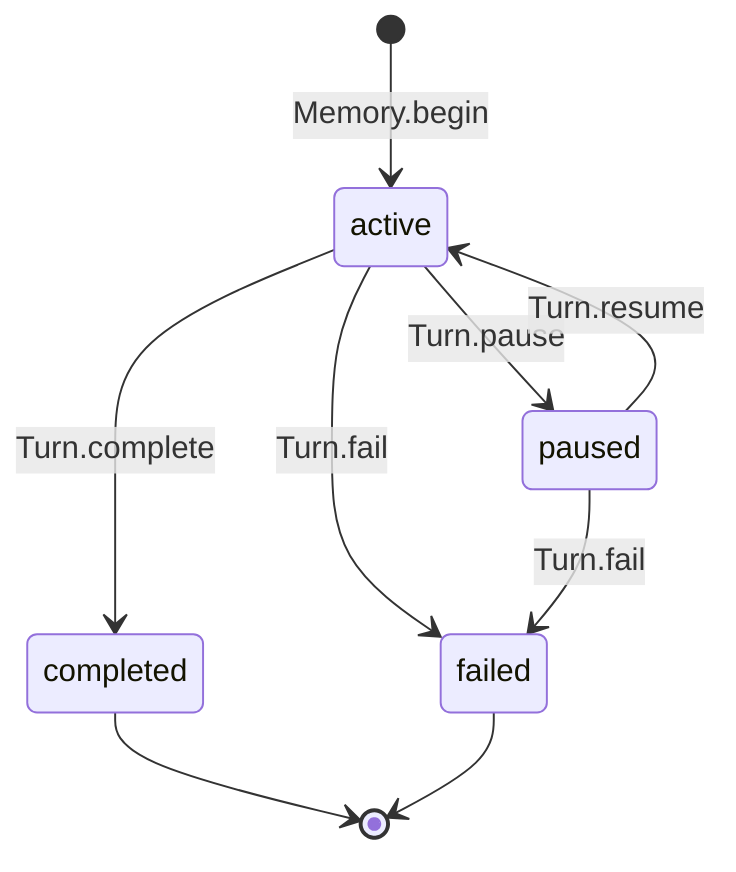

# Life-Form Architecture

## Design Philosophy

Flyflor treats biological language as domain language, not decoration. Brain owns cognition, Callosum perceives intent, Memory owns Turns, Identity owns durable self-description, and Synapse coordinates the whole life form. Technical facilities use direct names: Model, Tools, Transport, Packet, Controller, Config, and IOC.

The implementation follows four constraints:

1. One concept has one owner.
2. Dependencies point from orchestration toward capabilities.
3. Directory and filename conventions replace registries where possible.
4. Abstractions exist only when they remove real complexity or protect a runtime boundary.

## Dependency Direction

The business path is `app -> neural -> agent -> model/tool`; `neural -> transport` is the only transport edge. Agent does not import Neural. Transport does not import Neural. Model and Tool do not import each other. The static health gate enforces these rules.

## Ownership

| Object | Owns | Does not own |
| --- | --- | --- |
| `AppModule` | composition root | business behavior |
| `Synapse` | input routing, interaction, Agent pool, worker coordination | model protocol details, transport decoding |
| `Brain` | mode execution and cognitive model calls | socket lifecycle, provider wire formats |
| `Callosum` | one-pass perception of mode, goal, cwd, constraints, references | a second routing interpretation |
| `Turn` | one input's perception, state, answer, evidence, interaction, timestamps | cross-turn storage |
| `Memory` | active Turn and completed Turn continuity | identity notes, provider replay |
| `Identity` | prompt identity and fixed durable-note write allowlist | Turn state, generic file policy |
| `Investigation` | model/tool loop, replay, approvals, evidence | durable Turn ownership |
| `Model` | normalized model request lifecycle | cognition decisions, tool execution |
| `ProtocolClient` | provider conventions, fetch, timeout, stream decoding | agent state |
| `Tools` | concrete tool collection and dispatch | model transport |
| each `Tool` | schema, prompt description, cwd behavior, approval decision, execution | global JSON registry |
| `FSocket` | socket lifecycle, backpressure, packet callbacks | Synapse reference |
| `IPCPacket` | framing, buffering, encoding, decoding | action dispatch |

## Turn Lifecycle

There is one active Turn at most. `Memory.begin()` rejects overlapping Turns. Error boundaries call `Memory.fail()` so an exception cannot leave hidden active state. The next user input can then begin a new Turn. Continuous context is formed directly from the latest four completed Turns; there is no summarization or settlement model call.

## Perception And Modes

`Callosum.perceive()` makes one model request and returns:

- `mode`: `reply`, `research`, `soul`, or `coordinate`;
- `goal`;
- optional `cwd`;
- `constraints`;
- `references`.

`Brain` executes the selected mode:

- `reply`: stream a direct answer and complete the Turn;
- `research`: run Investigation with Tools, approvals, replay, and evidence;
- `soul`: ask Model for complete note replacements and delegate fixed allowlist enforcement to Identity;
- `coordinate`: delegate worker and reviewer orchestration to Synapse.

Workers are fresh IOC-created Agents. They receive an `Assignment`, produce an `Outcome`, do not share the active Turn, and cannot pause for interactive approval. Approval-gated worker calls are returned to the model as structured denials.

## IOC And Decorators

IOC is the only application-class constructor. It provides:

- singleton caching through `@Singleton` and `@Module`;
- property injection through `@Inject`;
- host-bound fresh objects through `@Scope`;
- early instance injection through `@Config` and `@Prompt`;
- post-injection lifecycle through `@Init`.

The complete decorator surface is `Module`, `Provide`, `Singleton`, `Inject`, `Scope`, `Init`, `Config`, and `Prompt`. Base classes carry runtime semantics; decorator aliases do not.

## Model Protocols

`src/model/types.ts` contains only model-boundary structures: `Message`, `ToolCall`, `ToolDefinition`, `ModelResult`, and `StreamEvent`. Protocol state and wire types stay inside `src/model/protocol`.

Provider names select conventions:

| Provider | Adapter and endpoint convention |
| --- | --- |
| `openai` | Responses first, then Chat Completions |
| `deepseek` | shared OpenAI Chat Completions adapter with endpoint fallback |
| `anthropic` | Messages |
| `google`, `gemini` | Gemini streaming generate content |
| `aws`, `bedrock` | Bedrock converse stream |
| `cohere` | Cohere chat |
| `ollama` | Ollama chat JSON stream |
| `huggingface`, `vllm`, `lmstudio`, other compatible providers | shared OpenAI Chat Completions adapter |

Configuration supplies provider, model, base URL, credential environment variable, and timeout. Endpoint path, authentication header, protocol fallback, and wire parser are code conventions. Stream decoding buffers split UTF-8 bytes and line fragments before adapters receive data.

## Tools And Approval

The model-visible tools are `ask`, `filesystem`, `shell`, and `execute`. There is no standalone confirm tool. Confirmation remains a stable interaction action used when a tool's `confirm()` decision returns true.

`Investigation` injects a perceived cwd only into tools that declare `workingDirectory`. An explicit tool-call cwd always wins. Tool request/result replay exists only in the local model loop. Evidence is normalized and merged into the completed Turn.

## Prompt Convention

`PromptService` loads canonical English markdown files from a directory, keyed by filename without `.md`. It sorts names for deterministic discovery, ignores `config.jsonc`, and ignores `.zh.cn.md` mirrors. Callers select ordered sections explicitly.

Identity is the only durable prompt writer. Its allowlist is fixed in code to:

- `SOUL.md`;
- `USER.md`;
- `EXTENSION.md`.

`AGENTS.md`, mirrors, hidden files, arbitrary paths, and unknown files are rejected. No general XML policy or writable-file registry exists.

## Transport Contract

Each IPC packet contains an 8-byte unsigned big-endian JSON body length followed by UTF-8 JSON bytes. `IPCPacket` buffers partial input and returns zero or more complete frames, covering split headers, split bodies, split UTF-8 characters, and coalesced packets. Oversized and malformed packets fail explicitly.

`FSocket` owns partial writes and retries pending buffers on drain. Inbound `user` and `answer` packets are reported through callbacks. Other stable actions are dispatched to `Controller`. Browser behavior and action names remain compatible.

## Enforced Red Lines

`bun run check` verifies:

- the nine allowed source roots;
- one-word lowercase directory names;
- dependency direction;
- barrel-only `index.ts` files;
- IOC-only application construction;
- documentation mirrors;
- prompt source constraints.

The kernel intentionally has no repository placeholder, SQL schema placeholder, plugin registry, generic event framework, Skills/MCP configuration, tool JSON registry, Observable wrapper, or speculative state class family.
