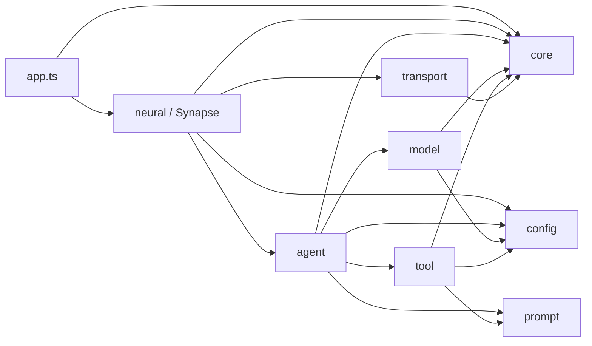
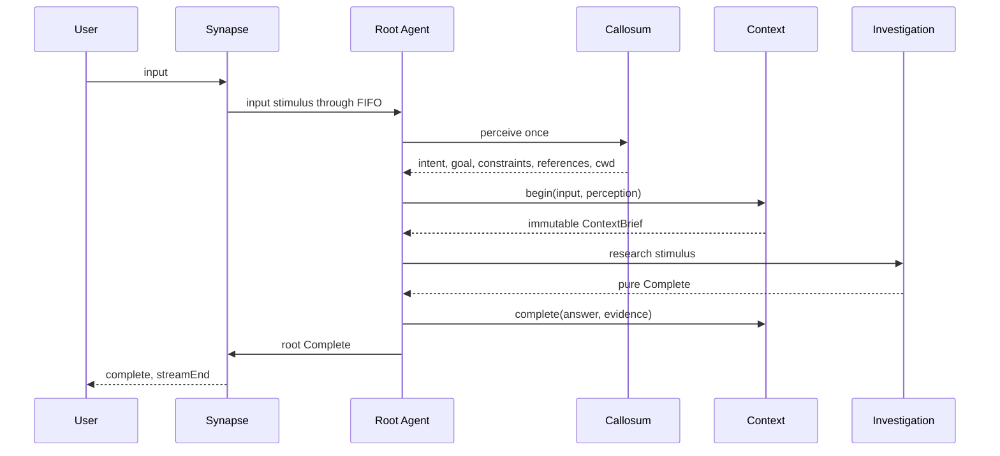
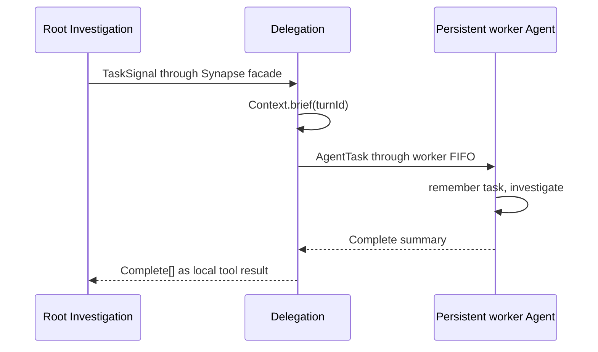

# Sessionless Life-Form Architecture

## Purpose

Flyflor is a continuously living intelligent entity. The kernel has one purpose: understand the user's need, investigate reality, summarize what was learned, and complete the task accurately. A transport connection is not a lifecycle boundary and there is no Session object.

## Ownership

| Object | Lifetime | Sole responsibility |
| --- | --- | --- |
| `Synapse` | life-form singleton | cortical facade, lifecycle composition, signal routing |
| `AgentPool` | one Synapse lifecycle | active identity, validated profiles, persistent Agent scopes |
| `Sensory` / `Interaction` / `Delegation` / `Expression` | one Synapse lifecycle | one independent FIFO and its exact cortical effect |
| `Context` | life-form singleton | sole creation and mutation of Turns; completed experience |
| `Agent` | persistent pool person | private FIFO boundary around one person's cognition |
| `Memory` | one Agent scope | bounded continuous temporary notes; never Turns |
| `Brain` | one Agent scope | cognitive routing and root completion |
| `Callosum` | one Agent scope | one strict perception for each root input |
| `Investigation` | one Agent scope | model loop, Ask/Confirm/Task/Complete network, compact evidence, and local replay |
| `Identity` | one Agent scope | durable prompt identity under package policy |
| `Tools` | life-form singleton | direct concrete actions and their schemas |
| `Model` | one Agent scope | context-pressure decision, exact provider request, and fully awaited streaming |
| `FSocket` | life-form singleton | IPC lifecycle and backpressure only |

Context owns the internal `Turn` class. The Context barrel exports immutable briefs and summaries, never Turn. Brain calls `begin()` and `complete()`; Interaction calls `pause()` and `resume()`; Delegation calls `brief()`. No caller receives mutable Turn state.

## Dependency Direction

Agent never imports Neural. Their boundary is `AgentBus.fire()` plus the stable discriminated signal structures in `src/agent/types.ts`. Transport never imports cognition or Synapse; it invokes bound callbacks.

## IOC And Lifecycle

`src/bootstrap.ts` loads `reflect-metadata` before decorated application classes and calls `Factory.create(AppModule)`. AppModule imports Synapse, so one call resolves and initializes the entire life form.

- `@Singleton` and `@Module` are cached only after injection and `@Init` succeed.
- `@Inject()` records only an owned property key; Container reads its `design:type` through Reflect metadata when resolving the object.
- inherited member metadata is collected explicitly without sharing mutable arrays, while singleton and module policies remain class-owned.
- `@Scope` uses one Agent-local resolution scope.
- Brain, Callosum, Investigation, Identity, Memory, and Model are created once inside that person's scope and reused there.
- different people never share scoped cognition or Memory;
- business code never directly constructs an application class;
- a failed initialization is not published to the singleton cache.

Synapse binds one fresh AgentPool to its `AgentBus`. AgentPool validates and copies every complete configured profile, creates each person once, and retains the isolated scopes. A failed Synapse initialization discards its unpublished pool and circuits. Shared configuration is never mutated and task-level workers are never created.

## Observable Circuits

`Observable<TInput, TOutput>` extends `FlyFlor`. It intentionally exposes only `pipe`, `switch`, `subscribe`, and `next`.

- `next()` returns the full processing Promise;
- one promise tail gives each circuit FIFO ordering;
- stages, selected branches, and subscribers are awaited in registration order;
- an absent switch branch throws;
- a rejection propagates unchanged and leaves that circuit fail-stopped;
- separate instances can discharge concurrently.

Synapse composes four independent concrete circuit objects:

| Circuit | Input | Effect |
| --- | --- | --- |
| sensory | user text | queues the root person's input stimulus |
| interaction | Ask or Confirm | serializes exact user interaction while other circuits remain live |
| delegation | Task | builds child tasks from `ContextBrief` and awaits target Completes |
| expression | Reply or root Complete | orders reply chunks, Complete, then streamEnd |

Each Agent and Brain also owns a private FIFO circuit. Investigation builds its Ask, Confirm, Task, and Complete switch once in `@Init` and reuses the network for later stimuli.

## Root Turn

The `reply`, `research`, and `soul` routes all end in Complete. Complete is the final summary and Context stores it directly. There is no second settle call and provider replay is never written to Context.

If cognition rejects, the rejection is not converted to a friendly message. The affected FIFO remains fail-stopped and the active experience is preserved for diagnosis rather than disguised as success.

## Delegation

Investigation exposes Task only for a root-capable run. Task validates `[{ agent, goal }]`; it neither creates people nor performs dispatch.

Tasks targeting the same person queue behind that person's current stimulus. Different people can run concurrently. Self-delegation is rejected because waiting on the currently executing FIFO would deadlock. Delegated runs receive `tools.list(false)`, so they cannot recursively emit Task. They may still use the common Ask and Confirm circuit.

## Investigation And Tools

Provider tool calls exist only in the local Investigation message list.

- Ask is validated by its tool, discharged through the interaction circuit, and replayed with structured answers.
- Confirm is discharged before a concrete dangerous action. Rejection becomes `{ approved: false, executed: false }`; the action is not run.
- Task is validated, discharged through delegation, and replayed with child Complete summaries.
- Filesystem, Shell, and Execute run directly through Tools.
- thrown failures reject unchanged;
- shell non-zero exit and timeout remain explicit process data;
- execute spawn errors reject the batch, while completed process exits remain explicit data;
- valid observations are copied into the current person's bounded Memory.

Investigation advances by understanding the goal, obtaining facts or executing, checking the result, and either continuing or completing. It requests a model-written plain-text summary before the next ordinary sample when Model reports approximately eighty percent of usable context capacity. The compacted history retains identity, the current stimulus, the original goal, compact evidence, the summary, and its next action; older tool replay is removed. Model-facing results share a fixed 64 KiB display budget per tool-call batch and retain UTF-8-safe head and tail content around an explicit omitted-byte marker. Tool schemas, implementations, and public results are unchanged.

Memory evicts oldest notes in FIFO order after sixteen notes. It stores compact goals, references, and observations, not the current raw input, full file contents, process output, delegated answers, provider messages, final Turn answer, Turn status, or a Turn array. Context alone retains the completed answer. The current input appears once in the stimulus input block and is omitted from its Context block.

## PromptService And XML

PromptService is the only prompt boundary. It owns:

- canonical English Markdown loading and `.zh.cn.md` mirror exclusion;
- ordered sections declared by package `config.jsonc`;
- editable, locked, and runtime-ignored identity policy;
- strict all-before-any validation of identity writes;
- XML name validation, attribute escaping, CDATA splitting, and stable block order;
- inline `document` rendering for ContextBrief, user input, task data, and tool results.

XML exists only at model input boundaries. It is not a storage format for Context, Turn, or Memory. Missing packages, sections, mappings, blocks, and illegal names reject immediately.

## Model Protocol

Each provider resolves to one protocol attempt:

| Provider | Protocol and path |
| --- | --- |
| `openai` | Chat Completions, `/v1/chat/completions` |
| `responses` | Responses, `/v1/responses` |
| `deepseek` | OpenAI-compatible Chat Completions, `/chat/completions` |
| `anthropic` | Messages, `/v1/messages` |
| `google`, `gemini` | Gemini streaming generate content |
| `aws`, `bedrock` | Bedrock converse stream |
| `cohere` | Cohere chat |
| `ollama` | Ollama JSON stream |
| `vllm`, `lmstudio` | declared OpenAI-compatible Chat Completions |

Unknown providers reject. Failed status codes, wrong response shapes, malformed tool JSON, missing keys, and unterminated streams reject. Streaming text callbacks are awaited, so neural output ordering cannot escape the model Promise.

Agent profiles provide `contextLength` and `maxTokens` as capacity facts; they do not configure cognition or review policy. ProtocolClient measures the final UTF-8 JSON body and rejects any request above its internal 512 KiB safety boundary before `fetch`.

## Transport

IPC frames contain an eight-byte unsigned big-endian body length followed by UTF-8 JSON. Packet buffering covers split headers, split bodies, split UTF-8 sequences, and coalesced frames. Invalid and oversized frames reject.

FSocket rejects writes without a live connection. Reconnect resets only transport framing and pending bytes; Context and Agent Memory remain untouched. Input and answer callbacks are awaited. Unknown controller actions reject.

## Static Red Lines

`bun run check` combines TypeScript checking with an AST-based architecture gate. It rejects:

- CatchClause, `.catch()`, and rejection fallback handlers;
- direct application construction outside IOC;
- missing EN/ZH JSDoc on runtime classes, constructors, methods, and accessors;
- methods over 500 lines;
- illegal dependency direction and behavioral barrels;
- public or externally imported Turn;
- Session types;
- missing Chinese documentation mirrors;
- invalid prompt source constraints.

## Verification Layers

`bun test` provides deterministic coverage for Observable FIFO/fail-stop behavior, IOC scope and publication, Context isolation, Investigation branching, tools, protocol parsing, IPC framing, and Web bridge encoding. `bun run test:live` then drives the actual browser bridge and kernel with the configured DeepSeek model. Its disposable scenarios cover all three cognitive routes, every concrete tool, Ask/Confirm correlation, multi-person Task completion, and reconnect continuity. This separation keeps ordinary tests repeatable while making provider and prompt behavior independently reproducible.
