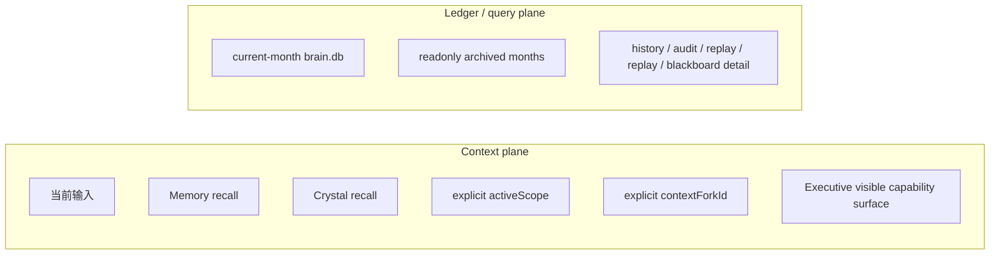

# 架构总览

## 一句话定位

Flyflor 当前主线是一个 Bun + TypeScript 智能体内核。它的运行模型已经明确切成两张平面：

- Context plane：只负责当前这一轮真正进入模型上下文的东西
- Ledger/query plane：只负责保存、查询、审计、回放经历

这两张平面必须彻底分开。不能再把“流水账”当成“上下文”。

## 当前主线

- `app.ts`：薄入口，只做模式分派。
- `src/app.ts`：composition root。
- `src/cognitive/*`：认知内核。
- `src/executive/*`：Capability / Tool / Trust / Loop 外骨骼。
- `src/agent/*`：runtime、gateway、sandbox、blackboard、mcp、plugin、skills、context。
- `src/events/*`：事件血管。
- `src/protocol/*`：公共协议。
- `src/entities/*`：entity / repo / SQL owner。
- `src/components/*`：Component 基类与基础设施。

主线保留两个 Bun 可见入口：

- 本地 `stdio` chat 调试入口
- 最小 Gateway：`/ws`、`/health`、`/channels`

第一方 Bun CLI/TUI/channel adapter 已退出主线，只保留在 `docs/old-docs/` 作为历史材料。

## 两张平面

硬规则：

- `brain.db` 原始 event 流不能直接塞进 prompt。
- 只有 recall、summary、scope-local index、vector / summary-first 检索产物才能进入上下文。
- “历史记录完整保存”与“当前该给模型看什么”是两套系统。

## Context plane

当前真正允许进入运行时上下文的只有：

1. 当前输入
2. `MemoryComponent` 的热区召回
3. `CrystalComponent` 的晶体召回
4. 显式 `activeScope`
5. 显式 `contextForkId`
6. Executive 当前可见能力面

没有显式 scope 时：

- 不创建 fallback scope
- 不创建 inbox scope
- 不按 `sourceSurface/conversationKey/thread/user` 自动恢复工作域
- 只装配 `Memory + Crystal + explicit fork`

## Ledger/query plane

`brain.db` 的职责是：

- 当前月唯一可写全量账本
- 保存 turn 对话
- 保存 fork 详细对话
- 保存 blackboard 深度思考详情
- 服务历史查询、审计、回放、摘要、replay/detail 检索

它不是：

- prompt 热区本体
- 当前 self
- 当前 scope
- 会话容器

## 显式工作域：Scope

Flyflor 现在只承认一个显式工作域概念：`Scope`。

- `project` / `event` 的工作域语义统一收口到 `Scope`
- `ContextFork` 是 `Scope` 的显式分支
- `codename` 只保留为锚点、提议入口、recall boost

运行规则：

1. 若已有 `activeScope`，直接装配
2. 若没有，模型可以输出结构化 scope proposal
3. runtime 通过 ask 请求确认
4. 用户确认后创建 scope
5. 之后只有显式 `RuntimeContext.activeScope` 才进入该范围

## 连续性模型

系统不再允许把 transport tuple 当成认知连续性容器。

允许的长期连续轴只有：

- `activeScope.id`
- `contextForkId`
- `codenameId`
- memory activation / recall
- crystal recall
- ledger 时间线

不再承担连续性容器职责的字段：

- `sourceKey`
- `sourceSurface`
- `conversationKey`
- `threadId`
- transport protocol handshake

这些字段仍可存在于 gateway/raw audit 边界，但不再定义“当前上下文是谁”。

## 分层关系

### Cognitive

- Mindstream：当前推理与生成
- Crystal：长期稳定知识与方法
- Hippocampus：工作记忆、召回、压缩、回放

### Executive

- Capability：能做什么
- Tool：如何向模型暴露
- Trust：这次是否允许
- Loop：如何执行、暂停、恢复、审计

### Agent

- runtime：单轮主链
- gateway：transport 血管
- blackboard：复杂任务工作台
- sandbox：副作用边界
- context：显式 scope/fork/capability 装配

## 这次重构的真实目标

不是削弱宪法，也不是放松边界。

真正要清理的是残留的隐式绑定：

- `(sourceSurface, conversationKey, actor)` 式快照键
- transport tuple 充当 blackboard lease key
- fallback scope / inbox scope 默认兜底
- `sourceKey` 进入核心认知分区
- 把 `brain.db` 当成 prompt 本体

换句话说，这次重构不是“少一点约束”，而是“让实现终于和设计一致”。
