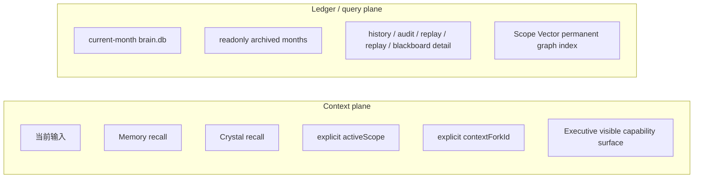

# 架构总览

## 一句话定位

Flyflor 当前主线不是普通的“聊天智能体 runtime”，而是一个 Bun + TypeScript 的智能生命体内核。它的运行模型已经明确切成两张平面：

- Context plane：只负责当前这一轮真正进入模型上下文的东西
- Ledger/query plane：只负责保存、查询、审计、回放经历

这两张平面必须彻底分开。不能再把“流水账”当成“上下文”。

Flyflor 试图实现的是一种会思考、会提问、会形成独立工作域、会把经验结晶成长期方法、也会遗忘和压缩的智能生命体，而不是一个只会堆会话和调工具的 agent 壳体。

## 当前主线

- `app.ts`：薄入口，只做模式分派。
- `src/app.ts`：composition root。
- `src/cognitive/*`：认知内核。
- `src/executive/*`：Capability / Tool / Trust / Loop 外骨骼。
- `src/agent/*`：runtime、sandbox、blackboard、mcp、plugin、skills、context。
- `src/socket/*`：外显 socket 血管层，当前 transport 是 `/ws` WebSocket，HTTP 只保留 `/health`。
- `src/events/*`：事件血管。
- `src/protocol/*`：公共协议。
- `src/entities/*`：entity / repo / SQL owner。
- `src/components/*`：Component 基类与基础设施。

当前封板波次的重点是 Bun 内核真实封板：OpenAPI/Apifox 契约、真实配置模型 socket 场景、prompt 优化、DB/context guard 和 release/binary 验证。Rust 相关文档只作为外部独立仓库的 `/ws` 交接材料，不是本仓库的实现计划。

主线保留两个 Bun 可见入口：

- 本地 `stdio` chat 调试入口
- 最小 socket：`/ws`、`/health`

第一方 Bun CLI/TUI/channel adapter 已退出主线，只保留在 `docs/old-docs/` 作为历史材料。

## 两张平面

硬规则：

- `brain.db` 原始 event 流不能直接塞进 prompt。
- 只有 recall、summary、scope-local index、Scope Vector permanent graph index 和 vector / summary-first 检索产物才能进入上下文。
- “历史记录完整保存”与“当前该给模型看什么”是两套系统。

## 智能生命体的四个器官

Flyflor 当前活跃设计可以理解成四个彼此协作的认知器官：

1. `Mindstream / LLM`
   - 流体智力
   - 负责当下理解、推理、生成、编排与即时判断
2. `MemoryComponent`
   - 热记忆
   - 更像工作记忆与缓冲区，负责近期召回、行为挂接、热区压缩
3. `CrystalComponent`
   - 晶体智力
   - 负责把高价值经验结晶成稳定、可复用的方法与知识
4. `Scope`
   - 独立生命工作域
   - 负责长期项目、事情、主题的显式固化与局部宪法/记忆装配

执行力依然重要，但 `Executive` 在这里是外骨骼，不是本体；它负责让生命体可行动、可暂停、可恢复、可审计。

## Context plane

当前真正允许进入运行时上下文的只有：

1. 当前输入
2. `MemoryComponent` 的热区召回
3. `CrystalComponent` 的晶体召回
4. 显式 `activeScope`
5. 显式 `contextForkId`
6. Executive 当前可见能力面

没有显式 scope 时：

- 不创建 fallback scope
- 不创建 inbox scope
- 不按 `sourceSurface/conversationKey/thread/user` 自动恢复工作域
- 只装配 `Memory + Crystal + explicit fork`

这意味着 Flyflor 当前上下文不是“最近几轮聊天 + 工具列表”，而是由流体智力、热记忆、晶体智力、显式 scope/fork 和可见能力面共同构成的当前生命态。

## Ledger/query plane

`brain.db` 的职责是：

- 当前月唯一可写全量账本
- 保存 turn 对话
- 保存 fork 详细对话
- 保存 blackboard 深度思考详情
- 服务历史查询、审计、回放、摘要、replay/detail 检索
- 为 Scope Vector permanent graph index 提供可恢复的 ledger 锚点

`brain.db` 不是单一永续总库，而是按月分片的生命账本：

- 当前月：一份可写 `brain.db`
- 历史月：归档分片，只读检索

也就是说，Flyflor 的生命日志会随着月份诞生新的账本分片，但上下文装配仍然不直接从这些账本原文取材。

Scope Vector permanent graph index 是独立的长期 graph/tree index：默认落在每个 Scope 的 `<scope.projectDir>/.flyflor/scope.db`，保留 scope / fork / recall 之间的稳定连边、记忆树节点、热区项目记忆和多维关联词索引，但仍然不承担 prompt 容器职责。

它不是：

- prompt 热区本体
- 当前 self
- 当前 scope
- 会话容器

## 显式工作域：Scope

Flyflor 现在只承认一个显式工作域概念：`Scope`。

- `project` / `event` 的工作域语义统一收口到 `Scope`
- `ContextFork` 是 `Scope` 的显式分支
- `codename` 只保留为锚点、提议入口、recall boost

Scope 在这里不是轻量标签，而是智能生命体对长期事情形成的独立工作域。一个 Scope 被确认并固化后，应当拥有局部宪法、局部记忆入口、局部召回面和后续演化空间。

运行规则：

1. 若已有 `activeScope`，直接装配
2. 若没有，模型可以输出结构化 scope proposal
3. runtime 通过 ask 请求确认
4. 用户确认后创建 scope
5. 之后只有显式 `RuntimeContext.activeScope` 才进入该范围

这也意味着 Ask 不是补充 UI，而是 Scope 升格和长期连续性的关键闭环器官。

## 连续性模型

系统不再允许把 transport tuple 当成认知连续性容器。

允许的长期连续轴只有：

- `activeScope.id`
- `contextForkId`
- `codenameId`
- memory activation / recall
- crystal recall
- ledger 时间线

不再承担连续性容器职责的字段：

- `sourceKey`
- `sourceSurface`
- `conversationKey`
- `threadId`
- transport protocol handshake

这些字段仍可存在于 socket/raw audit 边界，但不再定义“当前上下文是谁”。

## 分层关系

### Cognitive

- Mindstream：当前推理与生成，也就是流体智力
- Crystal：长期稳定知识与方法，也就是晶体智力
- Hippocampus：工作记忆、召回、压缩、回放，也就是热记忆与生命账本接线

### Executive

- Capability：能做什么
- Tool：如何向模型暴露
- Trust：这次是否允许
- Loop：如何执行、暂停、恢复、审计

Executive 是 Flyflor 的执行外骨骼。它借给生命体行动能力，但不定义生命体的认知主语，也不接管记忆、结晶或 Scope 连续性。

### Agent

- runtime：单轮主链
- socket：外显 socket 血管层
- blackboard：复杂任务工作台
- sandbox：副作用边界
- context：显式 scope/fork/capability 装配

## Ask 与结晶

Flyflor 的长期成长不是靠“多存聊天记录”，而是靠 ask 闭环与结晶闭环。

- Ask 用于黑板封顶、工具 loop 配额耗尽、scope 升格确认、思考无果交还等场景
- Ask 让系统在边界处显式向用户求证，而不是隐藏重试或装作已知
- 高质量 ask-answer、黑板收敛、反思证据和长期任务收束，会成为 Crystal 的结晶候选来源

因此，Flyflor 的长线能力不是后台偷偷续跑，而是“显式 ask -> 用户回答 -> 继续推进 -> 形成结晶”的生命闭环。

## 这次重构的真实目标

不是削弱宪法，也不是放松边界。

真正要清理的是残留的隐式绑定：

- `(sourceSurface, conversationKey, actor)` 式快照键
- transport tuple 充当 blackboard lease key
- fallback scope / inbox scope 默认兜底
- `sourceKey` 进入核心认知分区
- 把 `brain.db` 当成 prompt 本体

换句话说，这次重构不是“少一点约束”，而是“让实现终于和设计一致”，让 Flyflor 更像一个会提问、会结晶、会形成局部生命域的智能生命体，而不是普通 agent runtime。
