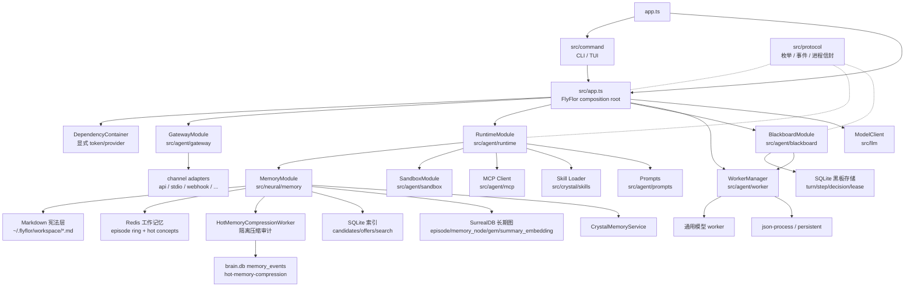
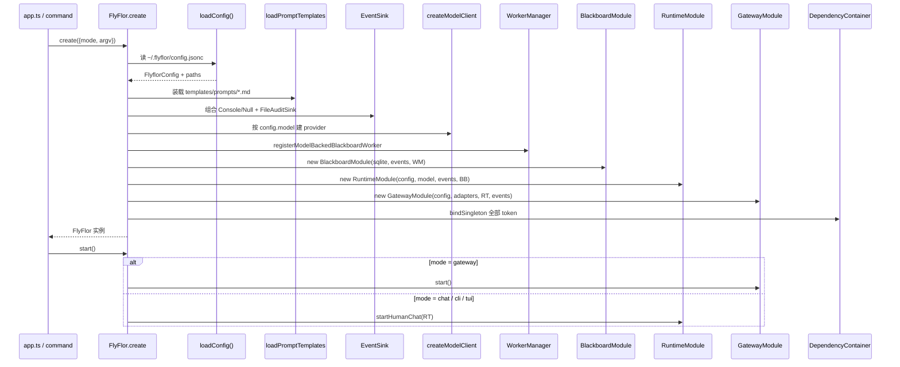
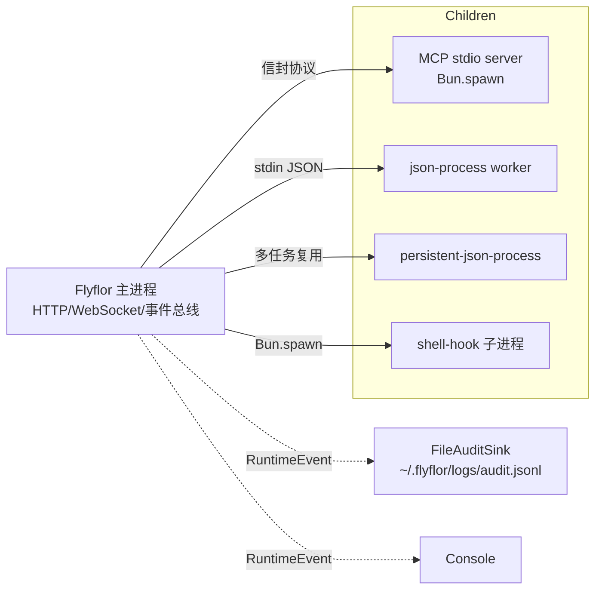

# 架构总览

## 一句话定位

Flyflor 是 Bun + TypeScript 智能体运行时，目标是单文件二进制；入口装配在 `FlyFlor` composition root 完成，热路径由 `RuntimeModule` 编排，记忆系统按「流体 / 晶体 / 海马体」三层切分。

## 相关代码路径

- `app.ts` — 程序入口，仅做版本输出与命令分派
- `src/app.ts` — `FlyFlor` composition root，显式 DI 装配
- `src/agent/components.ts` — 边界基类 `Gateway` / `Blackboard` / `Runtime` / `Memory` / `Sandbox`
- `src/agent/di/` — `@Module` / `@Provide` / `@Inject` metadata、`DependencyContainer`
- `src/protocol/` — 公共协议、枚举、事件、进程信封
- `src/llm/`、`src/crystal/`、`src/neural/`、`src/agent/`、`src/command/`、`src/config/`

## 三层智能模型

| 层 | 目录 | 角色 | 后端 |
| --- | --- | --- | --- |
| 流体智力 LLM | `src/llm` | 当前任务的理解、推理、生成、工具编排 | OpenAI 兼容 / Anthropic 兼容 |
| 晶体智力 Crystal | `src/crystal` | 反思候选 → Gem 升格、Skill 与方法论沉淀 | SurrealDB |
| 海马体 Neural | `src/neural/memory` | 工作记忆 ring、激活、TTL 遗忘、热记忆压缩审计 | Redis + Markdown + SQLite + SurrealDB |

## 分层结构图



## Composition Root（`FlyFlor.create`）



## 边界继承约定

所有边界模块继承 `src/agent/components.ts` 中的空抽象类来表达语义：

```ts
abstract class Gateway {}
abstract class Blackboard {}
abstract class Runtime {}
abstract class Memory {}
abstract class Sandbox {}
```

实现类形如 `class RuntimeModule extends Runtime`、`class MemoryModule extends Memory`。继承关系只用于身份标识，不在基类放任何逻辑；注入语义由 `@Module` + `@Provide` 元数据承载，运行期连线由 `DependencyContainer` 完成。

## DI 容器

- `DependencyContainer`（`src/agent/di/factory/dependency.container.ts`）只暴露三种绑定：
  - `bindSingleton(token, value)` — 已构造的稳定依赖
  - `bindProvider(token, factory)` — 懒加载单例
  - `bindFactory(token, factory)` — 每次 resolve 创建新实例
- 仅在 composition root 注入；运行时只 `resolve` 已注册 token。
- `@Module` / `@Provide` / `@Inject` / `@Service` / `@Component` / `@Worker` / `@Channel` / `@Plugin` 仅登记 metadata，**不做反射扫描或自动加载**。
- `FlyFlorTokens` 列出 10 个对外 token：`Container / Mode / Config / Events / Model / Workers / Blackboard / Runtime / Adapters / Gateway`。

## 模块边界硬约束

| 模块 | 允许 | 禁止 |
| --- | --- | --- |
| `app.ts` / `src/app.ts` | 装配、显式注入 | 业务逻辑、领域协议 |
| `src/command` | CLI/TUI 入口、状态展示 | 直接驱动 agent loop、绕过 Gateway/Runtime |
| `src/agent/gateway` | 渠道归一、status 快照 | 调用模型、写记忆 |
| `src/agent/runtime` | turn 编排、上下文装配、事件发布 | 持有渠道私有协议、储存驱动细节 |
| `src/agent/blackboard` | turn/step/decision/lease | 执行工具、写长期记忆 |
| `src/agent/worker` | registry / pool / adapter / 超时 | 动态扫描、动态 import、绕过 Sandbox |
| `src/agent/sandbox` | mcp-tool / shell-hook / plugin 审批 | 被业务模块绕过 |
| `src/agent/mcp` | server/client 适配 | 跑非 MCP 工具、维护路由策略 |
| `src/llm` | provider 协议转换、流式输出 | 读取渠道状态、写长期记忆 |
| `src/crystal` | reflection、Gem、Skill | 持有渠道协议、绕过证据门 |
| `src/neural/memory` | 海马体 + markdown + 索引 + 长期图 | 调用模型决策 |
| `src/protocol` | 枚举、事件、信封 | 业务决策、状态存储 |

## 进程模型



所有跨进程消息走 `src/protocol/processes/protocol.ts` 信封，要求 JSON 可序列化、有 start/ready/stop/crash/restart backoff 生命周期。

## 关键数据结构

```ts
interface FlyFlorDependencies {
    adapters: Map<ChannelName, ChannelAdapter>;
    blackboard: BlackboardModule;
    config: FlyflorConfig;
    container: DependencyContainer;
    events: EventSink;
    gateway: GatewayModule;
    memory: MemoryModule;
    mode: RuntimeMode;       // chat | cli | gateway | tui
    model: ModelClient;
    runtime: RuntimeModule;
    workers: WorkerManager;
}
```

`MemoryModule` 已在 composition root 中显式构造并注入 `RuntimeModule`，测试可通过 `FlyFlor.create({ memory })` 替换实现。

## 风险点 / 已知缺口

- `RuntimeModule` 已拆为 prepare / assemble / generate / persist / async 五个 phase，但文件仍较大；下一步适合继续拆工具循环、reply 解析和 persist helper。
- `Sandbox` 仅在 `RuntimeModule` 内决策 mcp-tool；shell-hook / plugin 执行器有独立路径，但未统一从 DI 容器拿 `SandboxPolicy`。
- 三层智能模型在代码上仍有少量回流依赖：`neural/memory` 会 import prompt/project/runtime dream worker；导入方向需要继续收敛。
- `brain.db` 已成为 prompt recall / turn event write 权威；Behavior Snapshot 与提示词优先级冲突表已接入 runtime / memory / prompt 模板链路。
