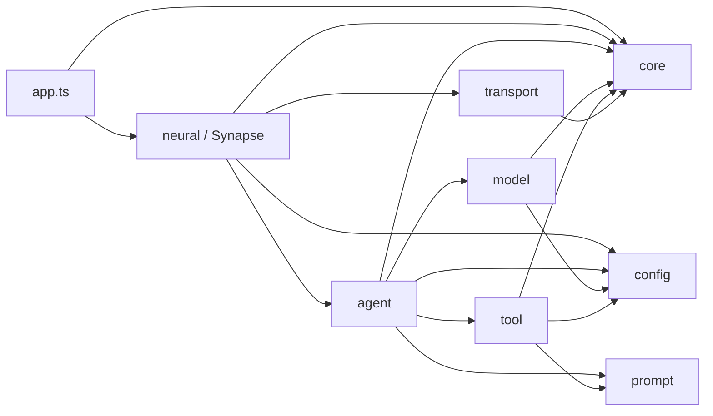
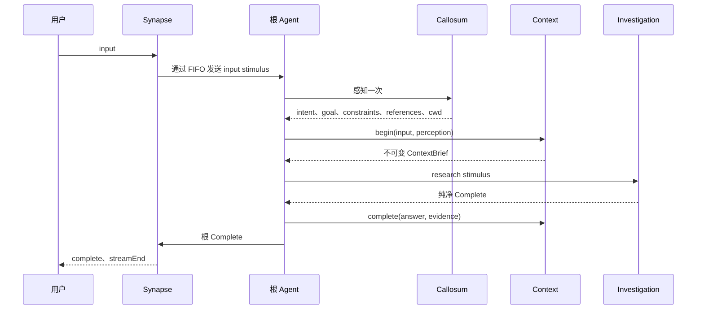
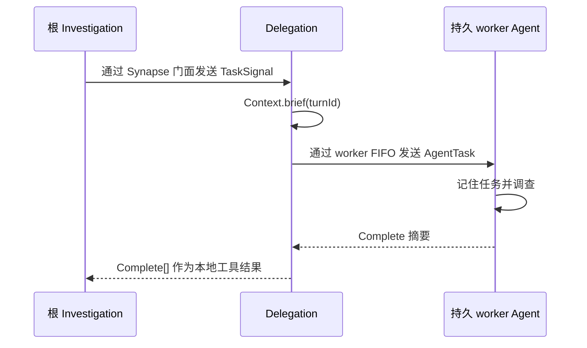

# 无 Session 智能生命体架构

## 目的

Flyflor 是一个持续存在的智能生命体。内核只有一个目的：理解用户需求、调查现实、摘要所得，并准确完成任务。Transport 连接不是生命周期边界，系统中不存在 Session 对象。

## 所有权

| 对象 | 生命周期 | 唯一职责 |
| --- | --- | --- |
| `Synapse` | 生命体 singleton | 皮层门面、生命周期组合、信号路由 |
| `AgentPool` | 单个 Synapse 生命周期 | 活跃身份、已验证 profiles、持久 Agent scopes |
| `Sensory` / `Interaction` / `Delegation` / `Expression` | 单个 Synapse 生命周期 | 一条独立 FIFO 及其精确皮层效果 |
| `Context` | 生命体 singleton | 唯一创建和修改 Turn；保存完成经历 |
| `Agent` | pool 中持久人物 | 用私有 FIFO 包围一个人的认知 |
| `Memory` | 单个 Agent scope | 有界、连续的临时笔记；绝不保存 Turn |
| `Brain` | 单个 Agent scope | 认知路由与根任务完成 |
| `Callosum` | 单个 Agent scope | 对每次根输入进行一次严格感知 |
| `Investigation` | 单个 Agent scope | 模型循环、Ask/Confirm/Task/Complete 网络、紧凑证据与本地 replay |
| `Identity` | 单个 Agent scope | 按 package policy 持有持久 prompt 身份 |
| `Tools` | 生命体 singleton | 直接具体动作及其 schema |
| `Model` | 单个 Agent scope | 上下文压力判断、精确 provider 请求与完整等待的 streaming |
| `FSocket` | 生命体 singleton | 仅负责 IPC 生命周期与 backpressure |

Context 持有内部 `Turn` class。Context barrel 只导出不可变 brief 与 summary，绝不导出 Turn。Brain 调用 `begin()`、`complete()`；Interaction 调用 `pause()`、`resume()`；Delegation 调用 `brief()`。任何调用者都无法取得可变 Turn 状态。

## 依赖方向

Agent 永不导入 Neural。两者边界是 `AgentBus.fire()` 与 `src/agent/types.ts` 中稳定的判别信号结构。Transport 不导入认知层或 Synapse，只调用已绑定 callback。

## IOC 与生命周期

`src/bootstrap.ts` 在 decorated application class 前加载 `reflect-metadata`，再调用 `Factory.create(AppModule)`。AppModule 导入 Synapse，因此一次调用即可解析并初始化整个生命体。

- `@Singleton` 与 `@Module` 只有在注入和 `@Init` 成功后才写入缓存；
- `@Inject()` 只登记自有属性键；Container 在解析对象时通过 Reflect metadata 读取其 `design:type`；
- 继承成员元数据由 Container 显式收集且不共享可变数组，singleton 与 module 策略仍由 class 自有；
- `@Scope` 使用单个 Agent 本地 resolution scope；
- Brain、Callosum、Investigation、Identity、Memory、Model 在同一人物 scope 内只创建一次并复用；
- 不同人物绝不共享 scoped cognition 或 Memory；
- 业务代码不得直接构造 application class；
- 初始化失败的对象不会发布到 singleton cache。

Synapse 将一个全新的 AgentPool 绑定到自身 `AgentBus`。AgentPool 验证并复制每个完整的已配置 profile，为每个人物只创建一次隔离 scope 并持续保留。Synapse 初始化失败时，其尚未发布的 pool 与回路会被整体丢弃。共享配置不会被修改，也不会创建 task-level worker。

## Observable 回路

`Observable<TInput, TOutput>` 继承 `FlyFlor`，只暴露 `pipe`、`switch`、`subscribe`、`next`。

- `next()` 返回完整处理 Promise；
- 每条回路使用一个 promise tail 保证 FIFO；
- stages、选中分支、subscribers 按注册顺序完整 await；
- 缺失 switch 分支直接抛错；
- rejection 原样传播，并使该回路 fail-stop；
- 不同 Observable 实例可以并行放电。

Synapse 组合四个独立的具体回路对象：

| 回路 | 输入 | 效果 |
| --- | --- | --- |
| 感觉 | 用户文本 | 将根人物 input stimulus 排入队列 |
| 交互 | Ask 或 Confirm | 串行化精确用户交互，同时不阻塞其他回路 |
| 委派 | Task | 从 `ContextBrief` 构建子任务并等待目标 Complete |
| 表达 | Reply 或根 Complete | 保证 reply chunks、Complete、streamEnd 顺序 |

每个 Agent 与 Brain 也拥有私有 FIFO 回路。Investigation 在 `@Init` 中一次性构建 Ask、Confirm、Task、Complete switch，并为后续刺激复用网络。

## 根 Turn

`reply`、`research`、`soul` 三条路径都以 Complete 结束。Complete 就是最终摘要，Context 直接保存。不存在第二次 settle 调用，provider replay 永不写入 Context。

如果认知 reject，错误不会被转换为友好消息。受影响 FIFO 保持 fail-stop，活动经历保留用于诊断，而不是伪装成功。

## 委派

Investigation 只在根能力运行中暴露 Task。Task 只验证 `[{ agent, goal }]`；它不创建人物，也不执行派发。

发给同一人物的任务排在该人物当前 stimulus 之后；不同人物可以并发。自我委派会被拒绝，因为等待当前正在执行的 FIFO 会死锁。委派运行使用 `tools.list(false)`，因此无法递归触发 Task，但仍可使用统一 Ask 与 Confirm 回路。

## Investigation 与 Tools

Provider tool calls 只存在于本次 Investigation 的本地消息列表。

- Ask 由工具验证，通过交互回路放电，并以结构化 answers replay；
- Confirm 在具体危险动作前放电；拒绝结果为 `{ approved: false, executed: false }`，动作不执行；
- Task 完成验证后通过委派回路放电，并以子 Complete summaries replay；
- Filesystem、Shell、Execute 通过 Tools 直接运行；
- 抛出的失败原样 reject；
- shell 非零退出与 timeout 保留为显式进程数据；
- execute spawn 错误使批次 reject，已完成进程的退出仍是显式数据；
- 有效观察复制到当前人物的有界 Memory。

Investigation 始终按理解目标、获取事实或执行、检查结果、继续或完成推进。当 Model 判断可用上下文容量达到约百分之八十时，它会在下一次普通采样前请求模型生成纯文本摘要。压缩后的历史保留身份、当前 stimulus、原始目标、紧凑证据、摘要及下一步，并移除旧 tool replay。每批 tool call 的模型可见结果共享固定 64 KiB 展示预算，以 UTF-8 安全的首尾内容和显式 omitted-byte 标记呈现。工具 schema、实现与公开结果保持不变。

Memory 在超过十六条 notes 后按 FIFO 淘汰最旧笔记。它只保存紧凑的目标、引用与观察，不保存当前原始输入、完整文件内容、进程输出、委派答案、provider messages、Turn 最终答案、Turn status 或 Turn 数组。完成答案只由 Context 保存。当前输入只出现在 stimulus 的 input block 一次，Context block 不再重复它。

## PromptService 与 XML

PromptService 是唯一 prompt 边界，负责：

- 加载规范英文 Markdown，并忽略 `.zh.cn.md` 镜像；
- 按 package `config.jsonc` 声明顺序组合 sections；
- editable、locked、runtime-ignored 身份策略；
- 身份写入的 all-before-any 严格验证；
- XML name 验证、attribute escaping、CDATA splitting、稳定 block 顺序；
- 为 ContextBrief、用户输入、task data、tool results 渲染内联 `document`。

XML 只存在于模型输入边界，不是 Context、Turn 或 Memory 的存储格式。缺少 package、section、mapping、block 或非法 name 都立即 reject。

## 模型协议

每个 provider 只解析为一个协议 attempt：

| Provider | 协议与路径 |
| --- | --- |
| `openai` | Chat Completions，`/v1/chat/completions` |
| `responses` | Responses，`/v1/responses` |
| `deepseek` | OpenAI-compatible Chat Completions，`/chat/completions` |
| `anthropic` | Messages，`/v1/messages` |
| `google`、`gemini` | Gemini streaming generate content |
| `aws`、`bedrock` | Bedrock converse stream |
| `cohere` | Cohere chat |
| `ollama` | Ollama JSON stream |
| `vllm`、`lmstudio` | 显式声明的 OpenAI-compatible Chat Completions |

未知 provider 直接 reject。失败状态码、错误响应结构、非法 tool JSON、缺失 key、未终止 stream 都 reject。Streaming 文本 callback 被完整 await，因此神经输出顺序不会逃逸模型 Promise。

Agent profile 的 `contextLength` 与 `maxTokens` 只描述容量事实，不配置认知或审查策略。ProtocolClient 测量最终 UTF-8 JSON body，并在调用 `fetch` 前拒绝超过内部 512 KiB 安全边界的请求。

## Transport

IPC frame 使用八字节 unsigned big-endian body length，随后是 UTF-8 JSON。Packet buffering 覆盖 split header、split body、split UTF-8 sequence 与 coalesced frames。非法或过大 frame 直接 reject。

FSocket 在无活动连接时拒绝 write。重连只重置 transport framing 与 pending bytes，不触碰 Context 或 Agent Memory。Input 与 answer callback 被完整 await。未知 controller action 直接 reject。

## 静态红线

`bun run check` 组合 TypeScript 检查与 AST 架构门，拒绝：

- CatchClause、`.catch()`、rejection fallback handler；
- IOC 外直接构造 application class；
- runtime class、constructor、method、accessor 缺少 EN/ZH JSDoc；
- method 超过 500 行；
- 非法依赖方向与带行为 barrel；
- 公开或外部导入 Turn；
- Session type；
- 缺少中文文档镜像；
- 非法 prompt source。

## 验证层次

`bun test` 为 Observable FIFO/fail-stop、IOC scope 与发布、Context 隔离、Investigation 分支、tools、协议解析、IPC framing、Web bridge encoding 提供确定性覆盖。随后，`bun run test:live` 使用已配置 DeepSeek 模型驱动真实 browser bridge 与内核。其一次性场景覆盖三条认知路径、全部具体工具、Ask/Confirm 关联、多人物 Task Complete 与重连连续性。这样既保持普通测试可重复，又能独立复现 provider 与 prompt 的真实行为。
