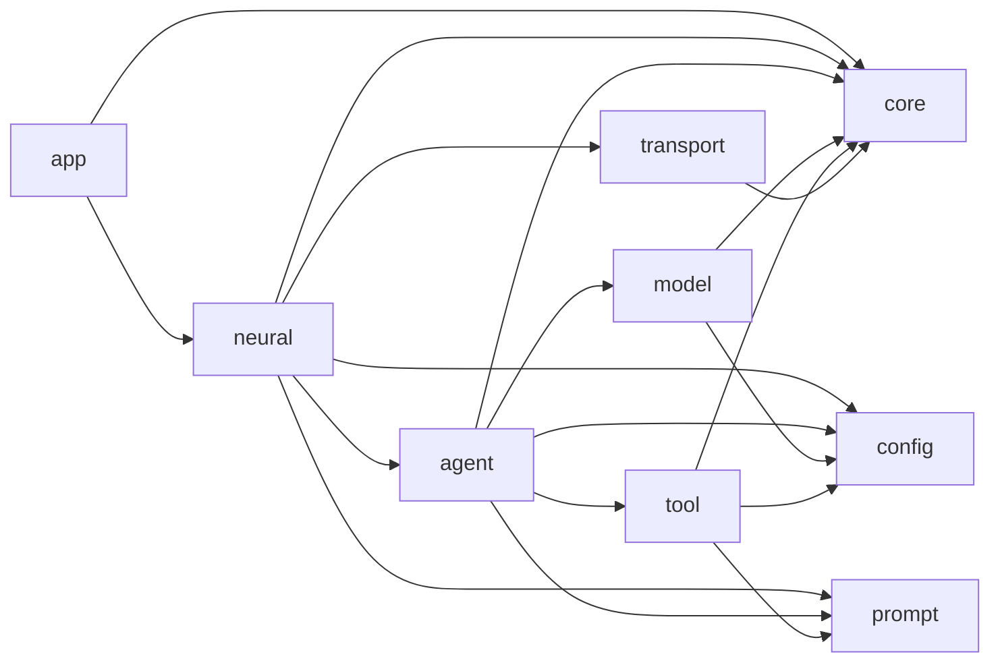
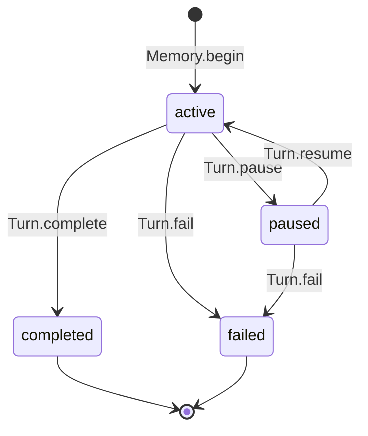

# 生命体架构

## 设计哲学

Flyflor 把生物学语言当作领域语言，而不是装饰。Brain 持有认知，Callosum 感知意图，Memory 持有 Turn，Identity 持有长期自我描述，Synapse 协调整个生命体。技术设施使用直接名称：Model、Tools、Transport、Packet、Controller、Config、IOC。

实现遵循四个约束：

1. 一个概念只有一个所有者。
2. 依赖从 orchestration 指向 capability。
3. 能用目录和文件名约定解决时，不建立 registry。
4. 只有能移除真实复杂度或保护运行时边界时才引入抽象。

## 依赖方向

业务路径固定为 `app -> neural -> agent -> model/tool`；`neural -> transport` 是唯一 transport 边。Agent 不 import Neural，Transport 不 import Neural，Model 和 Tool 不互相 import。静态健康门槛会强制这些规则。

## 所有权

| 对象 | 持有 | 不持有 |
| --- | --- | --- |
| `AppModule` | 组合根 | 业务行为 |
| `Synapse` | 输入路由、交互、Agent pool、worker 协调 | model protocol 细节、transport 解码 |
| `Brain` | mode 执行和认知模型调用 | socket 生命周期、provider wire format |
| `Callosum` | 对 mode、goal、cwd、constraints、references 的单次感知 | 第二次路由理解 |
| `Turn` | 单次输入的感知、状态、回答、证据、交互、时间戳 | 跨 Turn 存储 |
| `Memory` | active Turn 和 completed Turn 连续上下文 | identity 记录、provider replay |
| `Identity` | prompt identity 和固定长期记录写入白名单 | Turn 状态、通用文件 policy |
| `Investigation` | model/tool 循环、replay、审批、证据 | durable Turn 所有权 |
| `Model` | 标准化模型请求生命周期 | 认知决策、工具执行 |
| `ProtocolClient` | provider 约定、fetch、timeout、stream 解码 | agent 状态 |
| `Tools` | 具体工具集合和派发 | model transport |
| 每个 `Tool` | schema、prompt 描述、cwd 行为、审批决策、执行 | 全局 JSON registry |
| `FSocket` | socket 生命周期、backpressure、packet callback | Synapse 引用 |
| `IPCPacket` | framing、buffering、encode、decode | action 派发 |

## Turn 生命周期

最多只能有一个 active Turn。`Memory.begin()` 会拒绝重叠 Turn。错误边界调用 `Memory.fail()`，异常不会遗留隐藏 active 状态，下一条用户输入可以开始新 Turn。连续上下文直接来自最近四个 completed Turn，不存在总结或 settle 模型调用。

## 感知与模式

`Callosum.perceive()` 只发起一次模型请求并返回：

- `mode`：`reply`、`research`、`soul`、`coordinate`；
- `goal`；
- 可选 `cwd`；
- `constraints`；
- `references`。

`Brain` 执行选择后的 mode：

- `reply`：流式回答并完成 Turn；
- `research`：运行带 Tools、审批、replay、证据的 Investigation；
- `soul`：让 Model 生成完整记录替换，并由 Identity 执行固定白名单；
- `coordinate`：把 worker 和 reviewer orchestration 委托给 Synapse。

Worker 是 IOC fresh 创建的 Agent。它只接收 `Assignment`、产生 `Outcome`，不共享 active Turn，也不能为交互审批暂停。需要审批的 worker 调用会以结构化拒绝回传给模型。

## IOC 与 Decorator

IOC 是应用 class 的唯一构造器，提供：

- `@Singleton`、`@Module` 的 singleton 缓存；
- `@Inject` 的 property injection；
- `@Scope` 的 host-bound fresh object；
- `@Config`、`@Prompt` 的 early instance injection；
- `@Init` 的 post-injection lifecycle。

完整 decorator surface 是 `Module`、`Provide`、`Singleton`、`Inject`、`Scope`、`Init`、`Config`、`Prompt`。运行时语义由基类表达，不使用 decorator alias。

## Model Protocol

`src/model/types.ts` 只包含 model boundary 结构：`Message`、`ToolCall`、`ToolDefinition`、`ModelResult`、`StreamEvent`。Protocol state 和 wire type 留在 `src/model/protocol` 内部。

Provider 名选择约定：

| Provider | Adapter 与 endpoint 约定 |
| --- | --- |
| `openai` | 先 Responses，再 Chat Completions |
| `deepseek` | 共享 OpenAI Chat Completions adapter，并带 endpoint fallback |
| `anthropic` | Messages |
| `google`、`gemini` | Gemini streaming generate content |
| `aws`、`bedrock` | Bedrock converse stream |
| `cohere` | Cohere chat |
| `ollama` | Ollama chat JSON stream |
| `huggingface`、`vllm`、`lmstudio` 和其他兼容 provider | 共享 OpenAI Chat Completions adapter |

配置只提供 provider、model、base URL、credential 环境变量和 timeout。Endpoint path、auth header、protocol fallback、wire parser 都是代码约定。Stream decoder 会先缓冲 split UTF-8 byte 和 line fragment，再交给 adapter。

## 工具与审批

模型可见工具是 `ask`、`filesystem`、`shell`、`execute`。不存在 standalone confirm tool。工具 `confirm()` 返回 true 时，仍通过稳定的 `confirm` interaction action 完成审批。

`Investigation` 只向声明 `workingDirectory` 的工具注入感知 cwd。Tool call 显式 cwd 永远优先。Tool request/result replay 只存在于本地 model loop，证据标准化后合并进 completed Turn。

## Prompt 约定

`PromptService` 从目录读取 canonical English markdown，以去掉 `.md` 的文件名作为 key。文件名排序保证稳定发现，`config.jsonc` 和 `.zh.cn.md` mirror 都不会加载。调用方显式选择 section 顺序。

Identity 是唯一 durable prompt writer，代码中的固定白名单是：

- `SOUL.md`；
- `USER.md`；
- `EXTENSION.md`。

`AGENTS.md`、mirror、隐藏文件、任意路径和未知文件都会被拒绝。不存在通用 XML policy 或 writable-file registry。

## Transport 契约

每个 IPC packet 包含 8-byte unsigned big-endian JSON body length，后接 UTF-8 JSON bytes。`IPCPacket` 缓冲 partial input 并返回零个或多个完整 frame，覆盖 split header、split body、split UTF-8 character、coalesced packet。Oversized 和 malformed packet 会明确失败。

`FSocket` 持有 partial write，并在 drain 时重试 pending buffer。入站 `user`、`answer` packet 通过 callback 上报，其他稳定 action 派发给 `Controller`。浏览器行为和 action 名保持兼容。

## 强制红线

`bun run check` 验证：

- 九个允许的 source root；
- 单词小写目录名；
- 依赖方向；
- barrel-only `index.ts`；
- IOC-only 应用构造；
- 文档镜像；
- prompt source 约束。

内核刻意不包含 repository 占位、SQL schema 占位、plugin registry、通用 event framework、Skills/MCP 配置、tool JSON registry、Observable wrapper 或推测性 state class family。
