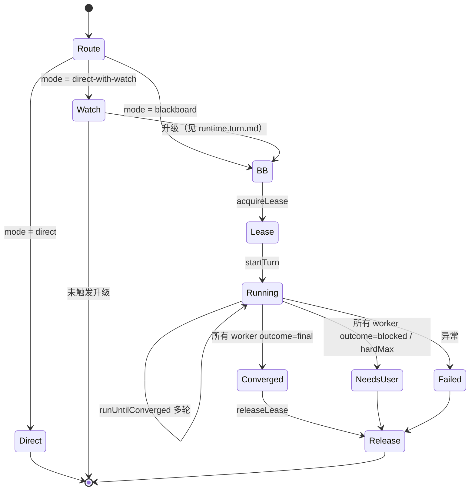
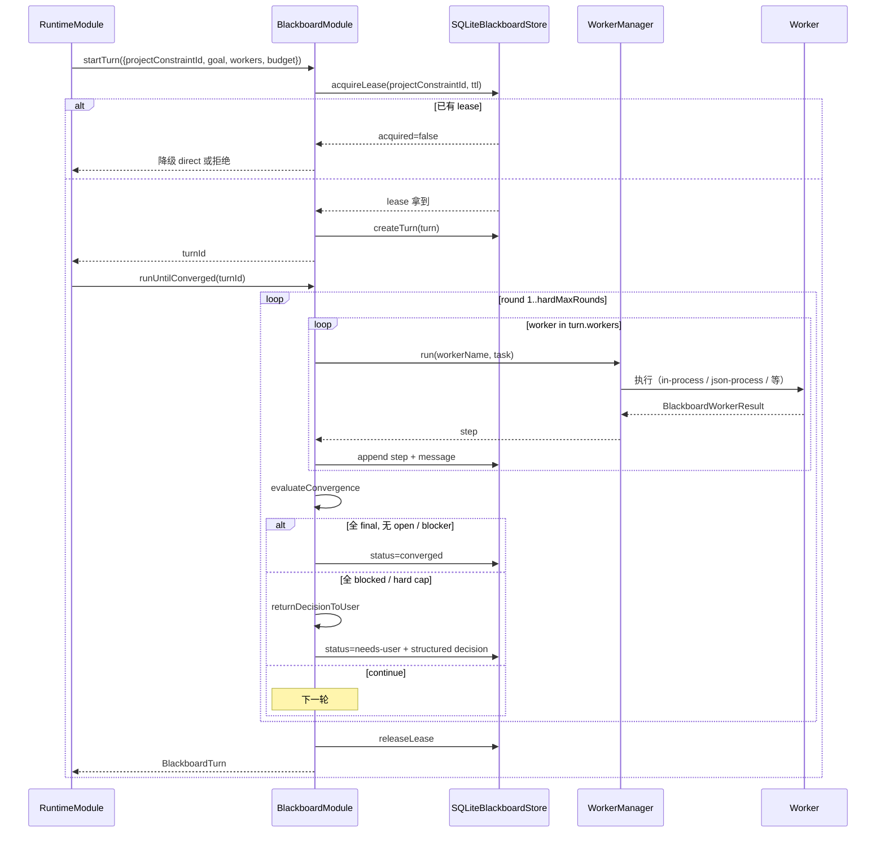
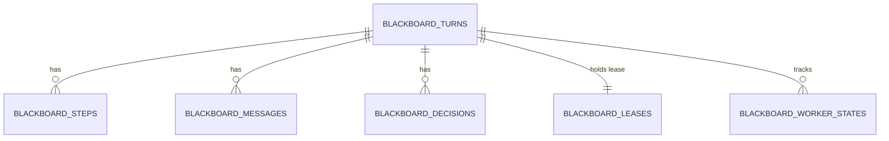

# 黑板系统

## 一句话定位

黑板是复杂任务的「可观察、可收敛、可交还」工作台：simple 走 direct、灰区走 direct-with-watch、复杂走 blackboard；模型按 `blackboard.route.md` 生成 worker plan，WorkerManager 跑 turn，BlackboardModule 控制收敛与 lease。

## 相关代码路径

- `src/agent/blackboard/blackboard.module.ts` — turn / step / decision / lease 控制
- `src/agent/blackboard/sqlite.ts` — 持久化（turn / step / decision / lease / message）
- `src/agent/blackboard/types.ts` — 公共结构
- `src/agent/worker/worker.manager.ts` — registry / pool / 超时 / 事件
- `src/agent/worker/blackboard.worker.ts` — 通用模型 worker 注册
- `src/agent/worker/types.ts` — runtime kind / interaction kind
- `src/agent/runtime/blackboard.route.ts` — `blackboard.route.md` 调用与 JSON 校验
- `templates/prompts/blackboard.route.md` / `blackboard.worker.system.md` / `blackboard.decision.md` / `blackboard.advisory.md`

## 执行模式



## Worker plan 动态生成

`blackboard.route.md` 必须返回 `workers` 数组，每项形如：

```json
{
  "role": "requirements-boundary",
  "stage": "analysis",
  "handoff": "analysis | implementation | proposal | review | structure | summary | verification",
  "capabilities": ["..."],
  "dependsOn": []
}
```

- 默认只注册一个通用模型型 blackboard worker（`BLACKBOARD_MODEL_WORKER_NAME`）。
- 若 role 没有显式外部 worker，`WorkerManager` 路由到通用模型 worker，并把 role 写入任务信封。
- `workers` 数量上限 5；不强制角色名集合，由当前请求语义决定。

## 一轮黑板的时序



## 收敛规则

- `BlackboardWorkerOutcome`：`final` / `continue` / `blocked`。
- 全部 worker `outcome = final`、无 `openIssues` / blocker、无 `agreement: false` → **converged**。
- 全部 worker `outcome = blocked`、存在 blocker / openIssues → **needs-user**（只写结构化 decision，不写用户可见 decision-form）。
- 默认 `minRounds = 1` / `maxRounds = 3` / `hardMaxRounds = 5`；hardMax 触顶仍未收敛 → needs-user，附最多 8 条 unresolved issues。
- 若 metadata 声明 `forceHardCap`（如「非收敛性 contract」），调度器跑到 hardMax 后再交还。
- 仅口头 `agreement: true` 不能终止讨论，必须有 `outcome: final`。

## Worker 协议

```ts
type WorkerRuntimeKind =
  | "in-process"
  | "json-process"
  | "persistent-json-process"
  | "thread" | "process"
  | "agent-cli" | "tui";

type WorkerInteractionKind = "one-shot" | "persistent" | "interactive";

type WorkerTaskStatus = "queued" | "running" | "completed" | "failed" | "timeout";

interface BlackboardWorkerResult {
    outcome: "final" | "continue" | "blocked";
    agreement?: boolean;
    proposal?: string;
    questions?: string[];
    answers?: string[];
    openIssues?: string[];
    blockers?: string[];
    newFacts?: string[];
}
```

`json-process` / `persistent-json-process` 协议：

```json
// stdin：单行 JSON
{ "context": { "taskId", "workerName", "runtime", "requestId", "projectConstraintId", "turnId" }, "input": {} }

// stdout：单行 JSON（persistent 用 id 对齐）
{ "id": "task-id", "output": {} }
```

stderr 只做诊断，不进入模型上下文。

## Project constraint lease

```sql
CREATE TABLE blackboard_leases (
    project_constraint_id TEXT PRIMARY KEY,
    turn_id TEXT NOT NULL,
    request_id TEXT NOT NULL,
    acquired_at TEXT NOT NULL,
    expires_at TEXT NOT NULL
);
```

- TTL 默认 15 分钟；崩溃后到期自动释放。
- 同 project constraint 同时只允许一个 blackboard turn；冲突时降级 direct 或返回「已有任务运行中」。

## Needs-user 交还格式

`needs-user` 是正常出口。`BlackboardModule.returnDecisionToUser` 会：

- 把 unresolved issues 收敛成 `BlackboardDecision`（`kind=single-choice`、`options[]`、`metadata.openQuestions`）。
- 发布 `blackboard.livelock.detected` 事件。
- 释放 project constraint lease。
- 由 `RuntimeModule` 读取结构化 decision，合成 `AgentAsk`（`reason=blackboard-stalemate`）并向用户提问。

旧 `flyflor-decision-form` 用户可见系统消息已退役；测试只保留 negative assertion，确保不再写入 transcript。

## 状态持久化表



CLI `flyflor blackboard` 在 TTY 下进入黑板浏览 TUI，可搜索、上下选择并进入 turn 详情；`flyflor blackboard list` / `show <turnId>` 继续直接消费这些表，保留脚本化排查入口（见 `cli.commands.md`）。

## 事件清单

| 事件 | 触发点 |
| --- | --- |
| `agent.complexity.assessed` | 路由完成（保留） |
| `agent.blackboard.escalated` | watch 升级到 blackboard |
| `blackboard.lease.acquired` / `released` | lease 状态 |
| `blackboard.turn.start` / `end` | turn 状态 |
| `blackboard.worker.start` / `end` | 单个 worker 执行 |
| `blackboard.message.appended` | 讨论消息落盘 |
| `blackboard.livelock.detected` | 触顶 hardMax |
| `blackboard.decision.requested` | 写入结构化 decision，供 runtime 合成 Ask |
| `worker.task.queued` / `start` / `end` / `failed` | WorkerManager 内事件 |

## 记忆边界

worker **不能**直接写长期记忆：

- 允许：写 blackboard step / decision、写 journal episode、通过模型输出合法 `memory_action` 走 Memory Action 链路。
- 禁止：worker prompt 改 Markdown、关键词把讨论自动晋升长期记忆、unresolved blocker 当长期事实。

收敛黑板 → `recordDebateEpisode` 高权重 episode（`sourceKind = blackboard-converged`，evidence weight 0.8）。

## 配置

- `RoutingConfig.watchEscalationThreshold` — direct-with-watch 连续命中升级阈值（默认 3）
- `RoutingConfig.blackboardFailureEscalationThreshold` — 黑板未收敛连续轮数（默认 2）
- 黑板 budget 来自 `BlackboardStartRequest.budget`，默认 `minRounds=1 / maxRounds=3 / hardMaxRounds=5 / maxWorkerContextChars=12_000`
- lease TTL 默认 `DEFAULT_LEASE_TTL_MS = 15 * 60 * 1000`

## 风险点 / 已知缺口

- direct-with-watch 升级已接入工具失败 / 上下文压力资源指标，但未读取 worker 内部复杂语义信号。
- chat TUI 已能在 assistant 消息下回填 `BlackboardModule.getTurn(turnId)` 的快照并展示 workers / steps / public messages / decision；但仍**未实时流式订阅 worker.step**。
- 进程隔离（Bun Worker / 子进程）阶段未完成；当前 worker 大多 in-process。
- `BlackboardWorkerRole` 仅类型别名 `string`，没有 enum 约束，靠模型生成 + capabilities 字段约束。

## 相关测试

- `tests/blackboard.boundaries.test.ts`
- `tests/workers.boundaries.test.ts`
- `tests/worker.raw.stdio.test.ts`
- `tests/route.escalation.test.ts`
- `tests/chaos.fuzz.test.ts`
