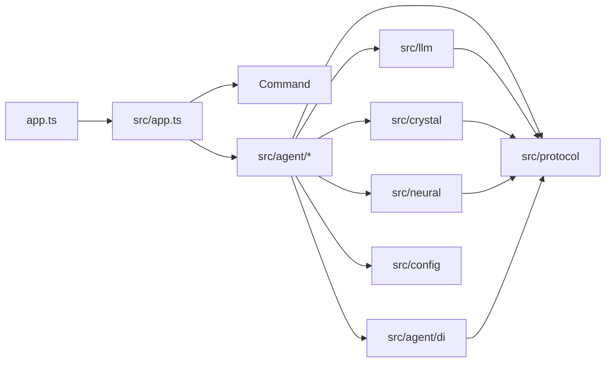

# 工程边界与红线

## 一句话定位

本文是源码、依赖、构建、配置和安全的硬性边界。任何 PR 在合入前必须满足这里的全部要求；与本文冲突的实现一律打回。

## 1. 项目定位

- 单文件二进制目标：`bun build --compile --target=bun --packages=bundle --reject-unresolved`。
- 输入渠道统一归一化为 `GatewayMessage`。
- 智能体执行可观察、可中断、可恢复、可审计。
- 工具 / MCP / 插件 / 技能 / 记忆都有显式边界。

## 2. 目录与命名

```
app.ts            程序入口，只做版本/命令分派
src/app.ts        FlyFlor composition root
src/command/      CLI / TUI / 命令注册 / 终端渲染
src/agent/        runtime / gateway / blackboard / session / sandbox / worker / mcp / project / plugin
src/agent/di/     @Module / @Provide / @Inject metadata 与显式容器
src/llm/          模型 provider
src/crystal/      reflection / Gem / skill
src/neural/       海马体记忆
src/protocol/     枚举 / 事件 / contract / 信封
src/config/       JSONC 配置 + 默认值 + 路径
templates/        提示词与记忆 Markdown 模板
```

命名规则（点分后缀是硬规则）：

- 目录入口统一 `index.ts`；跨目录导入优先指向 `index.ts`。
- 实现文件按角色加点分后缀：`*.module.ts` / `*.service.ts` / `*.worker.ts` / `*.manager.ts` / `*.adapter.ts` / `*.store.ts` / `*.route.ts` / `*.executor.ts`。
- 提示词 / 模板 / 脚本 / 测试辅助同样点分：`blackboard.route.md` / `blackboard.route.zh.cn.md` / `build.docker.binary.ts`。
- 禁止连字符或下划线命名仓库文件（`component-factory.ts` / `memory_context.md` 均不允许）。
- 单职责短文件保留语义名：`types.ts` / `scope.ts`。
- 用户工作区文件保留领域约定：`MEMORY.md` / `SELF.md` / `SOUL.md` / `USER.md`。

## 3. 导入方向



硬规则：

- `llm` / `crystal` / `neural` / 能力实现禁止 import `command` 或入口层。
- `gateway` 不知道模型 provider；`blackboard` 不执行工具或写长期记忆；`worker` 不动态扫描或动态 import。
- `session` 是 session scope 的唯一计算入口；其他目录不得重新实现。
- `sandbox` 是工具 / shell / 网络 / 插件 / MCP 副作用的唯一审批边界。
- `command` / `gateway` 必须通过 runtime facade，不绕过 runtime 自驱 agent loop。
- 跨目录禁止深层私有导入；先在 `index.ts` 暴露 public API。
- `protocol` / `agent/di` 不能成为垃圾桶；只服务单一领域的类型必须回到对应目录。

## 4. Decorator 白名单

只保留：`@Module` / `@Provide` / `@Inject` / `@Service` / `@Component` / `@Worker` / `@Channel` / `@Plugin`。

- `@Provide` 是注入底座；Gateway / Blackboard / Memory / Session / Runtime / Sandbox 用 `class XModule extends X` 表达边界语义。
- 不新增专用 decorator，不使用 reflect-metadata，不做自动目录扫描，不做动态 require / import。
- 依赖注入仅在 composition root 使用显式 token/provider 绑定。

## 5. 类型与协议

- 公共类型放在领域内 `types.ts` 或 `index.ts`；跨目录必须经过显式 TypeScript 类型。
- 运行时事件必须可 JSON 序列化，禁止携带 class instance / function / stream / socket。
- 外部输入进入核心前必须 schema 校验；`unknown` / `any` 只能在第三方边界短暂存在，必须在同一函数收敛。
- 错误必须保留机器可读 `code`，用户文案与调试信息分离。
- 协议值使用枚举或常量对象，不裸写字符串。新增协议值先放 `src/protocol/contracts/enums.ts`。

## 6. Bun 与二进制编译

```bash
bun build --compile --target=bun --packages=bundle --reject-unresolved \
  --define process.env.FLYFLOR_BUILD_COMMIT="'$(git rev-parse --short HEAD)'" \
  --outfile dist/flyflor app.ts
```

硬规则：

- 运行时不依赖用户机器存在 `node_modules`。
- 不从依赖包目录读取 schema / wasm / 二进制 / 模板，除非构建明确把它们复制到产物旁。
- 内部提示词模板必须由安装脚本复制到 `~/.flyflor/prompts` 与 `~/.flyflor/templates/*`；缺失即报错，不写兜底。
- 禁止无法静态解析的 `import()` / `require()` / 按用户输入加载 npm 包。
- 禁止要求安装 Node.js；开发与发布都以 Bun 为准。
- 必须启用 `--reject-unresolved`。
- 不把 `.env`、本地日志、会话数据库、密钥、测试 fixture 编译进二进制。

## 7. 依赖准入

新增生产依赖前先回答四个问题：

1. 编译成二进制后是否仍可运行？
2. 是否需要 native addon / postinstall / 外部命令？
3. 能否用 Bun / Web 标准 API 或少量本地代码替换？
4. 失败时是否能降级，还是阻断整个 runtime？

允许：ESM、可静态打包、无 postinstall、无强制 native addon、license/维护可接受。

禁止：

- 为小函数引入大依赖（`lodash-es` 是低频允许的基础工具库；热路径优先原生实现）。
- import 时修改全局状态。
- 默认联网 / 默认采集遥测 / 默认读取用户目录。
- 没有适配层就把 provider SDK 深埋核心。

## 8. 配置与密钥

- 全局：`~/.flyflor/config.jsonc`；Docker dev：`./docker/config/config.jsonc`。所有 JSON 配置必须兼容 JSONC（注释 + 尾逗号）。
- 业务配置不走环境变量；provider / 模型 / 渠道凭据 / 沙箱策略 / 网关行为必须走 config 或 secrets provider。
- 默认目录、默认 provider、默认 channel registry 在代码中给出约定；配置只覆盖差异。
- provider key / MCP token / 插件 token 不得写入日志、事件 payload、错误详情或记忆。
- 配置对象进入核心后视为只读。
- 默认配置必须能离线启动；需要联网的能力必须显式启用。

目录约定：

```
~/.flyflor/
  config.jsonc
  prompts/                    # 内部提示词模板（不属于用户工作区）
  templates/memory/           # MEMORY/SELF/SOUL/USER 初始模板
  templates/projects/         # 项目骨架模板
  workspace/                  # 用户工作区（可编辑）
    SELF.md / SOUL.md / USER.md / MEMORY.md
    projects/<projectId>/
    .flyflor/{skills,mcp,plugins,memory}/  # 项目局部 capability
  skills/ / mcp/ / plugins/   # 全局 capability
  logs/                       # 审计日志
```

## 9. 工具与沙箱

- 工具调用必须经 `SandboxPolicy` 决策（`deny` / `ask` / `allow`）。
- `mcp-tool` / `plugin` / `shell-hook` 三类能力共享同一审批协议。
- 跨进程消息必须 JSON 可序列化；子进程必须有 start / ready / heartbeat / stop / crash / restart backoff。
- 使用 `Bun.spawn`：必须显式设置 cwd、env 白名单、超时、stdin/stdout/stderr 策略、退出码。
- MCP stdio：cwd = 项目根；env 只继承 PATH/HOME/TMPDIR/locale + 配置显式声明。stdout 走 MCP `Content-Length` framing；stderr 截断后只用于诊断，不进入模型上下文。
- YOLO 模式只放宽默认审批为 allow，不能绕过审计 / cwd / 超时 / 输出限制 / 协议校验。
- CLI 临时覆盖只改本次 invocation 策略，不写长期配置。

## 10. 业务语义判断零字符匹配（全局红线）

业务语义判断必须满足以下三种之一：

1. **结构化协议字段**：模型同轮返回的 `mode` / `type` / `action` / `memory_action` / `route` 等字段，代码只做枚举 / JSON shape 校验。
2. **专用提示词模板**：通过 `templates/prompts/*.md` 调用模型生成 JSON，代码只校验 shape。
3. **数学/统计指标**：纯数值阈值（importance、cosine、cluster size、TTL、token 预算）可写死。

明确禁止：

- `text.includes("记住")`、正则识别意图、`message.endsWith("?")` 判断对话类型。
- 关键词列表 / 停用词表过滤 / 分类 / 归桶 episode / memory_node / skill / concept。
- 「消息小于 N 字 → direct」这类业务启发式（用 token 数代替不算，但要明确写为资源指标）。
- 维护「项目类关键词」「问题类关键词」「反馈类关键词」等任何 hand-crafted lexicon。
- 用情感词典或正则提取 valence / arousal / importance。
- 把模型自然语言再用字符串匹配二次解析；模型必须返回 JSON。

唯一例外：

- CLI flag / 配置 key / 环境变量 / 文件后缀 / URL scheme 等纯协议层匹配。
- 无业务语义的字符串处理（trim、split、token 截断、UUID 校验、JSON 解析）。
- 不可绕过的安全过滤（secrets 字段名脱敏）。

## 11. 记忆与数据

- 用户当前指令优先级最高。
- 长期记忆只保存稳定偏好、项目事实、明确结论、可复用方法。
- 工具输出 / 日志 / stack trace / 大文件不能无筛选写入长期记忆。
- 记忆写入必须记录来源、时间、session key 和 schema version。
- 删除会话必须能删除对应索引、摘要和向量记录。

## 12. 可观察性

- 事件命名 `domain.action`（例：`agent.turn.start`、`blackboard.lease.acquired`）。
- 事件必须 JSON 可序列化；payload 不携带密钥 / `.env` / 未脱敏 header。
- 大 payload 必须摘要化并提供 debug 开关。
- 事件必须在无 UI 环境可消费。

## 13. 开发检查

提交功能前至少运行：

```bash
bun run check         # tsc --noEmit
bun test              # 已注册测试套件
bun run build:binary  # 二进制可编译
```

涉及工具 / MCP / 插件 / 文件系统 / shell / 网络 / 记忆 / provider 时必须补对应测试或最小验证脚本。
