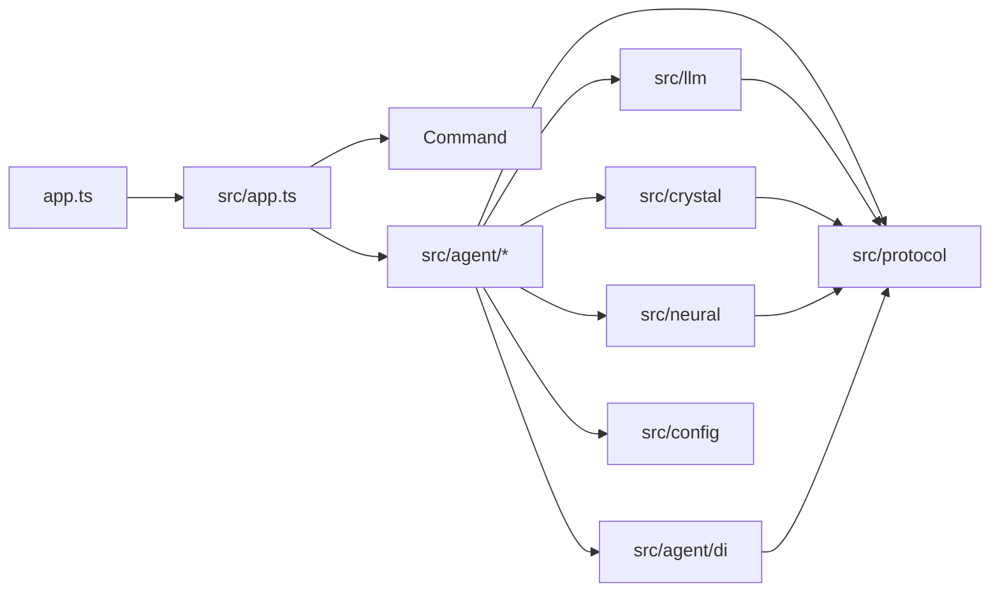

# 工程边界与红线

## 一句话定位

本文是源码、依赖、构建、配置和安全的硬性边界。任何 PR 在合入前必须满足这里的全部要求；与本文冲突的实现一律打回。

## 1. 项目定位

- 单文件二进制目标：`bun build --compile --target=bun --packages=bundle --allow-unresolved=""`。
- 输入渠道统一归一化为 `GatewayMessage`。
- 智能体执行可观察、可中断、可恢复、可审计。
- 工具 / MCP / 插件 / 技能 / 记忆都有显式边界。

## 2. 目录与命名

```
app.ts            程序入口，只做版本/命令分派
src/app.ts        FlyFlor composition root
src/command/      CLI / TUI / 命令注册 / 终端渲染
src/agent/        runtime / gateway / blackboard / sandbox / worker / mcp / project / plugin
src/agent/di/     @Module / @Provide / @Inject metadata 与显式容器
src/llm/          模型 provider
src/crystal/      reflection / Gem / drift
src/neural/       海马体记忆
src/context/      显式 project / fork / capability scope 装配
src/entities/     领域实体、row / record 映射、repo SQL
src/protocol/     枚举 / 事件 / contract / 信封
src/config/       JSONC 配置 + 默认值 + 路径
templates/        提示词与记忆 Markdown 模板
```

命名规则（点分后缀是硬规则）：

- 目录入口统一 `index.ts`；跨目录导入优先指向 `index.ts`。
- 实现文件按角色加点分后缀：`*.module.ts` / `*.worker.ts` / `*.manager.ts` / `*.adapter.ts` / `*.store.ts` / `*.repo.ts` / `*.route.ts` / `*.executor.ts`。目录内唯一 Component owner 必须直接命名为 `component.ts`；只有同目录存在多个组件边界时才使用 `*.component.ts` 加限定前缀。
- 提示词 / 模板 / 脚本 / 测试辅助同样点分：`blackboard.route.md` / `blackboard.route.zh.cn.md` / `build.docker.binary.ts`。
- JSX 环境声明也必须点分命名，例如 `solid.jsx.d.ts`，不要再回到 `solid-jsx.d.ts` 这类连字符文件名。
- 禁止连字符或下划线命名仓库文件（`component-factory.ts` / `memory_context.md` 均不允许）。
- 单职责短文件保留语义名：`types.ts` / `scope.ts`。
- 用户工作区文件保留领域约定：`MEMORY.md` / `SELF.md` / `SOUL.md` / `USER.md`。

## 3. 导入方向



硬规则：

- `llm` / `crystal` / `neural` / 能力实现禁止 import `command` 或入口层。
- `gateway` 不知道模型 provider；`blackboard` 不执行工具或写长期记忆；`worker` 不动态扫描或动态 import。
- 当前注意力连续性由 `FocusPointer` 协议字段、codename 锚点和 memory activation 共同表达；实现入口在 `src/protocol/contracts/memory.atom.ts`、`src/neural/project` 与 `src/neural/memory`。其他目录不得重新实现隐式会话容器。
- `sandbox` 是工具 / shell / 网络 / 插件 / MCP 副作用的唯一审批边界。
- `command` / `gateway` 必须通过 runtime facade，不绕过 runtime 自驱 agent loop。
- 跨目录禁止深层私有导入；先在 `index.ts` 暴露 public API。
- `protocol` / `agent/di` 不能成为垃圾桶；只服务单一领域的类型必须回到对应目录。

## 4. Decorator 白名单

只保留：`@Module` / `@Provide` / `@Inject` / `@Component` / `@Event` / `@Worker` / `@Channel` / `@Plugin`。

- `@Provide` 是注入底座；`@Module` / `@Component` 必须复用 `Provide` 的 metadata 注册路径，禁止各自维护第二套注入协议。
- Gateway / Blackboard / Memory / Runtime / Sandbox / Context / Crystal 等边界必须优先用 `FlyflorComponent` 继承链表达：`class MemoryModule extends Memory`、`class ContextScopeComponent extends ContextComponent`、`class CrystalMemoryComponent extends CrystalComponent`。
- 本地状态与 IO 存储属于 Component：`BrainStore`、`SQLiteGraphStore`、`SQLiteMemoryStore`、Markdown/project memory store 等必须继承 `BrainComponent` / `GraphComponent` / `SQLiteComponent` / `MemoryComponent`，避免回退成额外中间层或散落工具类。
- Redis / SurrealDB 作为原型定位继续保留 `RedisComponent` / `SurrealComponent` 基类；默认运行时不启用外部 Redis / SurrealDB backend，未来恢复外部存储时必须通过这两个 Component 边界接入。
- `kind` / `layer` / `provider` 默认由 `FlyflorComponent` 继承链与类名推断；`name` 只作展示字段，不参与注入匹配；`tags` 不用于 `@Module` / `@Component`。
- `@Component()` / `@Module()` 默认无参数、默认单例；只有偏离默认值（例如 factory scope、channel / worker / plugin 特例）时才显式写参数。
- `@Event(type)` 只登记显式事件 hook metadata，不做反射类型推断、不扫描目录；实例必须由 composition root 或组件 owner 调用 `EventsComponent.registerHooks(instance)` 显式接入。
- Runtime 副作用优先事件化：主 turn pipeline 可以发布结构化 RuntimeEvent，统计、审计、usage、后处理等非路由关键路径放在 `*.event.ts` handler；handler 只能消费 JSON payload 和显式注入组件，不能反向读取自然语言做业务判断。
- 不新增专用 decorator，不使用 reflect-metadata，不做自动目录扫描，不做动态 require / import。
- 依赖注入仅在 composition root 使用显式 token/provider 绑定；允许 `DependencyContainer.bindClass()` 按构造函数 `@Inject(ClassToken)` 自动实例化，但注册目标仍必须由 composition root 显式列出。
- DI key 优先使用 class 对象本身：`@Inject(RuntimeModule)`、`container.resolve(RuntimeModule)`。`ConfigComponent` / `RuntimeModeComponent` / `EventsComponent` / `ModelComponent` / `AdaptersComponent` 这类边界必须是域内 `component.ts` 的真实组件，不能只是空壳 token；只有非 class 值才使用 `createInjectionToken()` 创建对象 token；禁止新增裸字符串 token。
- 公开 API 必须显式写 `public`；内部状态和 helper 保持 `private` / `protected`，避免隐式可见性漂移。可被子类定制的生命周期、factory、storage hook 预留 `protected`，不要为了“封闭”而把扩展点无脑写死为 `private`。

## 4.1 OOP + use composition 编程风格

- 业务能力默认用 class / Component / Module / Repo 表达；局部 helper 应优先变成 `private` / `protected` class 方法，不能散落在文件底部形成“函数垃圾区”。
- 跨 class 的组合入口统一使用 `useXxx()` composition。`useXxx()` 可以返回 class 实例或装配对象，但它只做装配，不承载复杂业务流程。
- 目录约定优先于文件长名：`src/config/component.ts` 已经表达 config 域，不再写 `config.component.ts`；`src/llm/component.ts` 已经表达 model provider 域，不再写 `model.component.ts`。长名只用于同目录多 owner 或协议需要显式区分时。
- 允许的函数形态只有：`useXxx()` composition 入口、CLI / script / app 的薄入口、框架强制导出的 handler、测试 fixture、小型纯协议 adapter（例如 tagged template `query`）以及 TypeScript 类型守卫。除此之外新增顶层 `function` 前必须先考虑 class 方法或 `*.composition.ts`。
- 已存在的大型函数式模块要按触碰即迁移原则处理：改到该文件时必须把同一职责的 helper 收进 class / Component，或者抽到同目录 `*.composition.ts` 并用 `useXxx()` 命名；禁止继续追加新的无归属 helper。
- Crystal / Gem 这类晶体智力流程必须有明确 Component owner；保留的顶层函数只能作为兼容旧 public API 的薄壳，新增调用优先依赖 `CrystalReflectionComponent` / `CrystalGemComponent` 等组件实例。
- Crystal 向量检索的 tokenizer / hash / cosine / freshness 数值逻辑必须由 `CrystalVectorCodec` 拥有；`vector.index.ts` 的函数导出只能作为兼容薄入口。
- Runtime planning 的 `TaskPlan` / `ContextFork` / `SceneRecord` 解析必须由 `PlanningBlockParser` 拥有；runtime 主链和新增代码直接持有 class 实例，`parsePlanningBlocks()` 只作为外部兼容薄入口，禁止继续在 `blocks.ts` 增加解析 helper。
- Runtime planning 的回复 metadata 压缩必须由 `PlanningMetadataBuilder` 拥有；runtime 主链直接持有 builder 实例，metadata 文件只允许暴露 builder 和兼容薄入口，不能继续追加游离 compact helper。
- Runtime 黑板路由 prompt 调用、JSON 校验、worker plan 归一化和 contract 读取必须由 `RuntimeBlackboardRouteComponent` 拥有；`route.ts` 兼容函数只能委托该组件。
- Runtime 黑板文本投影、history scene、ask handoff 必须由 `RuntimeBlackboardOutputComponent` 拥有；`output.ts` 可以保留兼容导出，但不能继续追加新的格式化 helper。
- Runtime Ask 渲染、turn timing 和 working-memory 健康判定分别由 `AskReplyRenderer`、`TurnTiming`、`WorkingMemoryHealthInspector` 负责；兼容函数只作转发。
- Memory prompt nudge 渲染由 `MemoryModule` 持有；pending project / skill offer 与 EQ directive 只能消费结构化 store/state 字段，不得把 nudge helper 散落成新的业务入口。
- `src/neural/project/triggers.ts` 的显式意图、cluster 候选、skill 升格和 codename 升格判定必须由 `ProjectTriggerDetector` 负责；兼容函数只能转发，不得继续扩散 helper。
- 约定优先于抽象：迁移不是为了消灭重复代码，而是为了让生命周期、状态、IO 副作用和协议边界有明确 owner。重复的 5-10 行值转换可以保留在对应 class 内，不为了“复用”抽成跨域工具函数。
- 目录约定优先于长文件名：模块拥有的 store 必须留在模块目录内；单一职责子目录优先命名为 `store.ts` / `types.ts`，例如 `src/neural/memory/brain/store.ts`、`src/neural/memory/working/store.ts`、`src/agent/blackboard/store.ts`。禁止把模块 store 或兼容导出塞回 `src/components/memory` / `src/components/crystal` 这类假边界目录。
- `src/components` 只承载共享 Component 基类与真正跨模块基础设施（例如 SQL tagged template）；不得按领域开 `components/<domain>` 目录。

## 4.2 数据模型与 SQL Repo

- SQLite 访问分三层：`src/entities/**/*.repo.ts` 是表模型 + SQL function，模块内 `store.ts` 负责连接生命周期 / schema / 事务组合，模块 `component.ts` 对上表达能力边界。
- `*.entity.ts` 是 data entity layer，只负责 row / record 映射、JSON 列编解码和轻量 shape 校验，不写 SQL；例如 `src/entities/memory/*.entity.ts`、`src/entities/crystal/*.entity.ts` 与 `src/entities/blackboard/*.entity.ts`。
- Repo 不是 service 层：不得调用 LLM、prompt、runtime、gateway、TUI 或业务决策；只能接收结构化 DTO、执行 SQL、映射 row。
- 新增表或高频 SQL 必须优先建立 `src/entities/<domain>/tablename.repo.ts`，例如 `brain.event.repo.ts`、`brain.state.repo.ts`、`brain.summary.repo.ts`、`local.crystal.repo.ts`；确实跨领域公用的 repo 才放 `src/entities/repo/`。
- 新增 repo SQL 必须使用 `query\`SELECT ... ${value}\`` tagged template；插值只允许值参数并转成 SQLite `?`，禁止字符串拼接值进入 SQL。
- 表名、列名和排序字段必须是 repo 内部字面量。确需动态 identifier 时先设计白名单 helper 和测试，不能直接插值用户输入。
- `brain.db` 热路径仍保持单库；低频详情可以由 repo 写 sidecar，但 `brain.db` 必须保留摘要索引和可恢复审计。

## 5. 类型与协议

- 公共类型放在领域内 `types.ts` 或 `index.ts`；跨目录必须经过显式 TypeScript 类型。
- 运行时事件必须可 JSON 序列化，禁止携带 class instance / function / stream / socket。
- 外部输入进入核心前必须 schema 校验；`unknown` / `any` 只能在第三方边界短暂存在，必须在同一函数收敛。
- 错误必须保留机器可读 `code`，用户文案与调试信息分离。
- 协议值使用枚举或常量对象，不裸写字符串。新增协议值先放 `src/protocol/contracts/enums.ts`。
- 面向模型输出的内部结构化块统一登记在 `src/protocol/structured.block.ts`；各业务模块只负责对应 JSON payload 的 schema 校验，不能重复手写 tag、close tag、正则剥离或私有协议名。当前允许的内部块包括 `AgentAsk`、`GhostDecisions`、`IdentityAppend`、`MemoryActions`、`McpCalls`、`TaskPlan`、`ContextFork`、`SceneRecord`。
- Gateway 出站生命周期（typing、message edit、card update、reaction、thread create）必须走 `GatewayOutboundOperation` + `GatewayChannelCapabilities`；adapter 不得用自然语言文本、私有字符串或隐式布尔推断平台能力。
- 新增代码必须带必要注释解释边界、生命周期、副作用或协议意图；修改旧代码时补齐被触碰路径的关键注释。注释应解释“为什么/边界是什么”，避免机械复述代码。
- 源码、测试、模板、脚本和文档不得出现疑似真实 provider 密钥。测试只能使用明显的非厂商占位值（例如 `test-openai-key-*`），让 `sk-*` 这类厂商格式在发布扫描中保持高信噪比；本机或 Docker dev 的私有配置文件只由用户自己管理，不在清理任务中自动改写。

## 6. Bun 与二进制编译

```bash
bun build --compile --target=bun --packages=bundle --allow-unresolved="" \
  --define process.env.FLYFLOR_BUILD_COMMIT="'$(git rev-parse --short HEAD)'" \
  --outfile dist/flyflor app.ts src/command/tui/chat/parser.worker.ts
```

硬规则：

- 运行时不依赖用户机器存在 `node_modules`。
- 不从依赖包目录读取 schema / wasm / 二进制 / 模板，除非构建明确把它们复制到产物旁。
- 内部提示词模板必须由安装脚本复制到 `~/.flyflor/prompts` 与 `~/.flyflor/templates/*`；缺失即报错，不写兜底。
- 安装分发固定三条路径：`install.sh` 只做 release 二进制 + 模板包安装；`install.source.sh` / `install.ps1` 必须把源码 checkout 留在用户本机；`install.docker.sh` 必须保留本机源码并启动既有 compose，不在 compose 内安装依赖或构建项目。`flyflor-templates.tar.gz` 必须由 `build:templates:release` 生成，tar 根布局直接对应安装前缀，禁止发布时手工拼包。
- curl-pipe / PowerShell bootstrap 脚本属于发布协议，新增选项必须同步 README 与 `tests/install.script.test.ts`，避免安装入口漂移。
- 运行时提示词正文只能放在 `templates/prompts/*.md`；TypeScript 代码只允许读取模板、替换占位符和拼接结构化数据，不允许内嵌会注入模型上下文的提示词段落。会作为 `ModelRole.User` / worker task 发给模型的 JSON envelope 也按提示词模板管理。
- 禁止无法静态解析的 `import()` / `require()` / 按用户输入加载 npm 包。
- 禁止要求安装 Node.js；开发与发布都以 Bun 为准。
- 当前必须启用 `--allow-unresolved=""` 兼容 OpenTUI 的 opaque dynamic import；同时保留 `src/command/tui/chat/parser.worker.ts` 作为第二个 compile entrypoint，保证 TreeSitter worker 及其依赖进入独立二进制。新增依赖仍不得引入新的运行时动态加载要求。
- 不把 `.env`、本地日志、会话数据库、密钥、测试 fixture 编译进二进制。

## 7. 依赖准入

新增生产依赖前先回答四个问题：

1. 编译成二进制后是否仍可运行？
2. 是否需要 native addon / postinstall / 外部命令？
3. 能否用 Bun / Web 标准 API 或少量本地代码替换？
4. 失败时是否能降级，还是阻断整个 runtime？

允许：ESM、可静态打包、无 postinstall、无强制 native addon、license/维护可接受。

禁止：

- 为小函数引入大依赖（`lodash-es` 是低频允许的基础工具库；热路径优先原生实现）。
- import 时修改全局状态。
- 默认联网 / 默认采集遥测 / 默认读取用户目录。
- 没有适配层就把 provider SDK 深埋核心。

## 8. 配置与密钥

- 全局：`~/.flyflor/config.jsonc`；Docker dev：`./docker/config/config.jsonc`。所有 JSON 配置必须兼容 JSONC（注释 + 尾逗号）。
- 本地交互命令：`~/.flyflor/commands.jsonc`。它只定义 TUI / app slash command rules，不能放 provider、渠道凭据、sandbox 模式或网关行为；内置规则按 `run.action` 合并，用户扩展用 `match.slash` + `run.type` 追加，禁止再引入独立 `id` 字符串命名层。
- `/project` / `/projects` / `/fork` / `/forks` 都是本地命令协议层行为：它们只负责把结构化 project / fork 选择写回 `RuntimeContext.activeProject` / `contextForkId`，不能反向变成隐式 session 容器。
- 业务配置不走环境变量；provider / 模型 / 渠道凭据 / 沙箱策略 / 网关行为必须走 config 或 secrets provider。
- 默认目录、默认 provider、默认 channel registry 在代码中给出约定；配置只覆盖差异。
- OpenAI-compatible provider 的最小配置是 `baseUrl` + `apiKey` + 当前模型；`type`、默认 `chat-completions` 和模型列表由加载器推断 / 探测。自动化代理不得把用户本地 `config.jsonc` 中正在使用的 `apiKey` 改成占位符。
- provider key / MCP token / 插件 token 不得写入日志、事件 payload、错误详情或记忆。
- 配置对象进入核心后视为只读。
- 默认配置必须能离线启动；需要联网的能力必须显式启用。
- OOP + use composition 是硬边界：业务能力用 class / Component 表达；跨 class 的组合装配只允许写在对应模块的 `composition.ts` 中，并统一用 `useXxx()` 命名；禁止在业务文件里散落无归属 helper function 去拼装依赖或路径。
- `index.ts` 只做 barrel export：单出口可以直接一行 export；多出口必须拆到明确角色文件后再汇总，禁止把实现逻辑、class 主体或 helper function 写进 `index.ts`。

目录约定：

```
~/.flyflor/
  config.jsonc
  commands.jsonc              # TUI / app slash command rules
  prompts/                    # 内部提示词模板（不属于用户工作区）
  templates/memory/           # MEMORY/SELF/SOUL/USER 初始模板
  templates/projects/         # 项目骨架模板
  workspace/                  # 用户工作区（可编辑）
    SELF.md / SOUL.md / USER.md / MEMORY.md
    projects/<projectId>/
    .flyflor/{skills,mcp,plugins,memory}/  # 项目局部 capability
  skills/ / mcp/ / plugins/   # 全局 capability
  logs/                       # 审计日志
```

## 9. 工具与沙箱

- 工具调用必须经 `SandboxPolicy` 决策（`deny` / `ask` / `allow`）。
- `mcp-tool` / `plugin` / `shell-hook` 三类能力共享同一审批协议。
- 跨进程消息必须 JSON 可序列化；子进程必须有 start / ready / heartbeat / stop / crash / restart backoff。
- 使用 `Bun.spawn`：必须显式设置 cwd、env 白名单、超时、stdin/stdout/stderr 策略、退出码。
- MCP stdio：cwd = 项目根；env 只继承 PATH/HOME/TMPDIR/locale + 配置显式声明。stdout 走 MCP `Content-Length` framing；stderr 截断后只用于诊断，不进入模型上下文。
- YOLO 模式只放宽默认审批为 allow，不能绕过审计 / cwd / 超时 / 输出限制 / 协议校验。
- CLI 临时覆盖只改本次 invocation 策略，不写长期配置。

## 10. 业务语义判断零字符匹配（全局红线）

业务语义判断必须满足以下三种之一：

1. **结构化协议字段**：模型同轮返回的 `mode` / `type` / `action` / `memory_action` / `route` 等字段，代码只做枚举 / JSON shape 校验。
2. **专用提示词模板**：通过 `templates/prompts/*.md` 调用模型生成 JSON，代码只校验 shape。
3. **数学/统计指标**：纯数值阈值（importance、cosine、cluster size、TTL、token 预算）可写死。

明确禁止：

- `text.includes("记住")`、正则识别意图、`message.endsWith("?")` 判断对话类型。
- 关键词列表 / 停用词表过滤 / 分类 / 归桶 episode / memory_node / skill / concept。
- 「消息小于 N 字 → direct」这类业务启发式（用 token 数代替不算，但要明确写为资源指标）。
- 维护「项目类关键词」「问题类关键词」「反馈类关键词」等任何 hand-crafted lexicon。
- 用情感词典或正则提取 valence / arousal / importance。
- 把模型自然语言再用字符串匹配二次解析；模型必须返回 JSON。

唯一例外：

- CLI flag / 配置 key / 环境变量 / 文件后缀 / URL scheme 等纯协议层匹配。
- 无业务语义的字符串处理（trim、split、token 截断、UUID 校验、JSON 解析）。
- 不可绕过的安全过滤（secrets 字段名脱敏）。

## 11. 记忆与数据

- 用户当前指令优先级最高。
- 长期记忆只保存稳定偏好、项目事实、明确结论、可复用方法。
- 工具输出 / 日志 / stack trace / 大文件不能无筛选写入长期记忆。
- 记忆写入必须记录来源、时间、focus pointer、episode id、schema version 和必要证据链。
- 删除任何范围的记忆必须能删除对应索引、摘要和向量记录。

## 11.1 生命体重构红线（与第 11 章并列硬约束）

> 这些红线是当前运行契约的一部分。历史设计背景已归档到 `docs/old-docs/life.form.md`，不能覆盖本文件。

### R1 — 无 session

- 协议、提示词、存储、事件、日志、CLI 中禁止出现 `sessionId` / `sessionKey` / `sessionScope` / `legacySessionKey` 等任何形式的会话标识。
- 禁止把 session 改名为 legacy、scope、conversation、thread 等新容器继续表达会话；纯渠道协议字段（如外部 IM thread id）只能保留在 gateway 原始元数据边界，不能进入记忆连续性模型。
- 时间是唯一事实连续轴：所有"哪一段经历"问题改由 `(userId, channelId, codenameId, ts)` + `FocusPointer` + hippocampus activation 共同表达。
- Project 是从海马体 / 晶体智力中沉淀出来的内部约束 + 由 codename 升格而来的可感知容器；默认 CLI / TUI 不展示 project id，调试入口必须显式标注 internal / audit。
- Project-local memory 归 `ProjectMemoryStore` 单一组件持有；Markdown 与 JSONL 审计都保持 append-only，不能把项目固化路径拆成无 owner 的 helper 或 service。
- 黑板互斥、Confirmation lookup、Reflection `sourceId`、TUI 当前焦点全部由内部 project constraint / turn / episode 审计 id 承担。

### R2 — Brain.db 是单文件大脑契约

- `~/.flyflor/brain.db` 是用户可见、可手动 inspect 的"生平"，唯一权威记忆库。结构契约：**event / state 分离 + append-only + 时间字段索引**。
- 禁止把 event 表改成可变行（任何"更新内容"操作必须新写一行 + 状态层指向）；可变性只允许出现在 `memory_state` / `memory_summary` / `codenames` 这类显式状态表。
- 性能优化必须保持单主库契约：`brain.db` 是唯一 live DB，热路径通过复合索引和 query-plan 测试守住；历史数据只通过月级只读归档外迁。禁止把 live 主库拆成按日 / 按项目 shard。
- 月级冷归档落 `~/.flyflor/archive/brain.YYYY-MM.db`，必须 read-only ATTACH；禁止"为性能"把多月数据合并成单一压缩文件去替换原 brain.db 行。
- `MemoryComponent` 热记忆压缩只能写 `memory_events.type='hot-memory-compression'` 审计事件；不得写入 `memory_summary`、不得生成 prompt atom、不得默认进入 `CrystalComponent` / Gem 候选。若未来要把压缩结果转为长期证据，必须新增显式 gate。
- 删除操作只能通过显式 CLI（如 `flyflor memory forget`）触发并审计；Dream / sweeper 一律只能改 `memory_state` 字段，不得 DELETE event 行。
- 旧 `~/.flyflor/journal/<yyyy>/W<ww>/day_*.db` 目录在重构过渡期内只读保留 60 天，期满下线；过渡期内禁止反向写入旧目录。

### R3 — Identity 自写：append-only + revertable

- `~/.flyflor/identity/{soul.md,user.md}` 由 agent 直接 append，但必须满足三件事：
    1. 写入前后落 `revert.log.jsonl`，记录 `beforeHash` / `afterHash` / `appendedText` / `atomIds` 完整证据链。
    2. 频率门：每文件每天最多 `memory.tuning.identity.appendDailyLimitPerFile` 次（默认 3）；超额走 dream 慢通道，不丢弃。
    3. 用户可 1-click revert（`flyflor identity revert <entryId>`），revert 后回写反向标记 atom，未来同主题 append 概率下调。
- 禁止覆盖式重写、行内 patch、二进制 diff；必须是整段 append。
- `flyflor doctor` 必须显示最近 7 天 agent 对 identity 的写入条数与待 review 条数。

### R4 — 分数决定可见性

- 所有记忆召回入口必须先过 `AtomScore` 阈值；默认 prompt 可见性阈值为 `memory.tuning.atomScore.visibilityThreshold = 0.65`。禁止绕过分数直接 `SELECT *` 用作 prompt 上下文。
- 唯一例外：`flyflor memory dump` / `doctor` / 调试 CLI 等显式调试入口，必须在日志中标注 `bypass-score: true`。
- inbox project 内 atom 的 `recency` 分量必须乘以 `memory.tuning.inbox.decayMultiplier`（默认 2.0），实现"7 天加速淡出"。
- `RuntimeMode.Dormant` 期间召回阈值不变；Dormant 不等于关闭召回，gateway 监听不停（行为契约，不可配）。

### R5 — Ask 是一等公民（中断模型）

- 模型同轮输出 `{ kind: 'reply' | 'ask' }` **互斥**：要么回答，要么反问。禁止用 reply 文本中嵌入问句"模拟"反问；只有 `kind === 'ask'` 携带的 `AgentAsk` 才是 ask。
- Ask 不引入新的暂停 / 等待状态机：pending ask 仅是 `memory_events` 中一条 `type='ask-answer-pair'` 的事件 + `memory_state.status` 字段。用户**任意新输入**自动 cancel pending ask（标记 `abandoned`），不超时。
- ask 链深度硬上限 `memory.tuning.ghost.maxChainDepth`（默认 5）。超过 → runtime 强制 reply 并落 `excessive_clarification_loop` 信号。
- Ask 的触发面（reason / choices / freeform）必须完全由模型同轮结构化字段决定。禁止 runtime 用 `text.includes` / 正则 / 关键词列表 / 句末标点判断是否要 ask（**业务语义判断零字符匹配红线 — 见全局红线章节**）。
- 黑板内部 worker 之间的讨论与 Ask 无关：worker 不能 ask 用户、不调工具、不写记忆。**只有黑板 cap（5 轮硬顶）后** runtime 接管，复用 Ask 协议向用户求助（`AskReason.BlackboardStalemate`）。`flyflor-decision-form` 等独立黑板决策表单退役。
- Sandbox approval 与 Ask 正交，不走 Ask 协议；同一 turn 可同时出现一个 ask 和一个 sandbox approval。

### R6 — Ghost Context 是 events 的子型

- Ghost 不是新存储 / 新状态机：仅是 `memory_events.type = 'ghost-context'` 的一行。所有"未完事项 / 可恢复副本"必须复用 events + state + AtomScore + decay 通路。
- 默认对用户可见：通过 `memory.tuning.atomScore.visibilityThreshold` 过滤后渲染。任何 ghost 渲染面（TUI 侧栏、CLI `flyflor ghost list`、渠道 `/ghosts`）禁止绕过分数门。
- `userFacing.{ title, askPrompt, contextHint }` 必须由模型同轮生成；runtime 不得用规则拼接（零字符匹配）。
- `ghost pin` 只允许把半衰期乘以 `memory.tuning.ghost.pinHalflifeMultiplier`（默认 3.0），**不允许永久冻结分数**；pin 不绕过 AtomScore 衰减，仅放慢。
- `ghost resume <id>` 是用户显式意图，跳过模型 fork/fresh 自决；成功 resume 的 ghost `importance` 拉回峰值并保留作为 gem 升格证据。被 cancel 的 ghost 标 `abandoned`，`evidence weight = 0`，不参与晶体升格。

### R7 — Dream 只放大、不创造

- Dream worker 的写操作（merge / contradiction-audit / reconsolidation / drift-repair）必须有**已记录的 negative 信号源**：用户显式纠正、连续工具失败计数、`memory_links.type ∈ { contradicts, causal, derived }`、ghost abandoned 计数。
- 无信号源时 Dream 一轮**写 0 条**。禁止 Dream 基于"两条 atom 语义相似"作出无证据的合并 / 改写。
- Dream 不得新增 `memory_events`（事件层）以外的状态轨道；改写只能落 `memory_state` / `memory_links`，并附 `atomIds` + `linkIds` 证据链。

## 12. 可观察性

- 事件命名 `domain.action`（例：`agent.turn.start`、`blackboard.lease.acquired`）。
- 事件必须 JSON 可序列化；payload 不携带密钥 / `.env` / 未脱敏 header。
- 大 payload 必须摘要化并提供 debug 开关。
- 事件必须在无 UI 环境可消费。
- 禁止吞错：不得写空 `catch`、不得把异常静默转换为默认结果、不得在 provider / MCP / plugin / shell / worker / memory parse 链路里自动 fallback 到另一条路径。确有兼容分支时必须是显式配置、显式事件、显式错误边界，不能掩盖原始异常。
- 审计、后台任务、清理任务也必须暴露失败：可以发布失败事件，但发布后仍需抛出或让 `flush()` / 调用方拿到 rejected promise。遇到坏数据、坏 schema、坏 JSON，直接修提示词、协议或数据，不生成默认业务判断。

## 13. 开发检查

提交功能前至少运行：

```bash
bun run check         # tsc --noEmit
bun run test          # 已注册确定性测试套件
bun run smoke:agent   # runtime + memory + planning + brain.db 确定性主路径冒烟
bun run smoke:agent:live # 真实 provider + 临时 HOME，验证完整 agent turn；无 apiKey 时跳过
bun run build:release  # 本机 + GitHub Release 资产名对齐的二进制与模板包可构建
```

默认测试套件必须离线、确定性、无真实 provider 消耗；模型调用用 stub / mock 覆盖协议与错误边界。需要验证当前真实配置时，显式运行 `bun run test:live`（`~/.flyflor/config.jsonc`）或 `bun run test:live:docker`（`./docker/config/config.jsonc`），这类 live 冒烟不进入 `ci` / `release:check` 的默认门禁。

涉及工具 / MCP / 插件 / 文件系统 / shell / 网络 / 记忆 / provider 时必须补对应测试或最小验证脚本。
