# CLI Command Status

## One-line Summary

`flyflor` CLI is assembled with `commander`; the command spec is expanded from the `buildSpecs` tree in `src/command/cli/commands.ts`, and the table below shows the commands currently implemented.

## Related Paths

- `src/command/index.ts` - CLI entrypoint
- `src/command/cli/commands.ts` - spec tree and handlers
- `src/command/cli/index.ts` / `status.ts` / `config.ts` / `update.ts`

## Command Tree

```mermaid
flowchart TB
    Root["flyflor"]
    Root --> chat["chat"]
    Root --> tui["tui"]
    Root --> gateway["gateway"]
    gateway --> gateway_run["run"]
    gateway --> gateway_start["start"]
    gateway --> gateway_stop["stop"]
    gateway --> gateway_restart["restart"]
    gateway --> gateway_status["status"]
    gateway --> gateway_service["service"]
    gateway_service --> gateway_service_plan["plan"]
    gateway --> gateway_setup["setup"]
    Root --> model["model"]
    Root --> setup["setup [section]"]
    Root --> status["status"]
    Root --> channels["channels"]
    Root --> codename["codename"]
    codename --> codename_list["list"]
    codename --> codename_promote["promote <name>"]
    codename --> codename_use["use <name>"]
    Root --> inbox["inbox"]
    inbox --> inbox_list["list"]
    Root --> ghost["ghost"]
    ghost --> ghost_list["list"]
    ghost --> ghost_show["show <ghostEventId>"]
    ghost --> ghost_resume["resume <ghostEventId>"]
    ghost --> ghost_drop["drop <ghostEventId>"]
    ghost --> ghost_pin["pin <ghostEventId>"]
    Root --> identity["identity"]
    identity --> identity_list["list"]
    identity --> identity_revert["revert <eventId>"]
    Root --> doctor["doctor"]
    Root --> config["config"]
    config --> config_show["show"]
    config --> config_path["path"]
    config --> config_env_path["env-path"]
    Root --> memory["memory"]
    memory --> memory_status["status"]
    memory --> memory_reset["reset"]
    memory --> memory_retrospective["retrospective"]
    Root --> blackboard["blackboard"]
    blackboard --> blackboard_browser["(TTY browser)"]
    blackboard --> blackboard_list["list"]
    blackboard --> blackboard_show["show <turnId>"]
    Root --> skills["skills"]
    skills --> skills_list["list"]
    skills --> skills_show["show <name>"]
    skills --> skills_validate["validate [name]"]
    skills --> skills_usage["usage [name]"]
    skills --> skills_install["install <identifier>"]
    skills --> skills_reset["reset <name>"]
    Root --> tools["tools"]
    tools --> tools_enable["enable <toolsets...>"]
    tools --> tools_disable["disable <toolsets...>"]
    Root --> mcp["mcp"]
    mcp --> mcp_list["list"]
    mcp --> mcp_show["show <name>"]
    mcp --> mcp_validate["validate [name]"]
    mcp --> mcp_add["add <name>"]
    mcp --> mcp_enable["enable <name>"]
    mcp --> mcp_disable["disable <name>"]
    mcp --> mcp_remove["remove <name>"]
    mcp --> mcp_tools["tools <name>"]
    mcp --> mcp_call["call <name> <tool>"]
    Root --> plugins["plugins"]
    plugins --> plugins_list["list"]
    plugins --> plugins_show["show <name>"]
    plugins --> plugins_validate["validate [name]"]
    plugins --> plugins_add["add <name>"]
    plugins --> plugins_enable["enable <name>"]
    plugins --> plugins_disable["disable <name>"]
    plugins --> plugins_remove["remove <name>"]
    plugins --> plugins_run["run <name>"]
    Root --> dream["dream"]
    dream --> dream_status["status"]
    dream --> dream_run["run"]
    Root --> sandbox["sandbox"]
    sandbox --> sandbox_list["list"]
    sandbox --> sandbox_allow["allow <kind> <value>"]
    sandbox --> sandbox_deny["deny <kind> <value>"]
    Root --> update["update"]
    Root --> version["version"]
```

## Implementation Status

| Command | Status | Note |
| --- | --- | --- |
| `flyflor chat` | ✅ | Supports `--query` / `--image` / `--toolsets` / `--skills` / `--max-turns` / `--tui`; `--tui` is TTY-gated, the TUI prompt uses a multiline textarea, assistant replies render themed Markdown with full-width tables, startup shows the current user's history, scrolling to the top loads older records, ask lists render inline and append an `Other` freeform option when choices are present, blackboard turn details render inline, message and side-panel text can be copied within the panel where selection starts, and the Docker binary keeps Solid reactive updates through `--conditions=browser`. |
| `flyflor tui` | ✅ | Requires an interactive stdin/stdout TTY and uses the same lifecycle guard as `chat --tui`, but launches the dashboard instead of the chat surface; the dashboard Overview shows working-memory health and recovery file metadata and exits through a one-shot renderer teardown path. |
| `flyflor gateway run` | ✅ | Runs in the foreground. |
| `flyflor gateway start/stop/restart` | ✅ | Manages the background service through gateway daemon helpers. |
| `flyflor gateway service plan` | ✅ | Renders deterministic systemd user units or launchd plists; `--write` only writes the file and leaves enable/start commands explicit. |
| `flyflor gateway status [--deep]` | ✅ | Calls `buildGatewayStatusSnapshot`. |
| `flyflor gateway setup` | ✅ | Interactive configuration. |
| `flyflor model` | ✅ | Lists or sets the default provider and model. |
| `flyflor setup` | ✅ | Initialization wizard. |
| `flyflor status` | ✅ | TTY mode opens the CLI TUI navigator; non-interactive mode uses `renderStatus` and reports working-memory recovery visibility. |
| `flyflor channels` | ✅ | TTY mode opens the CLI TUI navigator; non-interactive mode lists channel adapter status. |
| `flyflor doctor` | ✅ | `--fix` creates missing directories; TTY mode opens the CLI TUI navigator afterward; diagnostics include lightweight working-memory recovery metadata. |
| `flyflor codename list/use/promote` | ✅ | Brain.db codename anchors and project promotion. |
| `flyflor inbox list` | ✅ | Visualizes inbox atoms by codename bucket. |
| `flyflor ghost list/show/resume/drop/pin` | ✅ | Ghost Context management. |
| `flyflor identity list/revert` | ✅ | Audit and revert user-authored identity entries. |
| `flyflor config show/path/env-path` | ✅ | TTY mode opens the CLI TUI navigator on Config; non-interactive mode prints the requested value. |
| `flyflor memory status/reset/retrospective` | ✅ | Status shows working-memory health and recovery metadata; reset supports clearing allowlisted files; retrospective shows consolidation audit logs. |
| `flyflor blackboard` | ✅ | Opens the blackboard browser TUI in a terminal: it lists recent turns by default, supports `/` search, up/down selection, Enter to open details, and Esc/q to go back or quit. |
| `flyflor blackboard list/show` | ✅ | Provides non-interactive table / JSON output directly from SQLite; `show <turnId>` remains useful for scripted inspection. |
| `flyflor skills *` | ✅ | TTY mode opens the CLI TUI navigator on Skills; non-interactive mode supports install / reset / usage / validate. |
| `flyflor tools enable/disable` | ✅ | Enables or disables tool names per MCP server. |
| `flyflor mcp *` | ✅ | TTY mode opens the CLI TUI navigator on MCP; non-interactive mode supports list / show / validate / add / enable / disable / remove / tools / call. |
| `flyflor plugins *` | ✅ | TTY mode opens the CLI TUI navigator on Plugins; non-interactive mode supports list / show / validate / add / enable / disable / remove / run. |
| `flyflor dream status/run` | ✅ | TTY mode opens the CLI TUI navigator on Dream; non-interactive mode manually triggers a Dream pass. |
| `flyflor sandbox list/allow/deny` | ✅ | TTY mode opens the CLI TUI navigator on Sandbox; non-interactive mode manages persistent sandbox allowlists. |
| `flyflor update` | ✅ | `--check` compares versions; `-y` runs `install.sh` to update. |
| `flyflor version` | ✅ |  |

## Exit Code Convention

- `0` success
- `1` business error (`CommanderError`, commonly missing arguments or not found)
- `2` interactive TUI requested without both stdin and stdout TTYs
- other built-in `commander` errors

## Release Checks

- The CLI docs are generated from the command spec and checked for drift by `docs:check`.
- Daemon mode has PID helpers and deterministic systemd / launchd service-file planning.
- The implementation status table has spec coverage checks; newly added command leaves must be documented before tests pass.

## Related Tests

- `tests/cli.commands.docs.test.ts`
- `tests/command.boundaries.test.ts`
- `tests/config.view.test.ts`
- `tests/update.command.test.ts`
- `tests/runtime.toolset.test.ts`
- `tests/tools.toggle.test.ts`
- `tests/plugin.runner.test.ts`
- `tests/skill.mcp.test.ts`
