# CLI 命令现状

## 一句话定位

`flyflor` CLI 由 `commander` 装配；命令规范从 `src/command/cli/commands.ts` 的 `buildSpecs` 中按 spec 树展开，下表给出当前已落地 / 部分落地 / 未实现的命令视图。

## 相关代码路径

- `src/command/index.ts` — CLI 主入口
- `src/command/cli/commands.ts` — spec 树 + handler
- `src/command/cli/index.ts` / `status.ts` / `config.ts` / `update.ts`

## 命令树

```mermaid
flowchart TB
    Root["flyflor"] --> chat
    Root --> tui
    Root --> gateway
    Root --> model
    Root --> setup
    Root --> status
    Root --> channels
    Root --> doctor
    Root --> config
    Root --> memory
    Root --> blackboard
    Root --> skills
    Root --> tools
    Root --> mcp
    Root --> plugins
    Root --> dream
    Root --> update
    Root --> version
    gateway --> gw_run["run"]
    gateway --> gw_start["start"]
    gateway --> gw_stop["stop"]
    gateway --> gw_restart["restart"]
    gateway --> gw_status["status --deep"]
    gateway --> gw_setup["setup"]
    config --> cfg_show["show"]
    config --> cfg_path["path"]
    config --> cfg_env["env-path"]
    memory --> mem_status["status"]
    memory --> mem_setup["setup"]
    memory --> mem_reset["reset"]
    blackboard --> bb_list["list"]
    blackboard --> bb_show["show"]
    skills --> sk_list["list"]
    skills --> sk_show["show"]
    skills --> sk_validate["validate"]
    skills --> sk_usage["usage"]
    skills --> sk_install["install"]
    skills --> sk_reset["reset"]
    tools --> tl_enable["enable"]
    tools --> tl_disable["disable"]
    mcp --> mcp_list["list"]
    mcp --> mcp_show["show"]
    mcp --> mcp_validate["validate"]
    mcp --> mcp_add["add"]
    mcp --> mcp_enable["enable"]
    mcp --> mcp_disable["disable"]
    mcp --> mcp_remove["remove"]
    mcp --> mcp_tools["tools"]
    mcp --> mcp_call["call"]
    plugins --> pl_list["list"]
    plugins --> pl_show["show"]
    plugins --> pl_validate["validate"]
    plugins --> pl_add["add"]
    plugins --> pl_enable["enable"]
    plugins --> pl_disable["disable"]
    plugins --> pl_remove["remove"]
    dream --> dr_status["status"]
    dream --> dr_run["run"]
```

## 实现状态

| 命令 | 状态 | 备注 |
| --- | --- | --- |
| `flyflor chat` | ✅ 基本可用 | `--image` / `--toolsets` / `--max-turns` / `--tui` 标记 blocked |
| `flyflor tui` | ⚠️ stub | 未与 GatewayModule 完整接线 |
| `flyflor gateway run` | ✅ | 前台运行 |
| `flyflor gateway start/stop/restart` | ❌ 未实现 | 需后台服务管理 |
| `flyflor gateway status [--deep]` | ✅ | 调用 `buildGatewayStatusSnapshot` |
| `flyflor gateway setup` | ✅ | 交互式配置 |
| `flyflor model` | ✅ | 列 / 设默认 provider+model |
| `flyflor setup` | ✅ | 初始化向导 |
| `flyflor status` | ✅ | `renderStatus` |
| `flyflor channels` | ✅ | 列 channel adapter 状态 |
| `flyflor doctor` | ⚠️ 部分 | `--fix` 未实现 |
| `flyflor config show/path/env-path` | ✅ | |
| `flyflor memory status/setup/reset` | ✅ | reset 支持白名单文件清空 |
| `flyflor blackboard list/show` | ✅ | 直接读 SQLite |
| `flyflor skills *` | ✅ | install / reset / usage / validate |
| `flyflor tools enable/disable` | ❌ 未实现 | 仅 spec 占位 |
| `flyflor mcp *` | ✅ | list/show/validate/add/enable/disable/remove/tools/call |
| `flyflor plugins *` | ⚠️ 部分 | list/show/validate/add/enable/disable/remove 多为骨架 |
| `flyflor dream status/run` | ✅ | 手动触发 Dream pass |
| `flyflor update` | ⚠️ 部分 | 仅自检 / 提示，未做下载升级 |
| `flyflor version` | ✅ | |

## 退出码约定

- `0` 成功
- `1` 业务错误（`CommanderError` 抛出，常见 missing 参数 / not found）
- 其它 `commander` 内置错误

## 风险点 / 已知缺口

- `tools` / `plugins` / `update` 子命令未完全落地。
- 后台服务管理（gateway start/stop/restart、daemon mode）整体缺失。
- `doctor --fix` 没有自动修复路径。
- `chat --tui` 与 `flyflor tui` 重复职责未对齐。
- CLI 命令的契约**没有自动 spec 文档生成**，靠手动维护本表。

## 相关测试

- `tests/cli.commands.boundaries.test.ts`
- `tests/cli.config.test.ts`
- `tests/cli.status.test.ts`
- `tests/cli.dream.test.ts`
- `tests/cli.mcp.test.ts`
- `tests/cli.skills.test.ts`
