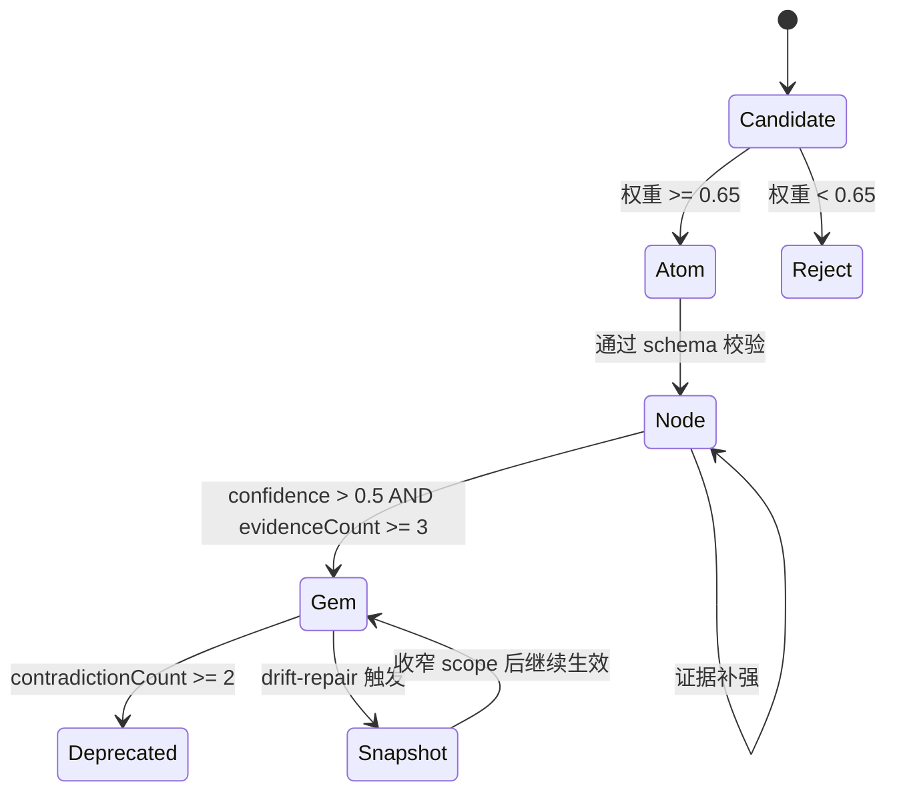
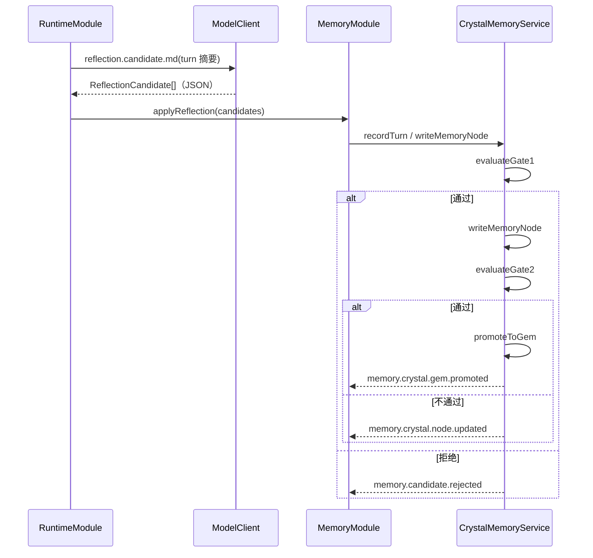

# Crystal Reflection

## 一句话定位

Crystal 子系统负责把单轮证据「结晶」为长期可复用的 Gem：候选 → atom（向量化原始事实）→ memory_node → gem，每一步都经过双质量门校验。

## 相关代码路径

- `src/crystal/reflection/index.ts` — `CrystalReflectionService`
- `src/crystal/memory/index.ts` — `CrystalMemoryService` / `LocalCrystalMemoryStore` / `SurrealCrystalMemoryStore`
- `src/crystal/memory/surreal.ts` — SurrealDB 实现
- `src/crystal/skills/index.ts` — Skill 升格（见 `skill.system.md`）
- `src/agent/runtime/reflection.worker.ts` — 反思 worker 调度
- `templates/prompts/reflection.candidate.md` — 反思抽取提示

## 数据流

```mermaid
flowchart LR
    Turn["完成的 turn"] --> RT["ReflectionWorker.dispatch"]
    RT --> LLM["reflection.candidate.md<br/>抽 symbols / bucket / coordinates"]
    LLM --> Cand["ReflectionCandidate[]"]
    Cand --> Apply["MemoryModule.applyReflection"]
    Apply --> Crystal["CrystalMemoryService.recordTurn"]
    Crystal --> Atom["写 episode / memory_node 候选"]
    Atom --> Gate1["门 1：sourceKind weight gate"]
    Gate1 --> Node["memory_node"]
    Node --> Gate2["门 2：confidence × evidenceCount"]
    Gate2 --> Gem["gem（已结晶）"]
    Gem --> Snap["gem_snapshot（drift-repair）"]
```



## 双质量门



## 结构（Surreal 表）

```ts
interface Gem {
    id: string;
    title: string;
    summary: string;
    symbols: string[];
    coordinates: number[];   // embedding
    confidence: number;
    evidenceCount: number;
    contradictionCount: number;
    importance: number;
    sourceKind: GemSourceKind;
    provenance: { turnId?: string; episodeId?: string; projectId?: string };
    createdAt: string;
    updatedAt: string;
}
```

## 触发链



## Dedup 与防漂移

- `dedupeGems`（纯函数）：`symbols IoU >= 0.7` 且 `cosine >= 0.85` → merge 到较新 gem，旧 gem 标 `merged`。
- 漂移触发条件：`contradictionCount >= 2`。
- 漂移修复：先写 `gem_snapshot`，再收窄 `scope`；不删除旧版本。

## 配置

- `config.memory.crystal.backend` — `local` / `surreal`
- `config.memory.crystal.local.dbFile` — 本地 `crystal.db` 路径
- `config.memory.crystal.surreal` — SurrealDB 兼容后端连接
- `config.memory.candidates.minConfidence` — gate 2 阈值
- `config.memory.candidates.minEvidenceCount` — gate 2 阈值
- `config.memory.candidates.maxCandidatesPerTurn` — 抽取上限
- `config.memory.candidates.autoPromoteExplicit` — explicit action 直接 promote

## 事件清单

| 事件 | 触发点 |
| --- | --- |
| `memory.candidate.proposed` | reflection 抽取后 |
| `memory.candidate.rejected` | gate 1 拒绝 |
| `memory.crystal.node.updated` | memory_node 写入 |
| `memory.crystal.gem.promoted` | gem 升格 |
| `memory.crystal.gem.snapshotted` | drift-repair 写存档 |
| `memory.crystal.gem.deprecated` | 矛盾归档 |
| `memory.reflection.failed` | LLM 抽取失败 |

## 运行边界 / 后续增强

- Reflection 已拆为独立 `ReflectionWorker`；Runtime 只投递异步任务，worker 自己处理抽取、规范化与失败事件。
- 本地后端已落地 `crystal.db + VectorIndex`；SurrealDB 迁移脚本 `scripts/surreal.migrate.ts` 仍保留兼容写入路径，方便对比与回滚。
- gate 2 是定值阈值，没有按 sourceKind 动态调整。
- contradictionCount 只在 dream pass 修复，runtime 路径不会清零（即便后续有大量正向证据）。

## 相关测试

- `tests/reflection.gem.consolidation.test.ts`
- `tests/reflection.boundaries.test.ts`
- `tests/reflection.thread.test.ts`
- `tests/dream.worker.test.ts`
