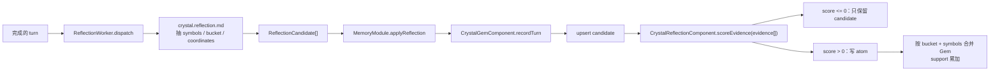
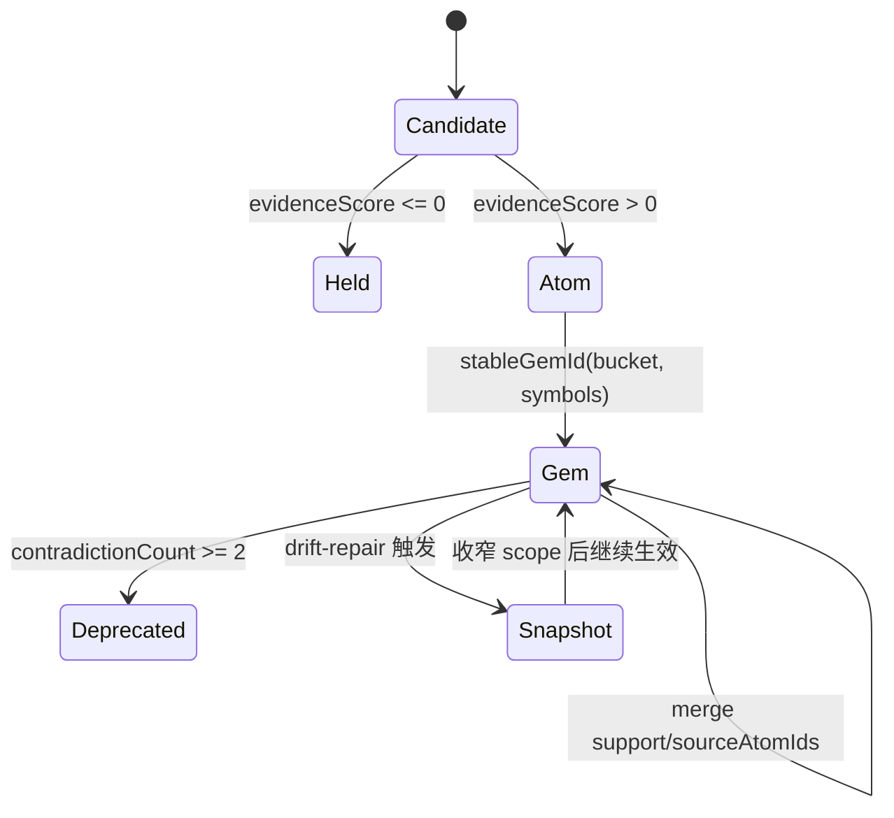
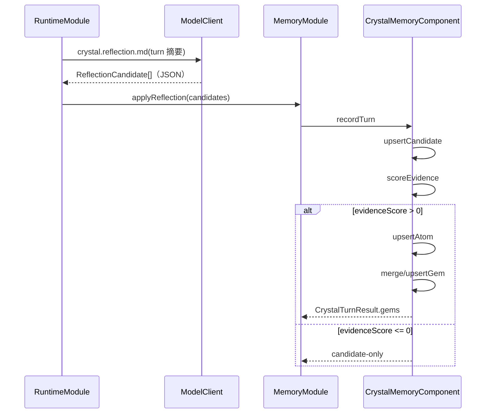

# Crystal Reflection

## 一句话定位

Crystal 子系统负责把结构化反思证据「结晶」为长期可复用的 Gem。当前 runtime reflection 路径是 candidate → atom → Gem；长期图的 episode → memory_node → Gem 由 `ConsolidationWorker` / `CrystalComponent` 维护，不能把两条链路的字段和门槛混写。

Gem 与 Skill 必须分开：Gem 是内部晶体智力，存在 `crystal.db` / Crystal graph；Skill 是外部 `SKILL.md` 能力包，存在 `~/.flyflor/.config/skills` 或项目 skill 目录。`gem-drift` 只修 Crystal graph，不能代替 `skill-drift`。

## 相关代码路径

- `src/cognitive/crystal/reflection/index.ts` — `CrystalReflectionComponent`，负责 candidate / atom / Gem 的确定性结晶规则；迁移期物理路径为 `src/fch/crystal/reflection/index.ts`
- `src/cognitive/crystal/gems/index.ts` — `CrystalGemComponent` / `InMemoryCrystalMemoryStore`，内部 Gem 模块边界；迁移期物理路径为 `src/fch/crystal/gems/index.ts`
- `src/cognitive/crystal/memory/index.ts` — `CrystalMemoryComponent` 对外兼容门面 / `LocalCrystalMemoryStore`；迁移期物理路径为 `src/fch/crystal/memory/index.ts`
- `src/agent/skills/index.ts` — 外部 Skill 包加载与物化；不属于 Gem 本体（见 `skill.system.md`），迁移期物理路径为 `src/skills/index.ts`
- `src/agent/runtime/reflection/worker.ts` — 反思 worker 调度
- `templates/prompts/crystal.reflection.md` — 反思抽取提示

## 数据流



## 固化门槛



Runtime reflection 不做关键词或句式判断：模型只负责输出结构化 candidate，代码只用 `evidence[].weight`、`bucket`、`symbols`、`coordinates` 等数值/结构字段。长期图的 `memory_node.evidenceCount` 属于 consolidation 数据面，不能作为 `CrystalGemComponent` 的隐藏门槛。

## 结构（runtime Crystal Gem 实体）

```ts
interface CrystalGem {
    id: string;
    bucket: string;
    title: string;
    method: string;
    symbols: string[];
    coordinates: Record<string, number>;
    confidence: number;
    support: number;
    evidenceScore: number;
    createdAt: string;
    updatedAt: string;
    sourceAtomIds: string[];
    metadata?: Record<string, unknown>;
}
```

## 触发链



## Dedup 与防漂移

- `dedupeGems`（纯函数）：`symbols IoU >= 0.7` 且 `cosine >= 0.85` → merge 到较新 gem，旧 gem 标 `merged`。
- 漂移触发条件：`contradictionCount >= 2`。
- 漂移修复：先写 `gem_snapshot`，再收窄 `scope`；不删除旧版本。
- `gem-drift` 与 `skill-drift` 是两个协议概念：前者属于 Crystal graph，后者属于外部 Skill 包校验/迁移，不能共用候选类型或写入路径。

## 配置

- `config.memory.crystal.backend` — 当前主线为 `local`
- `config.memory.crystal.local.dbFile` — 本地 `crystal.db` 路径
- `config.memory.candidates.maxCandidatesPerTurn` — 抽取上限
- `config.memory.candidates.autoPromoteExplicit` — explicit action 作为高权重 candidate 来源，不绕过 evidenceScore

## 事件清单

| 事件 | 触发点 |
| --- | --- |
| `memory.candidate.proposed` | reflection 抽取后 |
| `memory.candidate.rejected` | candidate schema / evidenceScore 不足，仅保留候选或拒绝 |
| `memory.crystal.node.updated` | 长期图 memory_node 写入 |
| `memory.crystal.gem.promoted` | runtime Gem 写入或长期图 Gem 关系补强 |
| `memory.crystal.gem.snapshotted` | drift-repair 写存档 |
| `memory.crystal.gem.deprecated` | 矛盾归档 |
| `memory.reflection.failed` | LLM 抽取失败 |

## 运行边界

- Reflection 已拆为独立 `ReflectionWorker`；Runtime 只投递异步任务，worker 自己处理抽取、规范化与失败事件。
- 本地后端已落地 `crystal.db + VectorIndex`。上层调用统一经 `CrystalComponent` 约束，不直接依赖后端实现。
- 本地向量编码统一由 `CrystalVectorCodec` 拥有；生产代码持有 codec 实例，`embedCrystalText()` / `toCrystalSearchText()` 等函数只保留给旧 public API 与测试。
- Runtime Crystal 主路径由 `CrystalGemComponent` 持有 `CrystalReflectionComponent` 实例；`buildReflectionCandidate()` / `crystallizeCandidate()` 等顶层导出只为旧 public API 与测试兼容，新增业务代码不得再依赖函数式结晶入口。
- Runtime reflection 的固化门槛只看结构化 evidence score；长期图 consolidation 另行维护 `memory_node`、`support`、`confidence` 和 graph edges。
- contradictionCount 只在 dream pass 修复，runtime 路径不会清零（即便后续有大量正向证据）。

## 相关测试

- `tests/reflection.gem.consolidation.test.ts`
- `tests/reflection.boundaries.test.ts`
- `tests/reflection.thread.test.ts`
- `tests/dream.worker.test.ts`
