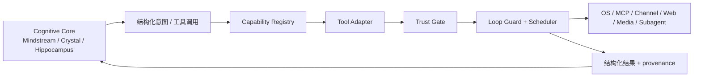

# Executive 能力外骨架

## 一句话定位

Executive 是 Flyflor 的能力外骨架，内部仍沿用 `Capability / Tool / Trust / Loop` 四个概念，中文叫 **能力工具信任回路层**。Flyflor 的 Cognitive 认知层负责思考、记忆和人格连续性；Executive 外骨架负责发现能力、包装工具、计算信任、控制执行回路，让智能体安全地拥有手脚。

迁移期说明：当前源码物理路径已迁移到 `src/executive`；历史 `src/cttl` 物理路径已移除。文档中的 Executive 指当前层名；旧 CTTL 只作为历史代号存在，新代码不得继续 import `src/cttl`。

## 设计原则

- Executive 是外骨架，不是第二套认知内核；业务意图、路由、记忆动作和反馈分类仍只能来自模型结构化输出或专用提示词 JSON。
- 能力发现不靠固定工具清单扩张。内置工具只是 bootstrap，长期必须能接入 MCP、插件、skill、channel action、用户自定义命令和 subagent。
- 所有 capability 最终都必须包装成 Tool，再经过 Trust 和 Loop；任何执行点不得绕过 sandbox、approval、secrets provider、输出限制和审计。
- Executive 必须兼容 Bun 单文件二进制。插件和用户扩展优先走 JSONC manifest、MCP、外部命令或 HTTP bridge，禁止依赖运行时动态加载 `node_modules`。

## 四层模型

| 层 | 责任 | 不负责 |
| --- | --- | --- |
| Capability | 描述“能做什么”，记录来源、可用性、配置需求、所需凭据和所属 provider | 不直接暴露给模型，不执行副作用 |
| Tool | 把 capability 适配成模型可调用 schema，声明 scope、permission、readOnly、concurrencySafe、exclusive、resultLimit | 不判断业务意图，不绕过 Trust |
| Trust | 根据 channel、sender、group、turn/request context、project、sandbox、approval、secrets 和 permission cap 决定本次是否可执行 | 不做自然语言语义判断 |
| Loop | 生成本轮 tool plan、调度并发/独占工具、压缩结果、处理失败和循环诊断 | 不重新解释模型自然语言 |

## Tool 元数据规则

每个 Tool 必须至少声明：

```ts
interface CttlToolDescriptor {
    name: string;
    description: string;
    inputSchema: Record<string, unknown>;
    outputSchema?: Record<string, unknown>;
    source: "core" | "mcp" | "plugin" | "skill" | "channel" | "user" | "subagent";
    scope: readonly CttlToolScope[];
    permission: CttlPermission;
    category: "system" | "coding" | "memory" | "network" | "media" | "message" | "computer" | "integration";
    readOnly: boolean;
    concurrencySafe: boolean;
    exclusive: boolean;
    resultLimit: { maxChars: number };
}
```

`scope` 是轻量集合，初始约定为 `core`、`chat`、`subagent`、`memory`、`background`、`channel`、`local`、`project`、`debug`。scope 只表达使用场景，不表达危险等级。

`permission` 独立于 scope，初始约定为 `none`、`read`、`write`、`execute`、`network`、`message`、`computer`、`dangerous`。本地 CLI 可以按交互模式提升默认审批，微信、Webhook 等远程 channel 默认不得拥有 `execute`、`computer`、`dangerous`。

`readOnly && concurrencySafe` 的工具可以并发执行；`exclusive` 工具必须独占，例如 shell PTY、browser control、mouse/keyboard、长生命周期 code runner 或会修改共享状态的工具。

## Capability 来源

Executive 支持多来源 capability，但所有来源进入运行时前都必须归一成 Tool：

| 来源 | 示例 | 入口规则 |
| --- | --- | --- |
| core | workspace、git、todo、cron、delegate、screenshot、lsp | 由 composition root 显式装配，不做目录扫描 |
| MCP | tools、resources、prompts | tools/resources/prompts 都是一等 capability |
| plugin | manifest 声明的命令或 bridge | registry 只读 manifest，执行必须走 runner + Trust |
| skill | Skill 包声明的 required/provided capability | skill 是做事方式，不直接等同 Tool |
| channel | send_message、reaction、typing、card update | 受 channel capability 与 sender policy 限制 |
| user | `~/.flyflor/.config/tools/*.jsonc` 或 project-local manifest | 必须声明 schema、permission、cwd、env、输出限制 |
| subagent | delegate、named agent、integration agent | 由配置动态合成工具，不写死一批 delegation 函数 |

当前 user tool manifest 约定落在 `tools.jsonc`：全局为 `~/.flyflor/.config/tools.jsonc`，项目为 `./.flyflor/tools.jsonc`，项目层覆盖全局层。manifest tool 首先归一成 Executive descriptor；带 `executor.kind="process-json"` 的 enabled tool 会作为虚拟 `user.*` 工具进入模型 catalog。执行协议复用 PluginRunner 的 JSON process bridge：stdin 一行 JSON、stdout 一行 JSON，执行必须经过 Plugin sandbox gate、approval、audit、result summary 和 loop guard。

plugin manifest 也可以声明 `capabilities`：全局为 `~/.flyflor/.config/plugins/plugins.json`，项目为 `./.flyflor/plugins/plugins.json`。这些 capability 先只作为 `plugin.<plugin>.<capability>` descriptor 进入 Executive Tool Plan 和 catalog snapshot，表达插件“能提供什么手脚”；具体执行仍由显式 `PluginRunner` 调用、命令白名单和 sandbox gate 控制，不因为出现在 catalog 里自动获得执行入口。

## Tool Plan

模型每轮不直接看到全量工具。Runtime 必须根据当前上下文计算 Tool Plan：

1. 收集已注册 descriptors。
2. 按 config、auth、secrets、channel、sender/group、project、sandbox、platform availability 过滤。
3. 对可见工具排序并注入模型上下文。
4. 对隐藏工具保留 diagnostics：缺配置、缺凭据、权限不足、channel cap、sandbox deny、平台不可用。
5. 工具结果进入模型前必须压缩、截断或摘要，且保留机器可读 provenance。

Tool Plan 是协议层数据，不是自然语言推断结果；隐藏原因必须来自结构化字段和枚举。

当前 Runtime 接线从内置 MCP 兼容工具开始：`workspace.*`、`git.*`、`shell.run` 在注入 prompt 前先归一成 Executive descriptor，再按本轮 trust context 过滤可见性。MCP `tools/resources/prompts` 也会统一进入 capability plan；resources/prompts 只做发现和受控读取 API，不把正文自动注入模型。这个切片只控制模型可见 catalog，不替代 sandbox / approval / quota 执行门；实际执行仍由 workspace access、ShellHook、MCP transport 和 sandbox gate 负责。

每轮 Tool Plan 生成后会发布 `cttl.capability.catalog.built`。这是外部 control/event 面的通用快照，只包含可 JSON 序列化的 descriptor 摘要、hidden reason、失败/stale source 和 totals；不包含 executor、resource 正文、prompt 正文或密钥。WS 客户端可通过 `capability.catalog.get` 读取最近一次 `capability.catalog.snapshot`，用于独立 TUI、channel console 或调试面板展示当前“手脚目录”。

## Trust Policy 默认行为

Trust Policy 把结构化运行面转换成 trust context。调用点只声明当前 surface、是否本地、是否 project-scoped、是否 debug，Executive 决定默认 scope 和 permission cap：

| 场景 | 默认 scopes | 默认 permission cap |
| --- | --- | --- |
| 远程 channel / webhook | `core`、`chat`、`channel`、可选 `project` | `message` |
| 本地 CLI / TUI | `core`、`chat`、`local`、可选 `project` | `write` |
| 本地 debug | `core`、`chat`、`local`、`debug`、可选 `project` | `dangerous` |
| background / cron | `core`、`background`、可选 `project` | `network` |

远程 surface 即使声明了 channel scope，也不会默认获得 shell、computer 或 dangerous。需要执行类能力时必须由调用方显式传入更高 permission cap，并经过 sandbox / approval / audit。scope 只表达使用场景，不能替代 permission。

## Loop Guard

Executive 的 Loop 层必须防止模型卡在工具回路：

- unknown tool 重复调用达到阈值后停止继续尝试，并向模型注入结构化诊断。
- 工具名漂移只能做协议层归一化，例如 MCP server/tool 精确映射或已注册 alias；不得用自然语言关键词猜工具。
- 同一工具同一参数连续失败必须触发 no-progress guard。
- 工具调用数量、总输出字符、总耗时和独占工具占用时间必须有上限。
- MCP 返回非法 schema、缺 `tool_call_id`、非 JSON content 或 transport 失败时，Loop 层必须转成结构化错误，不把原始异常长文本直接塞回模型。
- 后台任务、cron、delegate 和 long-running code runner 必须可中断、可恢复、可审计。

Runtime MCP loop 接入 Executive guard 时分两步：执行前用 `knownToolNames`、tool name 和 JSON input 做 preflight；执行后只记录 `ok/error` 结果，用于重复失败检测。被 guard 阻断的调用仍以失败 `McpToolCallExecution` 回灌模型，原因使用 `CttlLoopGuardReason`，便于事件面和 TUI 解释。

每次阻断还会发布 `cttl.loop.guard.blocked` RuntimeEvent。事件 payload 只包含 `server`、`tool`、`reason`、`message` 等可 JSON 序列化事实；它用于 TUI、WS、channel adapter 和审计展示，不参与业务语义判断。

## 高风险工具分层

| 能力族 | 默认权限 | 规则 |
| --- | --- | --- |
| web search / extract | `network` | 可通过 MCP/provider 接入，结果必须摘要和标来源 |
| filesystem read/search | `read` | 可并发，跨 project/root 读访问需 Trust 决策 |
| filesystem write/edit/apply_patch | `write` | 必须审批或明确 policy 允许，禁止绕过 sandbox |
| shell / execute_code | `execute` | 必须显式 cwd、env 白名单、超时、stdout/stderr 策略 |
| send_message | `message` | 受 channel/account/sender/group policy 限制，不能默认外发 |
| screenshot | `read` 或 `computer` | 本地 CLI 可按策略允许，远程 channel 默认 ask/deny |
| mouse / keyboard / browser control | `computer` 或 `dangerous` | 必须独占，默认需要审批 |
| image / video / TTS / transcription | `media` + `network` 或 `write` | 输出文件、外部 API、隐私数据必须显式记录 |
| LSP diagnostics | `read` | 只读 diagnostics/symbols 可并发 |
| LSP code action / apply edit | `write` | 写入前走 Trust，不能作为只读 diagnostics 附带执行 |
| delegate / subagent | 按子计划最高权限 | 子 agent 只能看到其 Tool Plan，不继承父级全量工具 |

## 与 Cognitive 的边界

Cognitive 可以决定“下一步需要搜索、读文件、执行命令或询问用户”，但具体能否执行由 Executive 决定。Executive 可以告诉 Cognitive 哪些工具可见、哪些隐藏、为什么失败，但不能基于自然语言重新判断用户意图。



## 红线

- 不把 Executive 写成固定工具清单。新增能力必须能说明它的 capability 来源、Tool descriptor、Trust 策略和 Loop 行为。
- 不新增专用 decorator、不做反射扫描、不做动态 import；装配仍由 composition root 和 `useXxx()` composition 完成。
- 不允许 Tool 直接读取业务配置环境变量；业务配置、凭据和策略必须走 config/secrets provider。
- 不允许 Tool 自行解析自然语言意图；语义判断继续遵守零字符匹配红线。
- 不允许 MCP 只接 tools；resources 和 prompts 也必须有一等 capability 规划。
- 不允许远程 channel 默认获得 shell、computer、dangerous 权限。
- 不允许用户自定义工具缺 schema、permission、cwd/env 边界或输出限制。
- 不允许为了插件生态牺牲 `bun build --compile`；运行时不能依赖用户机器存在 `node_modules`。
