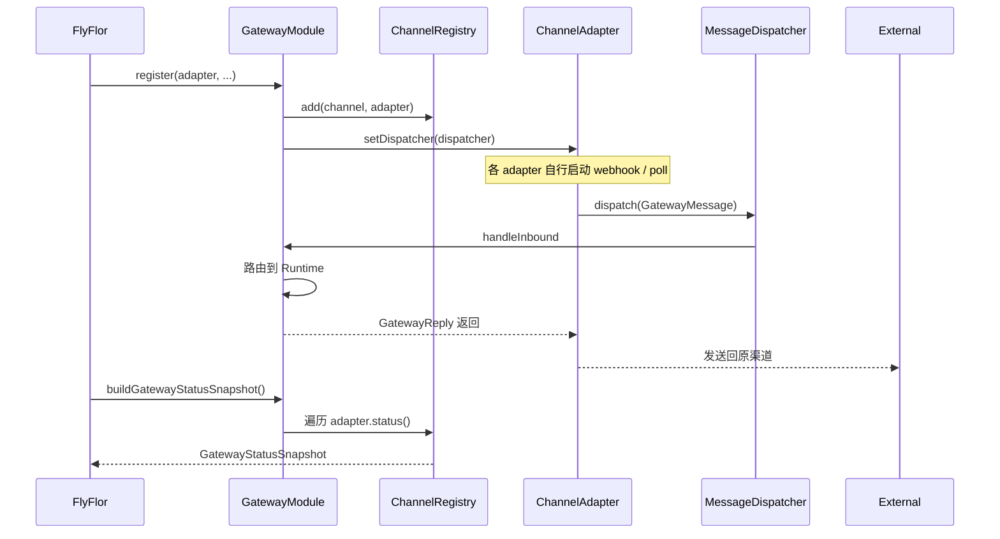
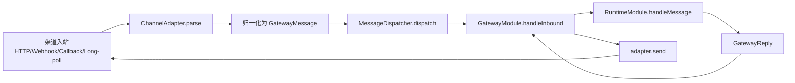

# Gateway 与渠道

## 一句话定位

Gateway 是 Flyflor 对外通讯的唯一入口：归一化 31 种 channel 入站消息为 `GatewayMessage`，按 `route` 调度到 Runtime，再把 `GatewayReply` 反向投递回原始渠道。消息生命周期、typing、thread、引用、评论、mention、reaction 都是显式协议字段或 adapter lifecycle hook，不靠自然语言解析。

## 相关代码路径

- `src/agent/gateway/gateway.module.ts` — Gateway 主类
- `src/agent/gateway/channels/index.ts` — channel adapter 工厂
- `src/agent/gateway/channels/types.ts` — `ChannelAdapter` 与 `MessageDispatcher` 接口
- `src/agent/gateway/channels/delivery.protocol.ts` — thread / 引用 / 评论回送元数据统一出口
- `src/agent/gateway/channels/helpers.ts` — final-only channel delivery 与通用响应工具
- `src/agent/gateway/channels/status.ts` — registry / status snapshot
- `src/agent/gateway/channels/api.ts` / `stdio.ts` / `webhook.ts` / `wechat.ts` / `wecom.callback.ts` / `weixin.ilink.ts` / `telegram.ts` / `discord.ts` / `feishu.ts` / `bluebubbles.ts` / `slack.ts` / `line.ts` / `mattermost.ts` / `dingtalk.ts` / `http.platforms.ts`
- `src/protocol/contracts/enums.ts` — `Channel` enum
- `src/protocol/contracts/types.ts` — `GatewayMessage` / `GatewayReply`

## Channel 矩阵（实现现状）

| Channel | Enum 值 | 适配器 | 状态 |
| --- | --- | --- | --- |
| API | `api` | `ApiChannelAdapter` | ✅ 完整 |
| API Server | `api_server` | `HttpPlatformAdapter` | ✅ OpenAI-compatible HTTP 入站骨架 |
| STDIO | `stdio` | `StdioAdapter` | ✅ 完整（CLI/TUI） |
| Webhook (Generic) | `webhook` | `GenericWebhookAdapter` | ✅ 完整 |
| Google Chat | `google_chat` | `HttpPlatformAdapter` | ✅ Chat event 归一化 + incoming webhook 回复 |
| IRC | `irc` | `HttpPlatformAdapter` | ✅ message/channel/nick 归一化 + reply URL 回发 |
| Weixin iLink | `weixin-ilink` | `WeixinIlinkAdapter` | ✅ token + base URL 配齐即启用 |
| WeChat official account | `wechat` | `WeChatOfficialAccountAdapter` | ✅ 官方公众号 XML callback；text/image/voice/video/location/link/event 入站 |
| Telegram | `telegram` | `TelegramAdapter` | ✅ webhook + bot |
| Discord | `discord` | `DiscordInteractionAdapter` | ✅ interactions |
| Feishu | `feishu` | `FeishuAdapter` | ✅ webhook |
| BlueBubbles / iMessage | `bluebubbles` / `imessage` | `BlueBubblesAdapter` | ✅ password 校验 + attachments + 群组识别 |
| DingTalk | `dingtalk` | `DingTalkAdapter` | ✅ token/signature 校验 + outgoing robot 文本归一化 |
| Microsoft Graph Webhook | `msgraph_webhook` | `HttpPlatformAdapter` | ✅ validationToken + change notification 归一化 |
| Email | `email` | `HttpPlatformAdapter` | ✅ subject/from/body 归一化 + reply URL 回发 |
| Home Assistant | `homeassistant` | `HttpPlatformAdapter` | ✅ state_changed 归一化 + persistent_notification 回复 |
| Line | `line` | `LineAdapter` | ✅ HMAC 签名 + replyToken 回注 |
| Mattermost | `mattermost` | `MattermostAdapter` | ✅ outgoing webhook / slash command token 校验 + response JSON |
| Matrix | `matrix` | `HttpPlatformAdapter` | ✅ room event 归一化 + Matrix send API 回复 |
| QQ / QQBot | `qq` / `qqbot` | `HttpPlatformAdapter` | ✅ guild/channel/group/direct 事件归一化 |
| Signal | `signal` | `HttpPlatformAdapter` | ✅ signal-cli HTTP envelope 归一化 + REST send |
| Slack | `slack` | `SlackAdapter` | ✅ HMAC 签名 + challenge + files |
| SMS | `sms` | `HttpPlatformAdapter` | ✅ form webhook 归一化 + TwiML 回复 |
| Teams | `teams` | `HttpPlatformAdapter` | ✅ Bot Framework activity 归一化 + webhook 回复 |
| WeCom | `wecom` | `HttpPlatformAdapter` | ✅ 企业微信通用 HTTP 归一化 |
| WeCom Callback | `wecom_callback` | `WeComCallbackAdapter` | ✅ 官方 callback；URL verify + AES 解密 + 主动 `message/send` 回复 |
| WhatsApp | `whatsapp` | `HttpPlatformAdapter` | ✅ verifyToken 握手 + Cloud API message 归一化 / 回复 |
| Yuanbao | `yuanbao` | `HttpPlatformAdapter` | ✅ TIM-style MsgBody 归一化 + reply URL 回发 |
| Zalo | `zalo` | `HttpPlatformAdapter` | ✅ sender/recipient/message 归一化 + reply URL 回发 |

> `HttpPlatformAdapter` 是共享 HTTP 协议适配层：每个 channel 保留自己的结构化归一化、验证握手或原生 send 分支；只有真正需要长连接、加密 callback 或复杂签名的渠道拆独立 adapter。

## 注册与状态时序



## 主流程



## 数据结构

```ts
interface GatewayMessage {
    messageId: string;
    route: GatewayRoute;        // channel / chatId / chatType / userId
    user: { id: string; displayName?: string };
    text: string;
    messageAction?: "create" | "edit" | "delete" | "reaction" | "unknown";
    mentions?: Array<{ id?, kind?, displayName?, text? }>;
    reactions?: Array<{ key, targetMessageId?, added?, count? }>;
    attachments?: Array<{ kind, url, mediaType }>;
    receivedAt: string;
    metadata?: Record<string, unknown>;
}

interface GatewayReply {
    messageId: string;
    route: GatewayRoute;
    text: string;
    metadata: { /* runtime/blackboard/skill/mcp/sandbox 等汇总 */ };
}
```

## 配置约束

- `config.gateway.allowedChannels` — 只有列在这里的 channel 才会被实例化。
- `config.gateway.channels.*` — 每个 channel 自己的凭据 / 端点。WeChat official account 与 Weixin iLink 分开配置。
- `config.gateway.channelReplyUrls` — 出站回执 URL（可被 channel 内部 `replyUrl` 覆盖）。
- 缺凭据时 adapter 静默退化为「未注册」，独立官方适配器不会降级到通用 HTTP。
- 凭据**不允许**走环境变量（参见 boundaries）。

## 事件清单

| 事件 | 触发点 |
| --- | --- |
| `gateway.message.received` | dispatcher 接收到入站消息 |
| `gateway.reply.sent` | 出站送达 |
| `channel.adapter.registered` / `unregistered` | registry 变化 |
| `channel.status.changed` | adapter `status()` 状态转换 |

## 运行边界

- 多数 HTTP channel 共用 `HttpPlatformAdapter`，但保留 channel-specific normalize / verify / send 分支；Slack、Line、Mattermost、DingTalk、WeChat official account、WeCom Callback 等已拆独立适配器，凭据不完整时不会回退到未校验的通用入口。
- 外部聊天 / 平台 channel 只发送最终 `GatewayReply.text`，不把 runtime 的 token delta 拆成多条平台消息；显式 OpenAI-compatible `/v1/*` API SSE 属于 API 协议面，单独处理。
- `GatewayMessage.messageAction / mentions / reactions / replyTo / comment` 只从平台结构化字段或协议 token 复制，属于通信协议归一化，不参与业务语义判断。
- TUI `flyflor chat --tui` 与 `flyflor tui` 已对齐到同一 bootstrap；chat TUI 已订阅 runtime / blackboard 事件，后续可把 gateway 级 channel 状态变化也接入同一事件面板。
- `gateway start/stop/restart` 已有 daemon helper；跨平台服务安装和长期运行仍需真实环境验证。
- Gateway 已有单进程 `InMemoryDedupStore` 与 `buildDedupKey(channel,messageId)`；多副本部署时需要替换为共享 dedup store 才能跨节点幂等。
- 入站消息 `attachments` 已由 runtime 渲染为 `[attachments]` 摘要；下一步是渠道富媒体下载 / 缓存 / 安全扫描。

## 相关测试

- `tests/gateway.channel.events.test.ts`
- `tests/gateway.daemon.test.ts`
- `tests/gateway.dedup.test.ts`
- `tests/channels.delivery.test.ts`
- `tests/channels.bluebubbles.test.ts`
- `tests/channels.dingtalk.test.ts`
- `tests/channels.feishu.test.ts`
- `tests/channels.line.test.ts`
- `tests/channels.mattermost.test.ts`
- `tests/channels.slack.test.ts`
- `tests/channels.telegram.test.ts`
