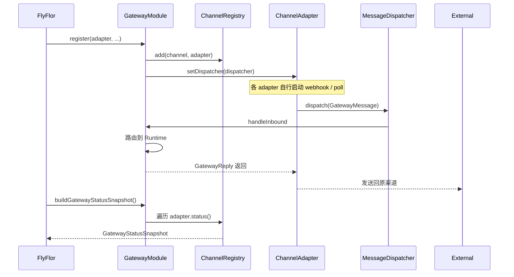
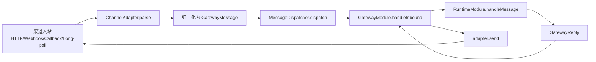

# Gateway 与渠道

## 一句话定位

Gateway 是 Flyflor 对外通讯的唯一入口：归一化 31 种 channel 入站消息为 `GatewayMessage`，按 `route` 调度到 Runtime，再把 `GatewayReply` 反向投递回原始渠道。消息生命周期、typing、thread、引用、评论、mention、reaction、卡片 / 消息更新都是显式协议字段、`GatewayOutboundOperation` 或 adapter capability，不靠自然语言解析。

## 相关代码路径

- `src/agent/gateway/module.ts` — Gateway 主类
- `src/agent/gateway/control.ts` — Gateway Control/Event WebSocket transport
- `src/agent/gateway/channels/index.ts` — channel adapter 工厂
- `src/agent/gateway/channels/types.ts` — `ChannelAdapter` 与 `MessageDispatcher` 接口
- `src/agent/gateway/channels/delivery.protocol.ts` — thread / 引用 / 评论回送元数据统一出口
- `src/agent/gateway/channels/helpers.ts` — final-only channel delivery 与通用响应工具
- `src/agent/gateway/channels/status.ts` — registry / status snapshot
- `src/agent/gateway/channels/api.ts` / `stdio.ts` / `webhook.ts` / `wechat.ts` / `wecom.callback.ts` / `weixin.ilink.ts` / `telegram.ts` / `discord.ts` / `feishu.ts` / `bluebubbles.ts` / `slack.ts` / `line.ts` / `mattermost.ts` / `dingtalk.ts` / `http.platforms.ts`
- `src/protocol/contracts/enums.ts` — `Channel` enum
- `src/protocol/control/envelope.ts` — control/event envelope 协议
- `src/protocol/contracts/types.ts` — `GatewayMessage` / `GatewayReply`

## Hermes 对齐原则

Flyflor 继承 Hermes gateway 的通信细节，但不搬流式逐 token 推送：Runtime 内部仍可流式生成，外部 IM channel 一律等本轮 `GatewayReply.text` 完成后 final-only 投递。平台差异通过 `GatewayChannelCapabilities` 暴露，发送侧通过 `GatewayOutboundOperation` 表达 lifecycle intent：

| Operation                          | 用途                     | 降级                                           |
| ---------------------------------- | ------------------------ | ---------------------------------------------- |
| `typing.start` / `typing.stop`     | 正在输入 / 处理中        | 不支持时 no-op，不影响最终回复                 |
| `message.send`                     | final text 回复          | 缺出站凭据时只完成 webhook ack，不伪造成功     |
| `message.edit`                     | 更新既有消息             | 不支持时不得硬凑；保留 final text 路径         |
| `card.create` / `card.update`      | 卡片创建 / 更新          | 仅能力声明为 `cardUpdate=true` 的 adapter 可用 |
| `reaction.add` / `reaction.remove` | 处理态 / 完成态 reaction | 不支持时 no-op                                 |
| `thread.create`                    | 新建话题 / topic         | 目前只作为协议预留，默认禁用                   |

`dispatchWithDelivery` 只负责 lifecycle 调度和 final-only 发送；引用、thread、评论回送的元数据统一由 `buildDeliveryMetadata()` 从入站结构化字段生成。

## Channel 矩阵（实现现状）

| Channel                 | Enum 值                    | 适配器                         | 状态                                                                           |
| ----------------------- | -------------------------- | ------------------------------ | ------------------------------------------------------------------------------ |
| API                     | `api`                      | `ApiChannelAdapter`            | ✅ 完整                                                                        |
| API Server              | `api_server`               | `HttpPlatformAdapter`          | ✅ OpenAI-compatible HTTP 入站骨架                                             |
| STDIO                   | `stdio`                    | `StdioAdapter`                 | ✅ 完整（CLI/TUI）                                                             |
| Webhook (Generic)       | `webhook`                  | `GenericWebhookAdapter`        | ✅ 完整                                                                        |
| Google Chat             | `google_chat`              | `HttpPlatformAdapter`          | ✅ Chat event 归一化 + incoming webhook 回复                                   |
| IRC                     | `irc`                      | `HttpPlatformAdapter`          | ✅ message/channel/nick 归一化 + reply URL 回发                                |
| Weixin iLink            | `weixin-ilink`             | `WeixinIlinkAdapter`           | ✅ token + base URL 配齐即启用；context_token / typing ticket                  |
| WeChat official account | `wechat`                   | `WeChatOfficialAccountAdapter` | ✅ 官方公众号 XML callback；text/image/voice/video/location/link/event 入站    |
| Telegram                | `telegram`                 | `TelegramAdapter`              | ✅ webhook + bot；thread / reply anchor / typing / message edit                |
| Discord                 | `discord`                  | `DiscordInteractionAdapter`    | ✅ interactions；deferred original message patch                               |
| Feishu                  | `feishu`                   | `FeishuAdapter`                | ✅ webhook；thread reply / message update                                      |
| BlueBubbles / iMessage  | `bluebubbles` / `imessage` | `BlueBubblesAdapter`           | ✅ password 校验 + attachments + 群组识别                                      |
| DingTalk                | `dingtalk`                 | `DingTalkAdapter`              | ✅ token/signature 校验 + outgoing robot 文本归一化；AI Card update 预留能力位 |
| Microsoft Graph Webhook | `msgraph_webhook`          | `HttpPlatformAdapter`          | ✅ validationToken + change notification 归一化                                |
| Email                   | `email`                    | `HttpPlatformAdapter`          | ✅ subject/from/body 归一化 + reply URL 回发                                   |
| Home Assistant          | `homeassistant`            | `HttpPlatformAdapter`          | ✅ state_changed 归一化 + persistent_notification 回复                         |
| Line                    | `line`                     | `LineAdapter`                  | ✅ HMAC 签名 + loading animation + reply/push fallback + quoteToken            |
| Mattermost              | `mattermost`               | `MattermostAdapter`            | ✅ outgoing webhook / slash command token 校验 + response JSON                 |
| Matrix                  | `matrix`                   | `HttpPlatformAdapter`          | ✅ room event 归一化 + Matrix send API 回复                                    |
| QQ / QQBot              | `qq` / `qqbot`             | `HttpPlatformAdapter`          | ✅ guild/channel/group/direct 事件归一化                                       |
| Signal                  | `signal`                   | `HttpPlatformAdapter`          | ✅ signal-cli HTTP envelope 归一化 + REST send                                 |
| Slack                   | `slack`                    | `SlackAdapter`                 | ✅ HMAC 签名 + challenge + files；thread / message update / reaction           |
| SMS                     | `sms`                      | `HttpPlatformAdapter`          | ✅ form webhook 归一化 + TwiML 回复                                            |
| Teams                   | `teams`                    | `HttpPlatformAdapter`          | ✅ Bot Framework activity 归一化 + webhook 回复                                |
| WeCom                   | `wecom`                    | `HttpPlatformAdapter`          | ✅ 企业微信通用 HTTP 归一化                                                    |
| WeCom Callback          | `wecom_callback`           | `WeComCallbackAdapter`         | ✅ 官方 callback；URL verify + AES 解密 + 主动 `message/send` 回复             |
| WhatsApp                | `whatsapp`                 | `HttpPlatformAdapter`          | ✅ verifyToken 握手 + Cloud API message 归一化 / 回复                          |
| WS Control              | `ws`                       | `GatewayControlHub`            | ✅ `/ws` first-party control/event transport；不进入普通 adapter registry      |
| Yuanbao                 | `yuanbao`                  | `HttpPlatformAdapter`          | ✅ TIM-style MsgBody 归一化 + reply URL 回发                                   |
| Zalo                    | `zalo`                     | `HttpPlatformAdapter`          | ✅ sender/recipient/message 归一化 + reply URL 回发                            |

> `HttpPlatformAdapter` 是共享 HTTP 协议适配层：每个 channel 保留自己的结构化归一化、验证握手或原生 send 分支；只有真正需要长连接、加密 callback 或复杂签名的渠道拆独立 adapter。

## 通信能力矩阵

| Channel              | Final reply                        | Typing                                   | Thread / topic                   | 引用回复                   | Message update            | Card update | Reaction             |
| -------------------- | ---------------------------------- | ---------------------------------------- | -------------------------------- | -------------------------- | ------------------------- | ----------- | -------------------- |
| Telegram             | ✅                                 | ✅ `sendChatAction`                      | ✅ `message_thread_id`           | ✅ `reply_to_message_id`   | ✅ `editMessageText`      | —           | —                    |
| Discord              | ✅ deferred interaction patch      | —                                        | —                                | ✅ interaction id          | ✅ original message PATCH | —           | —                    |
| Slack                | ✅                                 | no-op                                    | ✅ `thread_ts`                   | ✅ thread anchor           | ✅ `chat.update`          | —           | ✅ `reactions.add`   |
| Feishu               | ✅                                 | no-op                                    | ✅ `root_id` / `reply_in_thread` | ✅ `parent_id`             | ✅ message PATCH          | 预留        | —                    |
| WeChat official      | ✅ XML callback                    | —                                        | —                                | ✅ callback source id      | —                         | —           | —                    |
| WeCom Callback       | ✅ `message/send`                  | —                                        | —                                | ✅ callback source id      | —                         | —           | —                    |
| Weixin iLink         | ✅ `sendmessage` + `context_token` | ✅ `sendtyping`（需 `getconfig` ticket） | —                                | ✅ `context_token`         | —                         | —           | —                    |
| LINE                 | ✅ replyToken / push fallback      | ✅ direct chat loading animation         | —                                | ✅ `quoteToken`            | —                         | —           | —                    |
| DingTalk             | ✅ robot webhook                   | —                                        | —                                | ✅ `replyMsgId` 入站归一化 | —                         | 预留        | —                    |
| Mattermost           | ✅ webhook JSON / REST post        | ✅ `users/me/typing`（需 bot REST）      | ✅ `root_id`                     | ✅ `post_id` root          | ✅ `posts/{id}/patch`     | —           | —                    |
| Matrix / Google Chat | ✅                                 | adapter-specific no-op                   | ✅ 原生 thread/root 字段         | ✅ 原生 reply 字段         | 共享 HTTP 预留            | —           | Matrix 入站 reaction |
| 其他 HTTP channel    | ✅ / reply URL                     | —                                        | 结构化保留                       | 结构化保留                 | —                         | —           | 结构化保留           |

状态接口 `/channels` 会返回每个 adapter 的 `capabilities`，用于 CLI/TUI 和后续健康检查判断哪些细节是原生支持、哪些是显式降级。

## Gateway Control / Event Transport

Gateway 额外开放 `/ws` 作为本地 TUI、Web 控制台和未来 first-party app 的通用控制面。它不是某个 TUI 的兼容补丁，而是 `src/protocol/control/envelope.ts` 定义的结构化协议：

| Message type | 方向 | 用途 |
| --- | --- | --- |
| `client.hello` / `server.hello` | 双向 | 能力握手；server 返回支持的 command、当前 gateway status |
| `event.subscribe` / `event.unsubscribe` | client → server | 按 `RuntimeEvent.type` 或 `requestId` 订阅全局事件流 |
| `event.publish` | server → client | 推送 JSON 可序列化 `RuntimeEvent` |
| `gateway.status.get` / `gateway.status.snapshot` | 双向 | 拉取 `/channels` 同源 status snapshot |
| `gateway.message.send` | client → server | 发送一轮结构化 `GatewayMessage`，channel 固定归一为 `ws` |
| `turn.delta` / `turn.final` / `turn.error` | server → client | 控制面 turn 生命周期；WS 可收 delta，IM channel 仍 final-only |
| `ping` / `pong` / `ack` / `error` | 双向 | 心跳、确认和机器可读错误 |

Envelope 固定包含 `protocol`、`id`、`type`、`at`，可选 `requestId` / `correlationId` / `payload`。`gateway.message.send.payload.context` 可显式携带 `activeProject`、`contextForkId`、`skillNames`；这些字段直接进入 `RuntimeContext`，保持无 session 设计，不从自然语言或终端状态推断当前 project/fork。

鉴权规则：

- 配置 `gateway.control.token` 后，客户端必须使用 `Authorization: Bearer <token>` 或 `?token=`。
- 未配置 token 时只允许 localhost 连接，方便本机 TUI / Web 面板零配置调试。
- token 仍走 `config/secrets provider`，禁止环境变量。

事件模型：

- `EventsComponent` 会把所有 `RuntimeEvent` fan-out 到 `GlobalEventBus`；`GatewayControlHub` 只订阅这个全局事件入口。
- WS 事件订阅只按结构化 `type` / `requestId` 过滤，不读取自然语言内容。
- 外部 IM channel 不消费 `turn.delta`，也不会逐字推送；只有 `/v1` API SSE 和 `/ws` 控制面属于显式流式协议。
- Gateway 停止时必须先 dispose `GatewayControlHub`，再关闭 Bun server；这样 WS 订阅不会在 daemon restart 或测试进程内泄漏。

## 注册与状态时序



## 主流程



## Control/Event 时序

```mermaid
sequenceDiagram
    participant Client as TUI/Web/App
    participant WS as GatewayControlHub /ws
    participant GW as GatewayModule
    participant RT as RuntimeModule
    participant Bus as GlobalEventBus

    Client->>WS: websocket upgrade
    WS-->>Client: server.hello(status, capabilities)
    Client->>WS: event.subscribe(types/requestId)
    Client->>WS: gateway.message.send(text, context)
    WS->>GW: StreamingMessageDispatcher(message, context)
    GW->>RT: handleMessage(GatewayMessage, RuntimeContext)
    RT-. RuntimeEvent .->Bus
    Bus-. event.publish .->WS
    WS-->>Client: turn.delta*
    WS-->>Client: turn.final(reply)
```

## 数据结构

```ts
interface GatewayMessage {
    id: string;
    route: GatewayRoute; // channel / chatId / chatType / userId
    user: { id: string; displayName?: string };
    text: string;
    messageAction?: "create" | "edit" | "delete" | "reaction" | "unknown";
    mentions?: Array<{ id?; kind?; displayName?; text? }>;
    reactions?: Array<{ key; targetMessageId?; added?; count? }>;
    attachments?: Array<{ kind; url; mediaType }>;
    receivedAt: string;
    metadata?: Record<string, unknown>;
}

interface GatewayReply {
    messageId: string;
    route: GatewayRoute;
    text: string;
    metadata: {
        /* runtime/blackboard/skill/mcp/sandbox 等汇总 */
    };
}

interface GatewayChannelCapabilities {
    finalReply: boolean;
    typing: boolean;
    replyReference: boolean;
    thread: boolean;
    messageUpdate: boolean;
    cardUpdate: boolean;
    reactions: boolean;
    topicCreate: boolean;
}
```

## 配置约束

- `config.gateway.allowedChannels` — 只有列在这里的 channel 才会被实例化。
- `config.gateway.channels.*` — 每个 channel 自己的凭据 / 端点。WeChat official account 与 Weixin iLink 分开配置。
- `config.gateway.channelReplyUrls` — 出站回执 URL（可被 channel 内部 `replyUrl` 覆盖）。
- 缺凭据时 adapter 静默退化为「未注册」，独立官方适配器不会降级到通用 HTTP。
- 凭据**不允许**走环境变量（参见 boundaries）。

## 事件清单

| 事件                                          | 触发点                                                                 |
| --------------------------------------------- | ---------------------------------------------------------------------- |
| `gateway.message.received`                    | dispatcher 接收到入站消息                                              |
| `gateway.dedup.store.failed`                  | dedup claim/reply 状态写入失败；最终回复不被阻断，但上游重试幂等会降级 |
| `gateway.reply.sent`                          | 出站送达                                                               |
| `channel.adapter.registered` / `unregistered` | registry 变化                                                          |
| `channel.status.changed`                      | adapter `status()` 状态转换                                            |

## 运行边界

- 多数 HTTP channel 共用 `HttpPlatformAdapter`，但保留 channel-specific normalize / verify / send 分支；Slack、Line、Mattermost、DingTalk、WeChat official account、WeCom Callback 等已拆独立适配器，凭据不完整时不会回退到未校验的通用入口。
- 外部聊天 / 平台 channel 只发送最终 `GatewayReply.text`，不把 runtime 的 token delta 拆成多条平台消息；显式 OpenAI-compatible `/v1/*` API SSE 属于 API 协议面，单独处理。
- `/ws` 是 Gateway Control/Event Transport，允许 `turn.delta` 给 first-party 客户端做低延迟渲染；这不改变 IM channel final-only 规则。
- `typing.start` / `typing.stop` 只作为 best-effort lifecycle；失败会记录 `gateway.operation.failed` / `gateway.typing.failed`，不会阻断 final reply。Weixin iLink 只有拿到 `getconfig.typing_ticket` 后才调用官方 `sendtyping`，缺 ticket 时 no-op；最终回复仍必须走同一条入站 update 的官方 `sendmessage + context_token`，不能被 lifecycle operation 吞掉。若 iLink 返回结构化 `ret=-14`，adapter 会按官方过期信号重试一次不带 `context_token` 的 `sendmessage`；该分支不读取错误文案。
- Discord slash command 先按官方 interaction 协议返回 deferred ACK，再用 `PATCH /webhooks/{application_id}/{token}/messages/@original` 写入最终文本；不要改成 followup POST 造成重复消息。
- LINE 的 `replyToken` 是短生命周期发送凭据，不是引用锚点；引用回复只使用 message `quoteToken`。Direct chat 可用官方 loading animation，replyToken 失败后按官方 push API 回退，仍只发送最终文本。
- `message.edit` / `card.update` 必须由 adapter capability 声明支持后才能走原生 API；否则保持 final text send，不做 bridge 式伪装。
- `GatewayMessage.messageAction / mentions / reactions / replyTo / comment` 只从平台结构化字段或协议 token 复制，属于通信协议归一化，不参与业务语义判断。
- TUI `flyflor chat --tui` 与 `flyflor tui` 已对齐到同一 bootstrap；chat TUI 已订阅 runtime / blackboard 事件，channel 状态变化仍以 Gateway status snapshot 和 typed events 为准。
- `gateway start/stop/restart` 已有 daemon helper；后台子进程 stdout / stderr 会写入 `<logDir>/gateway.log`，PID 写 `<cacheDir>/gateway.pid`，便于二进制安装后排障。本地二进制调试用 `bun run dev:dist` 自动重编 `dist/flyflor`，再直接执行 `./dist/flyflor gateway run` 或 `./dist/flyflor gateway start`。`gateway service plan` 可生成 systemd user unit 或 launchd plist，`--write` 只写服务文件，启用 / 启动命令保持显式输出。`bun run smoke:gateway:service` 会在临时 HOME 内渲染并写入两类服务文件，不调用 `systemctl` / `launchctl`，并已纳入确定性 `ci` / `smoke:release` 门禁；跨平台长期运行验证属于发布验收，不改变服务文件生成契约。
- Gateway 已有单进程 `InMemoryDedupStore` 与 `buildDedupKey(channel,messageId)`；dedup 写 reply 或失败释放 claim 出错时会发布 `gateway.dedup.store.failed`，不阻断用户可见最终回复，但会暴露幂等保护降级。多副本部署必须新增独立共享 dedup Component 才能跨节点幂等。若未来恢复 Redis 后端，应继承 `RedisComponent` 表达原型边界，而不是把 gateway 专用 Redis 适配器塞回默认链路。
- 入站消息 `attachments` 已由 `src/agent/runtime/turn/index.ts` 渲染为 `[attachments]` 元数据摘要；runtime 不下载二进制。渠道富媒体下载 / 缓存 / 安全扫描必须作为 gateway attachment pipeline 单独落地，不能混入业务语义判断。

## 相关测试

- `tests/gateway.channel.events.test.ts`
- `tests/gateway.daemon.test.ts`
- `tests/gateway.dedup.test.ts`
- `tests/gateway.ws.test.ts`
- `tests/channels.delivery.test.ts`
- `tests/channels.bluebubbles.test.ts`
- `tests/channels.dingtalk.test.ts`
- `tests/channels.feishu.test.ts`
- `tests/channels.line.test.ts`
- `tests/channels.mattermost.test.ts`
- `tests/channels.slack.test.ts`
- `tests/channels.telegram.test.ts`
