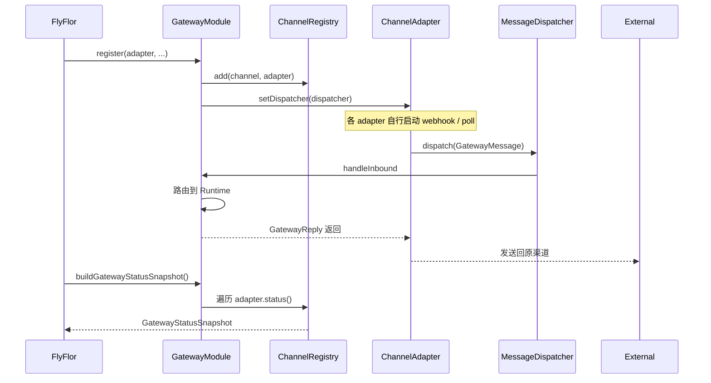
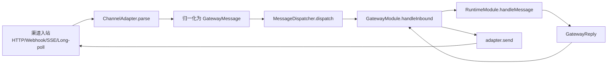

# Gateway 与渠道

## 一句话定位

Gateway 是 Flyflor 对外通讯的唯一入口：归一化 22 种 channel 入站消息为 `GatewayMessage`，按 `route` 调度到 Runtime，再把 `GatewayReply` 反向投递回原始渠道。

## 相关代码路径

- `src/agent/gateway/gateway.module.ts` — Gateway 主类
- `src/agent/gateway/channels/index.ts` — channel adapter 工厂
- `src/agent/gateway/channels/types.ts` — `ChannelAdapter` 与 `MessageDispatcher` 接口
- `src/agent/gateway/channels/status.ts` — registry / status snapshot
- `src/agent/gateway/channels/api.ts` / `stdio.ts` / `webhook.ts` / `weixin.ilink.ts` / `telegram.ts` / `discord.ts` / `feishu.ts` / `http.platforms.ts`
- `src/protocol/contracts/enums.ts` — `Channel` enum
- `src/protocol/messages/types.ts` — `GatewayMessage` / `GatewayReply`

## Channel 矩阵（实现现状）

| Channel | Enum 值 | 适配器 | 状态 |
| --- | --- | --- | --- |
| API | `api` | `ApiChannelAdapter` | ✅ 完整 |
| STDIO | `stdio` | `StdioAdapter` | ✅ 完整（CLI/TUI） |
| Webhook (Generic) | `webhook` | `GenericWebhookAdapter` | ✅ 完整 |
| 微信 iLink | `weixin-ilink` | `WeixinIlinkAdapter` | ✅ token 配齐即启用 |
| WeChat | `wechat` | 复用 `WeixinIlinkAdapter` | ⚠️ 仅当 iLink token 存在 |
| Telegram | `telegram` | `TelegramAdapter` | ✅ webhook + bot |
| Discord | `discord` | `DiscordInteractionAdapter` | ✅ interactions |
| Feishu | `feishu` | `FeishuAdapter` | ✅ webhook |
| BlueBubbles / iMessage | `bluebubbles` / `imessage` | `HttpPlatformAdapter` | ⚠️ HTTP 框架 stub |
| DingTalk | `dingtalk` | `HttpPlatformAdapter` | ⚠️ stub |
| Email | `email` | `HttpPlatformAdapter` | ⚠️ stub |
| Home Assistant | `homeassistant` | `HttpPlatformAdapter` | ⚠️ stub |
| Line | `line` | `HttpPlatformAdapter` | ⚠️ stub |
| Mattermost | `mattermost` | `HttpPlatformAdapter` | ⚠️ stub |
| Matrix | `matrix` | `HttpPlatformAdapter` | ⚠️ stub |
| QQ | `qq` | `HttpPlatformAdapter` | ⚠️ stub |
| Signal | `signal` | `HttpPlatformAdapter` | ⚠️ stub |
| Slack | `slack` | `HttpPlatformAdapter` | ⚠️ stub |
| SMS | `sms` | `HttpPlatformAdapter` | ⚠️ stub |
| WeCom | `wecom` | `HttpPlatformAdapter` | ⚠️ stub |
| WhatsApp | `whatsapp` | `HttpPlatformAdapter` | ⚠️ stub |
| Zalo | `zalo` | `HttpPlatformAdapter` | ⚠️ stub |

> 「stub」指框架就绪、配置占位完整，但缺少真实 webhook 验签 / 回放 / 富文本格式化等业务细节。

## 注册与状态时序



## 主流程



## 数据结构

```ts
interface GatewayMessage {
    messageId: string;
    route: GatewayRoute;        // channel / chatId / chatType / userId
    user: { id: string; displayName?: string };
    text: string;
    attachments?: Array<{ kind, url, mediaType }>;
    receivedAt: string;
    metadata?: Record<string, unknown>;
}

interface GatewayReply {
    messageId: string;
    route: GatewayRoute;
    text: string;
    metadata: { /* runtime/blackboard/skill/mcp/sandbox 等汇总 */ };
}
```

## 配置约束

- `config.gateway.allowedChannels` — 只有列在这里的 channel 才会被实例化。
- `config.gateway.channels.*` — 每个 channel 自己的凭据 / 端点。
- `config.gateway.channelReplyUrls` — 出站回执 URL（可被 channel 内部 `replyUrl` 覆盖）。
- 缺凭据时 adapter 静默退化为「未注册」，`channelStatus.snapshot` 标 `unsupported`。
- 凭据**不允许**走环境变量（参见 boundaries）。

## 事件清单

| 事件 | 触发点 |
| --- | --- |
| `gateway.message.received` | dispatcher 接收到入站消息 |
| `gateway.reply.sent` | 出站送达 |
| `channel.adapter.registered` / `unregistered` | registry 变化 |
| `channel.status.changed` | adapter `status()` 状态转换 |

## 风险点 / 已知缺口

- 大量 channel 适配器只是 `HttpPlatformAdapter` 占位，**未实现签名校验 / 富媒体 / 群组识别**。
- TUI `flyflor chat --tui` 与 `flyflor tui` 已对齐到同一 bootstrap；后续仍需补真实 gateway 事件订阅。
- `gateway start/stop/restart` 已有 daemon helper；跨平台服务安装和长期运行仍需真实环境验证。
- `MessageDispatcher` 仅是单进程；多副本部署时缺消息去重与幂等键。
- 入站消息 `attachments` 已由 runtime 渲染为 `[attachments]` 摘要；下一步是渠道富媒体下载 / 缓存 / 安全扫描。

## 相关测试

- `tests/gateway.boundaries.test.ts`
- `tests/dispatcher.test.ts`
- `tests/weixin.ilink.test.ts`
- `tests/stdio.gateway.test.ts`
