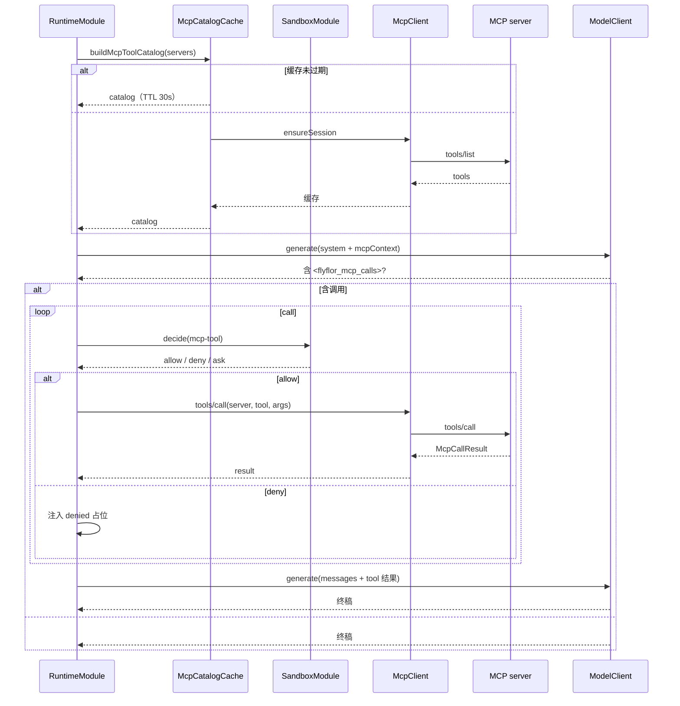

# MCP 工具系统

## 一句话定位

Flyflor 把 MCP 当成模型可调用工具的标准接入层：支持 stdio / Streamable HTTP，目录预拉取走 catalog 缓存，运行时调用走 `<flyflor_mcp_calls>` 协议并经 Sandbox 决策。

## 相关代码路径

- `src/agent/mcp/client.ts` — stdio / HTTP 客户端
- `src/agent/mcp/catalog.ts` — `buildMcpToolCatalog` + TTL 缓存
- `src/agent/mcp/tool.calls.ts` — `<flyflor_mcp_calls>` 解析
- `src/agent/mcp/server.config.ts` — `McpServerConfig` 解析
- `src/agent/runtime/runtime.module.ts` — 工具循环
- `src/agent/prompts/index.ts` — `renderMcpContextPrompt`
- `templates/prompts/mcp.tool.protocol.md` — 模型协议提示

## 传输形态

| 形态 | 启动方式 | 状态 |
| --- | --- | --- |
| stdio | 派生子进程 + stdin/stdout JSON-RPC | ✅ |
| Streamable HTTP (新) | `POST /mcp` + `GET /mcp` SSE | ✅ |
| SSE 双端点（旧式） | `GET /events` + `POST /messages` | ⚠️ 未实现 |

## 调用循环



## 调用协议（模型侧）

模型在同一轮回复内插入：

````markdown
```flyflor_mcp_calls
[{ "server": "filesystem", "tool": "read", "args": { "path": "./README.md" } }]
```
````

代码只校验 `server / tool` 是否在 catalog；`args` 是否符合 tool 的 JSON Schema 由 server 负责。

## 数据结构

```ts
interface McpServerConfig {
    name: string;
    transport: "stdio" | "http";
    command?: string;        // stdio
    args?: string[];
    env?: Record<string, string>;
    url?: string;            // http
    headers?: Record<string, string>;
    enabled?: boolean;
}

interface McpToolCatalogEntry {
    server: string;
    tool: string;
    description?: string;
    inputSchema: Record<string, unknown>;
}

interface McpCallResult {
    ok: boolean;
    content?: Array<{ type: string; text?: string; data?: string }>;
    error?: { code: string; message: string };
}
```

## Catalog 缓存策略

- 默认 TTL 30s；同进程内由 `McpCatalogCache` 统一管理。
- 失败时返回上一次成功结果 + `stale: true`，避免单点 server 抖动阻塞整轮。
- `config.mcp.catalog.maxTools` 截断单 server 工具数。

## 配置

- `config.mcp.servers[]` — 注册的 MCP server 列表
- `config.mcp.catalog.ttlMs` — catalog 缓存 TTL
- `config.mcp.timeoutMs` — tool 调用超时
- `config.sandbox` — 实际允许策略（见 sandbox 章）

## 事件清单

| 事件 | 触发点 |
| --- | --- |
| `mcp.server.connected` / `disconnected` | client 生命周期 |
| `mcp.catalog.refreshed` / `failed` | catalog 拉取 |
| `mcp.tool.called` | 调用发起 |
| `mcp.tool.succeeded` / `failed` / `timeout` | 调用结果 |
| `mcp.tool.denied` | sandbox 拒绝 |

## 风险点 / 已知缺口

- 旧式 SSE 双端点未实现（兼容老 MCP server）。
- catalog 缓存为进程内 Map，**多副本不共享**，且没有 LRU 限制（极端场景内存增长）。
- tool 调用结果直接拼回模型上下文，长结果**未做摘要 / 截断的可观察策略**。
- 调用失败的重试策略只是 0-1 次，无指数退避。
- `McpToolCatalogEntry.inputSchema` 没有在客户端做 JSON-Schema 校验，依赖 server 端拒绝。

## 相关测试

- `tests/mcp.boundaries.test.ts`
- `tests/mcp.tool.calls.test.ts`
- `tests/mcp.catalog.test.ts`
