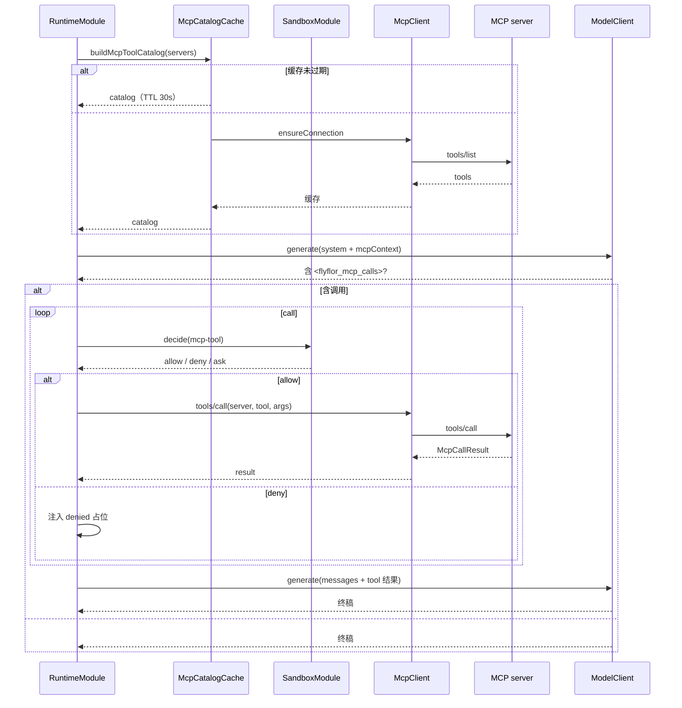

# MCP Tool System

## 一句话定位

Flyflor treats MCP as one capability ingress, not the whole execution model. Built-in local file/git/shell capabilities are registered by code, external MCP/user/plugin capabilities are discovered from explicit manifests or servers, and the prompt only receives the filtered catalog for the current turn. Runtime executes tools through Executive Tool Runtime; resources and prompts enter Executive descriptors and can be read through `RuntimeMcpCapabilityReader`. Every execution/read still passes Executive Tool Plan, Sandbox decisions, and audit events.

This is registry-driven rather than prompt-discovered: the model may only call tools present in the JSON catalog. It must not invent shell/git/file abilities from natural language. Configuration only controls policies, credentials, paths, and external registrations; it must not compensate for unclear ownership or missing core capabilities.

## 相关代码路径

- `src/agent/mcp/stdio.client.ts` — stdio 客户端
- `src/agent/mcp/http.client.ts` — Streamable HTTP 客户端
- `src/agent/mcp/sse.client.ts` — 旧式 SSE 双端点客户端
- `src/agent/mcp/index.ts` — 传输分派、结果渲染、公共类型
- `src/agent/mcp/tool.calls.ts` — `<flyflor_mcp_calls>` 解析
- `src/agent/mcp/schema.validate.ts` — tool inputSchema 轻量校验
- `src/agent/runtime/module.ts` — catalog TTL/LRU 缓存 + 工具循环
- `src/agent/runtime/mcp/workspace.ts` — built-in local file tools (`list/read/search/glob/stat/tree/write/edit`)
- `src/agent/runtime/mcp/git.ts` — 内置只读 git 工具（status/diff/show）
- `src/agent/prompts/index.ts` — `renderMcpContextPrompt`
- `templates/prompts/mcp.context.md` — 模型协议提示与工具目录说明

## 传输形态

| 形态 | 启动方式 | 状态 |
| --- | --- | --- |
| stdio | 派生子进程 + stdin/stdout JSON-RPC | ✅ |
| Streamable HTTP (新) | `POST /mcp` + `GET /mcp` SSE | ✅ |
| SSE 双端点（旧式） | `GET /events` + `POST /messages` | ✅ |

## 调用循环



## MCP Capability 形态

| MCP surface | Executive source | 默认权限 | 当前状态 |
| --- | --- | --- | --- |
| `tools/list` / `tools/call` | `mcp` | 由 tool descriptor 决定，远端默认 `network` | 已进入 runtime 工具循环 |
| `resources/list` | `mcp` | `read` | 已接发现与 descriptor，不直接注入正文 |
| `resources/read` | `mcp` | `read` | 已有受控 client API；必须显式读取、带 provenance 与输出限制 |
| `prompts/list` | `mcp` | `read` | 已接发现与 descriptor，不直接调用或改写系统提示词 |
| `prompts/get` | `mcp` | `read` | 已有受控 client API；只返回结构化 prompt result，不自动改写系统提示词 |

resources / prompts 只消费 MCP 标准结构化字段，不从描述文本推断语义。读取 resource 或获取 prompt 时必须带 result limit、provenance、requestId 和 sandbox / trust 审计，不自动把正文塞进上下文或改写系统提示词。

## 调用协议（模型侧）

The model emits this structured block in a turn:

````markdown
<flyflor_mcp_calls>{"calls":[{"server":"filesystem","tool":"read","input":{"path":"./README.md"}}]}</flyflor_mcp_calls>
````

Runtime verifies `server / tool` against the current catalog and validates `input` against the lightweight JSON Schema subset before execution. Complex schemas are still enforced by the source server/tool. Tool catalogs and tool results are code-generated JSON; `mcp.context.md` only explains the protocol and how to use the visible catalog.

## 内置工具

Runtime injects a built-in `workspace` server so local CLI/TUI turns can inspect and edit files without relying on platform-specific shell snippets:

- `workspace.list`：列出目录项。
- `workspace.read`：读取 UTF-8 文本文件，带 offset/limit 上限。
- `workspace.search`：做精确文本搜索，跳过 `.git`、`node_modules`、`dist` 等重目录。
- `workspace.glob`：按 `**/*.ts` 这类 glob 模式发现文件路径，默认跳过 `.git`、`node_modules`、`dist` 等重目录，并对扫描量和返回量设上限。
- `workspace.stat`：读取文件或目录元信息，不读取文件内容。
- `workspace.tree`：返回有深度和条数上限的递归目录树；用于项目级阅读、审查和架构梳理的第一步。
- `workspace.write`：创建或覆盖 UTF-8 文本文件，写入走审批/审计，使用 Node/Bun 文件 API 和原子临时文件替换。
- `workspace.edit`：对现有文本文件执行一次精确片段替换；匹配为 0 或多次时硬失败，除非显式 `replaceAll=true`。

`workspace` tools do not spawn shell processes. Relative paths resolve from `paths.projectDir`; absolute paths may target any local file. Project-local reads run directly; reads outside the project and every write/edit request require the same approval callback and publish sandbox approval/denial events. Missing approval is an explicit tool error, not a silent fallback. This keeps Windows/macOS compatibility because file work uses `node:path` and `node:fs/promises`, not `bash`, `cat`, `sed`, heredocs, or Unix-only patches.

Execution-class tools still require sandbox permission. `shell.run` appears only when `shellHookApproval=allow/ask`; `--accept-hooks` is an explicit process flag that upgrades shell hooks to `allow` for the current local process.

`shell.run` is cross-platform only at the process-spawn boundary: it uses argv-style execution (`command` + `args[]`) instead of an implicit Unix shell. It does not make `ls`, `cat`, `sed`, POSIX pipelines, heredocs, or PowerShell builtins portable. Cross-platform file work must use `workspace.*`; shell should call real executables only when the user or task explicitly requires a local process.

工作区或全局 `tools.jsonc` 中声明的 user tools 会以虚拟 `user` server 暴露，例如 `user.local.echo`。它们仍复用 `<flyflor_mcp_calls>` 调用协议，但执行不走远端 MCP server，而是走本地 `process-json` bridge 和 Plugin sandbox gate。这样模型侧只有一个工具调用协议，执行侧仍能保留 Executive descriptor、approval、audit、result summary 和 loop guard。

当 shell hook 可执行时，Runtime 也会注入只读 `git` server：

- `git.status`：执行 `git status --short --branch --untracked-files=all`，并返回结构化 branch/files 摘要。
- `git.diff`：执行 bounded `git diff --no-ext-diff`，支持 `cached`、`context` 和单一路径过滤。
- `git.show`：执行 bounded `git show --no-ext-diff --stat --patch --format=fuller`，默认查看 `HEAD`，支持 revision 和单一路径过滤。

`git` 工具底层仍走 `ShellHookExecutor`，命令白名单固定为 `git`，argv 由代码组装，不接受模型传入任意命令字符串；因此它继承 `shellHookApproval=allow/ask/deny` 的审批、超时、输出截断和审计事件。

## Capability Registration Model

The execution surface is assembled from three registries:

- Built-in registry: code-owned local file tools, git tools, and shell hook descriptor.
- Scanned registry: MCP `tools/resources/prompts`, user `tools.jsonc`, and plugin manifests.
- Turn registry: Executive Trust + Sandbox filters the above into the catalog visible to the model for this specific turn.

The prompt is not a discovery mechanism. It only receives the already-filtered catalog and tells the model to call exact `server`/`tool` names from that catalog.

## 数据结构

```ts
interface McpServerConfig {
    name: string;
    transport: "stdio" | "http" | "streamable-http" | "sse";
    command?: string;        // stdio
    args?: string[];
    env?: Record<string, string>;
    url?: string;            // http
    headers?: Record<string, string>;
    enabled?: boolean;
}

interface McpToolCatalogEntry {
    server: string;
    tool: string;
    description?: string;
    inputSchema: Record<string, unknown>;
}

interface McpCallResult {
    ok: boolean;
    content?: Array<{ type: string; text?: string; data?: string }>;
    error?: { code: string; message: string };
}
```

## Catalog 缓存策略

- 默认 TTL 30s；同进程内由 `McpCatalogCache` 统一管理。
- 失败时返回上一次成功结果，并在 `mcp.tool.catalog.built` 事件里写入 `failedServers` / `staleServers`，避免单点 server 抖动阻塞整轮；`tests/skill.mcp.test.ts` 覆盖 refresh 失败后复用 stale catalog 的路径。
- `config.mcp.catalog.maxTools` 截断单 server 工具数。

## 配置

- `config.mcp.servers[]` — 注册的 MCP server 列表
- `config.mcp.catalog.ttlMs` — catalog 缓存 TTL
- `config.mcp.timeoutMs` — tool 调用超时
- `config.sandbox` — 实际允许策略（见 sandbox 章）

## 事件清单

| 事件 | 触发点 |
| --- | --- |
| `executive.capability.catalog.built` | 本轮通用 capability plan 生成，包含 MCP、内置工具、user manifest tools 与 plugin manifest capabilities 的 descriptor 摘要 |
| `mcp.capability.catalog.built` | 本轮 tools/resources/prompts capability plan 生成 |
| `mcp.server.connected` / `disconnected` | client 生命周期 |
| `mcp.catalog.refreshed` / `failed` | catalog 拉取 |
| `mcp.tool.called` | 调用发起 |
| `mcp.tool.succeeded` / `failed` / `timeout` | 调用结果 |
| `mcp.tool.denied` | sandbox 拒绝 |

## 运行边界

- 旧式 SSE 双端点已有客户端兼容，会话建立阶段现在有一次指数退避重试；`tools/call` 在传输/协议失败时也会重开一次 handshake 重试。`bun run smoke:recovery` 已覆盖本地 mock 的短暂断链与长结果回灌，`tests/skill.mcp.test.ts` 覆盖 catalog stale 复用，并与 local working memory WAL/snapshot 恢复同属恢复门禁。真实第三方 server 走显式 opt-in：`bun run smoke:mcp:live -- --rounds 10 --delay-ms 30000`，默认只重复 `tools/list`，不会调用任何 tool；需要真实调用时再显式加 `--call server.tool --input '{}'`。
- catalog 缓存为进程内 Map，**多副本不共享**；已有 TTL/LRU，但跨 gateway 节点仍依赖各自预拉取。
- tool 调用结果现在带结构化 `summary`，长结果保留 head/tail + 原始大小标记；runtime 同步把 `resultSummary` + `resultSummaryMeta` 写入事件、TUI trace 和 memory provenance，反思与 skill 候选只消费结构化摘要，不回读完整大结果。
- 调用失败的重试策略仍然很薄，只对 transport/protocol 层做一次短退避重试；真正的幂等语义还要靠 server 自身能力或更细的 tool 标记。
- inputSchema 只做轻量 JSON Schema 子集校验；复杂 schema 仍依赖 server 端拒绝。

## 相关测试

- `tests/mcp.schema.validate.test.ts`
- `tests/mcp.http.transport.test.ts`
- `tests/mcp.sse.test.ts`
- `tests/mcp.long.results.test.ts`
- `tests/skill.mcp.test.ts`
- `tests/tools.toggle.test.ts`
