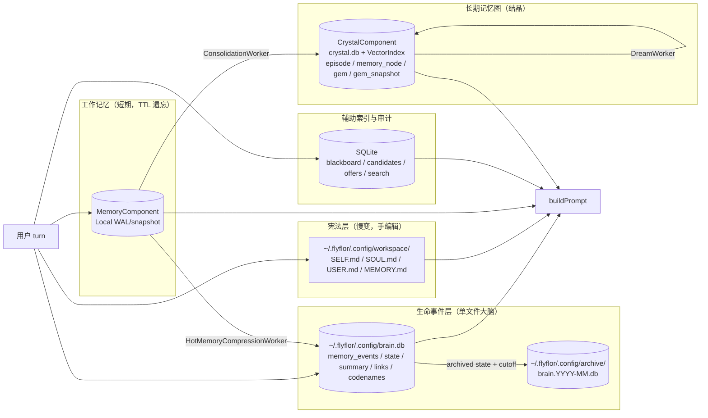
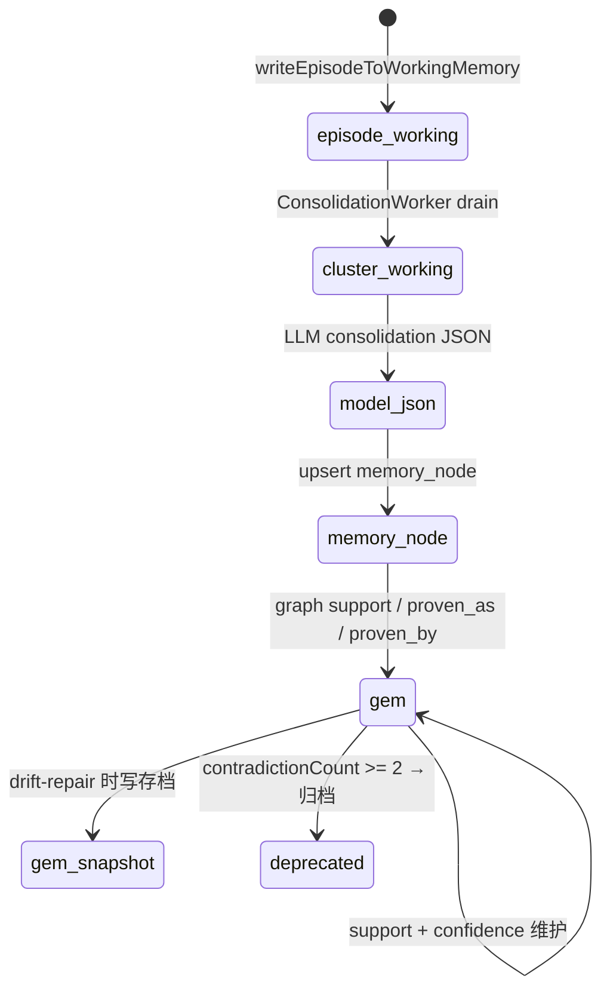
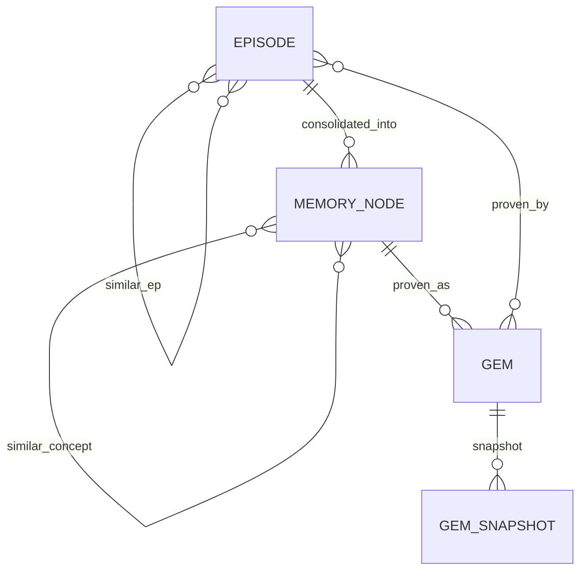
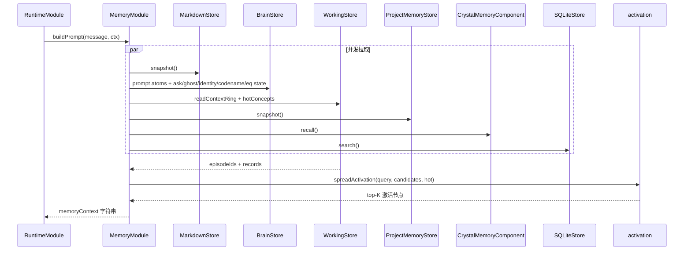
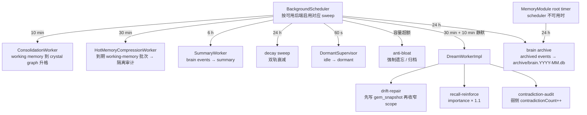

# 记忆系统

> 当前实现处于 LF-R15 收口态：`~/.flyflor/.config/brain.db` 是 prompt atom recall 与 turn event write 的唯一热路径权威源；月级冷归档与热记忆隔离压缩已自动化。

## 一句话定位

Flyflor 把记忆切成五类职责：Markdown 宪法层、brain.db 生命事件层、`MemoryComponent` 本地工作记忆、SQLite 辅助索引与审计、`CrystalComponent` 本地 `crystal.db` 晶体图；升格走证据门，遗忘走工作记忆 TTL / 热记忆压缩、AtomScore / decayScore / Gem 衰减与晶体图漂移机制，Dream worker 只放大已有信号，不凭空创造记忆。

## 相关代码路径

- `src/fch/hippocampus/memory/markdown/index.ts` — `SELF/SOUL/USER/MEMORY.md` 读写
- `src/fch/hippocampus/memory/brain/store.ts` — `brain.db` 单库生命周期、schema 初始化与对外门面（events/state/summary/links/codenames/projects/eq/task_plans/context_forks/scene_records）
- `src/entities/memory/brain.*.entity.ts` / `brain.*.repo.ts` — `memory_events`、`memory_state`、`projects`、`task_plans`、`context_forks`、`scene_records`、`memory_summary`、`memory_links`、`codenames`、`memory_eq_state` 的 row/record 映射与 SQL function；repo 只做数据访问，不做业务决策
- `src/fch/hippocampus/memory/brain/index.ts` — brain.db 月级冷归档（admin 脚本与 runtime 共用）
- `src/fch/hippocampus/memory/working/index.ts` — local WAL/snapshot 工作记忆后端
- `src/fch/hippocampus/memory/hot/index.ts` — 到期工作记忆隔离压缩审计
- `src/fch/hippocampus/memory/sqlite/index.ts` — candidates / offers / search
- `src/fch/hippocampus/memory/recall/index.ts` — spreading activation 与记忆矩阵评分
- `src/fch/hippocampus/memory/consolidation/index.ts` — working memory → crystal graph 升格与反思日志
- `src/fch/hippocampus/memory/lifecycle/index.ts` — 双轨衰减、容量阀门与后台调度节拍
- `src/fch/hippocampus/memory/project/index.ts` — 项目局部记忆
- `src/fch/hippocampus/memory/fork/index.ts` — fork 低频 replay sidecar；`brain.db` 只保留摘要索引
- `src/fch/hippocampus/memory/dream/index.ts` — Dream 三类动作
- `src/fch/hippocampus/memory/summary/index.ts` — daily / weekly summary worker
- `src/fch/hippocampus/memory/feedback/index.ts` — LLM 结构化反馈分类
- `src/fch/hippocampus/memory/history/index.ts` — chat history / planning replay 映射
- `src/fch/hippocampus/memory/actions/index.ts` — `<flyflor_memory_actions>` 解析
- `src/fch/crystal/gems/index.ts` — CrystalGemComponent，内部 Gem 召回与结晶边界
- `src/fch/crystal/memory/index.ts` — CrystalMemoryComponent 兼容门面与本地晶体图 backend
- `src/components/index.ts` — 共享 Component 基类：MemoryComponent / CrystalComponent / BrainComponent / GraphComponent / SQLiteComponent / RedisComponent / SurrealComponent

## 分层结构



## brain.db 单库契约

`brain.db` 是 LF-R1 之后的单文件大脑，当前已包含：

| 表                | 职责                                                                                                     |
| ----------------- | -------------------------------------------------------------------------------------------------------- |
| `memory_events`   | append-only 事实事件；turn、ask、ghost、identity、热记忆压缩审计等都以事件表达                           |
| `memory_state`    | 可变状态层；visibility、decay、status、accessCount 等                                                    |
| `memory_summary`  | day / week / rolling summary；`embedding_id` 指向长期图 `summary_embedding` 节点                         |
| `memory_links`    | contradicts / causal / derived / supersedes 等证据关系                                                   |
| `codenames`       | 用户显式工作锚点，支持 useCount、project 绑定和 inbox 分桶                                               |
| `projects`        | `/project` 显式创建 / 使用的项目注册表；存 projectDir、projectMemoryDir、useCount，不承担 session 连续性 |
| `memory_eq_state` | 最新 EQ 状态，latest-only UPSERT；仅用于语气、暖度和节奏提示                                             |
| `task_plans`      | 模型同轮输出的 TODO / 计划摘要；TUI 侧栏展示进度，不存原始推理                                           |
| `context_forks`   | 无 session 设计下的显式 fork 节点；只存继承事件 id、范围摘要和上下文预算                                 |
| `scene_records`   | 黑板 / 深度思考 / 反思场景回放摘要；`/history` 右侧复用，不存 chain-of-thought                           |

当前写路径：`rememberTurn` 先构造结构化 prompt atoms，并把 turn 作为 `memory_events.type='event'` 写入 brain；atoms 封在 `event.content.atoms` 中，工作记忆 episode 通过 `metadata.brainEventId` 回连该 brain event。当前读路径：prompt atom recall、hippocampus context 与 inbox 可视化都走 `BrainStore.listPromptAtomsWindow` 展开 `brain_events`；Ask continuation、Ghost hint、Identity block、EQ block、Dormant resume hint 也直接从 brain/state 渲染。表级 SQL 优先落在 `src/entities/memory/brain.*.repo.ts`，repo 使用 `query\`...\`` 绑定参数并只做 row/entity 映射；`BrainStore`不承载 service 层语义。Feedback 分类器归属`src/fch/hippocampus/memory/feedback/index.ts`，只产出结构化分类供 MemoryModule 写入修正证据。`MemoryActionAffect` 只参与 memory candidate 权重；EQ 只用于语气、暖度和节奏，不参与路由、工具、问答链深度或记忆候选打分。

TaskPlan / ContextFork / SceneRecord 也会作为 summary-first brain.db 元数据进入同一条回放链。它们只存进度、作用域和可复用场景摘要，不存 raw thinking trace；`/history` 与 TUI 详情可以直接复用这些摘要对象，不需要为每个视图再建一套存储。ContextFork 只在调用方显式传入 `RuntimeContext.contextForkId` 时注入 prompt，Project 只在调用方显式传入 `RuntimeContext.activeProject` 时使用项目局部记忆，保持无 session 设计。

ContextFork 的低频 replay 详情落 `~/.flyflor/.config/storage/forks/<forkId>/manifest.json` / `replay.jsonl`。`brain.db.context_forks` 仍是权威摘要与列表索引；sidecar 只服务 TUI 深度回放和未来清理策略，可按 `memory.tuning.contextFork.sidecarTtlDays`（默认 90 天，0 关闭）删除而不影响摘要审计。

chat TUI 的历史回放直接调用 `MemoryModule.listChatHistory(userId, { beforeTs, limit })`；它只读 `memory_events.type='event'` 的结构化 `userText` / `assistantText`，缺字段视为数据损坏并显式报错。turn event 到 `/history` 视图的映射集中在 `src/fch/hippocampus/memory/history/index.ts`，该文件只做 JSON shape 校验，不从文本推断 TODO、fork 或场景语义。

月级冷归档只移动 `memory_state.status='archived'` 且早于 cutoff month 的事件，并同步搬运同月 `memory_summary`；live / resumed / pending ask / active ghost 不移动。有完整 `BackgroundScheduler` 时归档 tick 复用调度器并避开 summary / dream busy；缺 `MemoryComponent`、`CrystalComponent` 或模型时，`MemoryModule` 仍会用根 timer 维护归档，不依赖长期图后端。

Ghost Context 不被压平成普通 prompt atom。它以 `[ghost-hint]` 单独注入，让模型同轮用 `<flyflor_ghost_decisions>` 决定 `resume` / `fork` / `fresh`；`fork` 或 `fresh` 只更新 ghost 的结构化 evidence，不删除 ghost，后续仍可像分支回归主线一样重新激活。

热记忆压缩同样不被压平成普通 prompt atom。`HotMemoryCompressionWorker` 只把到期 working-memory episode 批次压缩为 `memory_events.type='hot-memory-compression'` 审计事件，`content.isolation` 固定声明 `promptVisible=false`、`memorySummary=false`、`graphCandidate=false`、`gemCandidate=false`。这条记录不是 `memory_summary`，`SummaryWorker` 也会跳过该审计事件；它不写 `CrystalComponent` 长期图。未来如果要把它作为证据，必须走显式 gate。
调度层和 `MemoryModule` 降级 root timer 都把热压缩与 summary / brain archive 视为同一条 brain.db 维护通道，默认串行，避免同库写入互撞。

## Gem 升格与长期图整合



Runtime reflection 还有一条更短的 Gem 候选链：同轮模型输出 `ReflectionCandidate` 后，`CrystalGemComponent` 只用结构化 evidence 权重计算 `evidenceScore`；分数为 0 时只保留 candidate，分数大于 0 时写 atom 并合并 Gem。这里的 `support` / `evidenceScore` 是 runtime Crystal Gem 字段；`memory_node.evidenceCount` 只属于长期图 consolidation 数据面，不是 runtime Gem 的隐藏硬门槛。

Evidence weight 裁判：

| sourceKind                               | weight |
| ---------------------------------------- | ------ |
| `direct` / `unverified`                  | 0.0    |
| `blackboard-needs-user`                  | 0.65   |
| `blackboard-converged` / `mcp-augmented` | 0.8    |
| `explicit`                               | 0.9    |

## 晶体图后端



主实体：`episode`、`memory_node`、`gem`（晶粒）、`gem_snapshot`（防漂移版本快照）、`summary_embedding`（brain summary 的向量索引副本）。承载层是 `CrystalComponent` 的本地 `crystal.db` + VectorIndex + SQLiteGraphStore；Gem 的对内模块边界是 `src/fch/crystal/gems/index.ts` 的 `CrystalGemComponent`，`CrystalMemoryComponent` 只保留对外兼容门面。

`summary_embedding` 由 `MemoryModule.runSummaryOnce` 在 summary 写入后维护：对 summary content 计算 embedding，写入晶体图节点，再回填 `memory_summary.embedding_id`。summary 主记录先落盘；若 embedding 同步失败，会先保留已写入的 summary，再显式抛出，便于上层感知索引不一致并重试。

项目级记忆由 `ProjectMemoryStore` 维护在项目 `.flyflor/memory/` 下。缺失的 manifest 可以按约定初始化；已存在但 schema 不兼容或无法解析的 manifest 视为项目记忆元数据损坏，prompt 装配会显式失败，不再返回空项目记忆掩盖问题。

## 上下文装配



## 双轨衰减

| 实体        | 日衰减率 | 备注                              |
| ----------- | -------- | --------------------------------- |
| episode     | 5%       | `lastVerifiedAt > 30d` 时额外打折 |
| memory_node | 2%       | 同上                              |
| gem         | 0.5%     | 长期稳定                          |

判定阈值：`contradictionCount ≥ 2 → drift-repair`，`confidence < 0.1 → deprecated 归档`。

## 防膨胀

- Working memory：`maxEpisodesPerUser = 200`
- Crystal graph：episode 500 / memory_node 100 / gem 50
- Gem 去重：`symbols IoU ≥ 0.7` 且 `cosine ≥ 0.85` → merge（`dedupeGems` 纯函数）

## 后台 worker



Dream pass 单轮约束：`≤ 1` 次 LLM 调用，`≤ 8K` token，候选选择仅用资源指标（counter / age / cosine / contradictionCount）。无 negative 信号源时一轮 0 写、0 LLM call；Dream 只能放大已有纠错/失败/矛盾信号，不能凭语义相似度凭空创造新事件。

Brain archive 单轮约束：不调模型、不读 content 语义；只看状态、月份和配置阈值。默认 `archiveAfterMonths=3`、`archiveIntervalHours=24`、`vacuumIntervalDays=14`；`archiveIntervalHours=0` 关闭 runtime 自动归档但不影响 admin 脚本。

热记忆压缩单轮约束：只扫描已到 review 时间的 working-memory episode id；模型只输出结构化 JSON 压缩审计，不允许决定长期写入。压缩成功后删除对应 episode；模型输出无效时不删除，发布 `MemoryHotCompressionFailed`。
Consolidation 的 reinforce 分支会延长 working-memory episode TTL 并把下一次 review 时间后移，避免刚被判定仍有工作记忆价值的 episode 立刻进入热压缩清理。

## 记忆动作协议

模型同轮返回 `<flyflor_memory_actions>` JSON：

```json
[
    {
        "action": "add",
        "target": "soul | self | user | memory",
        "kind": "fact | profile | rule",
        "content": "...",
        "confidence": 0.85,
        "signals": { "projectIntent": 0.0, "eventIntent": 0.0, "skillPromotionIntent": 0.0 },
        "codename": { "name": "fly", "workingDir": "/abs/path", "description": "..." },
        "eq": { "label": "neutral", "valence": 0, "arousal": 0, "dominance": 0, "confidence": 0.8 }
    }
]
```

代码只做枚举 / shape 校验；不做关键词推断。

相关结构化块：

- `<flyflor_agent_ask>`：reply / ask 互斥，Ask 事件写 brain；pending ask 通过 `[continuation]` 注入。
- `<flyflor_ghost_decisions>`：resume / fork / fresh Ghost Context。
- `<flyflor_identity_append>`：identity 自写 append-only，用户可 `identity revert`。

## Markdown 文件用途

| 文件        | 内容                 | 写入触发                                       |
| ----------- | -------------------- | ---------------------------------------------- |
| `SELF.md`   | Flyflor 自我模型     | 模型 `target: self` action 或手编辑            |
| `SOUL.md`   | 长期语气、行为原则   | `target: soul` action                          |
| `USER.md`   | 用户画像、偏好       | `target: user` action                          |
| `MEMORY.md` | 项目事实、长期上下文 | `target: memory` 默认通道；history consolidate |

## 项目局部记忆

显式 project intent 或 TUI `/project` 激活后，候选写入当前 project 的 `.flyflor/memory/`：

- project scaffold 必须先成功写入 `AGENTS.md` / `TODO.md` / `README.md` 和 `.flyflor/{memory,skills,mcp,plugins}`；模板缺失或写入失败会发布 `ProjectScaffoldFailed` 并中止本轮 project-local memory 写入，避免没有项目红线的孤儿记忆目录。
- `project.memory.md` — 人可读
- `episodes.jsonl` / `candidates.jsonl` / `events.jsonl` / `recalls.jsonl` — 闭环证据链
- `manifest.json` — provenance

每条写入必须能反查模型 action、trigger 评分、目标文件、写入状态、召回回执和 Crystal provenance（projectId、project dir、memory path、memory layer）。

`/project [path]` 会创建 / 复用目标路径的项目骨架、`.flyflor/memory`、`.flyflor/skills`、`.flyflor/mcp`、`.flyflor/plugins`，并把项目注册到 `brain.db.projects`。后续 turn 是否使用该项目只看 `RuntimeContext.activeProject`，不从 cwd、chatId 或文本推断。

## Inbox 容器与 codename 命名空间（P2）

未显式触发 project 的轮次，atom 落在虚拟 inbox 容器，走 7-day 加速衰减（`isInboxProjectId` 谓词决定）：

- 无 codename → `projectId = "inbox"`
- 当前 turn 命中 codename → `projectId = "inbox:cn-<codenameId>"`（同一 codename 子桶聚集）
- codename 升格为真实 project 后，`bindCodenameProject` 写 `project_id`；后续 atom 走 `project-<hex>` 路径，旧 inbox atom 留在原桶不追溯

**召回偏变**：`recallVisibleBrainMemory` 调 `BrainStore.getMostRecentTouchedCodename(userId, sinceTs)` 取窗口内最近触达且未升格的 codename，命中其子桶的候选 atom 加 `inbox.codenameRecallBoost`（默认 0.15）。零字符匹配——只看 `codenameId` enum + projectId 字面量。

**配置**：`memory.tuning.inbox.activeCodenameWindowMinutes`（默认 60）/ `inbox.codenameRecallBoost`（默认 0.15）。

**可视化**：`flyflor inbox list` 直接读取 brain.db 权威事件并按 codename 分桶展示，`(uncoded)` 桶聚合无 codename 的 inbox atom。

## 事件清单

| 事件                                                                       | 触发点                                            |
| -------------------------------------------------------------------------- | ------------------------------------------------- |
| `memory.episode.written`                                                   | working-memory episode 写入完成                   |
| `memory.consolidation.completed` / `failed`                                | 升格 worker                                       |
| `memory.decay.swept`                                                       | 一轮衰减 sweep                                    |
| `memory.summary.written`                                                   | daily / weekly summary 写入                       |
| `memory.summary.embedding.written`                                         | summary embedding 写入长期图并回填 `embedding_id` |
| `memory.hot.compression.written` / `failed`                                | 到期工作记忆压缩审计写入 / 失败                   |
| `memory.dream.completed` / `failed`                                        | Dream pass 完成                                   |
| `memory.brain.archive.completed` / `failed`                                | brain.db 月级冷归档完成 / 失败                    |
| `memory.drift.repaired`                                                    | drift-repair 动作                                 |
| `memory.recall.reinforced`                                                 | recall-reinforce 动作                             |
| `memory.contradiction.flagged`                                             | contradiction-audit 动作                          |
| `memory.prompt.built`                                                      | buildPrompt 完成                                  |
| `memory.reflection.failed`                                                 | reflection 异步失败                               |
| `memory.feedback.classified` / `failed`                                    | feedback interpreter                              |
| `memory.project.candidate.recorded` / `memory.written` / `memory.recalled` | 项目记忆闭环                                      |
| `memory.warmup.complete`                                                   | working-memory warmup                             |

## 配置要点

- `config.memory.enabled` — 总开关
- `config.memory.crystal.backend` / `config.memory.crystal.local.dbFile` — 晶体层本地 Component 配置
- `config.memory.candidates.maxCandidatesPerTurn` — 每轮候选上限
- `config.memory.candidates.autoPromoteExplicit` — 显式 action 直接 promote
- `config.memory.retrieval.maxResults` / `maxPromptChars` — 上下文预算
- `config.memory.matrix` — Memory Matrix 权重；affect 只消费模型结构化 `emotionalValence/arousal/dominance`，不得启用情感词典或文本关键词推断
- `config.memory.tuning.brainDb.archiveAfterMonths` — 归档 cutoff 月数，默认 3
- `config.memory.tuning.brainDb.archiveIntervalHours` — runtime 自动归档检查间隔，默认 24；0 表示关闭
- `config.memory.tuning.brainDb.vacuumIntervalDays` — 自动 VACUUM 最小间隔，默认 14；0 表示关闭自动 VACUUM
- `config.memory.tuning.hotMemoryCompression.enabled` — 是否启用热记忆压缩审计，默认 true
- `config.memory.tuning.hotMemoryCompression.intervalMinutes` — 自动检查间隔，默认 30；0 表示关闭
- `config.memory.tuning.hotMemoryCompression.batchSize` — 单用户单轮压缩上限，默认 16
- `config.memory.tuning.contextFork.sidecarTtlDays` — fork 冷详情 sidecar TTL，默认 90；0 表示关闭自动清理

## 运行边界

- 任何新召回或 CLI 可视化能力必须直接扩展 brain events/state，不得新增 sidecar 事件库回到 prompt path。
- `RETROSPECTIVE.md` 是晶体升格与丢弃决策的可复核证据；写入失败必须显式失败，后台整合 Worker 只发布 failure event 并保留候选，不做静默吞错。
- 项目记忆 snapshot 只允许“缺文件初始化”这一种恢复路径；坏 manifest / recall JSONL 写失败必须向上冒泡，避免把项目局部记忆损坏伪装成空上下文。
- Ghost content patch 属于状态修复写路径；若原始 ghost event content 已不是合法 JSON object，patch 必须失败，不允许用空对象覆盖坏数据。
- `BackgroundScheduler` 按后端可用性降级；默认本地开发环境可运行 local working memory 与 local crystal graph，brain archive 与热记忆压缩由 `MemoryModule` 根 timer 保底，且共用同一条 brain.db 维护锁。
- Reflection 已拆为 `ReflectionWorker`；Runtime 仅投递异步任务，抽取与落库不再挂在 `RuntimeModule` 私有方法里。
- 本地 working memory 恢复与 MCP transport 恢复已纳入 `smoke:recovery`；`status` / `doctor` / TUI Overview 只读取 snapshot / backup / WAL 文件元数据展示恢复状态，不解析热数据；Docker dev 默认模板 `docker/config.default.jsonc` 启用 local working memory 与 local CrystalComponent，`docker:templates` 只在缺失时初始化 `docker/config/config.jsonc`，不覆盖本地 provider 密钥；Docker doctor/status/recovery 纳入 `smoke:runtime` 与本地 `release:check`。真实模型 chat probe 需要真实 API key，单独由 `smoke:runtime:live` 覆盖；不配置 GitHub Actions 跑仓库侧 CI。

## 相关测试

- `tests/consolidation.test.ts`
- `tests/dream.worker.test.ts`
- `tests/decay.anti.bloat.project.test.ts`
- `tests/activation.test.ts`
- `tests/idle.dream.trigger.test.ts`
- `tests/hot.memory.compression.worker.test.ts`
- `tests/memory.boundaries.test.ts`
- `tests/memory.scheduler.wiring.test.ts`
- `tests/background.scheduler.test.ts`
- `tests/brain.archive.test.ts`
- `tests/config.memory.tuning.test.ts`
- `tests/reflection.gem.consolidation.test.ts`
