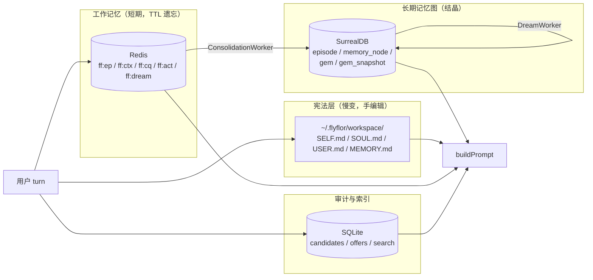
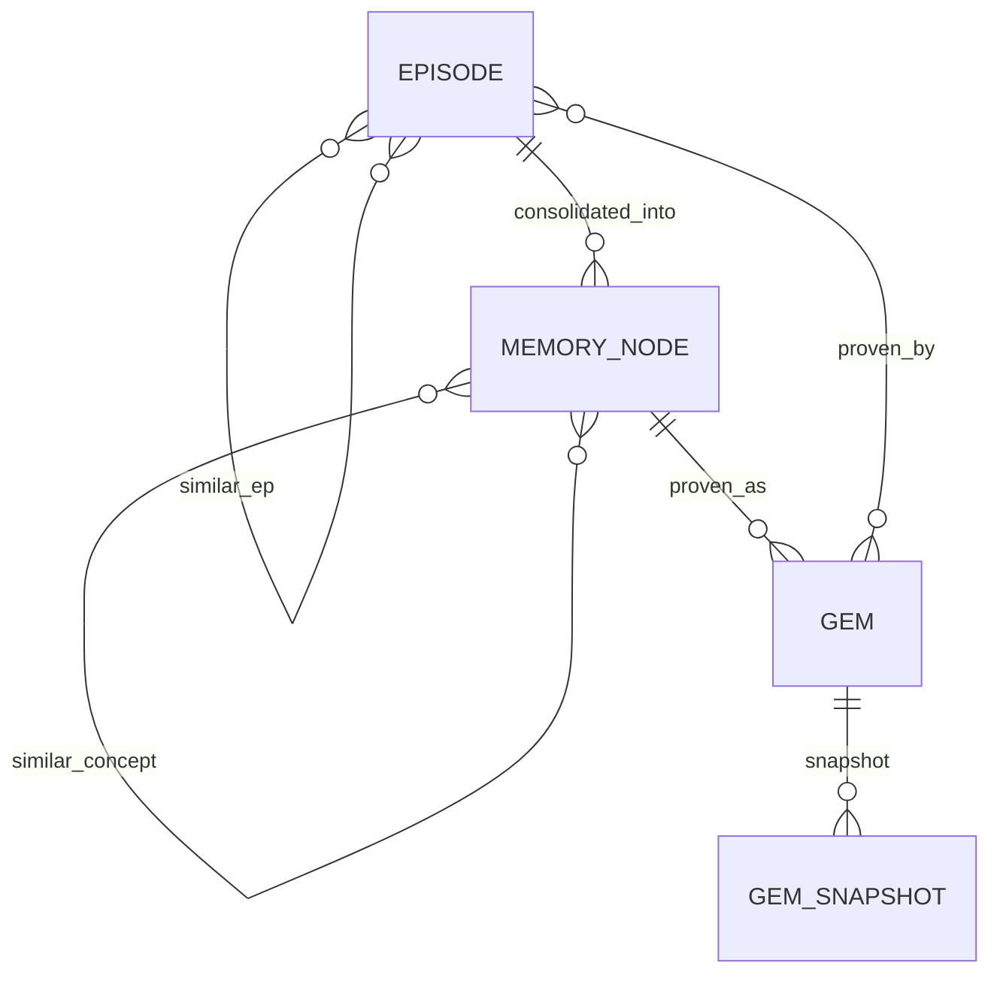
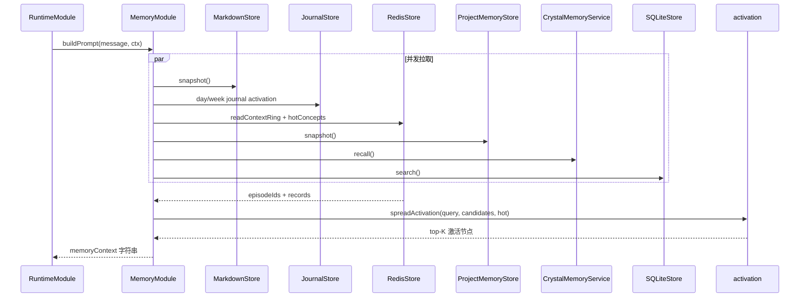
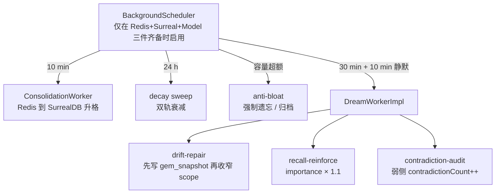

# 记忆系统

> **生命体重构（LF-R1）变更预告**：按天 `journal/<yyyy>/W<ww>/day_*.db` 将被 `~/.flyflor/brain.db` 单库取代（event/state 分离 + append-only），旧 journal 进只读过渡期 60 天。本文档描述当前实现，目标态见 `docs/proposals/life.form.md`。

## 一句话定位

Flyflor 把记忆切成四层：Markdown 宪法层、Redis 工作记忆、SQLite 索引与审计、SurrealDB 长期图；升格走双质量门，遗忘走双轨衰减，结晶在 Dream worker 离线维护。

## 相关代码路径

- `src/neural/memory/markdown.ts` — `SELF/SOUL/USER/MEMORY.md` 读写
- `src/neural/memory/redis.ts` — episode buffer / ring / hot concepts
- `src/neural/memory/sqlite.ts` — candidates / offers / search
- `src/neural/memory/surreal.graph.ts` — episode / memory_node / gem / 边关系
- `src/neural/memory/activation.ts` — spreading activation
- `src/neural/memory/consolidation.worker.ts` — Redis → SurrealDB 升格
- `src/neural/memory/decay.ts` — 双轨衰减
- `src/neural/memory/anti.bloat.ts` — 容量阀门
- `src/neural/memory/project.memory.ts` — 项目局部记忆
- `src/neural/memory/background.scheduler.ts` — consolidation / decay / dream 节拍
- `src/agent/runtime/dream.worker.ts` — Dream 三类动作
- `src/neural/memory/actions.ts` — `<flyflor_memory_actions>` 解析
- `src/crystal/memory/index.ts` / `src/crystal/memory/surreal.ts` — Crystal Memory 适配

## 四层结构



## 升格双质量门

```mermaid
stateDiagram-v2
    [*] --> episode_redis: writeEpisodeToRedis
    episode_redis --> cluster_redis: ConsolidationWorker drain
    cluster_redis --> gate1{"门 1<br/>sourceKind weight gate"}
    gate1 -- weight >= 0.65 --> memory_node
    gate1 -- weight < 0.65 --> discard
    memory_node --> gate2{"门 2<br/>confidence > 0.5 AND<br/>evidenceCount >= 3"}
    gate2 -- 通过 --> gem
    gate2 -- 未通过 --> memory_node
    gem --> gem_snapshot: drift-repair 时写存档
    gem --> deprecated: contradictionCount >= 2 → 归档
```

Evidence weight 裁判：

| sourceKind | weight |
| --- | --- |
| `direct` / `unverified` | 0.0 |
| `blackboard-needs-user` | 0.65 |
| `blackboard-converged` / `mcp-augmented` | 0.8 |
| `explicit` | 0.9 |

## SurrealDB 图



主表：`episode`、`memory_node`、`gem`（晶粒）、`gem_snapshot`（防漂移版本快照）。

## 上下文装配



## 双轨衰减

| 实体 | 日衰减率 | 备注 |
| --- | --- | --- |
| episode | 5% | `lastVerifiedAt > 30d` 时额外打折 |
| memory_node | 2% | 同上 |
| gem | 0.5% | 长期稳定 |

判定阈值：`contradictionCount ≥ 2 → drift-repair`，`confidence < 0.1 → deprecated 归档`。

## 防膨胀

- Redis：`maxEpisodesPerUser = 200`
- SurrealDB：episode 500 / memory_node 100 / gem 50
- Gem 去重：`symbols IoU ≥ 0.7` 且 `cosine ≥ 0.85` → merge（`dedupeGems` 纯函数）

## 后台 worker



Dream pass 单轮约束：`≤ 1` 次 LLM 调用，`≤ 8K` token，候选选择仅用资源指标（counter / age / cosine）。

## 记忆动作协议

模型同轮返回 `<flyflor_memory_actions>` JSON：

```json
[
  {
    "action": "add",
    "target": "soul | self | user | memory | project",
    "kind": "fact | preference | identity | event | project",
    "content": "...",
    "confidence": 0.85,
    "signals": { "projectIntent": 0.0, "eventIntent": 0.0 }
  }
]
```

代码只做枚举 / shape 校验；不做关键词推断。

## Markdown 文件用途

| 文件 | 内容 | 写入触发 |
| --- | --- | --- |
| `SELF.md` | Flyflor 自我模型 | 模型 `target: self` action 或手编辑 |
| `SOUL.md` | 长期语气、行为原则 | `target: soul` action |
| `USER.md` | 用户画像、偏好 | `target: user` action |
| `MEMORY.md` | 项目事实、长期上下文 | `target: memory` 默认通道；history consolidate |

## 项目局部记忆

显式 project intent 触发后，候选写入 `project/.flyflor/memory/`：

- `project.memory.md` — 人可读
- `episodes.jsonl` / `candidates.jsonl` / `events.jsonl` / `recalls.jsonl` — 闭环证据链
- `manifest.json` — provenance

每条写入必须能反查模型 action、trigger 评分、目标文件、写入状态、召回回执和 Crystal provenance（projectId、project dir、memory path、memory layer）。

## 事件清单

| 事件 | 触发点 |
| --- | --- |
| `memory.episode.written` | Redis episode 写入完成 |
| `memory.consolidation.completed` / `failed` | 升格 worker |
| `memory.decay.swept` | 一轮衰减 sweep |
| `memory.dream.completed` / `failed` | Dream pass 完成 |
| `memory.drift.repaired` | drift-repair 动作 |
| `memory.recall.reinforced` | recall-reinforce 动作 |
| `memory.contradiction.flagged` | contradiction-audit 动作 |
| `memory.prompt.built` | buildPrompt 完成 |
| `memory.reflection.failed` | reflection 异步失败 |
| `memory.feedback.classified` / `failed` | feedback interpreter |
| `memory.project.candidate.recorded` / `memory.written` / `memory.recalled` | 项目记忆闭环 |
| `memory.warmup.complete` | Redis warmup |

## 配置要点

- `config.memory.enabled` — 总开关
- `config.memory.redis` — 工作记忆后端
- `config.memory.crystal.surreal` — 长期图后端
- `config.memory.candidates.maxCandidatesPerTurn` — 每轮候选上限
- `config.memory.candidates.autoPromoteExplicit` — 显式 action 直接 promote
- `config.memory.retrieval.maxResults` / `maxPromptChars` — 上下文预算
- `config.memory.matrix` — Memory Matrix 权重

## 风险点 / 已知缺口

- `BackgroundScheduler` 仅在 Redis + Surreal + Model 三件齐备时启用；默认本地开发环境（无 Redis/Surreal）下静默 noop，没有降级告警。
- Reflection 仍由 `RuntimeModule.scheduleReflection` 同进程驱动；独立 Reflection worker 未拆出。
- Dream worker 压测缺失；候选选择策略未在大数据集下验证。
- Gem 表当前在代码内叫 `gem`，旧数据库可能仍是 `crystal_skill / skill_snapshot`，迁移脚本待补。
- `ioredis` 兼容 `bun build --compile` 未真实验证；备选 RESP-over-Bun-TCP 尚未实现。

## 相关测试

- `tests/consolidation.test.ts`
- `tests/dream.worker.test.ts`
- `tests/decay.anti.bloat.project.test.ts`
- `tests/activation.test.ts`
- `tests/idle.dream.trigger.test.ts`
- `tests/memory.boundaries.test.ts`
- `tests/memory.scheduler.wiring.test.ts`
- `tests/background.scheduler.test.ts`
- `tests/reflection.gem.consolidation.test.ts`
