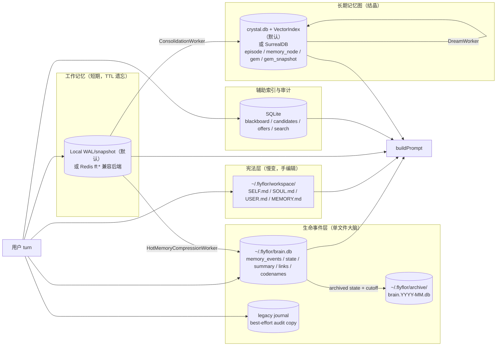
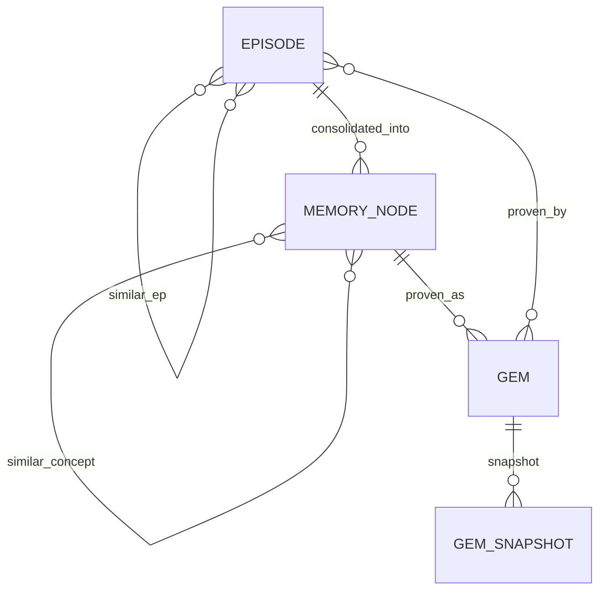
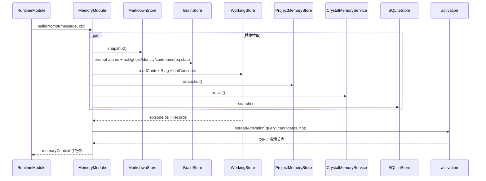
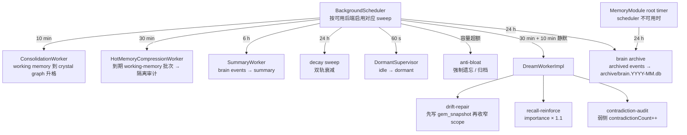

# 记忆系统

> 当前实现处于 LF-R15 收口态：`~/.flyflor/brain.db` 是 prompt atom recall 与 turn event write 的权威源；legacy `JournalStore` 仅保留为 best-effort 审计副本，不再参与 prompt 召回；月级冷归档与热记忆隔离压缩已自动化。

## 一句话定位

Flyflor 把记忆切成五类职责：Markdown 宪法层、brain.db 生命事件层、local/Redis 工作记忆、SQLite 辅助索引与审计、`crystal.db`/SurrealDB 长期晶体图；升格走证据门，遗忘走工作记忆 TTL / 热记忆压缩、AtomScore / decayScore / Gem 衰减与晶体图漂移机制，Dream worker 只放大已有信号，不凭空创造记忆。

## 相关代码路径

- `src/neural/memory/markdown.ts` — `SELF/SOUL/USER/MEMORY.md` 读写
- `src/neural/memory/brain.store.ts` — `brain.db` 单库（events/state/summary/links/codenames/eq）
- `src/neural/memory/brain.archive.ts` — brain.db 月级冷归档（admin 脚本与 runtime 共用）
- `src/neural/memory/journal.store.ts` — legacy atom journal（best-effort 审计副本，不参与 prompt recall）
- `src/neural/memory/local.working.store.ts` — local WAL/snapshot 工作记忆后端
- `src/neural/memory/redis.ts` — Redis 兼容 episode buffer / ring / hot concepts 后端
- `src/neural/memory/hot.memory.compression.worker.ts` — 到期工作记忆隔离压缩审计
- `src/neural/memory/sqlite.ts` — candidates / offers / search
- `src/neural/memory/surreal.graph.ts` — episode / memory_node / gem / 边关系
- `src/neural/memory/activation.ts` — spreading activation
- `src/neural/memory/consolidation.worker.ts` — working memory → crystal graph 升格
- `src/neural/memory/decay.ts` — 双轨衰减
- `src/neural/memory/anti.bloat.ts` — 容量阀门
- `src/neural/memory/project.memory.ts` — 项目局部记忆
- `src/neural/memory/background.scheduler.ts` — consolidation / hot compression / summary / decay / dream / dormant 节拍
- `src/agent/runtime/dream.worker.ts` — Dream 三类动作
- `src/neural/memory/actions.ts` — `<flyflor_memory_actions>` 解析
- `src/crystal/memory/index.ts` / `src/crystal/memory/surreal.ts` — Crystal Memory 适配

## 分层结构



## brain.db 单库契约

`brain.db` 是 LF-R1 之后的单文件大脑，当前已包含：

| 表 | 职责 |
| --- | --- |
| `memory_events` | append-only 事实事件；turn、ask、ghost、identity、热记忆压缩审计等都以事件表达 |
| `memory_state` | 可变状态层；visibility、decay、status、accessCount 等 |
| `memory_summary` | day / week / rolling summary；`embedding_id` 指向长期图 `summary_embedding` 节点 |
| `memory_links` | contradicts / causal / derived / supersedes 等证据关系 |
| `codenames` | 用户显式工作锚点，支持 useCount、project 绑定和 inbox 分桶 |
| `memory_eq_state` | 最新 EQ 状态，latest-only UPSERT；仅用于语气、暖度和节奏提示 |

当前写路径：`rememberTurn` 先构造结构化 prompt atoms，并把 turn 作为 `memory_events.type='event'` 写入 brain；atoms 封在 `event.content.atoms` 中，legacy journal 只做 best-effort 复制。当前读路径：prompt atom recall 走 `BrainStore.listPromptAtomsWindow` 展开 `brain_events`；Ask continuation、Ghost hint、Identity block、EQ block、Dormant resume hint 也直接从 brain/state 渲染。`MemoryActionAffect` 只参与 memory candidate 权重；EQ 只用于语气、暖度和节奏，不参与路由、工具、问答链深度或记忆候选打分。

chat TUI 的历史回放直接调用 `MemoryModule.listChatHistory(userId, { beforeTs, limit })`；它只读 `memory_events.type='event'` 的结构化 `userText` / `assistantText`，缺字段视为数据损坏并显式报错。

月级冷归档只移动 `memory_state.status='archived'` 且早于 cutoff month 的事件，并同步搬运同月 `memory_summary`；live / resumed / pending ask / active ghost 不移动。有完整 `BackgroundScheduler` 时归档 tick 复用调度器并避开 summary / dream busy；缺 Redis、SurrealDB 或模型时，`MemoryModule` 仍会用根 timer 维护归档，不依赖长期图后端。

Ghost Context 不被压平成普通 prompt atom。它以 `[ghost-hint]` 单独注入，让模型同轮用 `<flyflor_ghost_decisions>` 决定 `resume` / `fork` / `fresh`；`fork` 或 `fresh` 只更新 ghost 的结构化 evidence，不删除 ghost，后续仍可像分支回归主线一样重新激活。

热记忆压缩同样不被压平成普通 prompt atom。`HotMemoryCompressionWorker` 只把到期 working-memory episode 批次压缩为 `memory_events.type='hot-memory-compression'` 审计事件，`content.isolation` 固定声明 `promptVisible=false`、`memorySummary=false`、`surrealCandidate=false`、`gemCandidate=false`。这条记录不是 `memory_summary`，`SummaryWorker` 也会跳过该审计事件；它不写长期图。未来如果要把它作为证据，必须走显式 gate。
调度层和 `MemoryModule` 降级 root timer 都把热压缩与 summary / brain archive 视为同一条 brain.db 维护通道，默认串行，避免同库写入互撞。

## 升格双质量门

```mermaid
stateDiagram-v2
    [*] --> episode_working: writeEpisodeToWorkingMemory
    episode_working --> cluster_working: ConsolidationWorker drain
    cluster_working --> gate1{"门 1<br/>sourceKind weight gate"}
    gate1 -- weight >= 0.65 --> memory_node
    gate1 -- weight < 0.65 --> discard
    memory_node --> gate2{"门 2<br/>confidence > 0.5 AND<br/>evidenceCount >= 3"}
    gate2 -- 通过 --> gem
    gate2 -- 未通过 --> memory_node
    gem --> gem_snapshot: drift-repair 时写存档
    gem --> deprecated: contradictionCount >= 2 → 归档
```

Evidence weight 裁判：

| sourceKind | weight |
| --- | --- |
| `direct` / `unverified` | 0.0 |
| `blackboard-needs-user` | 0.65 |
| `blackboard-converged` / `mcp-augmented` | 0.8 |
| `explicit` | 0.9 |

## 晶体图后端



主实体：`episode`、`memory_node`、`gem`（晶粒）、`gem_snapshot`（防漂移版本快照）、`summary_embedding`（brain summary 的向量索引副本）。默认后端是本地 `crystal.db` + VectorIndex + SQLiteGraphStore；SurrealDB 保留为兼容后端。

`summary_embedding` 由 `MemoryModule.runSummaryOnce` 在 summary 写入后 best-effort 维护：对 summary content 计算 embedding，写入晶体图节点，再回填 `memory_summary.embedding_id`。该链路失败只发布 `memory.brain.write.failed(op="summary.embed")`，不影响 `memory_summary` 主记录。

## 上下文装配



## 双轨衰减

| 实体 | 日衰减率 | 备注 |
| --- | --- | --- |
| episode | 5% | `lastVerifiedAt > 30d` 时额外打折 |
| memory_node | 2% | 同上 |
| gem | 0.5% | 长期稳定 |

判定阈值：`contradictionCount ≥ 2 → drift-repair`，`confidence < 0.1 → deprecated 归档`。

## 防膨胀

- Working memory：`maxEpisodesPerUser = 200`
- Crystal graph：episode 500 / memory_node 100 / gem 50
- Gem 去重：`symbols IoU ≥ 0.7` 且 `cosine ≥ 0.85` → merge（`dedupeGems` 纯函数）

## 后台 worker



Dream pass 单轮约束：`≤ 1` 次 LLM 调用，`≤ 8K` token，候选选择仅用资源指标（counter / age / cosine / contradictionCount）。无 negative 信号源时一轮 0 写、0 LLM call；Dream 只能放大已有纠错/失败/矛盾信号，不能凭语义相似度凭空创造新事件。

Brain archive 单轮约束：不调模型、不读 content 语义；只看状态、月份和配置阈值。默认 `archiveAfterMonths=3`、`archiveIntervalHours=24`、`vacuumIntervalDays=14`；`archiveIntervalHours=0` 关闭 runtime 自动归档但不影响 admin 脚本。

热记忆压缩单轮约束：只扫描已到 review 时间的 working-memory episode id；模型只输出结构化 JSON 压缩审计，不允许决定长期写入。压缩成功后删除对应 episode；模型输出无效时不删除，发布 `MemoryHotCompressionFailed`。
Consolidation 的 reinforce 分支会延长 working-memory episode TTL 并把下一次 review 时间后移，避免刚被判定仍有工作记忆价值的 episode 立刻进入热压缩清理。

## 记忆动作协议

模型同轮返回 `<flyflor_memory_actions>` JSON：

```json
[
  {
    "action": "add",
    "target": "soul | self | user | memory",
    "kind": "fact | profile | rule",
    "content": "...",
    "confidence": 0.85,
    "signals": { "projectIntent": 0.0, "eventIntent": 0.0, "skillPromotionIntent": 0.0 },
    "codename": { "name": "fly", "workingDir": "/abs/path", "description": "..." },
    "eq": { "label": "neutral", "valence": 0, "arousal": 0, "dominance": 0, "confidence": 0.8 }
  }
]
```

代码只做枚举 / shape 校验；不做关键词推断。

相关结构化块：

- `<flyflor_agent_ask>`：reply / ask 互斥，Ask 事件写 brain；pending ask 通过 `[continuation]` 注入。
- `<flyflor_ghost_decisions>`：resume / fork / fresh Ghost Context。
- `<flyflor_identity_append>`：identity 自写 append-only，用户可 `identity revert`。

## Markdown 文件用途

| 文件 | 内容 | 写入触发 |
| --- | --- | --- |
| `SELF.md` | Flyflor 自我模型 | 模型 `target: self` action 或手编辑 |
| `SOUL.md` | 长期语气、行为原则 | `target: soul` action |
| `USER.md` | 用户画像、偏好 | `target: user` action |
| `MEMORY.md` | 项目事实、长期上下文 | `target: memory` 默认通道；history consolidate |

## 项目局部记忆

显式 project intent 触发后，候选写入 `project/.flyflor/memory/`：

- `project.memory.md` — 人可读
- `episodes.jsonl` / `candidates.jsonl` / `events.jsonl` / `recalls.jsonl` — 闭环证据链
- `manifest.json` — provenance

每条写入必须能反查模型 action、trigger 评分、目标文件、写入状态、召回回执和 Crystal provenance（projectId、project dir、memory path、memory layer）。

## Inbox 容器与 codename 命名空间（P2）

未显式触发 project 的轮次，atom 落在虚拟 inbox 容器，走 7-day 加速衰减（`isInboxProjectId` 谓词决定）：

- 无 codename → `projectId = "inbox"`
- 当前 turn 命中 codename → `projectId = "inbox:cn-<codenameId>"`（同一 codename 子桶聚集）
- codename 升格为真实 project 后，`bindCodenameProject` 写 `project_id`；后续 atom 走 `project-<hex>` 路径，旧 inbox atom 留在原桶不追溯

**召回偏变**：`recallVisibleBrainMemory` 调 `BrainStore.getMostRecentTouchedCodename(userId, sinceTs)` 取窗口内最近触达且未升格的 codename，命中其子桶的候选 atom 加 `inbox.codenameRecallBoost`（默认 0.15）。零字符匹配——只看 `codenameId` enum + projectId 字面量。

**配置**：`memory.tuning.inbox.activeCodenameWindowMinutes`（默认 60）/ `inbox.codenameRecallBoost`（默认 0.15）。

**可视化**：`flyflor inbox list` 按 codename 分桶展示，`(uncoded)` 桶聚合无 codename 的 inbox atom。

## 事件清单

| 事件 | 触发点 |
| --- | --- |
| `memory.episode.written` | working-memory episode 写入完成 |
| `memory.consolidation.completed` / `failed` | 升格 worker |
| `memory.decay.swept` | 一轮衰减 sweep |
| `memory.summary.written` | daily / weekly summary 写入 |
| `memory.summary.embedding.written` | summary embedding 写入长期图并回填 `embedding_id` |
| `memory.hot.compression.written` / `failed` | 到期工作记忆压缩审计写入 / 失败 |
| `memory.dream.completed` / `failed` | Dream pass 完成 |
| `memory.brain.archive.completed` / `failed` | brain.db 月级冷归档完成 / 失败 |
| `memory.drift.repaired` | drift-repair 动作 |
| `memory.recall.reinforced` | recall-reinforce 动作 |
| `memory.contradiction.flagged` | contradiction-audit 动作 |
| `memory.prompt.built` | buildPrompt 完成 |
| `memory.reflection.failed` | reflection 异步失败 |
| `memory.feedback.classified` / `failed` | feedback interpreter |
| `memory.project.candidate.recorded` / `memory.written` / `memory.recalled` | 项目记忆闭环 |
| `memory.warmup.complete` | working-memory warmup |

## 配置要点

- `config.memory.enabled` — 总开关
- `config.memory.redis` — 工作记忆后端
- `config.memory.crystal.backend` / `config.memory.crystal.local.dbFile` — 晶体层本地后端
- `config.memory.crystal.surreal` — 兼容长期图后端
- `config.memory.candidates.maxCandidatesPerTurn` — 每轮候选上限
- `config.memory.candidates.autoPromoteExplicit` — 显式 action 直接 promote
- `config.memory.retrieval.maxResults` / `maxPromptChars` — 上下文预算
- `config.memory.matrix` — Memory Matrix 权重
- `config.memory.tuning.brainDb.archiveAfterMonths` — 归档 cutoff 月数，默认 3
- `config.memory.tuning.brainDb.archiveIntervalHours` — runtime 自动归档检查间隔，默认 24；0 表示关闭
- `config.memory.tuning.brainDb.vacuumIntervalDays` — 自动 VACUUM 最小间隔，默认 14；0 表示关闭自动 VACUUM
- `config.memory.tuning.hotMemoryCompression.enabled` — 是否启用热记忆压缩审计，默认 true
- `config.memory.tuning.hotMemoryCompression.intervalMinutes` — 自动检查间隔，默认 30；0 表示关闭
- `config.memory.tuning.hotMemoryCompression.batchSize` — 单用户单轮压缩上限，默认 16

## 运行边界 / 后续增强

- legacy journal 仍保留 best-effort 审计写入；任何新召回能力必须直接扩展 brain events/state，不得回退到 journal prompt path。
- `BackgroundScheduler` 按后端可用性降级；默认本地开发环境可运行 local working memory 与 local crystal graph，brain archive 与热记忆压缩由 `MemoryModule` 根 timer 保底，且共用同一条 brain.db 维护锁。
- Reflection 已拆为 `ReflectionWorker`；Runtime 仅投递异步任务，抽取与落库不再挂在 `RuntimeModule` 私有方法里。
- 本地 working memory 恢复与 MCP transport 恢复已纳入 `smoke:recovery`；`status` / `doctor` / TUI Overview 只读取 snapshot / backup / WAL 文件元数据展示恢复状态，不解析热数据；Docker doctor/status/recovery 纳入 `smoke:runtime` 与本地 `release:check`。真实模型 chat probe 需要真实 API key，单独由 `smoke:runtime:live` 覆盖；不配置 GitHub Actions 跑仓库侧 CI。

## 相关测试

- `tests/consolidation.test.ts`
- `tests/dream.worker.test.ts`
- `tests/decay.anti.bloat.project.test.ts`
- `tests/activation.test.ts`
- `tests/idle.dream.trigger.test.ts`
- `tests/hot.memory.compression.worker.test.ts`
- `tests/memory.boundaries.test.ts`
- `tests/memory.scheduler.wiring.test.ts`
- `tests/background.scheduler.test.ts`
- `tests/brain.archive.test.ts`
- `tests/config.memory.tuning.test.ts`
- `tests/reflection.gem.consolidation.test.ts`
