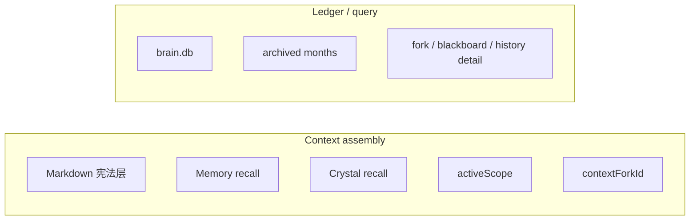

# 记忆系统

## 一句话定位

Flyflor 的上下文装配只来自 `Memory + Crystal + explicit Scope/Fork`。`brain.db` 负责保存和查询经历，但不直接参与 prompt 装配。

这篇文档的核心目的，就是把“记忆系统”和“账本系统”明确拆开。

## 系统分工

### Context assembly 负责什么

- 当前输入
- Markdown 宪法层
- Memory recall
- Crystal recall
- 显式 scope
- 显式 fork
- Executive 可见能力面

### Ledger/query 负责什么

- 完整 turn 对话保存
- 历史查询
- fork 回放
- blackboard 详情
- 审计
- 月度归档

## `brain.db` 的真实职责

`brain.db` 是当前月唯一可写 ledger。

它保存：

- 全部 turn 对话
- 全部 fork 详细对话
- 全部 blackboard 深度思考详细信息
- 结构化状态、摘要、links、replay、plan、fork 索引

它不负责：

- 直接作为 prompt 原文来源
- 自动恢复“当前上下文”
- 成为 scope 容器
- 成为 user/session/chat/thread 的隐式连续性桶

## 月度模型

固定模型是：

- 当前月：可写 `brain.db`
- 历史月：只读 archive shards

不维护“当前总副本”。

## 相关代码路径

- `src/cognitive/hippocampus/memory/module.ts` — Memory 主入口
- `src/cognitive/hippocampus/memory/brain/store.ts` — `brain.db` store 门面
- `src/entities/memory/brain/*` — brain 表 owner 的 entity / repo
- `src/cognitive/hippocampus/memory/working/*` — working memory
- `src/cognitive/hippocampus/memory/scope/*` — scope-local memory 文件面
- `src/cognitive/hippocampus/scope/*` — scope 固化触发、codename 升格和脚手架
- `src/cognitive/crystal/*` — crystal recall / graph / gem

## Scope-local memory

显式 `activeScope` 存在时，runtime 可以读取 scope-local memory。

这层的职责是：

- scope 宪法
- scope 摘要
- scope 下可复用压缩结果
- scope 相关 recall 索引

它不是：

- 从 `brain.db` 原始事件里直接拼 prompt
- 通过 `channel/chat/thread/user` 自动猜出来的工作域

## Fork

`ContextFork` 是显式分支，不是 session。

规则：

- 只有调用方显式传入 `contextForkId`，fork 才进入上下文
- fork 详情保存到 ledger/query plane
- fork 可有低频 sidecar，但摘要索引仍在 `brain.db`

## Codename

`codename` 保留，但降回轻量层：

- 锚点
- scope proposal 入口
- recall boost
- `codename -> scope` 升格前置层

codename 不再自动打开 scope，也不再充当隐式上下文容器。

## 没有显式 scope 时会发生什么

不会发生的事：

- 不创建 fallback scope
- 不创建 inbox scope
- 不按 chat/thread/channel/user 恢复工作域
- 不把 transport 连续性变成记忆连续性

会发生的事：

- 只做 `Memory + Crystal + explicit fork`
- recall 退回全局或 turn-local 语义
- blackboard 只在当前 turn 已装配的上下文上运行

## 当前实现口径

### Memory

Memory 负责：

- 热记忆召回
- 工作记忆 episode
- 行为快照
- ask/continuation/identity/replay/plan/fork 的记忆侧挂接
- scope-local memory 文件面

Memory 不负责：

- 从 transport tuple 恢复上下文
- 把 brain event 原文直接塞给模型

### Crystal

Crystal 负责：

- 稳定、可复用的方法/知识/Gem
- 结构化长期 recall
- 漂移修复与长期图维护

Crystal 不负责：

- 临时 turn 容器
- 直接接管显式 scope

## Blackboard detail

blackboard 详细信息固定保存在 ledger/query plane。

原则：

- normalized tables 优先
- event 流只挂必要摘要和关联 id
- 查询层按需 join / replay

禁止做法：

- 把完整 blackboard 详情只塞进 event JSON
- 把 blackboard 结果直接当成 session 容器

## 历史查询

`history.list` 读取的是全局 ledger。

它不是：

- per-user 上下文恢复接口
- per-chat 恢复接口
- scope 恢复接口

scope、fork、replay、plan 只是 turn 上附着的结构化对象。

## 仍保留的红线

- 约定大于配置
- 目录和文件名优先
- 明确 owner，允许重复，不为去重强行抽象
- `oop + use composition`
- 零字符匹配红线
- `brain.db` 与 prompt 装配不能重新混回去

## 当前最重要的判断句

如果你在实现里看到下面这种思路，就说明偏了：

- “先把 chat/thread/user 找出来，再恢复上下文”
- “没有 scope 也先给它造个默认 scope / workspace”
- “从 brain.db 最近几条 event 直接拼 prompt”

正确方向永远是：

- 先看有没有显式 `activeScope`
- 再看有没有显式 `contextForkId`
- 再用 `Memory + Crystal` 做 recall
- `brain.db` 只作为 ledger/query plane 提供召回素材和审计事实
