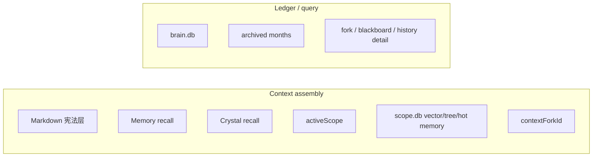

# 记忆系统

## 一句话定位

Flyflor 的上下文装配只来自 `Memory + Crystal + explicit Scope/Fork`。`brain.db` 负责保存和查询生命经历，但不直接参与 prompt 装配。

这篇文档的核心目的，就是把“记忆系统”和“账本系统”明确拆开，并把 Flyflor 的热记忆、晶体智力、Scope 生命域和月分片生命账本区分清楚。

## 系统分工

### Context assembly 负责什么

- 当前输入
- Markdown 宪法层：`~/.flyflor/.config/workspace/{SELF.md,IDENTITY.md,USER.md,MEMORY.md}`
- Memory recall（热记忆）
- Crystal recall（晶体智力）
- 显式 scope
- scope-local `scope.db` 二次索引：Scope Vector、记忆树节点、热区项目记忆和关联词召回
- 显式 fork
- Executive 可见能力面

### Ledger/query 负责什么

- 完整 turn 对话保存
- 历史查询
- fork 回放
- blackboard 详情
- 审计
- 月度归档

## `brain.db` 的真实职责

`brain.db` 是当前月唯一可写 ledger。

它保存：

- 全部 turn 对话
- 全部 fork 详细对话
- 全部 blackboard 深度思考详细信息
- 结构化状态、摘要、links、replay、plan、fork 索引

它不负责：

- 直接作为 prompt 原文来源
- 自动恢复“当前上下文”
- 成为 scope 容器
- 成为 user/handshake/chat/thread 的隐式连续性桶

## 月度模型

固定模型是：

- 当前月：可写 `brain.db`
- 历史月：只读 archive shards

也就是说，Flyflor 的生命账本不是单一总库，而是每个月诞生一份新的 `brain.db` 分片；历史月保留为只读审计与检索面。

不维护“当前总副本”。

## 相关代码路径

- `src/cognitive/hippocampus/memory/module.ts` — Memory 主入口
- `src/cognitive/hippocampus/memory/markdown/store.ts` — 全局 Markdown 宪法层，只读取 `SELF.md` / `IDENTITY.md` / `USER.md` / `MEMORY.md`
- `src/cognitive/hippocampus/memory/brain/store.ts` — `brain.db` store 门面
- `src/entities/memory/brain/*` — brain 表 owner 的 entity / repo
- `src/cognitive/hippocampus/memory/working/*` — working memory
- `src/cognitive/hippocampus/memory/scope/*` — scope-local memory 文件面
- `src/cognitive/hippocampus/scope/*` — scope 固化触发、codename 升格和脚手架
- `src/cognitive/crystal/*` — crystal recall / graph / gem

## Scope-local memory

## Markdown 宪法层

全局 Markdown 画像固定存放在 `config.paths.workspaceDir`，默认路径是 `~/.flyflor/.config/workspace`。

运行时只读取四个 canonical 文件：

- `SELF.md`
- `IDENTITY.md`
- `USER.md`
- `MEMORY.md`

初始化模板来自 `config.paths.templateDir/memory`，默认路径是 `~/.flyflor/.config/templates/memory`，文件名为 `self.md` / `identity.md` / `user.md` / `memory.md`。这些小写模板只负责首次生成大写 workspace 文件。

`.zh.cn.md` 是模板镜像和人工审查副本，不得进入 prompt/context/灵魂画像。旧残留 `SOUL.md` / `SOUL.zh.cn.md` 也不是当前运行契约的一部分；OpenHuman 里的 `SOUL.md` 思路只能作为历史参考，Flyflor 当前用 `IDENTITY.md` 承担身份边界。

这层类似宪法，不是对话账本，也不是 OpenHuman 记忆树。OpenHuman 的记忆树把外部资料切成 Markdown chunk，再用 SQLite 保存层级摘要；Flyflor 只把这个思想借给 Scope：全局画像保持四文件稳定，项目热区记忆进入 scope-local `scope.db` 与 `project.memory.md`。

显式 `activeScope` 存在时，runtime 可以读取 scope-local memory。

这层的职责是：

- scope 宪法
- scope 摘要
- scope 下可复用压缩结果
- scope 相关 recall 索引
- `<scope.projectDir>/.flyflor/scope.db` 中的 Scope Vector、tree node、hot memory 和 association index
- 用户提到该 Scope 时，用向量相似度、树节点、关联词和 provenance 召回热区项目记忆，再装配到当前 turn 的热区

它的设计主语不是“项目目录附属配置”，而是智能生命体对长期事情形成的独立生命工作域。

一个 Scope 一旦被确认并固化，它应当被理解为局部生命域，而不是简单标签：

- 它拥有独立的宪法层
- 它拥有独立的记忆入口与索引面
- 它拥有独立的召回装配资格
- 它可以承接后续的 codename、fork、task plan 和 replay 连续性

它不是：

- 从 `brain.db` 原始事件里直接拼 prompt
- 通过 `channel/chat/thread/user` 自动猜出来的工作域

`scope.db` 与 `brain.db` 必须分离：`brain.db` 是按月生命账本，负责 ledger/query/replay/audit/detail；`scope.db` 是某个 Scope 的上下文装备索引，保存类似 MemoryComponent 热区记忆的项目记忆、记忆树节点、多维关联词和向量召回材料。用户显式进入一个 Scope，或 codename 锚点升格成 Scope 后，运行时才能用 Scope Vector 把这些二次产物装配进热区。

Scope 热区记忆不是生命账本副本。它是项目记忆：从 turn、ASK、fork merge、task plan、blackboard 收束和 Crystal evidence 中提炼出的可召回片段。多维关联词只用于检索和装备，不允许变成业务语义判断规则；召回排序依赖向量相似度、图关系、TTL、activation、cluster size 和 provenance 等结构化信号。

自然语言 Scope 召回必须先经过 LLM 门控，而不是关键词触发。运行时流程是：

1. `ScopeRecallComponent` 发布 `scope.recall.started`，用户面可显示“回忆中”。
2. `MemoryModule.listScopeRecallCandidates()` 只读 `brain.db.scopes/codenames` 和 scope-local `scope.db`，组装候选证据。
3. LLM 用 `templates/prompts/scope.recall.md` 输出 `none | load | ask` 的结构化 JSON。
4. `load` 才把 `activeScope` 写入本轮 enriched context，然后装配 Scope 宪法、Scope Memory 和 Scope Vector。
5. `ask` 直接生成 `AgentAsk`，等待用户确认；未回复时仍进入 ASK ghost/continue 闭环。

向量分数、关联词、codename 只用于召回候选和排序，不能替代 LLM 做语义判断。

## Fork

`ContextFork` 是显式分支，不是隐式连续性容器。

规则：

- 只有调用方显式传入 `contextForkId`，fork 才进入上下文
- fork 详情保存到 ledger/query plane
- fork 可有低频 sidecar，但摘要索引仍在 `brain.db`

## Codename

`codename` 保留，但降回轻量层：

- 锚点
- scope proposal 入口
- recall boost
- `codename -> scope` 升格前置层

codename 不再自动打开 scope，也不再充当隐式上下文容器。

## 没有显式 scope 时会发生什么

不会发生的事：

- 不创建 fallback scope
- 不创建 inbox scope
- 不按 chat/thread/channel/user 恢复工作域
- 不把 transport 连续性变成记忆连续性

会发生的事：

- 只做 `Memory + Crystal + explicit fork`
- recall 退回全局或 turn-local 语义
- blackboard 只在当前 turn 已装配的上下文上运行

## 当前实现口径

### Memory

Memory 负责：

- 热记忆召回
- 工作记忆 episode
- 行为快照
- ask/continuation/identity/replay/plan/fork 的记忆侧挂接
- scope-local memory 文件面

Memory 不负责：

- 从 transport tuple 恢复上下文
- 把 brain event 原文直接塞给模型

Memory 在这里更接近生命体的热缓冲区：它保留近期活动、近期偏移和仍在升温的事实，但不替代 Crystal 的长期稳定方法层。

### Crystal

Crystal 负责：

- 稳定、可复用的方法/知识/Gem
- 结构化长期 recall
- 漂移修复与长期图维护

Crystal 不负责：

- 临时 turn 容器
- 直接接管显式 scope

Crystal 不是更大的 Memory；它负责的是已经经得起沉淀的稳定能力。Memory 与 Crystal 的关系是分层协作，而不是容量升级或冷热缓存的简单替代。

## Ask、结晶与遗忘

Flyflor 的长期成长不是靠“把所有聊天留着”，而是靠 ask 闭环、结晶闭环和遗忘曲线：

- Ask 负责把边界不清、黑板封顶、scope 升格、工具 loop 配额耗尽等场景显式交还给用户
- 高质量 ask-answer、黑板收敛、反思证据和长期任务收束，会变成 Crystal 的结晶候选来源
- 遗忘不是简单删除，而是通过热记忆压缩、晶体向量偏移、漂移修复和 LLM 再组织完成的生命再编码

这也意味着 Flyflor 的成长不是“日志越来越大”，而是：

1. 经历先进入热记忆与生命账本
2. 经 ask / reflection / blackboard / 长期任务收束形成结构化证据
3. 高价值部分再被结晶成长期可复用的能力

## Blackboard detail

blackboard 详细信息固定保存在 ledger/query plane。

原则：

- normalized tables 优先
- event 流只挂必要摘要和关联 id
- 查询层按需 join / replay

禁止做法：

- 把完整 blackboard 详情只塞进 event JSON
- 把 blackboard 结果直接当成 隐式连续性容器

## 历史查询

`history.list` 读取的是全局 ledger。

它不是：

- per-user 上下文恢复接口
- per-chat 恢复接口
- scope 恢复接口

scope、fork、replay、plan 只是 turn 上附着的结构化对象。

## 仍保留的红线

- 约定大于配置
- 目录和文件名优先
- 明确 owner，允许重复，不为去重强行抽象
- `oop + use composition`
- 零字符匹配红线
- `brain.db` 与 prompt 装配不能重新混回去

## 当前最重要的判断句

如果你在实现里看到下面这种思路，就说明偏了：

- “先把 chat/thread/user 找出来，再恢复上下文”
- “没有 scope 也先给它造个默认 scope / workspace”
- “从 brain.db 最近几条 event 直接拼 prompt”

正确方向永远是：

- 先看有没有显式 `activeScope`
- 再看有没有显式 `contextForkId`
- 再用 `Memory + Crystal` 做 recall
- `brain.db` 只作为 ledger/query plane 提供召回素材和审计事实
