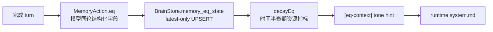

# EQ 模块（提案）

> Status: **done**（EQ 仅保留语气层；历史 ask cap 绑定已移除）。
>
> - EQ-01 三 slice：协议层 + brain.db 持久化 + `[eq-context]` prompt 注入 + 决策侧 `peekEqState` 公共读 API + 红线审计。
> - EQ-02：语气提示 — `EqDirective` 封闭枚举（calm-down / match-energy / steady）+ `deriveEqDirective(state)` 纯函数阈值映射；仅供 `[eq-context]` 文本表达使用，不参与路由、工具、ask cap 或记忆候选打分。
> - EQ-03：历史 runtime 绑定已移除 — 旧的 ask cap override 与 `RuntimeEqDirectiveApplied` 审计不再使用；`tests/eq.runtime.cap.test.ts` 现覆盖“EQ 不影响 ask cap”的回归。
>
> `docs/boundaries.md` 零字符匹配红线全程坚守：`EqLabel` / `EqDirective` 都是封闭枚举，`runtime` 严禁基于消息文本派生；`tests/eq.decision.test.ts` 内含红线审计扫描 src/，对 5 个 label + 2 个非平凡 directive 值禁止 `includes/indexOf/match/test/split` 关键词派生路径。当前维护重点是随 prompt / docs drift check 保持“EQ 仅语气层”的口径不漂移。

## 目标

为 Flyflor 提供「情绪状态」的轻量建模能力，让模型在 turn 之间能感知到用户当前情绪基线，并影响：

- 回复语气（保留在 SOUL.md 约束之下）
- 语气节奏与措辞

## 不做的事

- **不做关键词检测**。情绪分类必须由模型在结构化字段中返回，参考 `feedback.classify.md`。
- 不替代 USER.md 长期偏好；EQ 只是短期状态。
- 不改变路由、工具选择、问答链深度、记忆候选打分或是否发起 follow-up。
- 不引入新的硬编码语义规则。

## 概念模型



## 数据结构（已落地）

```ts
interface EqState {
    userId: string;
    valence: number;        // -1..1
    arousal: number;        // 0..1
    dominance: number;      // 0..1
    label: "neutral" | "joy" | "anger" | "sadness" | "fear" | "surprise";
    confidence: number;
    updatedAt: number;      // ms
}

type EqDirective = "calm-down" | "match-energy" | "steady";
```

## 与边界的关系

- valence 衰减允许走纯资源指标（时间窗 / 计数器）。
- 标签 / 强度变化必须由模型结构化字段产生，禁止文本匹配。
- 数据落点：`brain.db` 的 `memory_eq_state` 表，按 `userId` latest-only UPSERT；事件用 `MemoryEqStateUpdated` 审计，runtime 不再发 ask cap 级联事件。

## 落地清单

1. `MemoryAction.eq` 字段已加入 `templates/prompts/memory.action.md` / `memory.action.zh.cn.md`。
2. `BrainStore.upsertEqState/getEqState` 已写入 `memory_eq_state`。
3. `MemoryModule.buildPrompt` 已注入 `[eq-context]`，并作为语气提示使用。
4. `RuntimeModule` 不再消费 EQ 做 ask cap 或其他决策。
5. 测试覆盖：`tests/eq.contracts.test.ts`、`tests/eq.wire.test.ts`、`tests/eq.prompt.test.ts`、`tests/eq.decision.test.ts`、`tests/eq.runtime.cap.test.ts`。

## 风险点

- 情绪建模容易引入隐形语义判断（必须严格走结构化字段）。
- 误触发安抚消息会显著破坏体验，需要明确审批通道。
- 与 SOUL.md 的语气约束可能冲突；SOUL.md 优先级更高。
