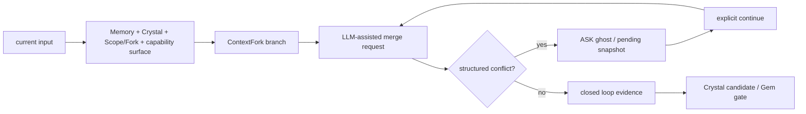

# Flyflor 项目报告

状态日期：`2026-05-23`

本文是 Bun + TypeScript 仓库当前的契约叙述。它说明哪些事情已经是事实，Kernel V2 正在闭合哪些事情，以及子 worktree 不能越过哪些红线。本文不会把外部 Rust shell 工作写成本仓库的活跃任务。

## 一句话定位

Flyflor 是智能生命体内核，不是 chat/session agent。本仓库负责 Bun runtime 内核、Cognitive-Executive-Agent 架构、socket 血管协议、memory 与 crystal 上下文装备，以及单文件二进制发布路径。

当前 runtime 主语是：

- 当前输入
- `MemoryComponent`
- `CrystalComponent`
- 显式 `Scope`
- 显式 `ContextFork`
- Executive 可见能力面

当前 ledger 主语是 `brain.db`：按月分片的生命账本，负责 event/state、query、replay、audit 和 detail 检索。它不是 prompt 容器。

## 当前事实

- 源码实现目标是 Bun + TypeScript，并且必须保持 `bun build --compile` 可用。
- 主 socket 暴露面是 `/ws` 加 `/health`；`/channels` 继续移除。
- `flyflor.ws.v1`、`flyflor.event.v1` 和 `gateway.*` 是兼容 wire 词汇，不是活跃架构 owner。
- `src/socket` 拥有 live turn、event、operation 和 ledger query/replay transport。
- `src/cognitive` 拥有 Mindstream、Crystal 和 Hippocampus 认知层。
- `src/executive` 拥有 capability、tool、trust 和 loop 执行层。
- `src/agent` 拥有 runtime、blackboard、sandbox、context、skills、worker、MCP 和 plugin 面。
- `brain.db` 只做 ledger/query/replay/audit/detail。
- Scope-local `scope.db` 是 Scope vector、tree、hot-memory 和 association 的 context/index 装备。
- Runtime context assembly 仍然是 current input + Memory + Crystal + explicit Scope/Fork + Executive visible capability surface。

## 不是当前事实

以下项目仍是 Kernel V2 的剩余闭合目标或外部交接参考。在对应实现和验证进入主线前，不能写成已经落地。

- 未回答 ASK snapshot 的 ASK ghost resume。
- ASK ghost 通过显式 `continue` 恢复后的端到端用户面闭环。
- 本 Bun 仓库内的任何 Rust shell 实现。
- `/health` 和 `/ws` 之外的任何 HTTP surface。
- 任何从 transport metadata 派生的认知连续性 owner。

## 作者设计思想

Flyflor 的设计来自几个明确判断：

1. 智能不是 transcript 堆叠。原始日志是 evidence 和 audit material；context 是被选择、打分、结构化后的视图。
2. 不确定性应该成为显式协议事件。ASK 是让系统停止、提问、恢复，并避免把隐藏猜测伪装成事实的器官。
3. 长期工作需要显式领地。Scope 是唯一 durable work domain，Fork 是该 domain 下唯一显式分支。
4. 经验只有经过证据门才应结晶。Crystal/Gem 输出的是稳定方法和知识，不是近期对话转储。
5. 行动力是外骨骼。Executive 提供工具、权限、中断、恢复和审计，但不拥有认知本体。
6. 约定大于配置。目录 owner、文件名形状、component 边界、protocol enum 和 JSON schema 是第一契约。
7. 字符匹配不能变成隐藏智能。业务语义判断只能来自结构化模型输出、专用提示词 JSON 或数值资源指标。

## 设计分层

| Layer | Owner | Responsibility |
| --- | --- | --- |
| Entry | `app.ts` | 只做薄模式分派。 |
| Composition | `src/app.ts` | 显式依赖绑定和 runtime 启动。 |
| Cognitive | `src/cognitive` | Mindstream、Crystal、Hippocampus、Memory、Scope、ASK、recall、consolidation。 |
| Executive | `src/executive` | Capability catalog、tool descriptor、trust gate、loop execution、pause/resume 语义。 |
| Agent | `src/agent` | Runtime pipeline、blackboard、sandbox、context assembly、skills、worker、MCP、plugin。 |
| Socket | `src/socket` | `/ws`、`/health`、live turn、event、operation、ledger query/replay transport。 |
| Events | `src/events` | Runtime event fabric 和 fan-out。 |
| Protocol | `src/protocol` | 可序列化 contract、enum、envelope、structured block。 |
| Entities | `src/entities` | Row mapping、repo SQL、schema ownership。 |
| Components | `src/components` | 共享 Component 基类和真正跨模块基础设施。 |
| Config/Templates | `src/config`, `templates` | JSONC config 默认值、prompt 和 memory template 源。 |

## 双平面契约

Context plane：

- 当前输入
- 经过打分的 Memory recall
- Crystal recall
- 显式 `activeScope`
- 显式 `contextForkId`
- Executive 可见能力面

Ledger/query plane：

- 当前月 `brain.db`
- 只读月归档
- history、replay、audit、detail lookup
- fork、ask、plan 和 blackboard detail 的结构化 provenance

两张平面可以通过 id 和 evidence 互相引用，但不能坍缩成同一个系统。尤其是 `history.list` 和 replay view 不是 session restore，也不是 prompt assembly。

## Scope/Fork/ASK Ghost/Crystal 闭环模型

当前契约：

- `Scope` 是唯一显式 durable work domain。
- `ContextFork` 是 Scope 或 turn-local context 下的显式分支。
- `ASK` 通过结构化 `AgentAsk` 输出和 ledger/state 记录表达，不靠自然语言问句检测。
- `CrystalComponent` 从带 evidence 的 candidate 中沉淀稳定知识和方法。

当前已进入主线的部分：

1. 结构化 continuation decision 可以携带 `forkMerges`。
2. `conflict-ask` fork merge 会进入 runtime ASK path。
3. `merged` fork merge 可以生成 `context-fork-closure` Crystal candidate。
4. Executive loop guard 会产生可见 `loopGuardSnapshot`，重复失败结果会结构化 ASK 暂停。

仍需继续验证和补齐的部分：

1. 未回答 ASK ghost/pending snapshot 的完整恢复体验。
2. `continue` 恢复后对 scope/fork/loop snapshot 的端到端用户面闭环。
3. Crystal candidate 到 Gem 的长期质量门和回放可解释性。

目标 loop：

## 红线

- 不从 `clientId`、`conversationKey`、`threadId`、`user.id`、connection 或 transport metadata 重新引入隐式连续性。
- 不创建 fallback Scope 或 inbox Scope。
- 不把原始 `brain.db` event 直接读进 prompt。
- 不把 codename 变成 context container。
- 不恢复 `/channels`。
- 不为了实现方便改变 v1 wire string。
- 不在本仓库放 Rust 实现工作。
- 不使用业务语义 `includes`、regex、关键词列表、标点启发式或情感词典。
- 工具、文件、shell、网络、MCP、plugin 或 computer control 不绕过 sandbox、trust、approval 或 audit。
- 不新增破坏 Bun 单文件二进制编译的运行时依赖。
- 修改 prompt template 必须同步 canonical `.md` 和 `.zh.cn.md`。

## Kernel V2 Worktree Task Table

| Merge order | Branch | Mainline state | Decision |
| --- | --- | --- | --- |
| 1 | `wt/docs-contracts-report` | 本报告被选择性保留；过宽 README / old-docs / control-file diff 不合入。 | 保留报告，主线维护 canonical 摘要。 |
| 2 | `wt/kernel-scope-memory` | Scope/Memory owned code/test surface 已在主线闭合。 | 回收 lane，分支保留为 evidence。 |
| 3 | `wt/kernel-fork-ask-crystal` | fork merge parsing、conflict ASK、merged closure Crystal candidate 已合入并通过 focused tests。 | 已合入 implementation/test。 |
| 4 | `wt/kernel-runtime-executive` | Executive loop guard snapshot 和 repeated failure ASK pause 已合入并通过 focused tests。 | 已合入 implementation/test。 |
| 5 | `wt/kernel-socket-protocol` | event selector guard / OpenAPI enum / WS docs 已在主线；剩余 diff 会回退当前协议。 | 拒绝剩余 diff，回收 lane。 |
| 6 | `wt/kernel-release-seal` | installer/Docker scripts 与主线一致；剩余 diff 违反 README/control-file policy。 | 拒绝剩余 diff，回收 lane。 |

## 交接影响

Protocol impact：本文不改变 wire protocol。它重申 `/ws`、`/health`、`flyflor.ws.v1`、`flyflor.event.v1` 和 `gateway.*` compatibility names。

DB impact：本文不改变 schema。它重申 `brain.db` 只做 ledger/query/replay/audit/detail，`scope.db` 是 Scope-local context/index equipment。

Context-assembly impact：本文不改变 runtime assembly。它重申 canonical source set：current input + Memory + Crystal + explicit Scope/Fork + Executive visible capability surface。

Prompt-template impact：本文不改变 runtime prompt templates。Runtime templates 继续是 canonical `.md` 文件，并配套 `.zh.cn.md` 人工审查副本。

Residual risk：本文是 contract anchor。当前主线已经合入 fork/ASK/crystal 和 runtime/executive 的关键 implementation/test 增量，但最终 seal 仍需要完整 `docs:check`、focused docs/naming tests、`bun run check`、`git diff --check`，以及按需要运行更大的 deterministic suite。
