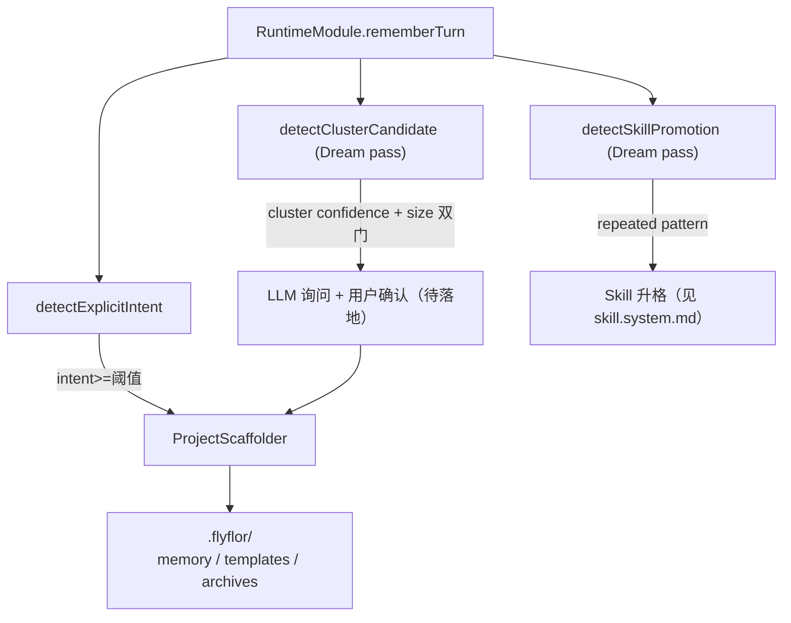
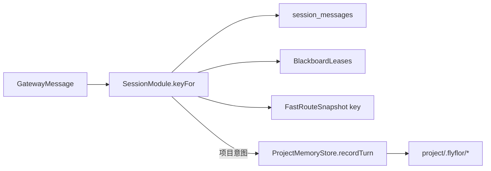

# Session 与 Project

## 一句话定位

Session 是「短期审计层」（按 channel + chat + user 组合 key 聚合最近若干轮消息），Project 是「长期工作上下文」（绑定本地目录，承载项目记忆 / 模板 / 闭环证据）；二者用 `keyFor` 桥接，不共享内部结构。

## 相关代码路径

- `src/agent/session/session.module.ts` — 4 个方法实现
- `src/neural/memory/sqlite.ts` — sessions / session_messages / session_history 三张表
- `src/agent/project/index.ts` — ProjectModule
- `src/agent/project/scaffolder.ts` — `.flyflor/` 脚手架
- `src/agent/project/triggers.ts` — `detectExplicitIntent` / `detectClusterCandidate` / `detectSkillPromotion`
- `src/neural/memory/project.memory.ts` — ProjectMemoryStore

## SessionModule 接口

```ts
class SessionModule extends Session {
    keyFor(message: GatewayMessage): string;
    recordTurn(message: GatewayMessage, reply: GatewayReply): Promise<void>;
    recentMessagesFor(message: GatewayMessage): Promise<SessionMessage[]>;
    consolidate(sessionKey: string): Promise<void>;
}
```

- `keyFor` 拼接 `channel:chatId:userId`，作为 SQLite 主键和黑板 lease 主键。
- `recordTurn` 写 `sessions / session_messages`；
- `recentMessagesFor` 返回最近 N 轮（用于 prompt）；
- `consolidate` 把 live messages 合并到 `session_history`，并 append 到 Markdown。

## Project 三路径触发



## 显式意图协议

模型在 `<flyflor_memory_actions>` 中给出：

```json
{
  "action": "add",
  "target": "project",
  "kind": "project",
  "content": "...",
  "signals": { "projectIntent": 0.92 }
}
```

`detectExplicitIntent` 只读 `signals.projectIntent`，不做关键词识别。

## Project 闭环结构

```
project/.flyflor/
    project.memory.md       人可读
    manifest.json           provenance
    candidates.jsonl        模型 action → 写入候选
    episodes.jsonl          turn 级闭环
    events.jsonl            project triggers / scaffolder 事件
    recalls.jsonl           召回回执
    archives/
        RETROSPECTIVE.md    回顾归档（待落地）
        ...
    templates/
        ...                 项目本地模板
```

## 桥接关系



Session 与 Project **不共享数据结构**：Project 落地后由 ProjectMemoryStore 单独维护，Session 仍照常 audit。

## 事件清单

| 事件 | 触发点 |
| --- | --- |
| `session.recorded` | recordTurn |
| `session.consolidated` | consolidate |
| `project.intent.detected` | detectExplicitIntent |
| `project.scaffold.created` | ProjectScaffolder |
| `project.memory.written` | ProjectMemoryStore |
| `project.memory.recalled` | ProjectMemoryStore.snapshot |

## 配置

- `config.memory.session.maxLiveMessages` — consolidate 阈值
- `config.memory.session.historyAppendPath` — Markdown 历史路径
- `config.project.workspaceRoot` — 当前工作区根
- `config.project.scaffoldTemplates` — 内置模板源

## 风险点 / 已知缺口

- `sessionKey` 渗透进 `MemoryCandidate` / `CrystalTurnInput` / `MemorySearchRequest`；「session 溶解」目标未完成。
- cluster 路径触发完整，但「LLM 询问用户 → 用户确认 → 脚手架落地」闭环未跑通。
- `RETROSPECTIVE.md` 归档没有自动入口。
- Project 模板与全局模板的冲突优先级未明文规定。

## 相关测试

- `tests/session.boundaries.test.ts`
- `tests/project.boundaries.test.ts`
- `tests/project.memory.test.ts`
- `tests/decay.anti.bloat.project.test.ts`
