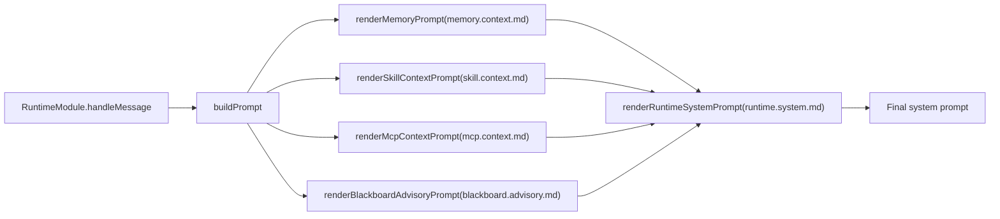
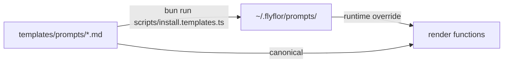

# Prompt Template System

## One-line Summary

All model-facing instructions live in `templates/prompts/`, grouped by topic; `*.md` files are the runtime canonical templates.

## Related Paths

- `src/agent/prompts/index.ts` - all render entry points
- `src/agent/prompts/template.manifest.ts` - template bundle version and file contract
- `src/agent/prompts/template.docs.ts` - docs generator
- `templates/prompts/` - built-in templates
- `scripts/install.templates.ts` - install into the user directory
- `~/.flyflor/prompts/` - user override directory

## Bundle Version

- Version: `v2`
- Manifest file: `template.manifest.json`
- Runtime checks the manifest version first, then reads each template by filename; missing files, empty files, and stale versions all fail with a reinstall hint.
- The manifest also records each template key, runtime filename, protocol metadata, protocol-specific envelope data, and required placeholders; lint compares it with runtime definitions to prevent partial bundle upgrades.
- `blackboard.worker.envelope.md` keeps its output schema and constraints in manifest metadata, then renders them into the JSON envelope at runtime.

## Template Catalog

| Template | Runtime File | Caller | Protocol | Purpose | Required Placeholders |
| --- | --- | --- | --- | --- | --- |
| `ask.schema.md` | `ask.schema.md` | `renderAskSchemaInstructions` | — | Structured clarifying questions, ghost decisions, and identity append blocks. | — |
| `behavior.priority.md` | `behavior.priority.md` | `renderBehaviorPriorityInstructions` | — | Prompt source ordering and conflict resolution rules. | — |
| `blackboard.advisory.md` | `blackboard.advisory.md` | `renderBlackboardAdvisoryPrompt` | — | Advisory transcript for direct-path turns that need blackboard context. | `compactRounds` / `elapsedMs` / `reason` / `status` / `turnId` |
| `blackboard.decision.md` | `blackboard.decision.md` | `BlackboardModule.returnDecisionToUser` | — | Decision prompt when the board needs user confirmation to close a loop. | `questionCount` / `reason` / `unresolvedIssues` |
| `blackboard.route.md` | `blackboard.route.md` | `decideBlackboardRoute` | — | Route planner prompt for the blackboard front door. | `request` |
| `blackboard.worker.envelope.md` | `blackboard.worker.envelope.md` | `renderBlackboardWorkerEnvelope` | `flyflor.blackboard.worker.v1` | User task envelope for a single blackboard worker participant. | `constraintsJson` / `contractJson` / `convergencePolicyJson` / `currentRoundStepsJson` / `discussionPlanJson` / `goalJson` / `expectedOutputJson` / `minRoundsJson` / `participantJson` / `phaseJson` / `previousStepsJson` / `roundJson` |
| `blackboard.worker.system.md` | `blackboard.worker.system.md` | `renderBlackboardWorkerSystemPrompt` | — | System prompt for a single blackboard worker participant. | `participant` |
| `crystal.reflection.md` | `crystal.reflection.md` | `ReflectionWorker.dispatch` | — | Reflection prompt that extracts reusable methods from evidence. | `evidence` |
| `feedback.classify.md` | `feedback.classify.md` | `classifyAndApplyFeedback` | — | Feedback classifier that buckets the latest user message. | `currentUserText` / `previousAssistantText` |
| `memory.action.md` | `memory.action.md` | `renderMemoryActionInstructions` | — | Durable Markdown memory tool block schema. | — |
| `memory.consolidation.md` | `memory.consolidation.md` | `ConsolidationWorker` | — | Episode classification prompt for consolidation. | `episode` |
| `memory.hot.compress.md` | `memory.hot.compress.md` | `HotMemoryCompressionWorker` | — | Audit-only compression prompt for expiring Redis working memory. | `episodes` |
| `memory.context.md` | `memory.context.md` | `renderMemoryPrompt` | — | Memory context wrapper for recent, project, long-term, and global layers. | `hippocampus` / `markdownContent` / `projectMemory` / `retrievedResults` |
| `memory.dream.md` | `memory.dream.md` | `DreamWorker` | — | Quiet maintenance prompt for long-term drift, recall, and contradiction work. | `candidates` / `userId` |
| `memory.project.offer.md` | `memory.project.offer.md` | `renderProjectOfferPrompt` | — | Runtime nudge for a project candidate awaiting user confirmation. | `evidenceScore` / `relatedCount` / `remainingTurns` / `title` |
| `memory.skill.offer.md` | `memory.skill.offer.md` | `renderSkillOfferPrompt` | — | Runtime nudge for a reusable skill candidate awaiting user confirmation. | `confidence` / `name` / `remainingTurns` / `support` / `tools` |
| `mcp.context.md` | `mcp.context.md` | `renderMcpContextPrompt` | — | MCP capability wrapper and tool-context listing. | `mcpEntries` |
| `runtime.ask.continuation.md` | `runtime.ask.continuation.md` | `renderRuntimeAskContinuationPrompt` | — | Runtime continuation hint for an active pending ask. | `chainDepth` / `choices` / `prompt` / `reason` |
| `runtime.dormant.resume.md` | `runtime.dormant.resume.md` | `renderRuntimeDormantResumePrompt` | — | Runtime resume hint after a dormant interval. | `idleBucket` |
| `runtime.eq.context.md` | `runtime.eq.context.md` | `renderRuntimeEqContextPrompt` | — | Tone-only emotional context hint. | `ageBucket` / `arousal` / `confidence` / `directive` / `dominance` / `label` / `valence` |
| `runtime.ghost.hint.md` | `runtime.ghost.hint.md` | `renderRuntimeGhostHintPrompt` | — | Runtime hint for active unfinished contexts. | `ghostEntries` |
| `runtime.identity.context.md` | `runtime.identity.context.md` | `renderRuntimeIdentityContextPrompt` | — | Runtime identity context assembled from live identity entries. | `identityEntries` |
| `runtime.system.md` | `runtime.system.md` | `renderRuntimeSystemPrompt` | — | Top-level runtime system prompt assembled for every turn. | `askSchemaInstructions` / `behaviorPriorityInstructions` / `blackboardContext` / `mcpContext` / `memoryActionInstructions` / `memoryContext` / `sandboxSummary` / `skillContext` |
| `skill.context.md` | `skill.context.md` | `renderSkillContextPrompt` | — | Skill wrapper prompt that formats loaded SKILL.md entries. | `skillEntries` |

## Assembly Flow

## Install Flow

- A same-named file in the user directory overrides the built-in template; the install script syncs the bundle and manifest together.
- Runtime only loads canonical `.md` template files.
- `*.zh.cn.md` files are audit-only mirrors synced by the install script; they do not enter the runtime bundle, manifest, or lint contract.

## Data Contract

Every template must guarantee:

1. The model emits structured JSON sections by schema (routing, reflection, feedback, memory actions, dream evaluation, cluster summaries, and so on), while code only validates shape, enums, and ranges.
2. Template-facing enum values come from `src/protocol/contracts/enums.ts`; add new enums there before updating templates.
3. Templates must not allow the model to invent undeclared fields; extra fields are always discarded.

## Prompt-facing Enums

- `MemoryActionTarget`: `memory` / `self` / `soul` / `user`
- `MemoryKind`: `candidate` / `conversation-turn` / `fact` / `history` / `profile` / `rule` / `skill` / `summary`
- `MarkdownMemoryFile`: `MEMORY.md` / `SELF.md` / `SOUL.md` / `USER.md`
- `AskReason`: `codename-ambiguity` / `codename-create` / `user-intent-unclear` / `blackboard-stalemate` / `policy-decision` / `other`
- `GhostContextReason`: `ask` / `tool-failure` / `blackboard-cap` / `process-restart`
- `GhostDecisionKind`: `resume` / `fork` / `fresh`
- `EqLabel`: `neutral` / `joy` / `anger` / `sadness` / `fear` / `surprise`

## Model Readability

Runtime-injected templates should only contain instructions the model can act on directly: when to use them, what structure to emit, what each field means, and how to resolve conflicts. Internal route ids, TODO ids, phase names, and implementation metaphors must not appear in runtime prompts, including `LF-R*` or engineering-only labels such as “hippocampus / crystal / Dream / Gem.”

Internal identifiers may stay in `TODO.md`, design docs, code comments, and test names; model-facing templates must translate them into plain source labels and behavior descriptions such as “recently activated memory,” “current project notes,” “open items,” and “quiet maintenance phase.”

## Risks / Known Gaps

- Template lint already checks required files, non-empty content, required placeholders, and unknown prompt files, and it blocks runtime prompt bodies that expose internal route ids or unexplained engineering metaphors; the bundle manifest version and template catalog are validated too.
- The manifest integrity test compares the canonical templates under `templates/prompts/`; unregistered runtime prompt files must not appear in the directory, and `lintPromptTemplates` performs the same checks in the user directory.
- `*.zh.cn.md` mirrors do not participate in runtime assembly or manifest comparison; they are for human review and audit only.
- `template.docs.ts` renders the template matrix and prompt-facing enum snapshot into reviewable documentation, while `scripts/prompt.templates.docs.ts` can generate or check the same output and sync the prompt bundle manifest.
- Runtime only assembles canonical `.md` files.

## Related Tests

- `tests/prompt.lint.test.ts`
- `tests/prompt.templates.docs.test.ts`
- `tests/blackboard.boundaries.test.ts`
- `tests/eq.prompt.test.ts`
- `tests/ask.parse.test.ts`
