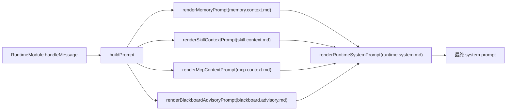
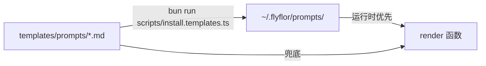

# Prompt 模板系统

## 一句话定位

所有「让模型按规则做事」的提示词都集中在 `templates/prompts/`，按主题命名 + 语言后缀（`*.md` 英文 / `*.zh.cn.md` 中文）；运行时通过 `src/agent/prompts/index.ts` 的 render 函数装配。

## 相关代码路径

- `src/agent/prompts/index.ts` — 所有 render 入口
- `templates/prompts/` — 内置模板
- `scripts/install.templates.ts` — 安装到用户目录
- `~/.flyflor/prompts/` — 用户覆盖目录

## 模板清单

| 模板 | 用途 | 调用方 |
| --- | --- | --- |
| `runtime.system.md` | runtime 主 system prompt | `renderRuntimeSystemPrompt` |
| `behavior.priority.md` | 提示词优先级与冲突处理规则（含多问 ask 约定） | `renderBehaviorPriorityInstructions` |
| `memory.context.md` | 记忆上下文外壳 | `renderMemoryPrompt` |
| `memory.action.md` | `<flyflor_memory_actions>` 写法 | runtime system 拼接 |
| `ask.schema.md` | `<flyflor_agent_ask>`、`questions[]`、`<flyflor_ghost_decisions>`、`<flyflor_identity_append>` 写法 | runtime system 拼接 |
| `memory.consolidation.md` | Consolidation worker 让模型抽 cluster 摘要 | `ConsolidationWorker` |
| `memory.dream.md` | Dream pass 候选评估 + 三类动作 | `DreamWorker` |
| `crystal.reflection.md` | 单轮反思抽 symbols / bucket / coordinates | `scheduleReflection` |
| `feedback.classify.md` | A/B/C/D feedback 分类 | `classifyAndApplyFeedback` |
| `skill.context.md` | skill 上下文外壳 | `renderSkillContextPrompt` |
| `mcp.context.md` | MCP catalog 外壳 + 调用协议 | `renderMcpContextPrompt` |
| `blackboard.route.md` | 路由 LLM：mode + workers + signals | `decideBlackboardRoute` |
| `blackboard.advisory.md` | 给直接路径加黑板上下文 advisory | `renderBlackboardAdvisoryPrompt` |
| `blackboard.worker.system.md` | 通用模型 worker system prompt | `BlackboardWorker` |
| `blackboard.decision.md` | needs-user 结构化 decision prompt | `BlackboardModule.returnDecisionToUser`，runtime 再合成 Ask |

## 装配流程

## 安装路径

- 用户目录存在同名文件即覆盖内置；运行时模板缺失或缺必需占位会由 `lintPromptTemplates` / `doctor` 报告，安装脚本负责同步内置模板。
- 中文 locale 自动选 `*.zh.cn.md`，否则回落到 `*.md`。

## 语言与 locale

- locale 来源：`config.runtime.locale` → 操作系统环境（仅识别 `zh*` 视为中文）。
- locale 不参与业务语义判断，只决定模板文件名。

## 数据契约

每个模板必须保证：

1. **结构化 JSON 段** 由模型按 schema 输出（路由、反思、feedback、记忆动作、dream 评估、cluster 摘要等），代码只校验 shape / 枚举 / 范围。
2. 模板对模型说明**枚举值**取自 `src/protocol/contracts/enums.ts`；新增枚举必须先动 enum，再改模板。
3. 模板**不得**让模型自由扩展未声明字段；冗余字段一律丢弃。

## 模型可理解性

运行时注入给模型的模板只写模型能直接执行的说明：什么时候使用、输出什么结构、字段含义、冲突时怎么处理。内部路线编号、TODO 编号、阶段名和实现隐喻不得出现在 runtime prompt 中，例如 `LF-R*`、只供工程讨论的“海马体 / 晶体 / Dream”说法。

允许内部编号保留在 `TODO.md`、设计文档、代码注释和测试名里；模型侧模板必须把它们翻译成普通来源名和行为说明，例如“近期激活记忆”“当前项目笔记”“未完成事项”“安静维护阶段”。

## 风险点 / 已知缺口

- 模板已有 lint：检查必需文件、非空、必需 placeholder，并阻止 runtime prompt 正文暴露内部路线编号或未解释的工程隐喻；仍缺 schema version 和枚举 golden test。
- 用户模板与内置模板仍可能语义版本不一致；当前只能通过 lint 缺字段，不能判断旧模板是否保留新协议说明。
- locale 推断仍用环境变量字符串，不走 config provider（与 boundaries「业务配置走 config」原则的边界案例：locale 视为运行时偏好，但仍建议显式配置）。

## 相关测试

- `tests/prompt.lint.test.ts`
- `tests/prompt.lint.test.ts` 会阻止 `templates/prompts/*.md` 再暴露 `LF-*` 路线编号，以及“海马体 / 晶体 / Dream / Gem”等只供工程讨论的隐喻。
- `tests/blackboard.boundaries.test.ts`
- `tests/eq.prompt.test.ts`
- `tests/ask.parse.test.ts`
